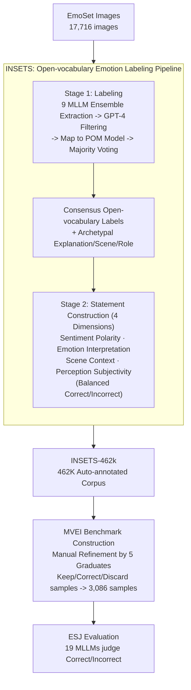

# Customizing Visual Emotion Evaluation for MLLMs: An Open-vocabulary, Multifaceted, and Scalable Approach

**Conference**: ICLR 2026  
**arXiv**: [2509.21950](https://arxiv.org/abs/2509.21950)  
**Code**: [GitHub](https://github.com/wdqqdw/MVEI)  
**Area**: Multimodal VLM  
**Keywords**: Visual Emotion, MLLM Evaluation, Open-vocabulary, ESJ, MVEI Benchmark

## TL;DR

The authors propose the Emotion Statement Judgment (ESJ) task and the INSETS automatic labeling pipeline, reframing visual emotion evaluation from "open-ended classification" to "statement truth judgment." They constructed the MVEI benchmark (3,086 samples, 424 emotion labels, across four cognitive dimensions). Systematic evaluation of 19 MLLMs reveals that even GPT-4o exhibits a 13.3% accuracy gap compared to humans (91.6%).

## Background & Motivation

**Background**: Affective Image Content Analysis (AICA) is a critical direction in multimodal understanding. As MLLMs achieve breakthroughs in general vision tasks, their visual emotion perception capability has gained attention. however, research conclusions remain contradictory—some studies suggest limited emotional recognition in MLLMs, while others successfully utilize them as affective labelers for data augmentation.

**Limitations of Prior Work**: The authors attribute this contradiction to the incompatibility between traditional evaluation methods and MLLMs, manifested in four aspects: (1) Fixed labels exclude other valid answers—emotion perception is inherently subjective, and the same image can evoke different responses; (2) Coarse granularity—mainstream benchmarks (e.g., FI, Artemis) feature only 8 emotion categories; (3) Neglect of contextual factors—focusing only on intrinsic image attributes while ignoring scene and viewer identity; (4) High labeling costs—the EMOTIC dataset required coordination of 23,788 crowdsourced annotators.

**Key Challenge**: Existing evaluations pose open-ended questions to MLLMs (e.g., "What is the emotion of this image?"). This creates a fundamental conflict: open answer spaces lead to ambiguous criteria, while closed classification systems fail to cover fine-grained emotional differences.

**Goal**: (1) Eliminate answer ambiguity in open-ended emotional evaluation; (2) Cover fine-grained emotions while maintaining scalability; (3) Incorporate scene context and subjectivity into evaluation dimensions; (4) Construct large-scale evaluation data with minimal human effort.

**Key Insight**: Inspired by cognitive psychology, the evaluation task is shifted from "generative answering" to "judgmental verification." Models are asked to judge whether an image matches an emotional statement. Four complementary dimensions are designed to cover the full spectrum of capability from basic recognition to subjective understanding.

**Core Idea**: Replace "answering what the emotion is" with "judging whether an emotion statement is correct." This fundamentally eliminates ambiguity in open-ended evaluation while enabling open-vocabulary, multidimensional, and large-scale assessment through an automated pipeline.

## Method

### Overall Architecture

The framework consists of two core components: the ESJ task defining "how to test" and the INSETS pipeline solving "what to test." Pipeline: INSETS automatically extracts open-vocabulary emotion labels from 17,716 images in EmoSet (via an ensemble of 9 MLLMs). Four-dimensional emotional statements (half correct, half incorrect) are constructed based on these labels, generating 462K automated annotations (INSETS-462k). Finally, 3,086 high-quality MVEI benchmark samples are obtained through manual refinement. During evaluation, MLLMs receive image-statement pairs and output only "Correct" or "Incorrect."

### Key Designs

**1. Four-Dimensional Evaluation System: Separating Recognition from Contextual Understanding**

While existing benchmarks focus primarily on the image itself, psychology indicates that external factors like scene and viewer identity also determine perception. ESJ splits evaluation into four complementary dimensions using "statement truth judgment":

*   **Sentiment Polarity**: Evaluates whether the image tone is positive, negative, or mixed. Correctness is determined via the label's position in the POM hierarchy.
*   **Emotion Interpretation**: Combines archetypal explanations with emotional states. Incorrect statements are generated via inter-image interference (swapping explanations from similar images) or intra-image interference (swapping opposing polarity labels for the same image).
*   **Scene Context**: Combines archetypal background scenes with emotional conclusions. Errors are constructed via polarity flipping or scene swapping within the same image.
*   **Perception Subjectivity**: Combines viewer roles with preference inclinations. Errors are created by reversing the preference order.
The first two dimensions target intrinsic attributes, while the latter two target external factors, covering the spectrum from recognition to subjective variations.

**2. INSETS Pipeline: Multi-model Ensemble + Hierarchical Constraints**

To avoid the high costs of crowdsourcing (e.g., 23,788 annotators for EMOTIC) or the hallucinations of single MLLMs, INSETS uses model voting with psychological constraints. 
*   **Stage 1 (Labeling)**: 9 MLLMs extract potential emotion words for each image. GPT-4 filters these into a candidate pool, which are then mapped to an expanded Parrott's Hierarchical Model (POM - 6 primary, 25 secondary, 113 tertiary categories). Consensus labels are selected via majority voting on the POM.
*   **Stage 2 (Construction)**: For each label, archetypal explanations, scenes, and roles are generated from the source MLLM, and paired correct/incorrect statements are synthesized according to the four dimensions. This achieves 90.6% accuracy and high flexibility (751 unique labels).

**3. MVEI Benchmark Construction: From Auto-Corpus to Golden Standard**

To ensure benchmark reliability, 3,164 samples from INSETS-462k were sampled and manually refined. Five graduate students evaluated labeling accuracy based on task guidelines. Samples were kept with $\ge 4/5$ consensus, corrected if $\le 1/5$, or discarded if ambiguous. This process (approx. 100 man-hours) produced 3,086 golden samples.

## Key Experimental Results

### Main Results

| Model | Params | Sentiment Polarity | Emotion Interpretation | Scene Context | Perception Subjectivity | Total Acc |
|------|--------|---------|---------|-----------|-----------|---------|
| GPT-4o | - | 72.5% | 84.3% | 81.6% | 69.2% | 78.3% |
| InternVL2.5 | 8.3B | 75.7% | 80.2% | 79.4% | 61.3% | 74.7% |
| mPLUG-Owl3 | 8.1B | 73.9% | 79.3% | 81.7% | 75.0% | 78.1% |
| Qwen2.5-VL | 8.3B | 63.2% | 81.5% | 83.9% | 66.3% | 75.9% |
| Qwen2-VL | 8.3B | 70.7% | 75.0% | 86.1% | 72.8% | 76.6% |
| LLaVa-1.6 | 7.6B | 66.4% | 69.7% | 55.3% | 49.7% | 60.2% |
| **Human Avg.** | - | **92.3%** | **90.1%** | **95.3%** | **89.6%** | **91.6%** |

### Ablation Study (Adaptation Strategies for Qwen2.5-VL)

| Adaptation Strategy | Sentiment Polarity | Emotion Interpretation | Scene Context | Perception Subjectivity | Total Acc |
|---------|---------|---------|-----------|-----------|---------|
| Direct Inference | 63.2% | 81.5% | 83.9% | 66.3% | 75.9% |
| Chain-of-Thought | 67.4 (+4.2) | 81.5 (+0.0) | 84.6 (+0.7) | 67.0 (+0.7) | 76.6 (+0.8) |
| ICL 8-shot | 70.1 (+6.9) | 81.7 (+0.2) | 84.9 (+1.0) | 67.0 (+0.7) | 77.3 (+1.4) |
| LoRA Fine-tuning | 78.6 (+15.4) | 84.7 (+3.2) | 86.3 (+2.4) | 70.3 (+4.0) | 80.7 (+4.8) |
| Full Fine-tuning | 84.3 (+21.1) | 84.8 (+3.3) | 87.0 (+3.1) | 71.1 (+4.8) | 81.9 (+6.0) |
| GRPO | 83.2 (+20.0) | 82.5 (+1.0) | 86.5 (+2.6) | 71.1 (+4.8) | 80.7 (+4.8) |

### Key Findings

- **Sentiment Polarity is a primary weakness**: MLLMs struggle with positive/negative/mixed determination but show massive improvement via fine-tuning (+21.1%), suggesting the issue lies in category boundary confusion rather than a complete lack of capability.
- **Perception Subjectivity is a fundamental challenge**: Even full fine-tuning yields only a +4.8% gain. The gap between humans (89.6%) and the best MLLM (75.0%) remains large, indicating this is tied to inherent model properties.
- **INSETS Accuracy**: The pipeline achieved 90.6% accuracy (89.7% for correct statements, 91.5% for incorrect), validating its reliability.
- **No Universal Best Model**: GPT-4o leads overall but is surpassed by mPLUG-Owl3 in Perception Subjectivity (69.2% vs 75.0%).

## Highlights & Insights

- **Elegant ESJ Task Design**: Converting subjective open-ended questions into objective binary judgments preserves depth while eliminating ambiguity. This "statement verification" approach is transferable to other subjective tasks like aesthetics or humor understanding.
- **Efficiency Paradigm**: INSETS reduces construction costs significantly (115 vs. 23,788 man-hours) through MLLM ensemble and hierarchical constraints. This "AI-initiation + Human-refinement" workflow is highly scalable.
- **Actionable Insights**: The four dimensions distinguish between "improvable capabilities" (Polarity) and "foundational gaps" (Subjectivity), providing a clear roadmap for MLLM development.

## Limitations & Future Work

- **Data Imbalance**: 65.2% of images represent positive emotions (inherited from EmoSet), potentially affecting negative emotion evaluation reliability.
- **Limited Granularity**: ESJ uses binary judgment and cannot evaluate continuous perceptions of emotional intensity.
- **Implicit Bias**: Role generation in the subjectivity dimension may inherit demographic stereotypes.
- **Static Scope**: The work focuses on single images and does not cover temporal evolution in videos or multimodal (text/audio) emotional cues.

## Related Work & Insights

- **vs EmoSet/FI**: While traditional benchmarks use 8 fixed classes, this work uses 751 open-vocabulary labels for statement judgment, significantly increasing flexibility.
- **vs EmoBench-M/EEmo-Bench**: Unlike these benchmarks that rely on open-ended questions, ESJ eliminates answer ambiguity through its task format.
- **vs FABA-Bench**: Focused on facial expressions and actions, whereas this work incorporates scene context and subjectivity.

## Rating

- Novelty: ⭐⭐⭐⭐ Innovative ESJ task design and 4D framework.
- Experimental Thoroughness: ⭐⭐⭐⭐⭐ Evaluated 19 MLLMs, 5 adaptation strategies, and human baselines.
- Writing Quality: ⭐⭐⭐⭐ Clear logic, natural integration of psychological theory and technical solution.
- Value: ⭐⭐⭐⭐ Practical contribution via the MVEI benchmark and INSETS-462k corpus.

<!-- RELATED:START -->

## Related Papers

- [\[ICLR 2026\] OmniVideoBench: Towards Audio-Visual Understanding Evaluation for Omni MLLMs](omnivideobench_towards_audio-visual_understanding_evaluation_for_omni_mllms.md)
- [\[AAAI 2026\] O3SLM: Open Weight, Open Data, and Open Vocabulary Sketch-Language Model](../../AAAI2026/multimodal_vlm/o3slm_open_weight_open_data_and_open_vocabulary_sketch-language_model.md)
- [\[CVPR 2026\] Vocabulary Scaling Law: Tuning Open-vocabulary Predictors for Their Openness](../../CVPR2026/multimodal_vlm/vocabulary_scaling_law_tuning_open-vocabulary_predictors_for_their_openness.md)
- [\[ICLR 2026\] MME-Emotion: A Holistic Evaluation Benchmark for Emotional Intelligence in Multimodal Large Language Models](mme-emotion_a_holistic_evaluation_benchmark_for_emotional_intelligence_in_multim.md)
- [\[CVPR 2026\] Towards Open-Vocabulary Industrial Defect Understanding with a Large-Scale Multimodal Dataset](../../CVPR2026/multimodal_vlm/towards_open-vocabulary_industrial_defect_understanding_with_a_large-scale_multi.md)

<!-- RELATED:END -->
