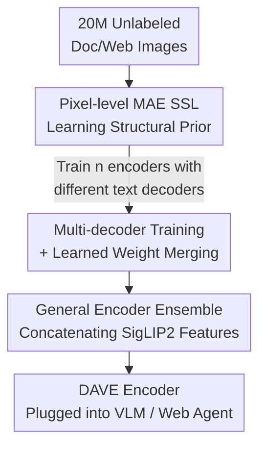

# DAVE: A VLM Vision Encoder for Document Understanding and Web Agents

**Conference**: ICLR 2026  
**OpenReview**: [https://openreview.net/forum?id=kgk0NqjsoW](https://openreview.net/forum?id=kgk0NqjsoW)  
**Code**: https://github.com/Brandon3964/DAVE  
**Area**: Multi-modal VLM  
**Keywords**: Vision encoder, Document understanding, Web Agent, Self-supervised pre-training, Model merging

## TL;DR
DAVE trains a specialized VLM vision encoder for document and web images. It employs modified pixel-level MAE for self-supervised learning on 20 million unlabeled document/web images, followed by autoregressive supervised pre-training on a small amount of high-quality data. By utilizing "multi-decoder weight merging + ensemble with SigLIP2," the encoder captures both structural-spatial information and general semantics, outperforming SigLIP2 by approximately 10.5% / 5% on document recognition, web localization, and Mind2Web Agent tasks.

## Background & Motivation
**Background**: Modern VLMs predominantly focus on vision encoder selection, with CLIP/SigLIP (contrastive learning) or DINO (self-supervised) being the mainstream choices due to their strong performance on natural images.

**Limitations of Prior Work**: Neither category of encoder is well-suited for documents or web pages. Contrastive encoders lack the fine-grained **structural and spatial information** (typography, table lines, widget positions) required for documents/UIs. While DINO-style models capture low-level features, they are optimized for natural images and transfer poorly to documents, UIs, and charts. Consequently, VLM performance in OCR, layout parsing, web element localization, and Agent actions is bottlenecked by the encoder.

**Key Challenge**: Developing a specialized encoder for documents/web pages faces two contradictions. First, **data contradiction**: high-quality annotations are scarce, and existing ones depend on OCR models, limiting both scale and quality. Second, **generality contradiction**: encoders trained on specialized data possess strong structural features but lose high-level semantics from large-scale general data. Furthermore, they tend to be tightly coupled with specific text decoders, leading to performance drops when switching LLM decoders.

**Goal**: Create a specialized vision encoder that understands document/web structural space, retains general visual semantics, and is plug-and-play across various VLM/Agent frameworks.

**Key Insight**: Utilize massive **unlabeled** document/web images via self-supervision to bypass annotation bottlenecks; employ model merging and ensembles to reconcile "specialization vs. generality" and "decoder-dependent vs. decoder-agnostic."

**Core Idea**: A two-stage pre-training pipeline (self-supervised foundation + supervised refinement) to build a specialized encoder, followed by "learned weight merging + ensemble with a general encoder" to produce DAVE, a decoder-agnostic and semantic-preserving final encoder.

## Method

### Overall Architecture
DAVE aims to produce a vision encoder $\phi$ that maps a document/web image $x\in\mathbb{R}^{H\times W\times 3}$ to a sequence of patch-level features for a VLM’s LLM backbone. The pipeline consists of two stages: **Stage 1** involves pixel-level MAE self-supervised pre-training on 20 million unlabeled images to learn strong structural-spatial priors. **Stage 2** involves autoregressive supervised pre-training on approximately 2 million labeled samples (OCR, layout extraction, web localization). Two key mechanisms are introduced: **weight merging** of multiple encoders trained with different text decoders to ensure decoder-agnosticism, and **feature ensemble** with a frozen SigLIP2 to recover high-level semantics. The final merged and ensembled encoder is integrated into VLM frameworks for downstream tasks.

### Key Designs

**1. Pixel-level MAE: Stabilizing Training on Low-variance Document Images via Direct Reconstruction**

Stage 1 uses MAE for self-supervised learning on massive unlabeled document/web images. However, standard MAE is highly unstable on document images. The authors attribute this to the **per-patch normalization target**: standard MAE normalizes each patch before calculating reconstruction loss, $L_{\text{MAE}}=\frac{1}{|M|}\sum_{i\in M}\lVert f_\theta(\tilde{x})_i-\frac{x_i-\mu(x_i)}{\sqrt{\sigma^2(x_i)+\epsilon}}\rVert_2^2$, where $\epsilon=10^{-6}$. Document/web images feature **extremely low intra-patch variance** (large white backgrounds, regular text). Analysis (Figure 3) shows inter-patch standard deviation is orders of magnitude lower than ImageNet, causing the denominator to approach $\epsilon$, blowing up the target and leading to training divergence.

The solution is straightforward: remove normalization and directly reconstruct raw pixel values: $L_{\text{MAE-pixel}}=\frac{1}{|M|}\sum_{i\in M}\lVert f_\theta(\tilde{x})_i-x_i\rVert_2^2$. This modification stabilizes training, allowing scaling to 20 million images without extra hyperparameter tuning. This is a scene-specific insight: while normalization works for natural images, it reveals numerical instability in low-variance document images.

**2. Multi-decoder Training + Learned Weight Merging: Decoupling Encoder from Text Decoders**

After autoregressive supervised training in Stage 2, the encoder often becomes **bound** to its specific text decoder, losing performance when paired with others. The authors decouple them using a "model soup" approach: given $n$ pre-trained text decoders $\{\Theta_1,\dots,\Theta_n\}$, $n$ encoders with identical architectures $\{\phi_1,\dots,\phi_n\}$ are trained and then merged.

Crucially, rather than simple averaging, they use **distillation-based learned merging coefficients**. Each encoder is treated as a set of $m$ weights, and a set of coefficients is learned per weight to calculate a weighted sum: $\theta^{(j)}_{\text{merge}}=\sum_{i=1}^{n}\alpha^{(j)}_i\theta^{(j)}_i$ (where $\alpha^{(j)}_i\in[0,1]$). During merging, original encoder parameters are frozen; only the new coefficients are optimized. The objective is to align the merged feature $z$ with each teacher encoder's feature: $L_{\text{distill}}=\frac{1}{n}\sum_{i=1}^{n}\lVert\hat{z}_i-z_i\rVert_2^2$. The resulting $\phi^{\text{final}}_{\text{DAVE}}$ is compatible with various decoders. Ablations show learned coefficients outperform simple averaging (Doc 62.8→63.4) and heuristic Fisher Merging (60.3→63.4), with performance improving as more LLMs are merged (Granite alone 55.6 → Granite+Qwen+Phi 63.4).

**3. General Encoder Ensemble: Concatenating Frozen SigLIP2 Features for High-level Semantics**

Training exclusively on document/web data causes the encoder to lose general visual representations. High-level semantics are equally vital for robustness. The authors design an ensemble: a **frozen general encoder** $\phi_{\text{gen}}$ (SigLIP2) is concatenated with the specialized encoder $\phi_{\text{spec}}$: $\phi_{\text{DAVE}}(x)=\text{Concat}(\phi_{\text{gen}}(x),\phi_{\text{spec}}(x))$.

This offers two advantages: first, $\phi_{\text{gen}}$ handles high-level semantics, **liberating** $\phi_{\text{spec}}$ to focus on low-level structural-spatial representations; second, it implements **early fusion** of structural features and high-level semantics during pre-training. Ablations confirm this—pairing SigLIP2 with other specialized encoders (DiT/Pix2Struct/Dolphin) yields poor results (Doc below 50.3), whereas DAVE's ensemble achieves 63.4. This indicates both the quality of the specialized side and the fusion method are critical. It also explains how DAVE maintains general VQA capabilities (MMMU, RealWorldQA) while significantly boosting document/web performance.

### Loss & Training
- **Stage 1**: ViT-L/16-384 as encoder, pixel reconstruction loss $L_{\text{MAE-pixel}}$, batch size 4096, 120K steps, 20M images (10M DocFM PDFs + 10M Common-Web screenshots).
- **Stage 2**: Tilting size 384, frozen SigLIP2 for ensemble. Trained with multiple LLM decoders (Qwen2.5-0.5B, Phi-4-mini, Granite-3.1-3B) using autoregressive supervision (full-parameter tuning, 1 epoch) on ~2M samples (PlotQA, ChartQA, fintabnet, Pubtables, DocFM, etc., plus 500K arXiv PDFs with OCR-derived labels).
- **Weight Merging Distillation**: Merging coefficients trained on unlabeled doc/web images for 20 epochs with frozen encoders.
- Downstream VLM evaluation uses LLaVA architecture with Llama-3.2-3B / Qwen2.5-7B backbones, training for 1 epoch with frozen vision encoders. Mind2Web is fine-tuned on the training set before offline evaluation.

## Key Experimental Results

### Main Results
Vision-Language Benchmarks (LLaVA + Llama-3.2-3B-Instruct, selection):

| Benchmark | Task Type | DAVE | SigLIP2 | Gain |
|-----------|-----------|------|---------|------|
| OCRBench | Document | 62.2 | 51.5 | +10.7 |
| DocVQA | Document | 82.1 | 72.1 | +10.0 |
| ChartQA | Document | 63.1 | 51.8 | +11.3 |
| Screenspot-V2 | Web Loc. | 64.5 | 40.7 | +23.8 |
| WebSRC | Web QA | 82.6 | 67.8 | +14.8 |
| MMMU | General VQA | 36.6 | 36.9 | ≈ Parity |

DAVE outperforms SigLIP2 by an average of **10.5%** across 8 document/web benchmarks while maintaining comparable general VQA performance, indicating successful integration of structural features and general semantics.

Web Agent (Mind2Web, Llama-3.2-3B, Step SR):

| Split | DAVE | Dolphin (Strongest Baseline) | SigLIP2 |
|-------|------|--------------------------|---------|
| Cross-Task | 26.1 | 19.6 | 17.3 |
| Cross-Website | 18.0 | 13.6 | 8.7 |
| Cross-Domain | 19.1 | 14.5 | 9.7 |

DAVE outperforms the strongest baseline by ~**5%**. Interestingly, self-supervised encoders like MAE/DinoV2 perform comparably to SigLIP2/AIMv2 in navigation, suggesting structural-spatial features are more critical than general semantics for Web Agents.

Classic Document Tasks (mAP / Classification Accuracy):

| Model | DocLayNet | DocBank | RICO-SCA |
|-------|-----------|---------|----------|
| SigLIP2 | 70.8 | 51.7 | **93.3** |
| DAVE | **74.1** | **56.9** | 92.8 |

DAVE leads in dense document recognition/segmentation, lagging slightly behind SigLIP2 only in semantic-heavy screenshot classification (attributed to doubling of hidden dimensions making pooling difficult for a single MLP head).

### Ablation Study
| Configuration | Doc | Web | Description |
|---------------|-----|-----|-------------|
| Scratch Decoder | 52.2 | 54.7 | Training text decoder from scratch |
| Pretrained Decoder | 55.6 | 53.0 | Using pre-trained LLM |
| + Ensemble | — | 67.7 | Adding SigLIP2 Ensemble |
| + Model Merge (Full) | 63.4 | 68.2 | Complete DAVE |
| w/ Simple Average Merge | 62.8 | 67.7 | Learned Coeffs → Average |
| w/ Fisher Merge | 60.3 | 67.0 | Learned Coeffs → Heuristic |
| 1 LLM Only (Granite) | 55.6 | 53.0 | vs. Three LLMs (63.4/68.2) |
| Finetune SigLIP2 | 58.2 | 65.2 | Direct fine-tuning of general encoder |

### Key Findings
- **Pixel-level MAE insight is pivotal**: Lower inter-patch variance in document/web images causes standard MAE normalization to diverge. Removing normalization allowed scaling to 20M images.
- **Learned weight merging > Average/Fisher**, and adding more LLM decoders improves performance (55.6→62.1→63.4), confirming multi-decoder training induces decoder-agnosticism.
- **Ensemble requires strength on both sides**: SigLIP2 paired with weaker specialized encoders (DiT/Pix2Struct/Dolphin) performed poorly (<50.3); DAVE's specialized side is high-quality enough to enable successful fusion.
- DAVE (63.4/68.2) significantly outperforms direct fine-tuning of SigLIP2 (58.2/65.2), proving that learning structural features via SSL from scratch is more effective than fine-tuning a general encoder.

## Highlights & Insights
- **Rooting training instability in data statistics**: Instead of blind hyperparameter tuning, the authors plotted inter-patch variance distribution to identify the zero-denominator issue in normalization, solving it with "de-normalization"—a precise diagnosis and simple solution.
- **"Model Soup + Distillation" for decoder decoupling**: Formulating decoder over-fitting as a learnable weight fusion problem with frozen parameters and minimal cost enables plug-and-play capability across LLM frameworks.
- **Ensemble rather than replacement**: The frozen SigLIP2 concatenation both provides semantics and "liberates" the specialized encoder for low-level features. This division of labor is applicable to any representation learning scenario involving "specialization vs. generality" conflicts.

## Limitations & Future Work
- **Slightly lower screenshot classification**: DAVE's doubled hidden dimensions make effective pooling of high-dimensional information via a single MLP head difficult, creating a bottleneck for semantic tasks.
- **Dependency on OCR for supervised labels**: Labels for 500K arXiv PDFs were generated by OCR models, capping quality at the OCR engine's limits.
- **Inference overhead**: DAVE uses a dual-path ensemble (SigLIP2 + Specialized), doubling feature dimensions and computational cost compared to a single encoder.
- Multi-decoder training requires training an encoder version for every LLM, meaning pre-training costs scale linearly with the number of decoders.

## Related Work & Insights
- **vs. Eagle / Perception Encoder**: These models align pre-trained vision encoders with pre-trained LLMs using large-scale general data. DAVE trains specialized foundation encoders from scratch using SSL and multiple LLM backbones with domain-specific data.
- **vs. SigLIP2 / AIMv2 (General Encoders)**: DAVE retains general semantics (via SigLIP2 ensemble) while adding structural-spatial features, leading significantly in document/web tasks.
- **vs. Dolphin / Pix2Struct (Specialized Encoder-Decoders)**: These specialized models excel in documents but lack general semantics, leading to performance drops in general VQA or when paired with general decoders. DAVE balances both via the ensemble + merging approach.

## Rating
- Novelty: ⭐⭐⭐⭐ Specialized VLM encoder for documents/web; pixel-level MAE diagnosis and learned merging are innovative.
- Experimental Thoroughness: ⭐⭐⭐⭐⭐ Covers classic documents, VQA, web localization, and Mind2Web Agents with multiple LLM backbones and detailed ablations.
- Writing Quality: ⭐⭐⭐⭐ Clear motivation, well-explained two-stage pipeline, and reconciliation of contradictions.
- Value: ⭐⭐⭐⭐ Provides a high-utility, plug-and-play vision encoder for Document and Web Agent communities.

<!-- RELATED:START -->

## Related Papers

- [\[ICLR 2026\] LiveWeb-IE: A Benchmark For Online Web Information Extraction](liveweb-ie_a_benchmark_for_online_web_information_extraction.md)
- [\[ICLR 2026\] WebDS: An End-to-End Benchmark for Web-based Data Science](webds_an_end-to-end_benchmark_for_web-based_data_science.md)
- [\[ICLR 2026\] Multimodal Policy Internalization for Conversational Agents](multimodal_policy_internalization_for_conversational_agents.md)
- [\[CVPR 2026\] SEA-Vision: A Multilingual Benchmark for Document and Scene Text Understanding in Southeast Asia](../../CVPR2026/multimodal_vlm/sea-vision_a_multilingual_benchmark_for_comprehensive_document_and_scene_text_un.md)
- [\[CVPR 2025\] DocoPilot: Improving Multimodal Models for Document-Level Understanding](../../CVPR2025/multimodal_vlm/docopilot_improving_multimodal_models_for_document-level_understanding.md)

<!-- RELATED:END -->
