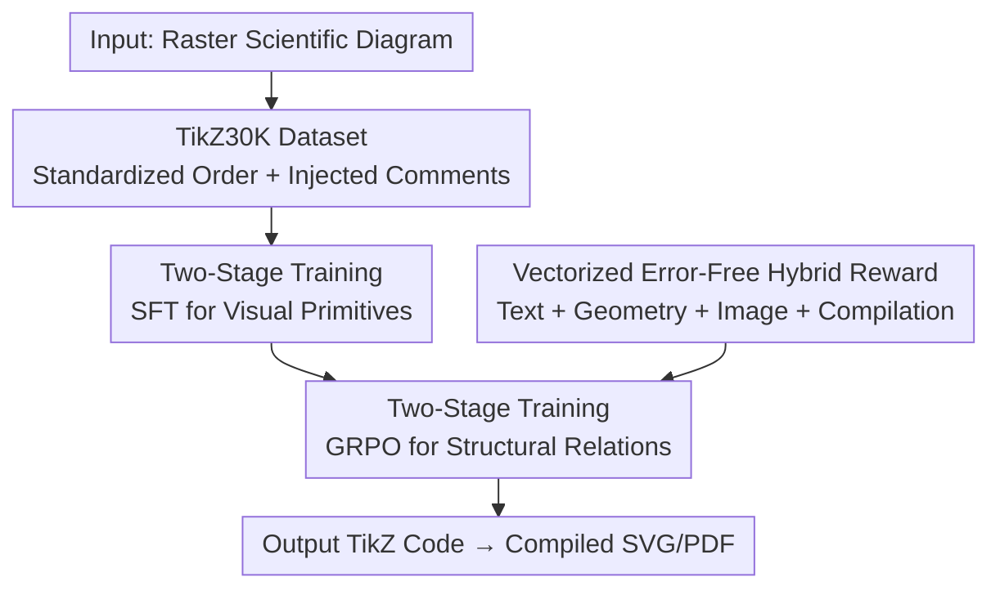

# DaVinci: Reinforcing Visual-Structural Syntax in MLLMs for Generalized Scientific Diagram Parsing

**Conference**: ICLR 2026  
**OpenReview**: [https://openreview.net/forum?id=OAXECnLxuk](https://openreview.net/forum?id=OAXECnLxuk)  
**Code**: https://github.com/zengxingchen/Diagram-to-TikZCode  
**Area**: Multimodal VLM  
**Keywords**: Diagram Parsing, TikZ Code Generation, Reinforcement Learning, GRPO, Vectorized Reward

## TL;DR
DaVinci trains a 7B MLLM using a two-stage framework consisting of "SFT for learning visual primitives + GRPO for learning structural relationships." By translating scientific diagrams into compilable TikZ code using the self-constructed TikZ30K dataset (standardizing drawing order + injecting comments) and a hybrid reward system that extracts error-free signals from vectorized representations, DaVinci surpasses closed-source models like GPT-5 and Claude-Sonnet-4 in both compilation rate and visual fidelity.

## Background & Motivation
**Background**: Scientific diagrams (frameworks, flowcharts, neural network architectures, etc.) are ubiquitous in papers, but most exist as raster bitmaps that cannot be directly edited or reused. Inverse parsing of bitmaps into structured program representations (diagram-to-code) is key to enabling editability and reuse. Among various representations, TikZ is the preferred target for MLLM-based diagram-to-code generation due to its declarative syntax, strong mathematical expressiveness, and ability to compile into PDF/SVG formats. Existing works like DATIkZ have accumulated large-scale "image-TikZ code" datasets for supervised fine-tuning (SFT).

**Limitations of Prior Work**: Even with large-scale SFT, existing MLLMs struggle with this task. Parsing diagrams requires pixel-level precision to specify primitives like lines, shapes, and text, while describing their spatial relationships and strictly adhering to TikZ's demanding syntax. Pure SFT primarily learns to "mimic reference code token-by-token," which fails to guarantee compilation success or geometric alignment.

**Key Challenge**: The root cause is two-fold. First, **data noise**: the rendering output of languages like TikZ is largely independent of code order (except for variable declarations). Consequently, the same image in a training set may correspond to multiple arbitrarily shuffled code sequences. For auto-regressive models, mapping similar visual content to numerous random permutations dilutes the training signal. Additionally, original code lacks structural/semantic hints, making models prone to logical inconsistencies or missing components in long sequences. Second, **unreliable reward signals**: reinforcement learning requires evaluating generated diagrams, but common methods like OCR for text extraction or pixel-level MSE/SSIM comparisons introduce significant errors for symbol-dense diagrams, propagating noise into the rewards.

**Goal**: (1) Prepare high-quality, clean, and structured data with planning prompts for cold-starting. (2) Design a hybrid reward system that avoids error-prone OCR/pixel metrics and accurately captures text alignment and geometric precision to optimize for "visual fidelity + compilability."

**Key Insight**: The authors decompose the task into two levels of capability—**visual primitive recognition** (how to draw lines/shapes/text) and **structural relationship arrangement** (how to layout and connect them). The former is addressed via supervised learning for a fast cold-start, while the latter is refined via reinforcement learning. They observe that TikZ-compiled PDFs contain precise vectorized metadata for every text and geometric object, which can be extracted as "error-free" ground truth for rewards.

**Core Idea**: A two-stage framework of "SFT for primitives + GRPO for structures," combined with TikZ30K data featuring standardized drawing orders and comment-based planning scaffolds. This, paired with an error-free hybrid reward from vectorized representations, allows diagram parsing to exceed the performance of closed-source LLMs.

## Method

### Overall Architecture
The diagram parsing task is formalized as a conditional sequence generation task: given an input image $I_{in}$, the goal is to generate a TikZ code sequence $C_{pred}=(t_1,\dots,t_L)$ such that the rendered image $I_{pred}=\text{Render}(C_{pred})$ faithfully reconstructs $I_{in}$. An MLLM with parameters $\theta$ models $p(C_{pred}\mid I_{in})$ via auto-regressive decoding.

The pipeline consists of two stages: first, SFT on the self-built TikZ30K dataset to teach the base model (Qwen2.5-VL-7B-Instruct) visual primitives and syntax rules (resulting in DaVinci-SFT-7B). Second, the policy is refined via GRPO (Group Relative Policy Optimization), where the reward is composed of three modalities: "compiled product + vectorized representation + rendered image," resulting in the final DaVinci-7B. During inference, the output TikZ code can be compiled into SVG/PDF for downstream editing.

### Key Designs

**1. TikZ30K: Treating "Drawing Order" and "Comments" as Overlooked Supervision Signals**

To address the dilution of training signals caused by disordered code, the authors replicated the DATIkZ collection process (collecting 366,075 compilable TikZ snippets from TEX.SE, arXiv, and GitHub, limited to pre-December 2023). They then performed two levels of cleaning: removing low-quality samples (e.g., truncated diagrams) to reach 258,421, and using Qwen-2.5-VL-32B to assign semantic categories and quality scores, retaining 225,648 samples with scores of 4-5.

The core innovation lies in:
- **Code Reordering**: Since TikZ rendering is order-independent, original code often jumps between nodes and edges haphazardly. The authors used Qwen3-Coder-480B to reorder code following a "semantic-guided, logical progression" protocol, followed by consistency checks.
- **Comment Injection**: Original TikZ consists of dense, low-level instructions. The authors used an LLM to systematically add comments that decompose the process into sub-tasks (e.g., "Starting from the left: draw the first circle, label it 1, connect to the right"). These comments act as planning anchors, guiding the model through long sequences and reducing logical inconsistencies.
The final TikZ30K includes 30,000 samples for SFT and 28,000 for RL.

**2. Vectorized Error-Free Hybrid Reward: Bypassing OCR and Pixel Metrics**

To avoid noise from OCR and pixel measures, the authors leveraged the fact that TikZ-compiled PDFs preserve precise geometry and typography metadata as native vector elements. PyMuPDF is used to extract ground truth directly. The hybrid reward is a weighted sum of four components:

$$R_{hybrid}=R_{text}(V_{in},V_{pred})+R_{geom}(V_{in},V_{pred})+R_{img}(I_{in},I_{pred})+R_{pass}(C_{pred})$$

- **Spatial-Text Reward $R_{text}$**: Extracts text and bounding boxes from PDF vector data. It uses greedy matching for identical text and Levenshtein distance with adaptive thresholds for others, selecting the highest Distance-IoU (dIoU) for rewards.
- **Geometric Reward $R_{geom}$**: Extracts primitives (lines, rectangles, circles) and uses the Hungarian algorithm for optimal bipartite matching. The cost function $C(e_p,e_g)$ integrates centroid distance, relative size, and aspect ratio.
- **Image Fidelity Reward $R_{img}$**: Combines DreamSim (perceptual feature space) and cropped MSE (pixel space).
- **Compilation Success Reward $R_{pass}$**: Penalizes non-compilable code by setting other reward components to their minimum values.

**3. Two-Stage Training: SFT for Primitives + GRPO for Structural Relations**

Decoupling "primitive recognition" and "structural arrangement" is key.
- **Stage 1**: Full-parameter SFT on TikZ30K (2 epochs) for Qwen2.5-VL-7B-Instruct to master primitives and syntax.
- **Stage 2**: GRPO (Group Relative Policy Optimization) refinement. Given a prompt, the policy samples $G$ candidates. Advantages $\hat A_k$ are estimated via group-relative comparisons of the hybrid reward $R_{hybrid}$, bypassing the need for an explicit critic model. RL training used 8×H100 GPUs for 500 steps.

### Loss & Training
- **SFT Stage**: Standard auto-regressive language modeling objective, full-parameter fine-tuning for 2 epochs.
- **RL Stage**: GRPO objective with within-group standardized rewards. The hybrid reward components are summed equally, with compiled failures receiving the minimum penalty.

## Key Experimental Results

### Main Results
Evaluation was conducted on the DATIkZv3 test set (542 diverse diagrams). Metrics include Pass@1, Text Edit Distance (TED), and CrystalBLEU (cBLEU) for code; DreamSim (DSIM), SigLIP, SSIM, MSE, and LPIPS for images.

| Model | Pass@1 ↑ | TED ↓ | cBLEU ↑ | DSIM ↑ | SSIM ↑ | MSE ↓ | LPIPS ↓ |
|--------|---------|-------|---------|--------|--------|-------|---------|
| Gemini-2.5-Pro-Thinking | 69.93 | 53.77 | 6.17 | 88.20 | 75.86 | 66.62 | 21.64 |
| GPT-5-Default | 72.88 | 53.17 | 3.22 | 83.78 | 73.73 | 73.57 | 25.37 |
| Claude-Sonnet-4-Thinking | 86.90 | 54.38 | 3.31 | 82.89 | 72.21 | 73.89 | 25.80 |
| Qwen2.5-VL-72B | 80.04 | 54.80 | 4.18 | 79.35 | 72.42 | 77.63 | 27.24 |
| DetikZify-V2-8B | 78.60 | 55.66 | 7.19 | 82.63 | 74.30 | 68.42 | 23.30 |
| DaVinci-SFT-7B | 84.50 | 56.21 | 7.52 | 81.15 | 72.65 | 73.90 | 26.10 |
| **DaVinci-7B** | **97.60** | 55.13 | 6.57 | 84.83 | 73.65 | **61.81** | 22.32 |

DaVinci-7B achieved a near-perfect compilation rate (97.60%), outperforming all open-source models and surpassing GPT-5 and Claude-Sonnet-4 in Pass@1, DSIM, and MSE. Human evaluations (Best-Worst Scaling) also ranked DaVinci-7B highest among non-closed-source models.

### Ablation Study
**Data Strategy Ablation (Pass@1)**:
| Configuration | Pass@1 ↑ | Description |
|------|---------|------|
| Baseline: Qwen2.5-VL-7B | 59.59 | Base model |
| + Original30K | 69.74 | Original code only |
| + Reordering30K | 78.78 | Code reordering added (+9.04%) |
| + TikZ30K | 84.50 | Comment injection added (+5.72%) |

**Reward Ablation**:
Adding $R_{text}$ and $R_{geom}$ significantly improved textual and geometric scores where standard pixel metrics like SSIM failed to provide meaningful gains.

### Key Findings
- **Code reordering is the most significant contributor**: It increased compilability by 9.04%, proving that structured data is a powerful signal.
- **Vectorized rewards are effective**: $R_{text}$ and $R_{geom}$ improved text/geometry fidelity and reduced MSE, whereas SSIM rewards provided negligible benefits.
- **High code similarity is not necessary**: While SFT had the highest cBLEU, the RL-refined DaVinci-7B saw a drop in cBLEU while improving all other visual/compilation metrics.
- **"Thinking" may not help**: The authors observed that explicit reasoning chains (like those in GLM-4.5V-Thinking) did not consistently improve parsing, suggesting that generating structured code is itself a form of implicit reasoning.

## Highlights & Insights
- **Vector metadata as reward ground truth**: Extracting coordinates from PDF vector elements bypasses OCR/pixel noise, turning reward calculation into a "read" operation rather than an "estimation."
- **Treating data noise as a first-class citizen**: Recognizing order-independence in code as a "training killer" and solving it with LLM-based reordering and comment scaffolds is a transferable strategy for any sequence generation task with ordering freedom.
- **Layered Capability Training**: SFT for primitives and RL for structure enables a 7B model to outperform models with 100x more parameters.

## Limitations & Future Work
- **Dense Visualizations**: Extremely dense diagrams (e.g., complex scatter plots) can exceed context length and cause compilation failure.
- **Reward Dependence on Compilation**: $R_{text}$ and $R_{geom}$ require a successful PDF build. Failed compilations receive no fine-grained gradient signal.
- **TikZ Specificity**: The reward pipeline relies on TikZ-to-PDF metadata; porting to SVG or Mermaid would require new extraction logic.

## Related Work & Insights
- **vs DetikZify (DATIkZ Series)**: While those works rely on large-scale SFT and MCTS, DaVinci uses standardized order, comment-augmentation, and GRPO to achieve a significantly higher compilation rate (97.60% vs 78.60%).
- **vs Closed-Source Models**: Unlike GPT-5 or Claude, which often fail on library imports or basic TikZ syntax, DaVinci’s specialized data and rewards ensure high structural fidelity and compilability.

## Rating
- Novelty: ⭐⭐⭐⭐⭐ (Error-free vectorized rewards and drawing order standardization are highly innovative).
- Experimental Thoroughness: ⭐⭐⭐⭐⭐ (Comprehensive comparison with closed/open models and dual ablation studies).
- Writing Quality: ⭐⭐⭐⭐ (Clear logic and derivation).
- Value: ⭐⭐⭐⭐⭐ (High practical value; makes specialized 7B models competitive with frontier LLMs for code generation).

<!-- RELATED:START -->

## Related Papers

- [\[ICLR 2026\] Sparsity Forcing: Reinforcing Token Sparsity of MLLMs](sparsity_forcing_reinforcing_token_sparsity_of_mllms.md)
- [\[ICLR 2026\] Visual Self-Refine: A Pixel-Guided Paradigm for Accurate Chart Parsing](visual_self-refine_a_pixel-guided_paradigm_for_accurate_chart_parsing.md)
- [\[CVPR 2026\] RxnCaption: Reformulating Reaction Diagram Parsing as Visual Prompt Guided Captioning](../../CVPR2026/multimodal_vlm/rxncaption_reformulating_reaction_diagram_parsing_as_visual_prompt_guided_captio.md)
- [\[ICLR 2026\] InSight-o3: Empowering Multimodal Foundation Models with Generalized Visual Search](insight-o3_empowering_multimodal_foundation_models_with_generalized_visual_searc.md)
- [\[ICLR 2026\] Visual Jigsaw Post-Training Improves MLLMs](visual_jigsaw_post-training_improves_mllms.md)

<!-- RELATED:END -->
