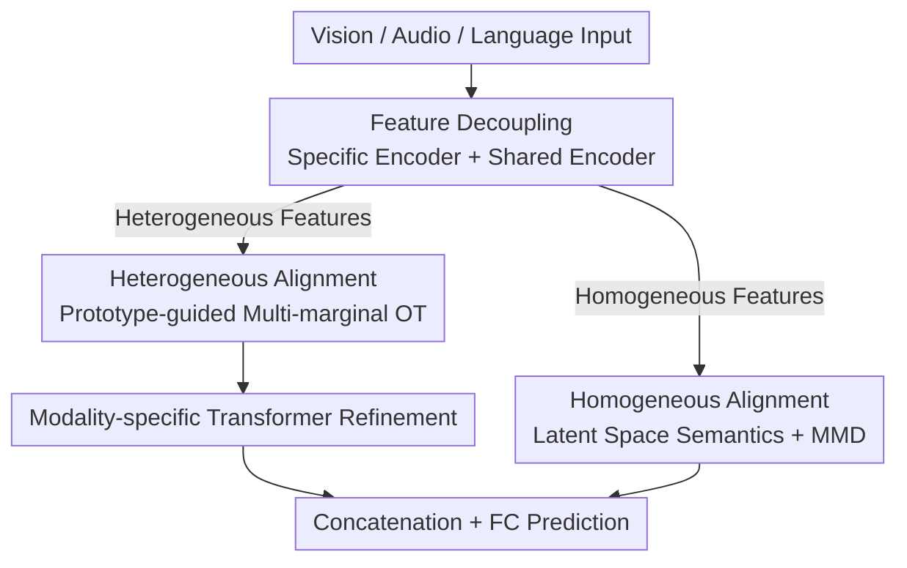

# DecAlign: Hierarchical Cross-Modal Alignment for Decoupled Multimodal Representation Learning

**Conference**: ICLR2026  
**OpenReview**: [https://openreview.net/forum?id=LasUPe2UxG](https://openreview.net/forum?id=LasUPe2UxG)  
**Code**: https://taco-group.github.io/DecAlign/ (Project Page)  
**Area**: Multimodal VLM  
**Keywords**: Multimodal representation learning, cross-modal alignment, feature decoupling, optimal transport, Maximum Mean Discrepancy

## TL;DR
DecAlign decouples multimodal features into two streams: "modality-specific heterogeneous features" and "cross-modal shared homogeneous features." It aligns the heterogeneous part using prototype-guided multi-marginal optimal transport and the homogeneous part through latent space distribution matching with MMD. It consistently outperforms 13 SOTA methods across four sentiment analysis benchmarks.

## Background & Motivation
**Background**: Multimodal representation learning aims to fuse heterogeneous modalities—such as vision, audio, and language—into a unified representation that captures shared semantics while preserving unique modality characteristics. Predominant approaches project raw multimodal data into a unified space via direct concatenation or linear transformations after fusion.

**Limitations of Prior Work**: This "indiscriminate fusion" mixes modality-specific details with global shared semantics, leading to **semantic interference**, where local features of a specific modality disrupt global cross-modal relationships. This is particularly evident when dimensions are mismatched—such as when high-dimensional, spatially-correlated image features are forced together with low-dimensional, temporally-correlated text features—resulting in either information redundancy or the loss of critical information during fusion.

**Key Challenge**: The fundamental problem lies in the **entanglement of heterogeneity and homogeneity**. Modality-specific heterogeneous patterns (varying in distribution, scale, and semantic granularity) and cross-modal shared homogeneous semantics are processed together. This creates a conflict: aligning shared semantics tends to erase modality-specific features, while preserving specific features often compromises global consistency.

**Goal**: To explicitly decouple these two types of features and apply tailored alignment strategies to each, ensuring that "aligning shared semantics" and "preserving modality-specific features" no longer interfere with each other.

**Key Insight**: The authors observe that while modality-specific features vary in form, they often carry semantically aligned information when pointing to the same underlying concept or category. Therefore, **category prototypes** can be introduced as cross-modal semantic anchors, allowing heterogeneous features to align around prototypes rather than relying on unreliable and computationally expensive point-wise alignment.

**Core Idea**: Decouple first, then align hierarchically. Multimodal representations are split into heterogeneous and homogeneous paths. The heterogeneous path utilizes "prototype-guided multi-marginal optimal transport + cross-modal Transformer" for fine-grained alignment, while the homogeneous path employs "latent space semantic matching + MMD regularization" for global consistency alignment.

## Method

### Overall Architecture
The core problem DecAlign addresses is semantic interference caused by the entanglement of specific features and shared semantics. The overall workflow consists of **decoupling**, **hierarchical alignment**, and finally **fused prediction**. Given inputs from $M$ modalities, modality-specific 1D temporal convolutions first align all modalities to the same temporal length $T_s$ and dimension $d_s$, resulting in $\tilde{X}_m \in \mathbb{R}^{T_s \times d_s}$. Each modality then passes through a **modality-specific encoder** $E^{(m)}_{uni}$ to extract heterogeneous features $F^{(m)}_{uni}$ and a **shared encoder** $E_{com}$ to extract homogeneous features $F^{(m)}_{com}$.

This is followed by dual-stream alignment: heterogeneous features proceed to the "prototype-guided optimal transport" branch (GMM-based prototype construction followed by multi-marginal optimal transport alignment), while homogeneous features proceed to the "latent space semantic alignment + MMD distribution matching" branch. The heterogeneous features are further refined by modality-specific Transformers before being concatenated with the homogeneous features and passed through a fully connected layer for downstream prediction (classification or regression).

### Key Designs

**1. Feature Decoupling: Separating heterogeneous and homogeneous features using dual encoders**

To address the entanglement of unique features and shared semantics, DecAlign stops projecting all features indiscriminately. Instead, it assigns a specific encoder $E^{(m)}_{uni}$ to each modality to extract heterogeneous features $F^{(m)}_{uni}=E^{(m)}_{uni}(\tilde{X}_m)$, and a shared encoder $E_{com}$ for all modalities to extract homogeneous features $F^{(m)}_{com}=E_{com}(\tilde{X}_m)$. All encoders output the same dimensionality for compatibility. To ensure true decoupling, a cosine similarity-based orthogonal constraint is applied to minimize the overlap between the two feature sets:

$$L_{dec}=\sum_{m=1}^{M}\frac{F^{(m)}_{uni}\cdot(F^{(m)}_{com})^{T}}{\|F^{(m)}_{uni}\|\,\|F^{(m)}_{com}\|}$$

This step is the prerequisite for "divide and conquer" alignment—distinct strategies can only be applied once the features are separated.

**2. Heterogeneous Alignment: Prototype-guided multi-marginal optimal transport for fine-grained alignment**

Modality-specific features exhibit vast differences in spatial structure, scale, noise, and density, making point-wise alignment unreliable. The authors introduce category prototypes as semantic anchors. First, a **Gaussian Mixture Model (GMM)** models the unique features of each modality, with prototypes represented by the means and covariances of the Gaussian components $P_m=\{(\mu^1_m,\Sigma^1_m),\dots,(\mu^K_m,\Sigma^K_m)\}$, where $K$ matches the number of downstream task categories. The GMM is fitted using the standard EM algorithm, where soft assignment weights $w^n_m(k)$ represent the probability of a sample belonging to the $k$-th component.

Once prototypes are established, **multi-marginal optimal transport** builds matching across prototypes of all modalities. The cross-modal prototype matching cost considers both mean distance and covariance discrepancy: $C_{i,j}(k_i,k_j)=\|\mu^{k_i}_i-\mu^{k_j}_j\|^2+\mathrm{Tr}(\Sigma^{k_i}_i+\Sigma^{k_j}_j-2(\Sigma^{k_i}_i\Sigma^{k_j}_j)^{1/2})$. The optimization goal minimizes total transport cost under marginal distribution constraints with entropy regularization: $T^*=\arg\min_T\sum_k T(k)\cdot C(k)+\lambda\sum_k T(k)\log T(k)$. The final heterogeneous alignment loss $L_{hete}$ comprises two terms: a global optimal transport term $L_{OT}$ (aligning prototype distributions) and a local prototype calibration term $L_{Proto}$ (pulling samples toward corresponding prototypes in other modalities), $L_{Proto}=\frac{1}{N}\sum_n\sum_k w^n_i(k)\|F^n_i-\mu^k_{j\neq i}\|^2$. This captures both global and local relationships more robustly than point-wise alignment.

**3. Homogeneous Alignment: Latent space semantic matching + MMD distribution correction**

Although homogeneous features share semantics, their distributions still suffer from global shifts. A two-step process is applied. First, **latent space semantic alignment**: modality-shared features are approximated as Gaussians $Z^{m_i}_{com}\sim N(\mu^{m_i}_{com},\Sigma^{m_i}_{com},\Gamma^{m_i}_{com})$, where **skewness** $\Gamma$ is specifically introduced to characterize distribution asymmetry (capturing non-Gaussian semantic variances). Third-order statistics—mean, covariance, and skewness—are then aligned: $L_{sem}=\frac{1}{M(M-1)}\sum_{i<j}(\|\mu^{m_i}_{com}-\mu^{m_j}_{com}\|^2+\|\Sigma^{m_i}_{com}-\Sigma^{m_j}_{com}\|^2_F+\|\Gamma^{m_i}_{com}-\Gamma^{m_j}_{com}\|^2)$.

Second, **cross-modal distribution alignment**: a Probability Distribution Encoder (PDE) encodes feature distributions in the latent space, followed by **Maximum Mean Discrepancy (MMD)** to measure distribution distances by mapping them to a Reproducing Kernel Hilbert Space (RKHS): $L_{MMD}=\frac{2}{M(M-1)}\sum_{i<j}[\mathbb{E}[k(x,x')]+\mathbb{E}[k(y,y')]-2\mathbb{E}[k(x,y)]]$, using a Gaussian kernel. The combination $L_{homo}=L_{sem}+L_{MMD}$ forms a hierarchical mechanism. This non-parametric kernel method does not rely on priors and captures higher-order statistical properties, offering finer alignment than mean-only methods.

**4. Modality-specific Transformer Refinement and Prediction: Post-alignment refinement**

While alignment places heterogeneous features into a semantically consistent space, these representations still contain rich intra-modal information (syntax in language, spatial layout in vision, temporal patterns in audio) that warrants refinement. A dedicated Transformer is assigned to each modality as a "modality-aware refiner." Since the representation space is already regularized by alignment losses, separate Transformers do not disrupt alignment. Refined heterogeneous features and homogeneous features are concatenated and passed through an FC layer. The total objective is $L_{total}=L_{task}+L_{dec}+\alpha L_{hete}+\beta L_{homo}$, where $L_{task}$ is the task loss and $\alpha,\beta$ are hyperparameters.

## Key Experimental Results

### Main Results
DecAlign was compared against 13 SOTA methods on CMU-MOSI, CMU-MOSEI, CH-SIMS, and IEMOCAP. Results are averages of 5 independent runs:

| Dataset | Metric | DecAlign | Prev. SOTA | Note |
|--------|------|------|----------|------|
| CMU-MOSI | MAE↓ / Acc-2↑ / F1↑ | 0.735 / 85.75 / 85.82 | 0.744 / 83.24 / 83.55 (DMD) | Acc-2 gain: ~2.5 pts |
| CMU-MOSEI | MAE↓ / Acc-2↑ / F1↑ | 0.543 / 86.48 / 86.07 | 0.561 / 84.17 / 83.88 (DMD) | F1 gain: ~2.2 pts |
| IEMOCAP (6-class) | WAcc↑ / WAF1↑ | 73.35 / 73.43 | 72.25 / 72.17 (CGGM) | Consistent lead in weighted metrics |
| CH-SIMS | MAE↓ / F1↑ | 0.403 / 81.85 | 0.413 / 80.41 (ReconBoost) | Best performance on Chinese dataset |

DecAlign achieves state-of-the-art or tied-best results across all datasets and metrics, showing better precision in capturing subtle continuous changes and clearer separation of discrete categories.

### Ablation Study
Ablation studies on MOSI/MOSEI (Full MOSI MAE 0.735 / F1 85.82; MOSEI MAE 0.543 / F1 86.07):

| Configuration | MOSI MAE↓ / F1↑ | MOSEI MAE↓ / F1↑ | Note |
|------|------|------|------|
| Full Model | 0.735 / 85.82 | 0.543 / 86.07 | Complete version |
| w/o Homo | 0.747 / 84.46 | 0.562 / 84.74 | No homogeneous alignment; slight drop |
| w/o Hete | 0.754 / 84.03 | 0.588 / 84.37 | No heterogeneous alignment; larger drop |
| w/o Hete & Homo | 0.784 / 81.92 | 0.632 / 82.22 | Both removed; significant degradation |
| w/o Decoupling | 0.794 / 81.56 | 0.624 / 81.87 | No decoupling (MFD) |

Detailed alignment ablations (Proto-OT / Cross-modal Transformer CT / Semantics Sem / MMD) show that removing prototype-guided OT (w/o Proto-OT) results in the most significant degradation, confirming that fine-grained heterogeneous alignment is the primary driver.

### Key Findings
- **Heterogeneous alignment contributes more than homogeneous alignment**: The performance drop when removing Hete is larger than when removing Homo, suggesting that interference from modality-specific features is the primary bottleneck for fusion quality.
- **Decoupling + hierarchical alignment are indispensable**: Performance degrades significantly when both paths are removed, proving that the "decouple first, then align separately" design is an integrated system rather than simple stacked modules.
- **Robustness on extreme emotions**: Confusion matrices show that DecAlign significantly reduces misclassifications for extreme cases (e.g., -3/+3 vs. adjacent -2/+2) compared to MulT/MISA/DMD.

## Highlights & Insights
- **"Decoupling first" is a clean paradigm**: It transforms the conflict between "aligning shared semantics" and "preserving specific features" from a reconciliation problem in a unified space into a physical separation problem, inherently avoiding semantic interference. This decouple-then-align paradigm is transferable to other fusion tasks with high modality entanglement.
- **Clever use of Prototypes + OT for heterogeneous alignment**: Replacing point-wise alignment with "GMM category prototypes as anchors + multi-marginal OT for matching" reduces complexity while preserving categorical semantic structures.
- **Introduction of Skewness (3rd-order statistic)**: While most distribution alignment methods only consider mean and covariance, DecAlign includes skewness to capture non-Gaussian asymmetric semantic shifts, an often-overlooked but effective detail for high-order statistical alignment.

## Limitations & Future Work
- The evaluation is primarily focused on multimodal sentiment/emotion analysis (V+A+L); its generalizability to more heterogeneous or large-scale scenarios like retrieval, generation, or autonomous driving remains to be fully tested.
- The number of GMM components $K$ is tied to the number of downstream categories, which may fail or require redesign for tasks with massive class counts or no clear categories (e.g., open-domain regression).
- Multi-marginal OT complexity grows exponentially with the number of modalities $M$. Experiments only covered $M=3$; scalability to higher modality counts is uncertain.
- The architecture is engineering-heavy, involving decoupling, heterogeneous, and homogeneous losses plus specific Transformers, requiring extensive hyperparameter ($\alpha, \beta$) tuning.

## Related Work & Insights
- **vs MISA / DMD (Decoupling based)**: These methods also split features into invariant/specific parts or use graph distillation but focus on global alignment, ignoring token-level inconsistencies. DecAlign uses dual-stream hierarchical alignment (local prototype OT + global statistical matching) for more comprehensive coverage.
- **vs MulT / Self-MM / PMR (Cross-attention based)**: These assume a shared latent space and rely on cross-attention for global fusion, where dominant modalities can overshadow weaker ones. DecAlign's explicit decoupling mitigates modality dominance.
- **vs CLIP / Uni-Code (Shared representation based)**: These align to a unified space via large-scale contrastive learning, risking over-alignment that erases modality-specific features. DecAlign balances "alignment" and "modality uniqueness" through its decoupled design.

## Rating
- Novelty: ⭐⭐⭐⭐ (Decouple-then-align paradigm + prototype-guided multi-marginal OT is a strong combination)
- Experimental Thoroughness: ⭐⭐⭐⭐ (4 datasets, 13 SOTAs, extensive ablations, though limited to sentiment analysis)
- Writing Quality: ⭐⭐⭐⭐ (Logical flow, complete equations, clear framework diagrams)
- Value: ⭐⭐⭐⭐ (The design philosophy of decoupling + hierarchical alignment is broadly applicable to multimodal fusion)

<!-- RELATED:START -->

## Related Papers

- [\[ACL 2026\] CodeBind: Decoupled Representation Learning for Multimodal Alignment with Unified Compositional Codebook](../../ACL2026/multimodal_vlm/codebind_decoupled_representation_learning_for_multimodal_alignment_with_unified.md)
- [\[ICLR 2026\] SpectralGCD: Spectral Concept Selection and Cross-modal Representation Learning for Generalized Category Discovery](spectralgcd_spectral_concept_selection_and_cross-modal_representation_learning_f.md)
- [\[CVPR 2026\] Decoupled and Reusable Adaptation for Efficient Cross-Modal Transfer](../../CVPR2026/multimodal_vlm/decoupled_and_reusable_adaptation_for_efficient_cross-modal_transfer.md)
- [\[NeurIPS 2025\] On the Value of Cross-Modal Misalignment in Multimodal Representation Learning](../../NeurIPS2025/multimodal_vlm/on_the_value_of_cross-modal_misalignment_in_multimodal_representation_learning.md)
- [\[ICLR 2026\] Decoupling Primitive with Experts: Dynamic Feature Alignment for Compositional Zero-Shot Learning](decoupling_primitive_with_experts_dynamic_feature_alignment_for_compositional_ze.md)

<!-- RELATED:END -->
