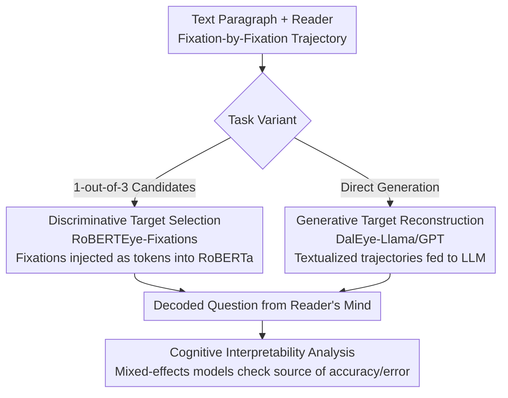

# Decoding Open-Ended Information Seeking Goals from Eye Movements in Reading

**Conference**: ICLR2026  
**arXiv**: [2505.02872](https://arxiv.org/abs/2505.02872)  
**Code**: TBD  
**Area**: Video Understanding  
**Keywords**: Eye-tracking, Reading Comprehension, Information Seeking Goal Decoding, Multimodal LLM, Cognitive State Decoding  

## TL;DR
This paper proposes a new task of decoding open-ended information retrieval goals from eye-tracking trajectories during reading. Using the OneStop eye-tracking dataset (360 subjects, 486 questions, 162 paragraphs), the authors develop discriminative and generative multimodal models. RoBERTEye-Fixations achieves 49.3% accuracy in a 3-choice target selection task (random baseline 33%) and 70.9% across different critical spans. DalEye-Llama/GPT also significantly outperforms non-eye-movement baselines in goal reconstruction.

## Background & Motivation

**Background**: Eye-tracking is a core methodology for studying reading cognition. However, existing research primarily focuses on "reading for understanding" in general scenarios, neglecting the more common information-seeking reading found in daily life.

**Limitations of Prior Work**: Existing cognitive state decoding works only distinguish between a few predefined reading modes (e.g., skimming vs. intensive reading) and cannot handle open-ended, text-specific information retrieval goals.

**Core Idea**: Given a text segment and the reader's eye-movement data, the goal is to automatically decode the specific question in the reader's mind—extracting target signals solely from eye-movement features such as fixation duration and saccade sequences, without relying on any external priors beyond the text itself.

## Method

### Overall Architecture
Given a text segment and a reader's fixation-by-fixation eye-movement trajectory, the objective is to reverse-engineer the question the reader is seeking to answer. The task is split into two variants: **Target Selection** chooses the reader's actual question from 3 candidates, and **Target Reconstruction** directly generates the question text. Both are built on the OneStop information retrieval dataset—each text is paired with 3 questions, where 2 share the same critical span (the text region containing the answer) and 1 falls in a different span. This same-span/different-span pairing naturally creates difficulty tiers. The selection variant is handled by the discriminative model RoBERTEye, while the reconstruction variant is handled by generative LLMs (DalEye series). After decoding the questions, mixed-effects models are used to analyze why the decoding succeeds.

### Key Designs

**1. Discriminative Target Selection: Injecting fixations as tokens into RoBERTa for joint encoding**

This corresponds to the selection variant in the framework. A naive approach would be to use fixation durations to weight RoBERTa word embeddings and calculate cosine similarity with candidate questions (Reading-Time weighted embedding similarity). However, this compresses eye movements into a static weight vector, losing gaze temporality and resulting in near-random performance. The proposed RoBERTEye-Fixations model instead injects individual fixation features as additional tokens into RoBERTa. This allows the attention mechanism to process both the text token sequence and the fixation sequence simultaneously, preserving the dynamic structure of "where to look first, where next, and for how long." Training uses 10-fold cross-validation with generalization settings for unseen texts and unseen readers. The temporal information of fixation order is what allows the model to distinguish between two questions focusing on the same region—ablation studies show that removing word embedding ordering results in the largest performance loss.

**2. Generative Target Reconstruction: Textualizing eye trajectories for LLMs**

This corresponds to the reconstruction variant. Since reconstructing question text cannot rely on similarity comparisons, the task description, original text, and eye trajectories (fixated word indices + fixation duration + saccade direction) are serialized into a single text prompt. DalEye-Llama and DalEye-GPT are fine-tuned on this representation. Similarly, textualized eye movements can be fed to Gemini-3-Pro for zero-shot or few-shot generation. This design avoids the need for a separate eye-movement encoder, leveraging the LLM's language priors to translate "reader scanning patterns" back into "target questions," significantly outperforming baselines that only provide text without eye-movement data.

**3. Cognitive Interpretability: Using mixed-effects models to analyze decoding success**

The model serves not just as a black-box predictor but as a probe to verify cognitive hypotheses. A linear mixed-effects model regresses RoBERTEye's accuracy against 11 trial-level features. A clear pattern emerges: the longer the reading time within the critical span and the shorter the time outside it, the higher the model accuracy ($p < 10^{-275}$). In other words, the more goal-oriented the reader is and the more focused their attention, the stronger the target signal in the eye movements, making it easier to decode—this also explains why same-span scenarios are the most difficult.

## Key Experimental Results

### Target Selection Accuracy

| Model | All (1-out-of-3) | Different Span (1-out-of-2) | Same Span (1-out-of-2) |
|------|-----------|----------------|----------------|
| Random Baseline | 33.0% | 55.3% | 49.9% |
| Haller RNN | 41.8% | 65.6% | 52.1% |
| **RoBERTEye-Fixations** | **49.3%** | **70.9%** | **57.3%** |

### Target Reconstruction Comparison

| Model | Question Word Acc | BERTScore | QA Acc |
|------|------------------|-----------|--------|
| Text-only Llama (No Gaze) | Baseline | Baseline | Baseline |
| DalEye-Llama | Sig. Better | Sig. Better | Sig. Better |
| DalEye-GPT | Sig. Better | Sig. Better | Sig. Better |
| Gemini few-shot | Best (New Reader) | Sig. Better | Best (New Reader) |

### Key Findings
- Even when two candidate questions focus on the same text region (same span), RoBERTEye still distinguishes them with 57.3% accuracy ($p < 0.001$), indicating that eye movements contain fine-grained cognitive information beyond "where to look."
- Fixation order in eye-movement sequences is more important than individual fixation features—ablation analysis shows that removing word embedding ordering leads to the greatest performance drop.
- In generation tasks, eye-movement information still contributes significantly in generalization scenarios with new texts.

## Highlights & Insights
- **Pioneering Task Definition**: Formulates "open-ended reading goal decoding" into two tasks (selection and reconstruction) and designs a sophisticated difficulty layering of same-span vs. different-span.
- **Cognitive-Computational Bridge**: Model performance can be explained by cognitive theory (goal-oriented reading behavior → information filtering → stronger signal); conversely, the model serves as an analytical tool to verify cognitive hypotheses.
- Large data scale (1.05 million word-level fixation data points) and comprehensive evaluation (generalization across new readers, new texts, and both).

## Limitations & Future Work
- Current accuracy (49.3%) still has a gap for practical application, particularly in same-span scenarios (57.3%) where it is only slightly above random.
- Experiments were conducted only in English; generalization across languages and populations (e.g., L2 readers, dyslexia) remains unknown.
- Generative models show a significant performance drop in new text scenarios, potentially requiring better eye-movement encoding methods.

## Related Work & Insights
- Unlike traditional task-based reading research (which focuses on a few predefined modes like skimming or proofreading), this work handles hundreds of text-specific goals.
- Insights from this work could inspire applications in educational systems (real-time detection of student reading goals) and content personalization (adjusting presentation based on user information needs).

## Rating
- Novelty: ⭐⭐⭐⭐⭐ New task definition + sophisticated experimental design
- Experimental Thoroughness: ⭐⭐⭐⭐⭐ Multiple models/baselines/evaluation dimensions, deep cognitive interpretability analysis
- Writing Quality: ⭐⭐⭐⭐⭐ Clear motivation, smooth narrative from cognitive science to NLP
- Value: ⭐⭐⭐⭐ High scientific value, though practical application requires higher accuracy

<!-- RELATED:START -->

## Related Papers

- [\[ECCV 2024\] Towards Open-ended Visual Quality Comparison](../../ECCV2024/multimodal_vlm/towards_open-ended_visual_quality_comparison.md)
- [\[CVPR 2026\] GUIDE: A Benchmark for Understanding and Assisting Users in Open-Ended GUI Tasks](../../CVPR2026/multimodal_vlm/guide_a_benchmark_for_understanding_and_assisting_users_in_open-ended_gui_tasks.md)
- [\[ICML 2026\] ECA: Efficient Continual Alignment for Open-Ended Image-to-Text Generation](../../ICML2026/multimodal_vlm/eca_efficient_continual_alignment_for_open-ended_image-to-text_generation.md)
- [\[NeurIPS 2025\] Reading Recognition in the Wild](../../NeurIPS2025/multimodal_vlm/reading_recognition_in_the_wild.md)
- [\[ICLR 2026\] Calibrated Information Bottleneck for Trusted Multi-modal Clustering](calibrated_information_bottleneck_for_trusted_multi-modal_clustering.md)

<!-- RELATED:END -->
