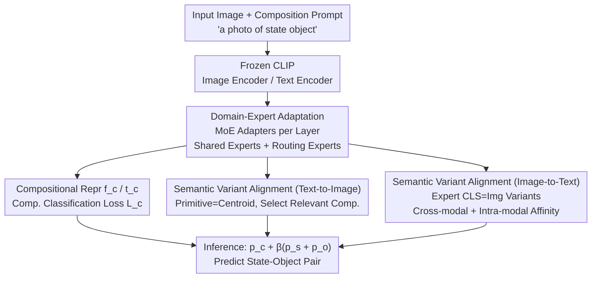

# Decoupling Primitive with Experts: Dynamic Feature Alignment for Compositional Zero-Shot Learning

**Conference**: ICLR2026  
**OpenReview**: [https://openreview.net/forum?id=hUtTGobe1r](https://openreview.net/forum?id=hUtTGobe1r)
**Code**: TBD  
**Area**: Multimodal VLM / Compositional Zero-Shot Learning  
**Keywords**: Compositional Zero-Shot Learning, Mixture-of-Experts, CLIP, Primitive Decoupling, Cross-modal Alignment

## TL;DR
To address the "same primitive has different semantics in different compositions" pain point in Compositional Zero-Shot Learning (CZSL), this paper proposes EVA—using Mixture-of-Experts (MoE) adapters to decouple primitives into multiple semantic variants for learning, and then employing semantic variant alignment to select the variant that best matches the image for fine-grained cross-modal matching. SOTA results are achieved on three benchmarks in both closed-world and open-world settings.

## Background & Motivation
**Background**: Compositional Zero-Shot Learning (CZSL) aims to learn knowledge of **primitives** such as states and objects from seen "state-object" combinations (e.g., *old man*, *young dog*) during training, and then recognize unseen new combinations during testing. Recent mainstream approaches leverage pre-trained vision-language models like CLIP, using contrastive loss to align "image compositions" and "text composition prompts" in the embedding space.

**Limitations of Prior Work**: Most existing methods learn a **single prototype representation** for each primitive, which is shared across all compositional contexts. however, primitives possess inherent "primitive polysemy"—the visual manifestation of *old* in *old man*, *old street*, and *old book* varies significantly. A static prototype cannot simultaneously accommodate these semantic variants. Consequently, the fine-grained "primitive $\leftrightarrow$ composition" topological structure is disrupted, semantics become entangled, and the quality of compositional embeddings is hindered by "flattened primitive modeling."

**Key Challenge**: Prior works implicitly assume that "primitive embeddings are static, context-independent fixed anchors," whereas in reality, primitive semantics are **heterogeneous and context-dependent**. This one-to-all constraint is the root cause limiting compositional generalization in CZSL, especially in open-world settings where primitives combine freely in unseen ways.

**Goal**: Enable primitive features to **dynamically adapt** to different semantic variants within their compositions and perform **fine-grained** image-primitive matching, rather than forcing all variants into a single prototype for one-to-all coarse alignment.

**Key Insight**: The authors draw inspiration from the Mixture-of-Experts (MoE) paradigm. The MoE mechanism of "routing different inputs to specialized experts" naturally fits the CZSL challenge where primitive meanings shift drastically with context. Each expert can specialize in one semantic aspect of a primitive. The authors emphasize that this is not merely a stronger architecture migration but an **explicit** response to the inherent semantic variability in compositional learning through expert division of labor.

**Core Idea**: Utilize MoE adapters to decouple primitives from a "single prototype" into "multiple semantic variant experts" (domain-expert adaptation), and then use "semantic variant alignment" to select the most relevant variant for the current image/text, replacing coarse one-to-all alignment with fine-grained "local-to-local" alignment.

## Method

### Overall Architecture
The skeleton of EVA consists of a frozen CLIP image encoder $E_v$ and text encoder $E_t$, with two integrated components: **domain-expert adaptation** (how to learn primitives well) and **semantic variant alignment** (how to align images and primitives at a fine-grained level).

Specifically, images pass through $E_v$ and text composition prompts (initialized as *"a photo of state object"*) pass through $E_t$. Parallel MoE adapters are attached to **every layer** of both encoders to dynamically assign each token to specific experts, resulting in high-quality image representations $f_c$ and text composition representations $t_c$. These are aligned using a standard compositional classification loss $\mathcal{L}_c$. Semantic variant alignment then proceeds via two paths: **text-to-image** treats primitive text features as "centroids" of their respective compositions and picks the most relevant individuals using local compositional distributions; **image-to-text** treats the CLS tokens output by experts in the last layer of the image encoder as "image feature variants," selecting the variant that best matches the state/object text using cross-modal and intra-modal affinity. During inference, compositional scores are fused with weighted state and object scores for final prediction.

### Key Designs

**1. Domain-Expert Adaptation: Decoupling "Single Prototype" into Multiple Semantic Experts**

This design directly addresses the "single prototype cannot fit primitive polysemy" issue. In each layer of the image and text encoders, an MoE adapter is placed in parallel to the Feed-Forward Network (FFN), consisting of a router $R$ and multiple experts $\{E_i\}_{i=0}^{N_E}$. Two key design choices: first, each expert is implemented as a lightweight LoRA (two trainable matrices $A\in\mathbb{R}^{r\times d}, B\in\mathbb{R}^{d\times r}$ where $r\ll d$), saving parameters and preventing overfitting on small CZSL datasets; second, a **shared expert $E_0$** is designated to learn general knowledge, while **routing experts** learn domain-specific knowledge to avoid redundancy. Given the $j$-th layer token embedding $h_j$, the router calculates affinities and selects TopK:

$$G = \mathrm{Softmax}(\mathrm{TopK}(R(h_j))), \quad E_i = B_i A_i, \quad h_{j+1} = \sum_{i=1}^{N_e} G_i E_i(h_j) + E_0(h_j)$$

This means the weighted outputs of $K$ selected routing experts is added to the output of the shared expert. This allows experts to specialize in semantic categories of tokens (e.g., in-domain knowledge like color), deepening primitive learning at the token level.

**2. Semantic Variant Alignment (Text-to-Image): Primitives as Centroids, Picking Local Relevant Compositions**

The text-to-image path resolves the issue of primitive text features being hindered by one-to-all alignment. The observation is that since compositions belong to their respective state and object sets, primitive features can be viewed as **centroids** of composition features. Thus, fine-grained primitive semantics can be captured indirectly without explicitly maintaining multiple feature variants. Specifically, for state $\hat{s}$, the maximum matching score among all compositions containing that state is used as the image-state matching score:

$$p_s(\hat{s}\mid x) = \max_{c_{\hat{s},o}} p_c(c_{\hat{s},o}\mid x)\cdot \tau_s$$

where $\tau_s>0$ is a learnable coefficient. The object side $p_o$ is calculated similarly. This effectively uses the "local compositional distribution" to select the specific individual most aligned with the image, rather than performing coarse matching with a global prototype. Supervision is provided via cross-entropy $\mathcal{L}_h$ (including $\mathcal{L}_s, \mathcal{L}_o$).

**3. Semantic Variant Alignment (Image-to-Text): CLS Tokens as Image Variants, Dual Affinity Selection**

The image-to-text path complements the image-side fine-grained alignment. Since multiple experts extract semantics from different subspaces, the CLS tokens from the **last layer** of the image encoder naturally form a set of **image feature variants** $\{v_i\}_{i=0}^{N_e}$, each describing one semantic aspect. To select the variant most suitable as the primitive visual feature, a **dual affinity** is designed: cross-modal affinity $A_s = V t_s^\top$ (similarity between variants and state text $t_s$ from prompt *"a photo of state"*) and intra-modal affinity $A_v = V f_c^\top$ (similarity between variants and global image feature $f_c$ to exclude outliers). The synthesis is:

$$A_S = A_s + \alpha A_v, \quad f_s = \arg\max_{v_i}\, a^s_i$$

The state visual feature $f_s$ ($f_o$ for object) is selected based on the score, and image-to-text primitive probability $p^v_h$ is supervised by $\mathcal{L}^v_s, \mathcal{L}^v_o$. This path relies on labels and is **used only during training** to "refine" the image representation space into a more structured form, bridging the gap between seen and unseen sets.

### Loss & Training
The total objective is a weighted sum of the compositional classification loss and the two-way variant alignment losses:

$$\mathcal{L} = \mathcal{L}_c + \lambda_1(\mathcal{L}_s + \mathcal{L}_o) + \lambda_2(\mathcal{L}^v_s + \mathcal{L}^v_o)$$

During inference, compositional scores are fused with state and object scores for the final prediction:

$$\hat{c}_{s,o} = \arg\max_{c_{s,o}\in C_{test}} p_c(c_{s,o}\mid x) + \beta\big(p_s(s\mid x) + p_o(o\mid x)\big)$$

where $\beta$ is set to $0.5$.

## Key Experimental Results

### Main Results
Evaluations were conducted on MIT-States, UT-Zappos, and C-GQA across both closed-world and open-world settings. Below are the **closed-world** results (AUC / HM, higher is better), with "Prev. SOTA" representing the strongest existing method for each dataset:

| Dataset | Metric | EVA (Ours) | Prev. SOTA | Gain |
|--------|------|-----------|----------|------|
| MIT-States | AUC / HM | 24.0 / 41.0 | 23.8 / 40.7 (CLUSPRO) | +0.2 / +0.3 |
| UT-Zappos | AUC / HM | 50.2 / 60.2 | 46.6 / 58.5 (CLUSPRO) | +3.6 / +1.7 |
| C-GQA | AUC / HM | 18.8 / 36.9 | 15.3 / 33.3 (LOGICZSL) | +3.5 / +3.6 |

The model also leads in open-world settings: UT-Zappos AUC 40.2 (+0.7), and C-GQA AUC 5.6. The improvement is particularly significant on the **largest and most difficult** dataset, C-GQA, indicating that explicitly modeling primitive semantic variants yields higher returns as the compositional space expands.

### Ablation Study
Ablation of core components (C-GQA Closed-world, AUC / HM):

| Configuration | AUC / HM | Description |
|------|----------|------|
| BASELINE | 10.4 / 26.9 | Frozen CLIP + Compositional Alignment |
| + Domain-Expert Adaptation | 17.2 / 35.5 | Adding MoE adapters only |
| + Semantic Variant Alignment | 12.1 / 29.8 | Adding variant alignment only |
| EVA (Full Model) | 18.8 / 36.9 | Full Model |

Internal ablation of variant alignment (C-GQA, AUC): BASELINE 17.2 $\rightarrow$ + Text-to-Image 18.0 $\rightarrow$ + Cross-modal affinity 18.5 $\rightarrow$ + Intra-modal affinity 18.8. Each component contributes cumulatively.

### Key Findings
- **Domain-Expert Adaptation is the primary driver**: Adding it alone increases AUC from 10.4 to 17.2 (+6.8), several times the gain of adding only semantic variant alignment (+1.7). However, combining both reaches 18.8, showing they are complementary.
- **Expert configuration has a sweet spot**: A **1+8** (shared + routing) configuration is optimal (AUC 18.8). Removing the shared expert (0+8) or increasing shared experts (2+8) performs worse, validating the "one shared for general, others for specialized" design.
- **Extra regularization can be harmful**: Adding common MoE regularization like semantic isolation or load balancing dropped AUC from 18.8 to 18.5 / 18.0, suggesting standard LLM MoE balance strategies may not suit the small-data CZSL scenario.

## Highlights & Insights
- **MoE as a "Semantic Decoupler" rather than "Capacity Expander"**: While conventional MoE is used for scaling capacity, here it is task-driven to map experts to "primitive polysemy." Each expert captures one semantic facet—a natural and clever mapping.
- **Primitive=Centroid observation is elegant**: The text-to-image path avoids maintaining explicit variants by using the logic that "compositions belong to state/object sets; primitives are centroids," which is efficient and self-consistent.
- **LoRA-based Lightweight Experts**: By implementing experts as low-rank matrices, the model allows multiple experts to coexist on small datasets without overfitting while remaining end-to-end efficient.
- **Training-only Image-to-Text Alignment**: Using label information to refine the image representation space during training and discarding it during inference is a reproducible trick to "shape" the feature space without adding inference overhead.

## Limitations & Future Work
- The method relies heavily on the quality of frozen CLIP representations; primitives not well-covered by CLIP (e.g., very fine-grained or long-tail visual concepts) might be limited by the base representation.
- There are several hyperparameters ($\alpha, \lambda_1, \lambda_2, \beta$, expert counts, TopK). Ablations show sensitivity to expert configurations, and the tuning cost across different datasets is not fully explored.
- The image-to-text alignment is training-only and requires labels; how well this supervision generalizes to "completely unseen primitives" in the open world remains a research question.
- The shared/routing split is currently manual; allowing the model to adaptively determine this ratio is a natural refinement.

## Related Work & Insights
- **vs. CSP / Troika / GIPCOL (Single Prototype approaches)**: CSP learns a single learnable prompt per primitive; Troika uses a single cross-modal module. They assume static prototypes. EVA decouples these into multiple experts at the token level.
- **vs. CLUSPRO / LOGICZSL (Recent SOTA)**: These were the previous leaders on MIT-States/UT-Zappos/C-GQA. EVA outperforms them across all benchmarks, with the largest lead on C-GQA.
- **vs. General MoE / Concept Learning (Mixtral, CLIP/LLaVA)**: General MoE focuses on token routing for capacity; EVA focuses on using **semantic variant supervision** rather than just text supervision to enhance primitive expressiveness for cross-modal fine-grained alignment.

## Rating
- Novelty: ⭐⭐⭐⭐ First use of MoE as a "primitive semantic decoupler" in CZSL.
- Experimental Thoroughness: ⭐⭐⭐⭐ Full coverage of three datasets in both settings with detailed ablations.
- Writing Quality: ⭐⭐⭐⭐ Clear logic from motivation to method, well-illustrated.
- Value: ⭐⭐⭐⭐ Refreshes SOTA on three benchmarks; the LoRA-expert + variant alignment paradigm is valuable for small-data MoE fine-tuning.

<!-- RELATED:START -->

## Related Papers

- [\[CVPR 2026\] FlowComposer: Composable Flows for Compositional Zero-Shot Learning](../../CVPR2026/multimodal_vlm/flowcomposer_composable_flows_for_compositional_zeroshot_learning.md)
- [\[CVPR 2026\] Bridging the Modality Gap in Compositional Zero-Shot Learning via Sparse Alignment and Unimodal Memory Bank](../../CVPR2026/multimodal_vlm/bridging_the_modality_gap_in_compositional_zero-shot_learning_via_sparse_alignme.md)
- [\[NeurIPS 2025\] TOMCAT: Test-time Comprehensive Knowledge Accumulation for Compositional Zero-Shot Learning](../../NeurIPS2025/multimodal_vlm/tomcat_test-time_comprehensive_knowledge_accumulation_for_compositional_zero-sho.md)
- [\[ICLR 2026\] Reversible Primitive–Composition Alignment for Continual Vision–Language Learning](reversible_primitivecomposition_alignment_for_continual_visionlanguage_learning.md)
- [\[ICLR 2026\] Memory-Free Continual Learning with Null Space Adaptation for Zero-Shot Vision-Language Models](memory-free_continual_learning_with_null_space_adaptation_for_zero-shot_vision-l.md)

<!-- RELATED:END -->
