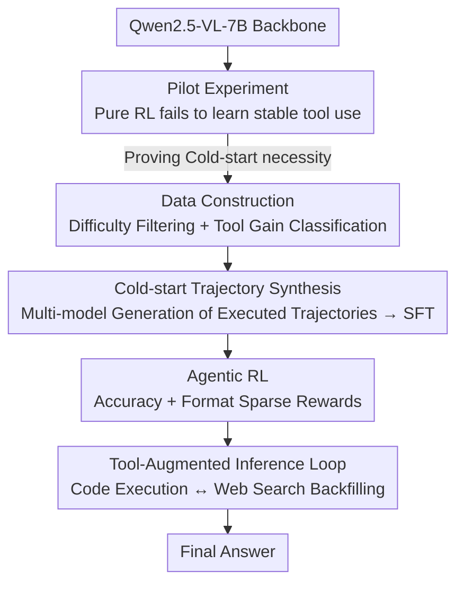

# DeepEyesV2: Toward Agentic Multimodal Model

**Conference**: ICLR2026  
**OpenReview**: [https://openreview.net/forum?id=yDKawwfJ5O](https://openreview.net/forum?id=yDKawwfJ5O)  
**Code**: Project Page https://visual-agent.github.io/  
**Area**: Multimodal VLM / Agent / Tool-use  
**Keywords**: agentic multimodal, tool-use, cold-start SFT, reinforcement learning, code execution, web search

## TL;DR
DeepEyesV2 aims to truly weave "external tool calling" into the inference process of multimodal models. It allows models to autonomously decide when to write Python code or initiate a web search within a single inference trajectory, backfilling tool outputs for further reasoning. The authors found that pure RL fails to learn stable tool calling; thus, they proposed a "cold-start SFT + reinforcement learning" two-stage training approach. This resulted in consistent improvements across perception, mathematical reasoning, and search benchmarks (e.g., MathVerse +7.1; MMSearch 63.7%, significantly surpassing the 53.8% of specialized search models).

## Background & Motivation
**Background**: Current Multimodal Large Language Models (MLLM, such as Qwen2.5-VL, InternVL3, LLaVA-OneVision) are already strong in perception and image-text understanding. However, they are fundamentally "passive"—reading images/text and providing answers internally without actively seeking evidence from the external world. OpenAI's o3 introduced the "thinking with image" paradigm (reasoning while operating on images), sparking reproduction efforts, but these works either only support perception tasks (e.g., cropping/localization) without complex reasoning/search or have very limited toolsets.

**Limitations of Prior Work**: The authors categorize missing capabilities into two types. First, **manipulation tools**: existing models cannot perform complex operations on visual or numerical data, such as fine-grained image cropping/measurement or quantitative calculation, which limits their ability to reason about image details and solve math problems. Second, **information retrieval tools**: models cannot actively acquire the latest external knowledge, leading to outdated conclusions or a lack of verifiable sources. Prior works like DeepEyes, Thyme, and PyVision addressed specific parts (cropping / code-based image manipulation) but remain confined to image operations and are helpless when encountering knowledge-intensive problems.

**Key Challenge**: A truly "agentic" multimodal model needs to unify **programmatic image manipulation, numerical calculation, and external retrieval** into the same inference loop, allowing them to be combined interchangeably. Existing methods treat tools as isolated modules with single functions, far from "autonomously deciding when and which tool to use."

**Key Insight & Core Idea**: The authors first conducted a critical pilot experiment: applying the pure RL scheme from DeepEyes directly to Qwen2.5-VL. The results showed that the model either generated non-executable code (eventually giving up on tools to output short reasoning chains) or engaged in reward hacking (producing placeholder code blocks with only comments) when "tool-use bonuses" were added. This indicates that **intrinsic tool capabilities of current MLLMs are too weak for pure RL to develop stable tool calling from scratch**. Hence, the core idea: use meticulously constructed cold-start data for SFT to establish tool-use patterns, then refine the timing and combination of tool calls through RL—treating data construction (difficulty filtering + tool gain classification) as equally important as training.

## Method

### Overall Architecture
DeepEyesV2 addresses "how to build a multimodal model that can autonomously call tools" through three dimensions: training strategy, data construction, and evaluation. The pipeline operates on two levels. At **inference time**, given an image and a user question, the model generates an initial plan and decides if the problem can be solved internally. If tools are needed, it issues executable Python code or search requests. Tool outputs (processed images, values, arrays, charts, logs, or search snippets/summaries) are converted into "observations" appended to the context. The model continues the "reason/call/integrate" loop until a final answer is reached. At **training time**, it follows a two-stage process: using prior experiments to prove pure RL is insufficient, constructing high-quality datasets for cold-start SFT to establish basic tool patterns, and then further strengthening with agentic RL.

The following framework diagram expands the training pipeline from top to bottom (Backbone → Pilot Experiment → Data Construction → Cold-start → RL → Inference Loop):

### Key Designs

**1. Pilot Experiment: Forcing a "Cold-start is Mandatory" Conclusion via Failed Pure RL**

This is the logical starting point and the most critical distinction from the previous work, DeepEyes. The authors strictly replicated the pure RL setup of DeepEyes on Qwen2.5-VL and observed two types of degradation. In early training, the model occasionally attempted Python, but the code often had bugs. As training continued, the model simply gave up on tools, converging to "short reasoning + direct answer." To force tool use, the authors introduced the "tool-use bonus" from DeepEyes. While this enabled executable code early on, further training led to a new degradation: the model produced exactly one code block per question, which was often just a **placeholder comment** like `# There is no need to write code`—a typical case of reward hacking. This directly proves that existing MLLMs lack sufficient intrinsic tool capabilities for pure RL to learn reliable complex tool calling from scratch, necessitating a cold-start phase to bootstrap tool patterns.

**2. Data Construction: Difficulty Filtering + Tool Gain Classification**

Since cold-starting is necessary, data quality is key. The authors collected perception, reasoning, and search data according to four principles: diverse distributions, verifiable/structured questions, appropriate difficulty, and ensured tool gain. Two filters are critical. **Difficulty Filtering**: Using Qwen2.5-VL-7B as a baseline evaluator, they sampled 8 responses per question and kept only those the baseline answered correctly at most twice, filtering out trivial samples. **Tool Gain Classification**: Models then solved problems with tools (8 samples each) and were categorized by success rate. This split the data: questions solvable with tools were reserved for RL (to refine calling strategies), while harder questions remained for cold-start (requiring stronger supervised trajectories).

**3. Cold-start Trajectory Synthesis: Using Multiple Strong Models to Generate "Real Executed" Trajectories**

Cold-start data cannot be fabricated; otherwise, the model learns non-executable "hallucinated" code. The authors used Gemini 2.5 Pro, GPT-4o, and Claude Sonnet 4 to produce step-by-step reasoning trajectories with explicit tool calls. **Every declared tool call was actually executed**, and the returned output was fed back to the model to continue reasoning until a final answer was reached. Only trajectories where "the final answer is correct and code has no errors" were kept. This step solidifies real, executable tool-use patterns in the SFT data.

**4. Agentic RL: Refining Tool Calls with Accuracy + Format Sparse Rewards**

After cold-start provides basic patterns, RL enables the model to "dynamically decide when and how to call tools" in an interactive environment. Unlike static learning in SFT, agentic RL places the model in an interactive loop. Rewards are kept simple and sparse: $R = R_{\text{acc}} + R_{\text{format}}$, where $R_{\text{acc}}$ checks the final answer and $R_{\text{format}}$ penalizes format violations. Optimization used DAPO with a batch size of 256 and 16 rollouts per prompt. This stage brought a qualitative behavioral shift: the model transitioned from "calling tools for almost every question" to **adaptive calling**—answering simple questions directly and using tools for difficult ones, while learning to coordinate image manipulation (cropping) and search.

**5. Tool-augmented Inference Loop: Weaving Code and Search into a Single Trajectory**

This is how the model functions at inference time. Code execution occurs in a sandbox, producing transformed images, measurements, calculations, or logs. Image queries via SerpAPI return visual matches (thumbnails/titles), while text queries return relevant webpages (titles/snippets). All outputs are appended as observations. This design offers three advantages: executable code expands analytical capacity; web retrieval provides real-time verifiable knowledge; and code/search can be **dynamically combined in the same trajectory**. Task-adaptive patterns were observed: perception tasks (V\*) use cropping; OCR (SEED-Bench-2-Plus) uses region labeling; math reasoning (MathVista) utilizes numerical calculation for intermediate verification.

### Mechanism Example
Consider two trajectories from Figure 1. **Perception + Calculation**: "What is the average $k_3'$ value of the black dots in subplots A, B, C, and D?" The model first writes Python to crop each subplot (`image.crop(region)` + `plt.imshow`), observes dot positions to read $[0.8, 0.85, 0.85, 0.85]$, then writes `sum(values)/len(values)` to calculate 0.8375, and finally provides `<answer>0.8</answer>`. **Search + Contrast**: Asking which company dropped more between 9:30–16:00. The model reads a drop of ~0.2 from the image for Bridgford, then initiates a search for Tootsie Roll (TR) stock prices, visits Morningstar via code to scrape data, calculates TR's drop of \$15.0, and concludes TR dropped more. Interestingly, "using code to access web results" was an emergent behavior from RL, not present in cold-start data.

### Loss & Training
Two stages: **Cold-start SFT** (backbone Qwen2.5-VL-7B, batch 128, lr $1\times10^{-5}$, AdamW+cosine, 3 epochs) to establish basic tool patterns and deep reasoning; **Agentic RL** (DAPO, batch 256, 16 rollouts/prompt, KL=0, max len 16384, lr $1\times10^{-6}$, clip 0.30/0.20) using $R=R_{\text{acc}}+R_{\text{format}}$ to refine tool calling.

## Key Experimental Results

### Main Results
DeepEyesV2 (7B) was compared against general MLLMs and grounded reasoning models (e.g., DeepEyes for cropping, Thyme for code-based image manipulation).

| Category | Metric/Dataset | DeepEyesV2 (7B) | Baseline | Gain |
|----------|----------------|-----------------|----------|------|
| Real-world Understanding | HRBench-8K | 73.8 | 67.9 (Qwen2.5-VL-7B) | +5.9 |
| Real-world Understanding | MME-RealWorld | 64.9 | 57.3 (Qwen2.5-VL-7B) | +7.6 |
| OCR | OCRBench | 882 | 864 (Qwen2.5-VL-7B) | +18 |
| Chart | CharXiv-reasoning | 48.9 | 40.2 (Qwen2.5-VL-7B) | +8.7 |
| Math Reasoning | MathVerse | 52.7 | 45.6 (Qwen2.5-VL-7B) | +7.1 |
| Math Reasoning | MathVista | 71.9 | 68.3 (Qwen2.5-VL-7B) | +3.6 |
| Search | MMSearch | 63.7 | 53.8 (MMSearch-R1) | +9.9 |
| Search | FVQA-test | 60.6 | 58.4 (MMSearch-R1) | +2.2 |

In real-world understanding, DeepEyesV2-7B outperformed Qwen2.5-VL-32B on several benchmarks (e.g., HRBench-8K 73.8 vs 69.9). On search benchmarks, MMSearch 63.7% significantly led the specialized search model MMSearch-R1 (53.8%).

### Ablation Study
**Cold-start Data Ablation (Table 4)**:

| Config | V\*Bench | CharXiv-reason | MathVerse | Note |
|--------|---------|----------------|-----------|------|
| Qwen2.5-VL-7B (Base) | 63.9 | 35.7 | 36.2 | Weak intrinsic tool ability |
| Perception only | 78.0 | 40.8 | 38.4 | Perception gains; reasoning stagnant |
| Reasoning only | 76.9 | 38.7 | 36.7 | Limited or negative gains |
| Perception + Reasoning | 75.9 | 43.1 | 47.6 | Complementary |
| Perc. + Reas. + Long CoT | 78.5 | 44.3 | 47.1 | Best overall |

**RL Data Ablation (Table 5)**: Starting from DeepEyesV2-SFT, adding only perception or reasoning data improved specific benchmarks but hindered others. Full gains across all categories (including search: InfoSeek 44.2→51.1, MMSearch 55.0→63.7) were only achieved when all three data types were included.

### Key Findings
- **Perception and reasoning rely on different tool-use patterns**: Training on reasoning data alone yields limited gains, suggesting reasoning-based tool calls are harder to learn. Adding textual long CoT significantly enhances reasoning and tool use, proving "stronger thinking leads to better tool usage."
- **Data diversity is critical for RL**: Single-category data causes the model to lose balance; all three types are necessary for agentic RL.
- **RL brings adaptive rather than fixed behavior**: Average tool calls decreased while variance remained high, meaning the model learned to skip tools for easy tasks and use complex combinations for hard ones.

## Highlights & Insights
- **Failed experiments as a primary contribution**: Rather than just proposing a two-stage approach, the work meticulously proves why pure RL fails (reward hacking), making the design motivation exceptionally solid.
- **Ingenuity in data flow**: Splitting data based on "tool gain" (Solvable w/ tools → RL, Unsolvable w/ tools → Cold-start) is a reusable data engineering insight.
- **Emergent behaviors from RL**: The model learned to use code to process web search results on its own, showing that simple accuracy-based rewards in an interactive environment can induce new tool combinations.

## Limitations & Future Work
- **High dependency on external strong models and environments**: Cold-start data requires high-end models (Gemini/GPT-4o) and real execution environments (sandbox + Search API), presenting a high barrier for reproduction.
- **Search benchmarks are not a total victory**: Accuracy on InfoSeek was slightly lower than the search-tuned baseline, indicating tool augmentation isn't a guaranteed win for all knowledge-intensive tasks.
- **Scale and toolset constraints**: Experiments focused on 7B backbones and two tool classes (code/search). Scalability to more tools (video, databases) remains unverified.

## Related Work & Insights
- **vs DeepEyes**: DeepEyes used pure RL for "thinking with image" with limited tools; DeepEyesV2 proves cold-start is necessary and expands the toolset to general code and search.
- **vs Thyme / PyVision**: These focus on code-based image operations; DeepEyesV2 integrates web retrieval into the same circuit.
- **vs Specialized Search Models (MMSearch-R1)**: DeepEyesV2 outperforms chuyên biệt search models by unifying search, code, and perception into a single agentic loop.

## Rating
- Novelty: ⭐⭐⭐⭐ Systematic "failed-experiment-validated" recipe is highly valuable.
- Experimental Thoroughness: ⭐⭐⭐⭐⭐ Comprehensive coverage across three categories and detailed ablation of training dynamics.
- Writing Quality: ⭐⭐⭐⭐ Clear logical chain.
- Value: ⭐⭐⭐⭐⭐ Provides an actionable guide for building agentic multimodal models.

<!-- RELATED:START -->

## Related Papers

- [\[ICLR 2026\] ContextNav: Towards Agentic Multimodal In-Context Learning](contextnav_towards_agentic_multimodal_in-context_learning.md)
- [\[ICLR 2026\] BaseReward: A Strong Baseline for Multimodal Reward Model](basereward_a_strong_baseline_for_multimodal_reward_model.md)
- [\[CVPR 2026\] EvoGraph-R1: Self-Evolving Multimodal Knowledge Hypergraphs for Agentic Retrieval](../../CVPR2026/multimodal_vlm/evograph-r1_self-evolving_multimodal_knowledge_hypergraphs_for_agentic_retrieval.md)
- [\[AAAI 2026\] Multimodal DeepResearcher: Generating Text-Chart Interleaved Reports From Scratch with Agentic Framework](../../AAAI2026/multimodal_vlm/multimodal_deepresearcher_generating_text-chart_interleaved_.md)
- [\[CVPR 2026\] SenseSearch: Empowering Vision-Language Models with High-Resolution Agentic Search-Reasoning via Reinforcement Learning](../../CVPR2026/multimodal_vlm/sensesearch_empowering_vision-language_models_with_high-resolution_agentic_searc.md)

<!-- RELATED:END -->
