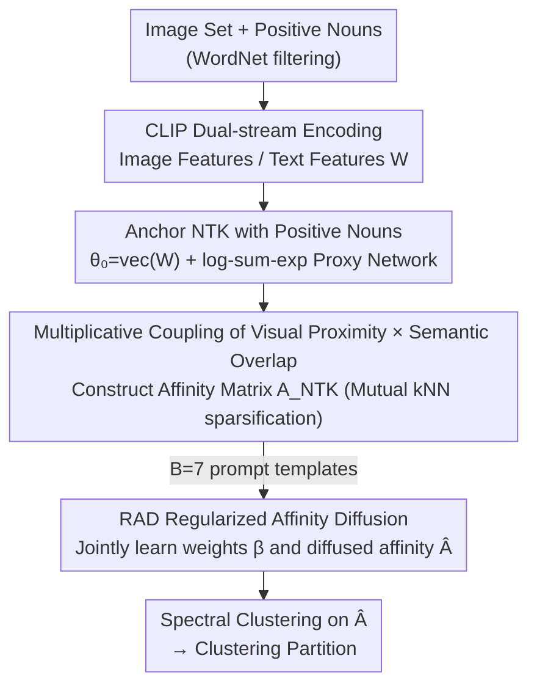

# Delving into Spectral Clustering with Vision-Language Representations

**Conference**: ICLR2026  
**OpenReview**: [https://openreview.net/forum?id=s1ea8y8VUL](https://openreview.net/forum?id=s1ea8y8VUL)  
**Code**: To be confirmed (Paper states source code is provided in supplementary materials)  
**Area**: Multimodal VLM / Unsupervised Clustering  
**Keywords**: Spectral Clustering, Neural Tangent Kernel, Vision-Language Models, Affinity Matrix, CLIP

## TL;DR
This paper advances spectral clustering from an image-only unimodal paradigm to a multimodal one: it utilizes "positive nouns" from the CLIP text end to anchor a Neural Tangent Kernel (NTK), making the affinity between two images a product of "visual proximity $\times$ semantic overlap." This naturally strengthens the block-diagonal structure. Furthermore, a regularized affinity diffusion mechanism is used to adaptively integrate affinity matrices from multiple prompts, significantly outperforming previous SOTA on 16 benchmarks (e.g., 98.3% ACC on STL-10, 84.9% ACC on ImageNet-Dogs).

## Background & Motivation
**Background**: Spectral clustering (SC) reformulates clustering as a graph-cut problem where samples are nodes, pairwise affinities are edge weights, and the smallest $K$ eigenvectors of the graph Laplacian matrix $L = I_M - D^{-1/2}AD^{-1/2}$ are used to obtain low-dimensional embeddings for partitioning. It captures non-linear pairwise relationships, and its performance depends almost entirely on the quality of the affinity matrix $A$. However, most SC methods rely solely on visual features.

**Limitations of Prior Work**: Purely visual affinity has a significant flaw—when two images with completely different semantics are visually similar (e.g., different dog breeds or different categories with similar textures), their visual distance is small. The affinity graph then incorrectly connects them, polluting the block-diagonal structure and degrading clustering quality. Vision-language pre-trained models like CLIP map images and text to the same hyperspherical embedding space, theoretically providing "semantic" information. However, there has been no principled framework for effectively incorporating textual semantics into the construction of the affinity matrix.

**Key Challenge**: The authors point out a counter-intuitive fact through experiments—simply "shoving text into the feature layer" is insufficient. They applied RBF kernels + spectral clustering to features from TAC (a method that concatenates vision-language features), denoted as TAC(SC), and found it performed almost identically to TAC(KMeans). This suggests that merging vision and language at the feature level does not naturally lead to a better affinity graph. The problem is refined into one core question: **How can textual semantics and visual similarity be organically combined when constructing the affinity matrix $A$?**

**Key Insight**: The authors adopt a novel perspective—the Neural Tangent Kernel (NTK). NTK does not measure the geometric distance between two inputs in the input space, but rather how they interact in the function space via the gradients of a proxy network, representing a "higher-order affinity." The key insight is: if the initial parameters of this NTK are **anchored** using semantic features from the CLIP text encoder, the kernel values will simultaneously encode "visual proximity" and "semantic consistency."

**Core Idea**: Set the initial weights of the proxy network to textual features of "positive nouns" and compute the NTK for image features. The resulting affinity is precisely the **multiplicative coupling** of visual proximity and semantic overlap, which automatically amplifies within-cluster connections and suppresses cross-cluster noise.

## Method

### Overall Architecture
The method is called **Neural Tangent Kernel Spectral Clustering (NTKSC)**. The input is a batch of unlabeled images and a set of positive nouns filtered from "wild" corpora like WordNet (following TAC's filtering, these nouns are semantically close to image content and act as semantic anchors for missing class names); the output is the clustering partition. The pipeline consists of two stages: first, injecting vision-language semantics into the affinity matrix using NTK, and second, integrating affinity matrices from multiple prompts into a robust $\hat{A}$ using Regularized Affinity Diffusion (RAD). Finally, standard spectral clustering is performed on $\hat{A}$.

### Key Designs

**1. Anchoring NTK with Positive Nouns: Injecting Textual Semantics into Affinity**

The challenge is "how to incorporate text into the affinity matrix." The authors first use the CLIP text encoder to encode $N$ positive nouns into a feature matrix $W = [w_1, \dots, w_N] \in \mathbb{R}^{d\times N}$, where $w_i = f_T(\Delta(\hat{c}_i))$ ($\Delta$ is a prompt template). They then set the initial parameters of the NTK proxy network directly to these textual features: $\theta_0 = \mathrm{vec}(W)$. Since CLIP's images and text are cross-modally aligned, this initialization allows the gradient $\partial g_{\theta_0}(z)/\partial \theta_0$ to capture "how image $z$ functionally interacts with various positive nouns," effectively injecting the textual semantic structure learned by CLIP into the NTK.

The proxy network $g_{\theta_0}$ is deliberately designed in a log-sum-exp form:
$$g_{\theta_0}\big(f_X(x_i)\big) = \log \sum_{k=1}^{N} e^{\,w_k^\top f_X(x_i)/\tau}.$$
This form is chosen because its NTK can be analytically decomposed into visual and semantic terms (see Design 2), leading to a provable block structure. This step transforms "semantic anchors" from a vague concept into a specific differentiable network initialization.

**2. Multiplicative Coupling of Visual Proximity $\times$ Semantic Overlap: Naturally Strengthening Block-Diagonality**

By substituting the log-sum-exp proxy network into the NTK definition, the authors derive a clean closed-form expression:
$$K_{\theta_0}\big(f_X(x_i), f_X(x_j)\big) = \frac{1}{\tau^2}\underbrace{f_X(x_i)^\top f_X(x_j)}_{U_{ij}}\cdot \underbrace{\Big(\sum_{k=1}^{N} s_i[k]\,s_j[k]\Big)}_{V_{ij}},$$
where $s_i[k] = \mathrm{softmax}_k(W^\top f_X(x_i)/\tau)$ is the normalized alignment distribution of image $x_i$ over the positive nouns. Since the temperature $\tau$ is small ($0.04$ in the paper), $s_i$ is highly sharp and nearly one-hot.

The elegance of this formula lies in its **multiplicative** (not additive) nature: $U_{ij}$ is the visual proximity in CLIP space, and $V_{ij}$ is the overlap of the semantic distributions of the two images. For within-cluster images, both terms are large (visually close + aligned to the same nouns), strongly amplifying the affinity and filling the diagonal blocks. For cross-cluster images, even if they look visually similar (moderate $U_{ij}$), their softmax distributions will concentrate on different subsets of nouns, making $V_{ij}$ approach zero and thus suppressing the cross-cluster affinity. This directly addresses the "visually similar but semantically different" issue. The final affinity matrix $A_{NTK}$ is sparsified using mutual $q$-nearest neighbors ($q=30$). Theoretically, this multiplicative structure sharpens the block-diagonal structure, which was confirmed by visualization (NMI on ImageNet-Dogs improved from CLIP's 72.8% to 82.4% for Ours).

**3. RAD Regularized Affinity Diffusion: Adaptive Integration of Multi-Prompt Affinities**

Affinity matrices constructed from a single prompt template (e.g., "a photo of a {}") can be biased. The authors construct an $A_{NTK}^{(b)}$ for each of $B=7$ templates. Simple equal-weight averaging ignores correlations between matrices. The authors formulate the "learning of integration weights" and "learning of diffused affinity" as a unified optimization problem (Eq. 9):
$$\min_{\beta,\hat{A}} \sum_{b=1}^{B}\beta[b]\,\ell(\hat{A}, A_{NTK}^{(b)}) + \mu\|\hat{A}-E\|_F^2 + \frac{\lambda}{2}\|\beta\|_2^2,\quad \text{s.t. } 0\le\beta[b]\le1,\ \sum_b \beta[b]=1,$$
where $\ell(\cdot)$ is the objective of the affinity diffusion process (measuring whether $\hat{A}$ is smooth on the manifold geometry induced by each $A^{(b)}$), $\mu\|\hat{A}-E\|_F^2$ uses a positive definite matrix $E$ (practically $E=I_M$) to prevent $\hat{A}$ from being over-smoothed, and the $\lambda$ term regularizes the weights $\beta$.

Since the objective depends on both $\beta$ and $\hat{A}$, the authors alternate between two subproblems: **optimizing $\hat{A}$ with $\beta$ fixed** has a closed-form solution (involving an $M^2 \times M^2$ matrix inversion, which is infeasible, so a fixed-point iteration $\hat{A}\leftarrow \sum_b \frac{\beta[b]}{\mu+1}S^{(b)}\hat{A}S^{(b)\top} + \frac{\mu}{\mu+1}E$ is used, where $S^{(b)}$ is the row-normalized $A^{(b)}_{NTK}$); **optimizing $\beta$ with $\hat{A}$ fixed** follows a Lasso form solved efficiently by coordinate descent. Both subproblems reach optimal solutions, ensuring monotonic convergence (approx. 30 steps). Finally, spectral clustering is performed on the integrated $\hat{A}$.

### Loss & Training
The method is essentially training-free (CLIP encoders are frozen). The core computation involves affinity matrix construction and the alternating optimization of RAD. Hyperparameters are consistent across datasets: $\tau=0.04$, $q=30$, $\mu=0.1$, $\lambda=10$. The default backbone is CLIP ViT-B/32 (image) + Transformer (text). Positive nouns follow TAC’s selection from WordNet.

## Key Experimental Results

### Main Results
Across five classic datasets, the proposed method leads TAC and zero-shot CLIP in ACC/ARI metrics. On ImageNet-Dogs, ACC increased by 9.8% and ARI by 7.8% (slightly lower than SIC on CIFAR-10 because SIC utilizes more trainable parameters and a more complex training strategy).

| Dataset | Metric | Ours | TAC(SC) | zero-shot CLIP |
|--------|------|------|---------|----------------|
| STL-10 | ACC | 98.3 | 94.3 | 97.1 |
| CIFAR-10 | ACC | 92.0 | 90.3 | 90.0 |
| ImageNet-Dogs | ACC | 84.9 | 75.8 | 72.8 |
| ImageNet-Dogs | NMI | 82.4 | 75.3 | 73.5 |

The advantage is even more pronounced on three challenging datasets (DTD / UCF-101 / ImageNet-1K), where the average ACC significantly exceeds TAC:

| Dataset | Metric | Ours | TAC(SC) | TAC(KMeans) |
|--------|------|------|---------|-------------|
| DTD | ACC | 52.0 | 44.0 | 45.9 |
| UCF-101 | ACC | 67.9 | 60.0 | 61.3 |
| ImageNet-1K | ACC | 56.3 | 49.1 | 48.9 |
| Average | ACC | 58.7 | 51.0 | 52.0 |

On UCF-101, ARI is 7.0% higher and ACC is 6.9% higher than TAC. The method also consistently leads TAC in domain shift (ImageNet-C/V2/S) and fine-grained (Aircraft/Food/Flowers/Pets/Cars) scenarios, such as +5.1% ACC on Pets and +5.3% ACC on ImageNet-Sketch.

### Ablation Study

| Configuration | Key Metrics | Description |
|------|---------|------|
| Default ViT-B/32 | ImageNet-Dogs ACC 84.9 | Full method |
| Switch to ViT-B/16 | STL-10 ACC 99.0 / DTD ACC 55.8 | Stronger backbone → higher performance, consistently exceeding TAC |
| Switch to ViT-L/14 | STL-10 ACC 99.5 / CIFAR-10 ACC 96.6 | Further improvements, good generalization |
| Varying $\tau$ / $q$ | Performance curves | Moderate values are optimal; extremes degrade performance |
| Varying $\mu$ / $\lambda$ | Stable performance | Stable over a wide range; insensitive to weight hyperparameters |

### Key Findings
- **Multiplicative coupling is the performance source**: Affinity matrix visualizations show that Ours yields the sharpest block-diagonal structure (dense within blocks, near-zero across), directly correlating with clustering improvement. This validates the "visual $\times$ semantic" design.
- **Feature Fusion $\neq$ Affinity Fusion**: The comparison TAC(SC) $\approx$ TAC(KMeans) indicates that adding text to features does not automatically yield better affinity graphs; modifications must occur at the affinity construction level.
- **RAD converges fast**: The objective in Eq. 9 converges within ~30 steps, and NMI increases monotonically with iterations. Integrating multiple prompts is more robust than equal-weight averaging.
- **Hyperparameter insensitivity**: $\mu$ and $\lambda$ are stable across wide ranges, facilitating uniform configuration across datasets.

## Highlights & Insights
- **NTK as an affinity metric is a fresh perspective**: Anchoring the proxy network weights with text features naturally encodes "semantic alignment" into the kernel. This is more principled than concatenating vision-language features—the kernel value naturally decomposes into visual and semantic terms.
- **Strong interpretability of multiplicative coupling**: The $U_{ij}\cdot V_{ij}$ form makes it clear why cross-cluster noise is suppressed—if semantic distributions do not overlap, $V_{ij}\to 0$ cuts the erroneous connection. This trick is transferable to any graph construction task needing "dual-condition" connectivity.
- **Log-sum-exp proxy serves derivation**: This network form was chosen to derive a closed-form NTK and provide theoretical proof for the block structure, reflecting a "design for discoverability" mindset.
- **Unified optimization for multi-view integration**: Formulating integration weight learning and diffusion affinity learning into a single objective with an alternating closed-form solution is a reusable paradigm for multi-graph fusion.

## Limitations & Future Work
- **Dependency on CLIP and Positive Nouns**: The method relies on CLIP's alignment and the quality of nouns filtered by TAC. If CLIP coverage is poor or appropriate nouns are missing in the vocabulary, the semantic term $V_{ij}$ will be distorted.
- **Performance Drop under Domain Shift**: The authors admit that both Ours and TAC drop significantly on ImageNet-C/V2/S (though Ours remains more robust), indicating cross-domain clustering remains an open challenge.
- **Diffusion Computation Complexity**: RAD involves Kronecker products and fixed-point iterations on large matrices. Although the iterative solver avoids direct inversion, scalability to ultra-large datasets requires further verification.
- **Relationship with GradNorm**: On some classic datasets, GradNorm (by same authors) is slightly superior. The strength of this work lies in more difficult/larger datasets; the boundaries between these two lines of work need further clarification.

## Related Work & Insights
- **vs TAC (Li et al. 2024)**: TAC uses feature concatenation/concentration to enhance discriminability. This paper proves this yields limited gain in affinity; Ours instead integrates semantics during affinity construction, leading significantly on difficult datasets like UCF-101.
- **vs SIC (Cai et al. 2023)**: SIC uses text semantics to enhance image pseudo-labels and performs consistency learning between image and semantic spaces, essentially pulling image embeddings toward semantic ones. Ours keeps embeddings fixed and modifies the pairwise affinity metric.
- **vs Deep Spectral Clustering (SpectralNet, etc.)**: Traditional deep spectral clustering focuses on unimodal data and often requires training a network to reconstruct a given affinity matrix. Ours is a training-free multimodal affinity construction that re-evaluates the "source of the affinity matrix" using NTK and textual semantics.

## Rating
- Novelty: ⭐⭐⭐⭐⭐ First to use NTK as a multimodal affinity metric with closed-form visual$\times$semantic coupling and block-structure analysis.
- Experimental Thoroughness: ⭐⭐⭐⭐⭐ 16 benchmarks covering classic, large-scale, fine-grained, and domain-shift scenarios, including backbone and hyperparameter ablations.
- Writing Quality: ⭐⭐⭐⭐ Clear derivations, motivations proven by controlled experiments, though some key proofs are relegated to the appendix.
- Value: ⭐⭐⭐⭐ Provides a principled and interpretable paradigm for incorporating textual semantics into unsupervised clustering with high practical utility.

<!-- RELATED:START -->

## Related Papers

- [\[CVPR 2026\] Multi-Hierarchical Contrastive Spectral Fusion for Multi-View Clustering](../../CVPR2026/multimodal_vlm/multi-hierarchical_contrastive_spectral_fusion_for_multi-view_clustering.md)
- [\[CVPR 2026\] Proxy3D: Efficient 3D Representations for Vision-Language Models via Semantic Clustering and Alignment](../../CVPR2026/multimodal_vlm/proxy3d_efficient_3d_representations_for_vision-language_models_via_semantic_clu.md)
- [\[ICLR 2026\] Calibrated Information Bottleneck for Trusted Multi-modal Clustering](calibrated_information_bottleneck_for_trusted_multi-modal_clustering.md)
- [\[ICLR 2026\] SpectralGCD: Spectral Concept Selection and Cross-modal Representation Learning for Generalized Category Discovery](spectralgcd_spectral_concept_selection_and_cross-modal_representation_learning_f.md)
- [\[ICLR 2026\] FLARE: Fully Integration of Vision-Language Representations for Deep Cross-Modal Understanding](flare_fully_integration_of_vision-language_representations_for_deep_cross-modal_.md)

<!-- RELATED:END -->
