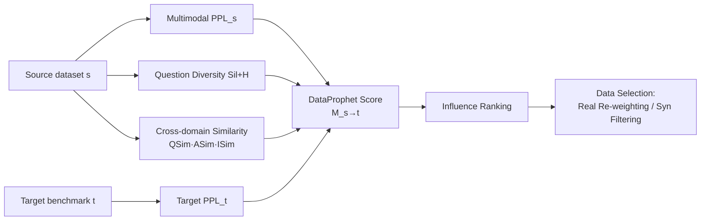

# DataProphet: Demystifying Supervision Data Generalization in Multimodal LLMs

**Conference**: ICLR 2026  
**OpenReview**: [https://openreview.net/forum?id=iYMZKz5BGz](https://openreview.net/forum?id=iYMZKz5BGz)  
**Code**: [https://dataprophet26.github.io/](https://dataprophet26.github.io/)  
**Area**: Multimodal / Data Selection / MLLM Instruction Tuning  
**Keywords**: Data influence prediction, training data selection, multimodal perplexity, cross-domain transfer, training-free  

## TL;DR
This paper systematically reveals that the common intuition "intuitively similar training data is more helpful" is unreliable for multimodal LLMs. It proposes DataProphet, a training-free metric that uses the product of multimodal perplexity, cross-domain similarity, and problem diversity to predict the impact ranking of a supervised dataset on a target benchmark with high precision before training (reaching a Kendall's τ of 86%). This guides data selection, outperforming training-based SoTA methods and even approaching oracle performance.

## Background & Motivation
**Background**: Training data is recognized as one of the most critical factors determining MLLM performance. Faced with massive multimodal supervised data, industry practice is to select data based on "intuitive task similarity"—for example, prioritize OCR/text-rich data to improve chart understanding because both involve reading text and numbers.

**Limitations of Prior Work**: Existing data selection methods (e.g., ICONS) mostly rely on gradient influence and require actual training before scoring. They are essentially "train first, then prune useless/redundant/low-quality data," which is computationally expensive and cannot provide pre-training predictions. Furthermore, the reliability of the "task similarity → transfer gain" intuition has never been systematically verified.

**Key Challenge**: The authors conducted a 14×14 full-matrix experiment by fine-tuning InternVL3-2B on 14 vision-language datasets covering 7 categories (OCR, Chart, Document, General VQA, Spatial Reasoning, Counting, Maps). The results directly challenged intuition: training on OCR data improved **spatial reasoning** (+12.86%) more than it improved **chart** tasks (+5.61%). Data influence is **asymmetric** ($s \to t \neq t \to s$), and datasets within the same task category do not necessarily help each other the most—influence is determined by the specific dataset rather than the broad task category.

**Goal**: Can the influence of a training set $D_i$ on a target benchmark $T_j$ (measured by relative performance change) be predicted **before any training occurs**?

**Key Insight**: **[Pre-training Influence Prediction]** Abandon surface-level heuristics like "task similarity" and instead identify factors that truly determine transfer from lower-level signals such as perplexity, similarity, and diversity. Combine these into a training-free metric, DataProphet, to approximate the actual post-training ranking of gains.

## Method

### Overall Architecture
The method consists of two steps: first, a "data influence matrix" analysis to establish the motivation that intuitive similarity is unreliable; second, the design of the DataProphet metric. DataProphet multiplies three types of signals: the source data's multimodal perplexity, source-target cross-modal similarity, and source data question diversity, normalized by the target data's perplexity, to obtain an impact score $M(s \to t)$. Finally, this score drives two downstream scenarios: real data re-weighting and synthetic data filtering.

### Key Designs

**1. Multimodal Perplexity: Measuring "Source Challenge and Target Difficulty"**  
The authors leverage the idea from LLM pre-training of using perplexity for data quality estimation, assuming "source data that is more challenging for the base model yields greater capability improvements." Given an answer token sequence $A=(a_1,\dots,a_T)$ and a base MLLM $p_\theta$, the multimodal perplexity on dataset $D$ is defined as:

$$\mathrm{PPL}(D) = \exp\!\Big(-\,\mathbb{E}_{(I,Q,A)\sim D}\,\mathbb{E}_{t\sim[T]}\,\log p_\theta\big(a_t \mid I, \tau_Q(Q), a_{<t}\big)\Big)$$

It appears in both the numerator (source data $\mathrm{PPL}(s)$, where harder indicates more worth learning) and the denominator (target data $\mathrm{PPL}(t)$, where a harder target amplifies the room for gain). Using perplexity alone for prediction yields a $\tau_{\mathrm{Tgt}}$ of only 0.274, indicating it is necessary but not sufficient. However, removing it during ablation causes τ to plummet from 0.86 to 0.49, making it the most significant single factor.

**2. Cross-domain Similarity: Aligning Questions, Answers, and Images**  
The intuition is that the more the source data resembles the target in the model's embedding space, the closer it is to learning on the target domain distribution. The authors use the base MLLM's **frozen encoder** to encode the question, answer, and image fields separately, apply $\ell_2$ normalization, and take the expected cosine similarity between samples independently sampled from $D$ and $T$, yielding $\mathrm{QSim}$, $\mathrm{ASim}$, and $\mathrm{ISim}$. An anti-intuitive finding was that encoding questions and answers together into QASim was 6% τ worse than separate encoding. Image similarity is particularly crucial (removing it drops τ to 0.625), confirming that visual alignment is irreplaceable in multimodal transfer.

**3. Source Question Diversity: Dual Measure of Coverage via Silhouette + Entropy**  
If the questions in the source data are diverse enough, fine-tuning is more likely to yield generalizable skills. The authors construct an embedding $z_u$ for each source question $u$, cluster them using K-means ($K=10$), and use the Silhouette coefficient to measure intra-cluster compactness and inter-cluster separation:

$$\mathrm{Sil} = \mathbb{E}_{u\sim U}\Big[\frac{b(u)-a(u)}{\max\{a(u),\,b(u)\}}\Big]$$

where $a(u)$ is the average intra-cluster distance and $b(u)$ is the average distance to the nearest neighboring cluster. Normalized entropy $H=-(\log K)^{-1}\sum_k \pi_k\log\pi_k$ is used to measure if the cluster distribution is balanced. Final diversity is taken as $\mathrm{Sil}+H$; higher values represent broader coverage and more balanced separation.

**4. Multiplicative Combination: Down-weighting if any factor is weak**  
The three types of factors are combined into the final DataProphet metric:

$$M(s\to t) = \mathrm{QSim}\cdot\mathrm{ASim}\cdot\mathrm{ISim}\cdot \mathrm{PPL}(s)\cdot \frac{\big(\mathrm{Sil}+H\big)}{\mathrm{PPL}(t)}$$

A **product form** is used rather than a weighted sum because successful transfer requires alignment of text, vision, base model difficulty, and question coverage **simultaneously**. A weakness in any single area should lower the total score—multiplication naturally implements this "bottleneck effect." For point-wise scoring of synthetic data, a simplified version without the diversity term is used: $M(\text{syn}_d\to T)=\mathrm{QSim}\cdot\mathrm{ASim}\cdot\mathrm{ISim}\cdot\mathrm{PPL}(\text{Syn}_D)/\mathrm{PPL}(T)$.

## Key Experimental Results

### Main Results for Influence Prediction (Kendall's τ)
Calculated pairwise for 14 datasets, yielding 14×14=196 scores. Given target $t$, source datasets are ranked to measure $\tau_{\mathrm{Tgt}}$; given source $s$, target benchmarks are ranked to measure $\tau_{\mathrm{Src}}$.

| Evaluation Direction | Average Kendall's τ |
|---|---|
| τ_Tgt (Predicting source contribution ranking) | 0.863 |
| τ_Src (Predicting one source's impact across targets) | 0.857 |
| Combined τ | ≈ 0.86 |

The predicted rankings correlate strongly with actual post-training gains, proving that data impact can be predicted with high precision before training.

### Ablation Study (τ after removing single factors)

| Variant | Kendall's τ |
|---|---|
| Full DataProphet | 0.860 |
| w/o Answer Similarity | 0.810 |
| w/o Question Similarity | 0.778 |
| w/o Diversity (Sil & H) | 0.659 |
| w/o Image Similarity | 0.625 |
| w/o Perplexity | 0.487 |

Perplexity is the strongest single factor; image similarity and diversity follow, while text similarity contributions are relatively marginal.

### Main Results for Data Selection (Fixed 280K budget, average across 14 benchmarks)

| Setting | Uniform | ICONS (SoTA, req. training) | Oracle (gold) | DataProphet |
|---|---|---|---|---|
| Real Data Re-weighting | 67.6 | 69.6 | 70.8 | **71.0** |
| Synthetic Data Filtering | 55.1 | 60.8 | — | **62.0** |

On real data, Ours is +3.4% over uniform, +1.4% over ICONS, and even +0.2% higher than Oracle. On synthetic data, Ours is +6.9% over uniform and +1.2% over ICONS. Data selection for post-training RL is also effective: +3.8% for real RL data and +2.0% for synthetic RL data.

### Key Findings
- Intuitive task similarity is a **poor predictor** of performance impact; influence is determined by **specific datasets** rather than task categories and is **asymmetric**.
- Lightweight pre-training metrics can approach or even exceed Oracle selection (based on actual training performance), suggesting that impact is largely "predictable."

## Highlights & Insights
- **Counter-intuitive yet solid**: The systematic 14×14 matrix experiment refutes the common sense that "task similarity is useful," making the conclusion persuasive.
- **Predictable before training**: DataProphet is entirely training-free yet matches or exceeds SoTA methods that require gradient signals, offering extreme cost-effectiveness.
- **Product-based "bottleneck" design**: Using multiplication to force all four types of alignment to be met simultaneously is physically intuitive and fits the nature of multimodal transfer better than simple weighting.
- **Bidirectional usage of Perplexity**: The same metric plays different roles in the numerator (source difficulty) and denominator (target difficulty), cleverly characterizing "headroom for learning × space for improvement."

## Limitations & Future Work
- Analysis and validation were mainly performed on a single base model (InternVL3-2B) and 14 VQA datasets; generalizability to larger models or more modal tasks remains to be verified.
- The metric relies on the base model's own encoder and perplexity; if the base model is weak or the encoder representation is poor, the similarity/perplexity signals might be distorted.
- Clustering for diversity (K-means, K=10) and Silhouette estimation are sensitive to hyperparameters and sampling scale, requiring further robustness checks.
- The three factors were screened empirically (as other heuristics proved ineffective), lacking a theoretical explanation for "why specifically these three."

## Related Work & Insights
This work extends the trend in LLM data selection of using perplexity (Marion et al. 2023), task difficulty, and problem diversity (Wang et al. 2024a) for data quality estimation, systematically migrating them to the multimodal setting. Compared to training-based SoTA methods like ICONS (Wu et al. 2025), the primary insight of DataProphet is that **in multimodal scenarios, a combination of lightweight pre-training signals is sufficient to predict data influence**. This provides a cheap and interpretable path for large-scale data mixing and synthetic data filtering. The finding that "task similarity is unreliable" also serves as a reminder for future work not to blindly trust surface-level task labels when designing data curation strategies.

## Rating
- **Novelty**: ⭐⭐⭐⭐ First to systematically introduce the "pre-training prediction of data influence" problem to MLLMs; the counter-intuitive findings and training-free metric are original.
- **Experimental Thoroughness**: ⭐⭐⭐⭐ Solid coverage with 14×14 matrix analysis, results across real/synthetic/RL settings, and complete ablations; however, base model and task scope are somewhat narrow.
- **Writing Quality**: ⭐⭐⭐⭐ The logic from motivation to findings to method to verification is clear; Figures 1 and 2 explain the anti-intuitive conclusions intuitively.
- **Value**: ⭐⭐⭐⭐ Provides a low-cost, interpretable data selection tool with direct practical value for data mixing in MLLM instruction tuning.

<!-- RELATED:START -->

## Related Papers

- [\[ACL 2025\] Exploring Compositional Generalization of Multimodal LLMs for Medical Imaging](../../ACL2025/multimodal_vlm/exploring_compositional_generalization_of_multimodal_llms_for_medical_imaging.md)
- [\[ICLR 2026\] WorldSense: Evaluating Real-World Omnimodal Understanding for Multimodal LLMs](worldsense_evaluating_real-world_omnimodal_understanding_for_multimodal_llms.md)
- [\[CVPR 2026\] Towards Multimodal Domain Generalization with Few Labels](../../CVPR2026/multimodal_vlm/towards_multimodal_domain_generalization_with_few_labels.md)
- [\[ICLR 2026\] On the Generalization Capacities of MLLMs for Spatial Intelligence](on_the_generalization_capacities_of_mllms_for_spatial_intelligence.md)
- [\[ICLR 2026\] MotionSight: Boosting Fine-Grained Motion Understanding in Multimodal LLMs](motionsight_boosting_fine-grained_motion_understanding_in_multimodal_llms.md)

<!-- RELATED:END -->
