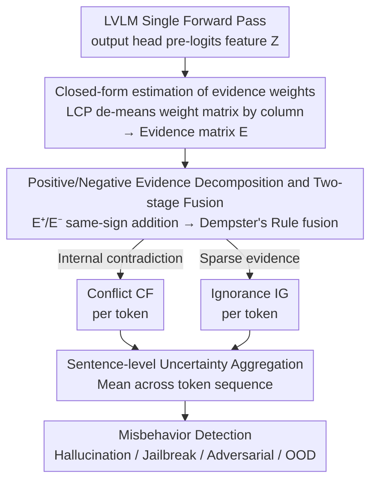

# Detecting Misbehaviors of Large Vision-Language Models by Evidential Uncertainty Quantification

**Conference**: ICLR2026  
**arXiv**: [2602.05535](https://arxiv.org/abs/2602.05535)  
**Code**: [HT86159/EUQ](https://github.com/HT86159/EUQ)  
**Area**: Multimodal VLM  
**Keywords**: LVLM uncertainty, evidential reasoning, Dempster-Shafer, misbehavior detection, hallucination

## TL;DR

The authors propose EUQ (Evidential Uncertainty Quantification), which decomposes the epistemic uncertainty of LVLMs into **Conflict (CF)** (internal contradiction) and **Ignorance (IG)** (lack of information) based on Dempster-Shafer evidence theory. Without training and using only a single forward pass, EUQ detects four types of misbehaviors: hallucination, jailbreaking, adversarial attacks, and OOD failures, achieving an average relative AUROC improvement of 10.4%/7.5% over the best baselines.

## Background & Motivation

LVLMs exhibit four typical **misbehaviors** when faced with difficult, out-of-distribution, or adversarial inputs:

- **Hallucination**: Outputs inconsistent with visual content (object/relationship/attribute hallucinations).
- **Jailbreaking**: Triggered by malicious visual prompts to generate harmful content.
- **Adversarial Vulnerability**: Pixel-level imperceptible perturbations leading to incorrect predictions.
- **OOD Failure**: Failure to recognize styles or quality shifts outside the training distribution.

Three core deficiencies of existing Uncertainty Quantification (UQ) methods:

1. **High Bayesian Computational Costs**: Impractical for LVLM scales.
2. **Multiple Inferences for Sampling**: Methods like Semantic Entropy (SE) require ~10 generations to estimate consistency, increasing latency tenfold.
3. **Capture Only Total Uncertainty**: Unable to distinguish between "internal contradictory evidence" and "fundamental lack of relevant knowledge."

The core insight of this paper is that different misbehaviors correspond to different sources of epistemic uncertainty. Hallucination involves both supporting and opposing evidence (high conflict), while OOD failure stems from a lack of relevant knowledge (high ignorance). This distinction provides a theoretical basis for targeted misbehavior detection.

## Method

### Overall Architecture

EUQ treats the output head pre-logits features from a single forward pass of the LVLM as "evidence" and applies Dempster-Shafer evidence theory to extract two types of epistemic uncertainty: **Conflict (CF)**, where supporting and opposing evidence clash, and **Ignorance (IG)**, where evidence is generally thin. The entire process consists of closed-form calculations without the need for training, sampling, or multiple inferences. Each token obtains a pair of uncertainty metrics at near-zero cost, which are then aggregated into sentence-level measures for misbehavior detection.

### Key Designs

**1. Closed-form estimation of evidence weights: Interpreting each feature as an item of evidence**

The projection layer of the output head $\mathbf{H} = \mathbf{Z}\mathbf{W} + \mathbf{b}$ maps pre-logits features $\mathbf{Z} \in \mathbb{R}^I$ to output dimensions. The core question is: how much support or opposition does the $i$-th feature $z_i$ provide for the $j$-th hypothesis $h_j$, denoted as evidence weight $e_{ij}$? To resolve the infinite solutions of the inverse problem, the authors introduce the Least Commitment Principle (LCP)—minimizing "over-commitment" while explaining the logits, i.e., solving $\min_{\mathbf{A},\mathbf{B}} \|\mathbf{A} \odot \mathbf{Z}^\top + \mathbf{B}\|_2^2$. This yields the closed-form solution $\mathbf{A}^* = W - \mu_0(W)$, which essentially de-means the weight matrix by column. Since this requires no training or iteration, UQ is achieved with near-zero overhead.

**2. Positive/negative evidence decomposition and two-stage fusion: Separating "contradiction" from "lack of knowledge"**

After obtaining the evidence matrix $\mathbf{E} \in \mathbb{R}^I \times J$, it is split by sign into positive evidence $\mathbf{E}^+ = \max(0, \mathbf{E})$ supporting the hypothesis and negative evidence $\mathbf{E}^- = \max(0, -\mathbf{E})$ opposing it. Fusion occurs in two stages. First, utilizing the additivity of evidence weights (Lemma 2), same-sign evidence is summed directly, avoiding the exponential power set enumeration in the DS framework. Second, Dempster's rule merges the positive and negative sides. Two complementary metrics are derived: **Conflict** $\mathbf{CF} = \sum_j \eta_j^+ \cdot \eta_j^-$ increases when a hypothesis $h_j$ is simultaneously supported and opposed (internal contradiction); **Ignorance** $\mathbf{IG} = \sum_j \exp(-e_j^-)$ nears 1 when negative evidence is weak ($e_j^-$ is small), corresponding to a lack of information. This separation allows the source of errors to be quantified individually for the first time.

**3. Sentence-level uncertainty aggregation: From token-level readings to sentence-level judgment**

Since LVLMs generate tokens sequentially, each step produces a CF/IG pair. EUQ calculates the mean across all tokens in a sentence as the sentence-level metric. This simple aggregation prevents extreme readings from individual tokens from biasing the result, ensuring stable sentence-level judgment.

## Main Results

### Misbehavior-Bench Evaluation Framework

To evaluate the four types of errors consistently, the authors constructed a benchmark covering 4 misbehaviors and 9 datasets:

| Error Type | Dataset | Samples | Task Type |
|-----------|---------|---------|-----------|
| Hallucination | POPE + R-Bench | 2000 | Multiple Choice |
| Jailbreaking | FigStep + Hades + VisualAdv + Typographic | 2800 | Open/Choice |
| Adversarial | ANDA + PGN | 400 | Yes/No |
| OOD | OOD-Bench | 1300 | Yes/No |

Models evaluated: DeepSeek-VL2-Tiny, Qwen2.5-VL-7B, InternVL2.5-8B, MoF-7B (covering SwiGLU and MoE architectures).

### Overall Comparison (Average across 4 models × 4 scenarios)

| Method | Type | AUROC | AUPR | Extra Overhead |
|--------|------|-------|------|----------------|
| SC (self-consistency) | Sample ×10 | 0.626 | 0.730 | 8.9×10⁻¹s |
| SE (semantic entropy) | Sample ×10 | 0.624 | 0.661 | 9.0×10⁻¹s |
| PE (predictive entropy) | Prob | 0.701 | 0.656 | 3.1×10⁻⁶s |
| LN-PE | Prob | 0.704 | 0.660 | 6.1×10⁻⁶s |
| HiddenDetect | Hidden Feat | 0.707 | 0.658 | 2.0×10⁻²s |
| **CF (ours)** | Evidential | **0.812** | 0.783 | 9.1×10⁻⁴s |
| **IG (ours)** | Evidential | 0.783 | **0.785** | 4.5×10⁻³s |

CF improves AUROC by 10.5% relative to the best baseline (HiddenDetect), while computational overhead is ~1/1000th of sampling methods.

### Optimal Detection per Scenario (AUROC, Average across 4 models)

| Error Type | CF | IG | Best Baseline | CF/IG Gain |
|-----------|------|------|---------------|------------|
| Hallucination | **0.761** | 0.657 | PE 0.742 | CF +2.6% |
| Jailbreaking | **0.757** | 0.665 | HiddenDetect 0.752 | CF +0.7% |
| Adversarial | 0.836 | **0.861** | LN-PE 0.717 | IG +20.1% |
| OOD | 0.894 | **0.948** | HiddenDetect 0.694 | IG +36.6% |

Key findings: **Hallucination ↔ High Conflict** (CF best), **OOD ↔ High Ignorance** (IG best). Both work for adversarial scenarios, but IG is superior, aligning with the intuition that adversarial perturbations cause information loss.

### Layer-wise Dynamic Analysis

- **IG decreases with depth**: Deep layers accumulate more supportive clues, gradually eliminating ignorance.
- **CF increases with depth**: Deep features are more task-specific, with increased competition between channels leading to higher conflict.
- This pattern aligns with information bottleneck theory—deeper layers compress redundant inputs and enhance discriminative information.

### Ablation Study

- **Temperature Robustness**: CF and IG detection performance remains stable across temperatures from 0.1 to 1.4.
- **Model Scale Effects**: Performance is better on 4B and 38B models (errors are obvious in small models and rare but clear in large ones); intermediate 8B models prove hardest for fine-grained error detection.
- **External Prompting Ineffectiveness**: Adding a "None of the above" option failed as models were overconfident (Qwen selected it 0.27% of the time, Intern 0.00%).

## Highlights & Insights

### Highlights

- **First decomposition of epistemic uncertainty into Conflict and Ignorance in LVLMs**: Provides interpretable error diagnosis: different misbehaviors map to different uncertainty sources, guiding targeted mitigation strategies.
- **Zero training + single forward pass**: The closed-form solution requires no optimization; UQ overhead is <1ms, making it nearly invisible for deployment.
- **Theoretical Rigor**: Derived from Dempster-Shafer theory, progressing through Lemma 1 (closed-form estimation), Lemma 2 (additivity), and Theorem 1 (CF/IG expressions).
- **Versatility**: Applicable to any model with linear projection layers (BERT, ResNet, LLM), not limited to VLMs.

### Limitations

- Requires access to internal representations, making it unusable for closed-source APIs like GPT-4.
- In adversarial/jailbreaking scenarios, CF and IG performances are close, making isolated attribution difficult.
- Currently, layer-wise analysis identifies that all 4 errors can be distinguished at specific layers, but there is no automatic mechanism for optimal layer selection.

## Limitations & Future Work
- Utilizes only output head features, missing rich information from intermediate layers.
- The closed-form solution for evidence weights depends on the linear projection assumption.
- Focuses on detection rather than repair—addressing how to improve outputs once uncertainty is detected is the next step.

## Related Work & Insights
- **vs Semantic Entropy**: SE requires multiple samples and an external model to evaluate equivalent semantics. EUQ requires only one forward pass.
- **vs Verbalized Confidence**: Reliance on model meta-cognition is unreliable. EUQ extracts uncertainty directly from features.
- **vs Evidential Deep Learning**: EDL requires training. EUQ is entirely training-free.

## Rating
- Novelty: ⭐⭐⭐⭐⭐ First application of evidential CF/IG decomposition for LVLM misbehavior detection.
- Experimental Thoroughness: ⭐⭐⭐⭐⭐ Across 4 models, 4 error types, and multiple baselines with deep layer analysis.
- Writing Quality: ⭐⭐⭐⭐ Rigorous theoretical derivation with helpful visualizations.
- Value: ⭐⭐⭐⭐⭐ Direct practical value for LVLM trustworthiness and safe deployment.

<!-- RELATED:START -->

## Related Papers

- [\[ACL 2026\] VAUQ: Vision-Aware Uncertainty Quantification for LVLM Self-Evaluation](../../ACL2026/multimodal_vlm/vauq_vision-aware_uncertainty_quantification_for_lvlm_self-evaluation.md)
- [\[ICML 2026\] Debate with Images: Detecting Deceptive Behaviors in Multimodal Large Language Models](../../ICML2026/multimodal_vlm/debate_with_images_detecting_deceptive_behaviors_in_multimodal_large_language_mo.md)
- [\[CVPR 2026\] Uncertainty-Aware Knowledge Distillation for Multimodal Large Language Models](../../CVPR2026/multimodal_vlm/uncertainty-aware_knowledge_distillation_for_multimodal_large_language_models.md)
- [\[ICLR 2026\] CityLens: Evaluating Large Vision-Language Models for Urban Socioeconomic Sensing](citylens_evaluating_large_vision-language_models_for_urban_socioeconomic_sensing.md)
- [\[CVPR 2025\] Topo-R1: Detecting Topological Anomalies via Vision-Language Models](../../CVPR2025/multimodal_vlm/topo-r1_detecting_topological_anomalies_via_vision-language_models.md)

<!-- RELATED:END -->
