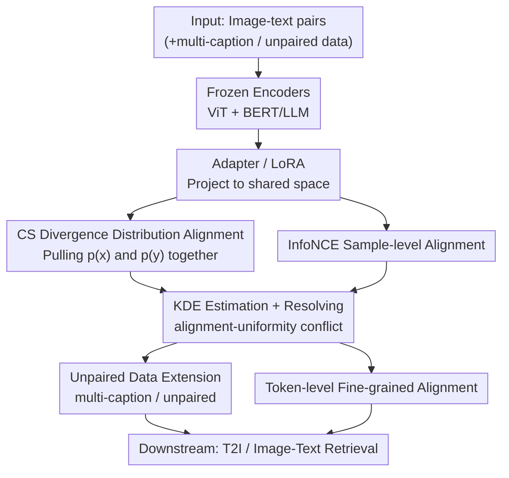

# Distributional Vision-Language Alignment by Cauchy-Schwarz Divergence

**Conference**: ICLR2026  
**OpenReview**: [https://openreview.net/forum?id=UUAjF4xL0e](https://openreview.net/forum?id=UUAjF4xL0e)  
**Code**: TBD  
**Area**: Multimodal VLM / Vision-Language Alignment / Representation Learning  
**Keywords**: Vision-language alignment, Cauchy-Schwarz divergence, distributional alignment, modality gap, InfoNCE

## TL;DR
To address the residual "modality gap" when CLIP uses InfoNCE for vision-language alignment, this paper proposes CS-Aligner. Beyond maximizing mutual information, it introduces Cauchy-Schwarz (CS) divergence to bridge the **feature distributions** of images and text. This approach compensates for InfoNCE’s limitation of only aligning paired samples while neglecting the overall distribution, and naturally resolves the internal conflict between alignment and uniformity in InfoNCE. It significantly outperforms alignment methods such as Eclipse, Long-CLIP, and LLM2CLIP in text-to-image (FID) and image-text retrieval tasks.

## Background & Motivation
**Background**: Vision-language alignment maps paired images and text into a shared feature space, serving as the foundation for downstream tasks like text-to-image generation and cross-modal retrieval. The mainstream approach, represented by CLIP, uses InfoNCE (contrastive loss) to maximize mutual information between paired representations, learning semantic correspondences through the relative similarity of positive and negative samples.

**Limitations of Prior Work**: CLIP and its variants consistently suffer from a persistent "modality gap"—the global cluster of text and image embeddings remains separated in the shared space, appearing as two distinct clusters in t-SNE visualizations. Existing mitigation strategies (projection modules with cosine similarity, geodesic mixup, or prior adapters like DALL-E 2 / Eclipse that use diffusion priors or $\ell_2$ loss to map text embeddings to image space) are **sample-wise** alignments. These heavily depend on carefully curated image-text pairs, capturing semantics but failing to align the global distribution. They are also unfriendly to unpaired or noisy real-world data.

**Key Challenge**: The authors point out two theoretical flaws in InfoNCE. First, **mutual information is insufficient for distribution alignment**: MI only measures the statistical correlation between two random variables. Two distributions can be highly correlated (high MI) but spatially distant (high divergence). As shown in their toy example, maximizing MI alone does not guarantee proximity between $p(x)$ and $p(y)$. Second, **InfoNCE is internally contradictory**: According to the decomposition by Wang & Isola, $\mathcal{L}_{\text{InfoNCE}}\approx\mathcal{L}_{\text{align}}+\mathcal{L}_{\text{uniform}}$. After Taylor expansion, the uniformity term is approximately $-t\,\mathbb{E}_{(x,y)\sim p_{\text{pair}}+p_{\text{unpair}}}[\lVert x-y\rVert_2^2]$, which acts in the opposite direction of the alignment term $\mathbb{E}_{(x,y)\sim p_{\text{pair}}}[\lVert x-y\rVert_2^\alpha]$. When $t=1$, the alignment contribution of positive samples is nearly canceled out, leaving the negative samples to push modalities apart and create the gap.

**Goal**: To explicitly pull the **global distributions** of the two modalities together while retaining InfoNCE’s semantic capture capabilities, thereby eliminating the alignment-uniformity conflict.

**Key Insight**: Rather than further optimizing MI, it's better to add an explicit **distribution distance** measure. The authors select Cauchy-Schwarz divergence because it is symmetric, does not require a prior distribution form, and provides robust estimates even when the supports of two distributions initially do not overlap—ideal for "far apart" multimodal settings. More elegantly, it can be expressed as the cosine similarity of distribution mean embeddings in RKHS, creating a "distribution-level + sample-level" dual complementarity with InfoNCE's sample-level cosine similarity. Other divergences (KL, MMD, etc.) cannot achieve this conflict-free synergy.

**Core Idea**: Add a CS divergence term for distribution alignment alongside InfoNCE: $\min\,-I(x;y)+\lambda D_{\text{CS}}(p(x),p(y))$, simultaneously aligning paired semantics and global distributions.

## Method

### Overall Architecture
CS-Aligner follows a **parameter-efficient fine-tuning** (PEFT) strategy. It freezes the pre-trained image encoder (ViT) and text encoder (BERT / LLM) and only adds lightweight adapters (or inserts LoRA low-rank matrices into the text encoder) to project embeddings into the shared space. A joint objective optimizes these adapters: InfoNCE handles sample-level semantic alignment, while CS divergence pulls the feature distributions of the two modalities together. Once aligned, the text adapter can directly connect to unCLIP-style decoders (Karlo / Kandinsky / SD-unCLIP) for text-to-image generation without extra prior modules; the multimodal adapter is used for image-text retrieval.

The core objective function of the method is:
$$\min\;-I(x;y)+\lambda D_{\text{CS}}(p(x),p(y)),$$
where the first term is estimated by InfoNCE and the second term is calculated via Kernel Density Estimation (KDE) for CS divergence, with $\lambda$ balancing the two. Based on this backbone, the authors extend the "distributional" property of CS divergence to two scenarios: alignment of unpaired data and fine-grained token-level alignment.

### Key Designs

**1. Distributional Alignment via CS Divergence: Filling the InfoNCE "Global Distribution" Gap**

This design addresses the limitation that "MI is insufficient for distribution alignment." Even with high correlation, feature clusters can remain separated. The authors introduce CS divergence $D_{\text{CS}}(p(x),p(y))$ into the objective:
$$D_{\text{CS}}(p;q)=-\log\frac{\left(\int p(\omega)q(\omega)\,d\omega\right)^2}{\int p(\omega)^2 d\omega\int q(\omega)^2 d\omega},$$
which satisfies $0\le D_{\text{CS}}<\infty$, becoming zero if and only if $p=q$. It is symmetric, bounded, and non-parametric, allowing for robust measurement of distance between arbitrary representation distributions. From an RKHS perspective, using mean embeddings $\mu_x, \mu_y$ of the feature map $\phi$, CS divergence translates to $\hat D_{\text{CS}}=-2\log\,\mathrm{sim}(\mu_x,\mu_y)$, which is the **cosine similarity of distribution means in RKHS**. Since InfoNCE measures **paired sample cosine similarity**, the two provide complementary alignment at distribution and sample levels respectively.

**2. Non-parametric KDE Estimation and Conflict Resolution: Harmonizing Objectives**

CS divergence not only supplements distribution info but also eliminates InfoNCE’s internal conflict. Using non-parametric KDE with samples $\{x_i\}_{i=1}^M\sim p(x)$ and $\{y_j\}_{j=1}^N\sim p(y)$, the empirical estimator is:
$$\hat D_{\text{CS}}=\log\Big(\tfrac{1}{M^2}\textstyle\sum_{i,j}\kappa(x_i,x_j)\Big)+\log\Big(\tfrac{1}{N^2}\textstyle\sum_{i,j}\kappa(y_i,y_j)\Big)-2\log\Big(\tfrac{1}{MN}\textstyle\sum_{i,j}\kappa(x_i,y_j)\Big),$$
where $\kappa$ is the Gaussian kernel $\kappa_\sigma(x,y)=\exp(-\lVert x-y\rVert_2^2/2\sigma^2)$. The estimator is symmetric, differentiable, and computationally efficient. The third cross-term only diverges when distributions are completely non-overlapping ($\mathbb{E}[\kappa(x,y)]\to0$); thus, it remains stable as long as there is non-zero overlap. By merging this with InfoNCE's alignment/uniformity and setting $\lambda=1$, the objective rearranges into "alignment term + **intra-modality** uniformity terms." CS divergence encourages embeddings within $x$ and $y$ to spread out individually, rather than pushing across modalities as in InfoNCE. Thus, alignment and uniformity no longer conflict—a unique property of CS divergence compared to KL or MMD.

**3. Unpaired Data Extension: Leveraging Alignment without Paired Annotations**

InfoNCE requires paired data $\{(x_i,y_i)\}$, but the KDE estimator for CS divergence allows $\{x_i\}_{i=1}^M$ and $\{y_j\}_{j=1}^N$ to be independent, even with $M\ne N$. This accommodates unpaired data without cost. The authors propose two use cases: (a) **One-image-to-multiple-captions**: In MSCOCO, one image often has 5 captions. Sample-wise methods cannot use them simultaneously, but the CS term can incorporate all captions into the distribution estimate. (b) **Completely unpaired data**: Independently sampled sets of images and text can participate in distribution alignment. Experiments show that training with 40K paired + 80K unpaired data outperforms 80K fully paired data, proving that distribution info extracts alignment gains from cheap unpaired data.

**4. Token-level Fine-grained Alignment: Distributional Alignment of Individual Sample Tokens**

CLIP-like methods only align "CLS" tokens, losing fine-grained details. The authors treat the $V$ visual tokens of an image and $L$ text tokens of a sentence as distributions $p(x_i)$ and $p(y_i)$, respectively. By calculating CS divergence between these token distributions within a sample, they derive a token alignment loss:
$$\mathcal{L}_{\text{token}}=\frac{1}{B}\sum_{i=1}^{B}\hat D_{\text{CS}}(p(x_i);p(y_i)).$$
Since $V\ne L$ and tokens lack direct pairing, InfoNCE is inapplicable here, whereas CS divergence aligns all tokens to capture more granular cross-modal details. Inclusion of token alignment reduced FID from 12.62 to 12.14 in ablations.

### Loss & Training
The total objective is $-I(x;y)+\lambda D_{\text{CS}}(p(x),p(y))$, balancing InfoNCE and KDE-estimated CS divergence. $\lambda=1$ correlates to the conflict-free alignment-uniformity decomposition. Only Adapters (lightweight Transformers) or LoRA (rank 8, inserted in CLIP text encoder layers) are trained; backbone encoders remain frozen. Text-to-image models are trained on MSCOCO / CC3M / CC12M / LAION-HighRes-5M, with FID used for evaluation (matching the distributional alignment goal).

## Key Experimental Results

### Main Results
Text-to-Image (MSCOCO 30K val set, FID↓): CS-Aligner, using only 0.08M MSCOCO samples to train an adapter, outperforms large-scale diffusion models and other similar-scale alignment methods like Eclipse and IB.

| Method | Training Data (M) | FID↓ |
|------|------|------|
| SD v2.1 (Large scale) | 2000 | 14.51 |
| DALL-E2 (Large scale) | 250 | 10.65 |
| Eclipse + Kandinsky decoder | 0.08 | 16.53 |
| **Ours + Kandinsky decoder** | 0.08 | **12.62** |
| Eclipse + Karlo decoder | 0.08 | 23.67 |
| **Ours + Karlo decoder** | 0.08 | **11.27** |
| **Ours + SD-unclip decoder** | 0.08 | **10.88** |

Comparison with Eclipse under different training data (FID↓), showing CS-Aligner’s consistent lead:

| Method | CC3M | CC12M | LAION-HighRes 5M |
|------|------|------|------|
| Eclipse | 26.73 | 26.98 | 19.16 |
| **Ours** | **22.88** | **22.72** | **14.79** |

Image-Text Retrieval (CC3M, aligning CLIP ViT-L/14 with Llama 3-8B, Recall↑):

| Method | Flickr30k I2T/T2I | Urban-1k I2T/T2I | DOCCI I2T/T2I | Avg I2T/T2I |
|------|------|------|------|------|
| Long-CLIP | 90.0 / 76.2 | 82.5 / 86.1 | 66.5 / 78.6 | 79.7 / 80.3 |
| LLM2CLIP-3M | 89.6 / 77.3 | 87.1 / 91.1 | 84.9 / 87.8 | 87.2 / 85.4 |
| **Ours-3M** | **91.8 / 81.0** | **87.6 / 92.2** | **86.6 / 89.1** | **88.7 / 87.4** |

### Ablation Study

| Configuration | FID↓ / Description | Conclusion |
|------|------|------|
| w/o token alignment | 12.62 | Base CS-Aligner (Kandinsky) |
| w/ token alignment | 12.14 | Token-level alignment improves FID/acc. |
| Adapter (Kandinsky, 34M) | 12.62 | Adapter approach |
| LoRA (Kandinsky, 6M) | 13.52 | Comparable results with 5x fewer params |
| LoRA (Karlo, 1.3M) | 15.63 | Alignment possible with minimal params |
| 80K Paired | (Fig 5b baseline) | Standard paired training |
| 40K Paired | Lower than 80K | Performance drops as data halves |
| 40K Paired + 80K Unpaired | Better than 80K Paired | Distributional gains from unpaired data |

### Key Findings
- **Distributional Information is Crucial**: Across all data scales, distributional alignment with CS divergence consistently outperforms sample-wise alignment (Eclipse), confirming the importance of modal distribution info for robust alignment.
- **Real Gains from Unpaired Data**: 40K paired + 80K unpaired data surpassing 80K paired data proves CS divergence effectively utilizes unpaired distribution information.
- **Token Alignment Adds Precision**: Improving FID from 12.62 to 12.14 and refining visual details confirms the value of token-level distributional alignment.
- **Efficient and Robust**: LoRA with only 1.3M–6M parameters achieves results comparable to 33M–34M adapters, indicating low sensitivity to the adaptation method.

## Highlights & Insights
- **Symmetry of Divergence and MI**: The perspective of dual-level alignment—distribution level (RKHS mean embedding cosine similarity) and sample level (InfoNCE sample cosine similarity)—is elegant. The identity $\hat D_{\text{CS}}=-2\log\mathrm{sim}(\mu_x,\mu_y)$ unifies the two perfectly.
- **CS Divergence Resolves Alignment–Uniformity Conflict**: It introduces intra-modality uniformity rather than the cross-modality repulsion found in InfoNCE. This property is unique to CS divergence and justifies its selection over KL or MMD.
- **Unified Extension via Distributional Properties**: The three extensions (unpaired, multi-caption, token) all stem from the fact that KDE estimation doesn't require pairing or equal sample counts. This makes diverse data formats usable under a single framework.
- **FID as an Alignment Probe**: Using FID measures distributional distance, making it a highly appropriate metric for evaluating modality alignment rather than just image quality.

## Limitations & Future Work
- The paper treats text-to-image generation and retrieval as proxy metrics for alignment capability. Since CS-Aligner focuses on the **alignment** layer, it does not modify the generative decoder; final image quality remains bounded by the unCLIP decoder.
- KDE estimation for CS divergence depends on hyperparameters such as kernel width $\sigma$ (and temperature $t$). Bandwidth selection in high-dimensional spaces may affect stability, though this isn't fully explored in the main text.
- Token-level alignment treats tokens as independent distributions within each sample. Scalability regarding computational overhead for long sequences or large token counts needs systematic evaluation.
- Unpaired data gains were verified on MSCOCO-derived datasets. Robustness on real-world, out-of-distribution, or highly noisy unpaired data remains to be tested.

## Related Work & Insights
- **vs CLIP / InfoNCE**: CLIP uses InfoNCE for sample-wise alignment but ignores global distributions and suffers from alignment-uniformity conflict. This work adds CS divergence to fix the distribution gap and resolve the conflict.
- **vs Eclipse / IB (Small-scale alignment)**: Eclipse uses $\ell_2$ for prior adapters, and IB uses an information bottleneck—both are sample-wise. CS-Aligner consistently leads with the same architecture and data (e.g., Karlo FID 11.27 vs 23.67).
- **vs Long-CLIP / LLM2CLIP (Retrieval)**: These remain pure InfoNCE approaches. This work achieves higher average retrieval scores when aligning Llama 3-8B with CLIP visual encoders.
- **vs Other Divergences (KL / MMD)**: The authors demonstrate that only CS divergence synergizes with InfoNCE without conflict, providing the core rationale for the choice of divergence measure.

## Rating
- Novelty: ⭐⭐⭐⭐⭐ Introducing CS divergence to V-L alignment and theoretically solving InfoNCE's internal conflict is both novel and self-consistent.
- Experimental Thoroughness: ⭐⭐⭐⭐ Extensive coverage of T2I, retrieval, and various data configurations (unpaired/token), though hyperparameter sensitivity is mostly in the appendix.
- Writing Quality: ⭐⭐⭐⭐⭐ Clear derivation from InfoNCE flaws to CS divergence benefits, with well-connected logic.
- Value: ⭐⭐⭐⭐ Provides a plug-and-play, parameter-efficient loss that leverages unpaired data, offering significant utility for V-L models.

<!-- RELATED:START -->

## Related Papers

- [\[NeurIPS 2025\] DOTA: DistributiOnal Test-time Adaptation of Vision-Language Models](../../NeurIPS2025/multimodal_vlm/dota_distributional_testtime_adaptation_of_visionlanguage_mo.md)
- [\[ICLR 2026\] Unified Vision-Language Modeling via Concept Space Alignment](unified_vision-language_modeling_via_concept_space_alignment.md)
- [\[ICLR 2026\] Reversible Primitive–Composition Alignment for Continual Vision–Language Learning](reversible_primitivecomposition_alignment_for_continual_visionlanguage_learning.md)
- [\[ICML 2026\] DIVA: Harnessing the Representation Divergence in Unified Multimodal Models for Mutual Reinforcement](../../ICML2026/multimodal_vlm/diva_harnessing_the_representation_divergence_in_unified_multimodal_models_for_m.md)
- [\[CVPR 2026\] GaussianVision: Vision-Language Alignment from Compressed Image Representations using 2D Gaussian Splatting](../../CVPR2026/multimodal_vlm/gaussianvision_vision-language_alignment_from_compressed_image_representations_u.md)

<!-- RELATED:END -->
