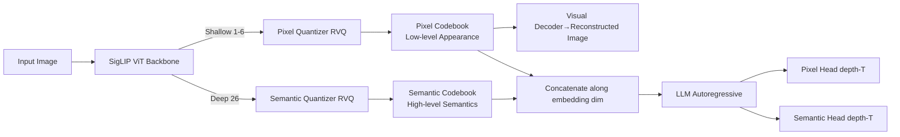

# DualToken: Towards Unifying Visual Understanding and Generation with Dual Visual Vocabularies

**Conference**: ICLR 2026  
**OpenReview**: [https://openreview.net/forum?id=BpgCOFefcE](https://openreview.net/forum?id=BpgCOFefcE)  
**Code**: Project page available in the paper  
**Area**: Multimodal / Unified Visual Understanding and Generation  
**Keywords**: Unified Visual Tokenizer, Dual Visual Codebooks, Autoregressive Multimodal, SigLIP, Residual Quantization  

## TL;DR
DualToken decouples the naturally conflicting goals of "semantics for understanding" and "pixels for generation" along the shallow and deep structures of ViT. By learning reconstruction in shallow layers for a pixel codebook and semantics in deep layers for a semantic codebook, a single tokenizer achieves 0.25 rFID and 82.0% zero-shot accuracy simultaneously, enabling a pure autoregressive MLLM to excel at both image understanding and synthesis.

## Background & Motivation

**Background**: The pure autoregressive (AR) paradigm, which unifies visual understanding and generation within LLMs, is more concise and end-to-end than "LLM + external diffusion module" approaches. Chameleon and Emu3 have demonstrated this feasibility: images are discretized into visual tokens by a tokenizer, interleaved with text tokens into multimodal sequences, and modeled via next-token prediction.

**Limitations of Prior Work**: The visual understanding capability of pure AR routes is significantly weaker than specialized MLLMs. The root cause lies in visual representation—traditional VQ-VAEs are optimized solely for reconstruction, preserving low-level appearance tokens while lacking high-level semantics. Conversely, the CLIP/SigLIP encoders relied upon for understanding are naturally aligned with text to encode high-level semantics but are difficult to decode back into pixel space for generation.

**Key Challenge**: An intuitive approach is to quantize CLIP features and train a decoder for reconstruction (the VILA-U route). However, **forcing reconstruction and semantic objectives into the same codebook leads to mutual interference**: reconstruction becomes severely distorted and blurred, and semantic metrics like zero-shot classification and image-text retrieval decline significantly (e.g., zero-shot accuracy drops from 83.2 to 72.3 after direct merging, with rFID reaching 3.86).

**Goal**: To support both understanding and generation within a **single tokenizer and a single coherent token space**, without attaching two heterogeneous encoders or allowing the two objectives to compromise each other.

**Core Idea**: **Decoupled Dual Visual Vocabularies**—rather than forcing one codebook to carry both appearance and semantics, this work draws inspiration from the hierarchical structure of the human visual system. By segmenting ViT into shallow, middle, and deep stages based on inter-layer cosine similarity, **shallow features are assigned to reconstruction and deep features to semantics**, naturally deriving a pixel codebook and a semantic codebook within a unified architecture.

## Method

### Overall Architecture
DualToken consists of two components: first, a **unified visual tokenizer** using a SigLIP backbone to simultaneously produce a pixel codebook (shallow layers) and a semantic codebook (deep layers); second, a **unified MLLM architecture** that concatenates tokens from both codebooks along the embedding dimension before feeding them into the LLM. Autoregressive prediction is performed via "pixel heads + semantic heads" using residual depth Transformers. The key insight stems from the observation that shallow SigLIP layers cluster by color/texture while deep layers cluster by semantics, matching the downstream requirements for generation and understanding respectively.

### Key Designs

**1. Hierarchical Decoupling of Dual Objectives: Assigning reconstruction to shallow layers and semantics to deep layers.** This work first validates a long-standing hypothesis: replacing the visual encoder in the LLaVA-1.5 framework with one trained purely for reconstruction leads to a collapse in understanding metrics (MMB, MME, SEED), proving high-level semantics are more critical for MLLM reasoning than low-level perception. To enable both understanding and generation in one model, pixel decoding is required. DualToken solves this by segmenting ViT based on inter-layer cosine similarity (bright blocks appearing in layers 1–7 and 8–17), observing texture/color clustering in shallow layers and semantic clustering in deep layers. Consequently, **reconstruction loss is applied only to shallow layers (1–6) and semantic loss only to deep layers (layer 26)**. The semantic loss constrains final layer features $F$ to remain close to their pre-trained values $F_0$: $\mathcal{L}_{sem} = -\cos(F, F_0) + \|F - F_0\|_2^2$, preserving semantics without an additional contrastive learning phase. The reconstruction loss is the sum of pixel L2, LPIPS, and adversarial loss: $\mathcal{L}_{recon} = \|\hat{x}-x\|_2^2 + \lambda_p \mathcal{L}_{LPIPS}(\hat{x},x) + \lambda_g \mathcal{L}_{G}(\hat{x})$. Ablation shows that rFID for "shallow reconstruction only" (Exp. c) and "shallow reconstruction + deep semantics" (Exp. d) are nearly identical (0.29 vs 0.25), indicating that deep semantic supervision does not contaminate shallow reconstruction.

**2. Separate Residual Quantization for Dual Codebooks.** Shallow and deep features are **independently** discretized via Residual Vector Quantization (RVQ, following RQ-VAE), yielding two separate vocabularies: a pixel codebook and a semantic codebook. This avoids the "shared mapping" used in TokenFlow to force shared IDs. To keep encoder outputs close to codebook entries, a VQ commitment loss $\mathcal{L}_c = \|z - \text{quantize}(z)\|_2^2$ is applied to each quantizer. The total loss is a weighted sum: $\mathcal{L}_{total} = \lambda_1 \mathcal{L}_{recon} + \lambda_2 \mathcal{L}_{sem} + \lambda_3 (\mathcal{L}_{c1} + \mathcal{L}_{c2})$. This work argues that separate codebooks are superior to shared mappings, where a shared ID might not optimally match either semantics or texture; separate codebooks allow both types of visual information to be represented optimally.

**3. Dual Tokens in MLLM: Concatenated Input + Dual-head Depth Transformer Output.** Pixel and semantic tokens each pass through a 2-layer MLP projection to align with LLM dimensions before being **concatenated along the embedding dimension into a unified visual token** (without increasing sequence length). These are interleaved with text tokens for next-token prediction. Since RVQ stacks depth residual codes at each visual position, the output side employs separate visual heads (pixel head / semantic head), each composed of a 3-layer depth Transformer. Given the LLM hidden state $h_p$ at position $p$, the depth Transformer autoregressively predicts $D$ residual tokens, where the input at depth $d$ is the sum of previous token embeddings $I_{pd} = \sum_{d'=1}^{d-1} e(r_{pd'})$ (with $I_{p1}=h_p$ when $d=1$). The log-likelihood of visual positions aggregates both codebooks: $P_i = \sum_{d=1}^{D}[\log P(y_{id}|y_{i,<d}) + \log P(z_{id}|z_{i,<d})]$. This design provides bidirectional gains: pixel tokens enhance understanding with fine-grained low-level features, while semantic tokens provide positive supervision during AR generation, ensuring better semantic alignment in synthesized images.

## Key Experimental Results

### Main Results (Tokenizer: Semantics vs. Reconstruction, Comparison with SOTA)

| Method | Zero-Shot↑ | T2I R@1↑ | I2T R@1↑ | rFID↓ | PSNR↑ | SSIM↑ |
|------|-----------|----------|----------|-------|-------|-------|
| SigLIP-So/14-384 (Semantic only) | 83.2 | 21.7 | 21.6 | ✗ | ✗ | ✗ |
| SBER-MoVQGAN (Recon. only) | ✗ | ✗ | ✗ | 0.68 | 27.04 | 0.741 |
| VILA-U (So/14-384) | 78.0 | - | - | 1.25 | - | - |
| UniTok | 78.6 | - | - | 0.38 | 25.34 | - |
| **Ours (So/14-384)** | **82.0** | 21.5 | 21.6 | **0.25** | **28.69** | **0.744** |

DualToken approaches the zero-shot accuracy of pure semantic SigLIP and surpasses specialized reconstruction models in rFID. It significantly outperforms VILA-U in both understanding and reconstruction (without distortion) while using only approximately **10% of VILA-U's pre-training data**.

### Ablation Study (Decoupling Conflict Resolution, SigLIP-So/14-384)

| # | Learning Objective (Layer) | Zero-Shot↑ | rFID↓ | PSNR↑ | SSIM↑ |
|---|---------------|-----------|-------|-------|-------|
| (a) | Recon.(26)+Sem.(26) In-layer forced merge | 72.3 | 3.86 | 12.64 | 0.574 |
| (b) | Recon.(26) only | ✗ | 0.27 | 27.88 | 0.722 |
| (c) | Recon.(6) only | ✗ | 0.29 | 28.12 | 0.745 |
| (d) | **Recon.(6)+Sem.(26) (Ours)** | **82.0** | **0.25** | **28.69** | **0.744** |

(a) vs (d) provides core evidence: in-layer forced merging causes reconstruction collapse (rFID 3.86) and a semantic drop (72.3); hierarchical decoupling restores both metrics to optimal levels.

### Key Findings
- **Dual Codebooks Resolve Conflict**: Hierarchical decoupling achieves SOTA in both reconstruction and semantics simultaneously, using only 10% of VILA-U's data.
- **Unified Architecture > Heterogeneous Concat**: As a single architecture, DualToken outperforms the direct concatenation of VQGAN+CLIP, being both simpler and more effective.
- **Mutual Mutual Promotion**: Pixel tokens supplement low-level details for understanding (Mean 53.9 for Semantic+Pixel > 52.2 for Semantic only), while semantic tokens act as positive supervision for generation (+13% on GenAI-Bench relative to VILA-U).

## Highlights & Insights
- **The problem of "which features to use" is translated into "which ViT layers to use"**, resolving conflicts through mechanism rather than just loss ratio tuning, which is both elegant and interpretable.
- Formally **validated the long-assumed but unproven claim** that "semantic features are more critical for MLLM reasoning than perceptual features" through controlled experiments with LLaVA-1.5.
- Concatenated dual tokens **do not increase sequence length**, making them AR-friendly and avoiding the computational cost of doubling tokens.

## Limitations & Future Work
- The shallow/deep division depends on cosine similarity analysis of a specific SigLIP backbone; changing the backbone requires re-locating the layer segments, limiting automation.
- Evaluations are concentrated on ImageNet reconstruction/zero-shot and common understanding benchmarks; coverage of more difficult scenarios like complex long-text-to-image or fine-grained controllable generation needs expansion.
- The model still uses two independent codebooks and visual heads; there is room for further unification towards a truly single-vocabulary approach similar to text tokenizers.

## Related Work & Insights
- **VILA-U / MUSE-VL**: Jointly train reconstruction and semantics in a single codebook, but neither is optimal due to target conflict—serving as the negative baseline for this work.
- **TokenFlow**: Uses separate codebooks + shared mapping but relies on heterogeneous dual-towers and non-optimal shared IDs; DualToken avoids this via a unified backbone and separate quantization.
- **FQGAN**: Proposed the idea of divide-and-conquer codebook decomposition, providing theoretical support for the "dual visual vocabularies" here.
- **RQ-VAE**: The source of residual quantization and depth Transformer heads, repurposed in this work for dual-head output.

## Rating
- **Novelty**: ⭐⭐⭐⭐ — The perspective of "decoupling reconstruction and semantics via ViT hierarchy" is novel and self-consistent, converting a conflict problem into a structural one.
- **Experimental Thoroughness**: ⭐⭐⭐⭐ — Comprehensive coverage across tokenizer, understanding, and generation tasks, with ablations pinpointing the conflict mechanism.
- **Writing Quality**: ⭐⭐⭐⭐ — The chain of motivation-validation-method-ablation is clear, with effective supporting diagrams.
- **Value**: ⭐⭐⭐⭐ — Provides a practical tokenizer solution for pure AR unified vision-language models, with direct implications for future unified multimodal research.

<!-- RELATED:START -->

## Related Papers

- [\[ICLR 2026\] Simulation to Rules: A Dual-VLM Framework for Formal Visual Planning](simulation_to_rules_a_dual-vlm_framework_for_formal_visual_planning.md)
- [\[ICLR 2026\] OmniVideoBench: Towards Audio-Visual Understanding Evaluation for Omni MLLMs](omnivideobench_towards_audio-visual_understanding_evaluation_for_omni_mllms.md)
- [\[ICLR 2026\] RAVENEA: A Benchmark for Multimodal Retrieval-Augmented Visual Culture Understanding](ravenea_a_benchmark_for_multimodal_retrieval-augmented_visual_culture_understand.md)
- [\[ICLR 2026\] TABLET: A Large-Scale Dataset for Robust Visual Table Understanding](tablet_a_large-scale_dataset_for_robust_visual_table_understanding.md)
- [\[ICLR 2026\] K-Sort Eval: Efficient Preference Evaluation for Visual Generation via Corrected VLM-as-a-Judge](k-sort_eval_efficient_preference_evaluation_for_visual_generation_via_corrected_.md)

<!-- RELATED:END -->
