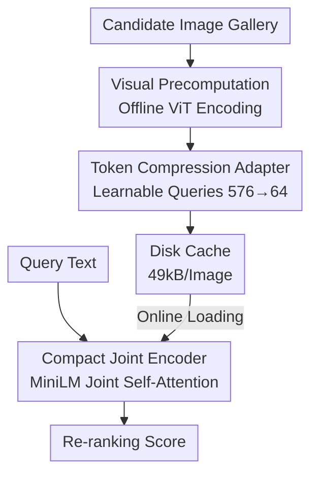

# Efficient Discriminative Joint Encoders for Large Scale Vision-Language Re-ranking

**Conference**: ICLR 2026  
**arXiv**: [2510.06820](https://arxiv.org/abs/2510.06820)  
**Code**: [GitHub](https://github.com/gitanony04-lab/Simple-Efficient-Fusion)  
**Area**: Information Retrieval  
**Keywords**: Vision-Language Retrieval, Joint Encoder, Re-ranking, Token Compression, Efficient Inference

## TL;DR
The paper proposes EDJE (Efficient Discriminative Joint Encoder), which achieves high-throughput inference at 50k image-text pairs/second by offlining visual feature extraction and using lightweight attention adapters to compress visual tokens. It matches the performance of existing joint encoders on Flickr (zero-shot) and COCO (fine-tuned) while requiring only 49kB of storage per image.

## Background & Motivation
In large-scale multimodal retrieval, embedding-based models (e.g., CLIP) enable efficient searching via vector similarity, but independent encoding of the two modalities limits fine-grained cross-modal interaction. Joint encoders (e.g., BLIP, BLIP-2) process both modalities together for superior retrieval performance, following the standard cross-encoder re-ranking paradigm in text retrieval.

**Key Challenge**: Existing joint encoders suffer from a severe visual feature extraction bottleneck—BLIP takes ~400ms to process a batch of 64 images with ViT-B and ~1400ms with ViT-L, where visual feature extraction accounts for 83%-93% of the total inference time. In contrast, MiniLM, the most popular re-ranker in text retrieval, uses only 22M parameters and processes the same batch in 60ms. This explains why multimodal re-rankers are largely absent in practical systems.

**Core Idea**: Offline the visual feature extraction—images are encoded once and cached to disk. During inference, only a compact joint encoder is run to process a small number of visual tokens and the text. This is combined with a token compression adapter to significantly reduce storage requirements.

## Method

### Overall Architecture
EDJE addresses the conflict where joint encoders are accurate but slow due to visual encoding. Key observation: visual encoding is query-independent and can be precomputed. EDJE splits the workflow into offline and online stages: during the offline stage, images are encoded via ViT and processed by a compression adapter to distill thousands of tokens into a small set of compact tokens for storage. During the online stage, a lightweight language model (MiniLM) performs joint self-attention on the cached visual tokens and the query text to output a re-ranking score. This reduces online cost to minimal cross-modal interaction, reaching a throughput of 50k pairs/sec with only 49kB storage per image.

### Key Designs

**1. Visual Precomputation: Caching the most expensive segment**

The root cause of joint encoder slowness is redundant visual encoding for every candidate. Since the input is query-independent, the output can be cached. EDJE uses ViT-B to project each 16×16 patch into an embedding of $d=384$. Storing this in FP16 takes approximately the same space as the original 8-bit RGB image. This allows replacing the visual encoder with larger models to improve representation quality without increasing online costs. However, persisting raw tokens for web-scale databases is impractical due to TB-level storage needs, necessitating the compression design.

**2. Token Compression Adapter: Distilling 576 tokens to 64 using learnable queries**

To reduce storage without losing critical semantics, EDJE introduces $m$ learnable universal query tokens $\mathbf{Q} = [\mathbf{q}_1, ..., \mathbf{q}_m]$. They aggregate information from $n$ original visual tokens $\mathbf{X}$ via cross-attention:

$$\mathbf{H} = \text{MultiHeadAttention}(\mathbf{Q}, \mathbf{X}\mathbf{W}_K, \mathbf{X}\mathbf{W}_V)$$

This is followed by a residual MLP block and a linear projection into the language model embedding space: $\mathbf{Y} = (\mathbf{H} + \text{MLP}(\text{LayerNorm}(\mathbf{H})))\mathbf{W}_{proj}$. Setting $m=64$ compresses 576 ViT tokens to 64, reducing storage from 442kB to 49kB per image. This compression is effective because raw ViT tokens are highly redundant (semantic analysis shows many tokens map to meaningless special symbols), while 64 queries are sufficient to capture object and scene-level information.

**3. Compact Joint Encoder: VLM paradigm with a 33M MiniLM**

After obtaining compressed visual tokens, EDJE follows the VLM paradigm—projecting them into the language embedding space and concatenating them with text tokens to process interaction via self-attention. Crucially, the language model is a 33M parameter MiniLM, significantly smaller than BLIP's 139–167M. Combined with few visual tokens, online inference takes only milliseconds. This decoupling of "ViT + Compression + LM" also provides modularity, allowing any ViT encoder to pair with any pre-trained LM.

### Loss & Training
The model is optimized using four objectives: Image-Text Matching (ITM) for binary classification of positive and hard negative pairs; Masked Language Modeling (MLM) to reconstruct 50% masked text tokens based on the image, strengthening cross-modal dependencies; Text Embedding Recovery to minimize the cosine distance between the projected CLS token and the text encoder embedding; and a Local-to-Compressed distillation where the uncompressed "Local" model acts as a teacher to recover discriminative power lost during compression. It is pre-trained on 14M pairs (CC12M/CC3M/SBU/VG/COCO) and fine-tuned on COCO.

## Key Experimental Results

### Main Results

**Flickr30k Zero-shot Retrieval (SigLIP2 ViT-L/16, 384²):**

| Method | T2I R@1 | I2T R@1 | Storage/Img | Params | Inf. Time |
|------|---------|---------|---------|--------|----------|
| BLIP ViT-L/16 | 86.7 | 96.7 | 2,359kB | 139M | 101.61ms |
| BLIP-2 ViT-L/16 | 88.6 | 96.9 | 2,359kB | 167M | 98.64ms |
| EDJE Local | 87.8 | 96.5 | 442kB | 33M | 4.14ms |
| EDJE Compressed-64 | 86.9 | 96.4 | 49kB | 33M | 1.91ms |

**EDJE gains across various embedding models (Flickr30k Zero-shot T2I R@1):**

| Backbone | Original | +EDJE | Gain |
|----------|----------|-------|------|
| CLIP ViT-B/16 | 62.1 | 76.8 | +14.7 |
| CLIP ViT-L/14 | 65.2 | 80.6 | +15.4 |
| SigLIP2 ViT-B/16 | 82.1 | 84.3 | +2.2 |
| SigLIP2 ViT-L/16 | 82.3 | 87.8 | +5.5 |

### Ablation Study
- **Token Count**: Tested {32, 64, 128, 256} target tokens. 64 tokens provide the best balance. 32 tokens cause significant performance drops, while 256 tokens approach the performance of the 576-token Local variant.
- **Re-ranking Pool Size**: Retrieval performance remains stable for $k=5$ to $k=50$, proving robustness to noisy candidates.
- **Training Objectives**: Stacking ITM, MLM, and Text Embedding Recovery progressively improves results.
- **Local-to-Compressed Distillation**: Provides further discriminative gains for the compressed variant.
- **Semantic Analysis**: Compressed tokens map to meaningful words (e.g., "boulders", "caves"), while many uncompressed tokens map to meaningless tokens (unused80), confirming redundancy.
- **Quantization**: Minimal performance loss when storing compressed tokens in quantized formats, optimizing the storage-performance trade-off.

### Key Findings
- EDJE acts as a plug-and-play re-ranker, improving results for all tested embedding models (CLIP/DFN/MetaCLIP/SigLIP2).
- Inference is 53× faster than BLIP-2 with 48× less storage (49kB vs 2,359kB/image).
- Quantization of compressed tokens results in negligible performance degradation.

## Highlights & Insights
- Accurately identifies visual feature extraction as the joint encoder bottleneck (83%-93% of time). The offline + compression solution is elegant and simple.
- Semantic analysis of the compression adapter is insightful: it confirms that most ViT tokens are indeed redundant and 64 tokens are sufficient.
- The highly modular design makes it extremely practical as a drop-in re-ranker.
- The paper follows a rigorous logical flow: bottleneck analysis → paradigm shift → specific design → experimental validation.
- It systematically introduces the mature cross-encoder re-ranking concept from text retrieval into the multimodal domain, filling a significant gap.

## Limitations & Future Work
- Currently limited to image-text retrieval; does not yet cover multilingual multimodal, audio, or video modalities.
- Discriminative power of the joint encoder can be further improved by exploring larger or stronger language models beyond MiniLM.
- Performance drops significantly at 32 tokens; more extreme compression methods are worth exploring.
- Gains on DFN and MetaCLIP are less pronounced than on CLIP and SigLIP2.
- Downstream applications such as zero-shot classification and large-scale dataset filtering have not been explored.

## Related Work & Insights
- **Relationship to BLIP**: EDJE serves as an efficient alternative for BLIP's re-ranking capability by moving visual extraction offline.
- **Connection to ColBERT**: Similar to ColBERT's token-level offline storage in text retrieval, but adds a compression dimension.
- **Relationship to Q-Former**: The compression layer shares similarities with BLIP-2's Q-Former but is lighter and focused on compression rather than generation.
- **Comparison with LightningDOT**: LightningDOT uses region features for re-ranking but compresses each region into a single vector, making it technically closer to an embedding model than a true joint encoder.

## Rating
- **Novelty**: ⭐⭐⭐⭐ The core idea (offline vision + compressed tokens) is intuitive, though components have precursors.
- **Experimental Thoroughness**: ⭐⭐⭐⭐⭐ Comprehensive validation across backbones, detailed ablations, semantic visualizations, and efficiency analysis.
- **Writing Quality**: ⭐⭐⭐⭐⭐ Precise problem definition, extremely clear motivation, and data-backed bottleneck analysis.
- **Value**: ⭐⭐⭐⭐⭐ High practical value, filling the gap for efficient joint encoder re-rankers in multimodal retrieval.

<!-- RELATED:START -->

## Related Papers

- [\[ICLR 2026\] Investigating Redundancy in Multimodal Large Language Models with Multiple Vision Encoders](investigating_redundancy_in_multimodal_large_language_models_with_multiple_visio.md)
- [\[ICLR 2026\] Self-Evolving Vision-Language Models for Image Quality Assessment via Voting and Ranking](self-evolving_vision-language_models_for_image_quality_assessment_via_voting_and.md)
- [\[ICLR 2026\] From Pixels to Words -- Towards Native Vision-Language Primitives at Scale](from_pixels_to_words_--_towards_native_vision-language_primitives_at_scale.md)
- [\[ICLR 2026\] RAR: Reversing Visual Attention Re-Sinking for Unlocking Potential in Multimodal Large Language Models](rar_reversing_visual_attention_re-sinking_for_unlocking_potential_in_multimodal_.md)
- [\[ACL 2026\] Region-R1: Reinforcing Query-Side Region Cropping for Multi-Modal Re-Ranking](../../ACL2026/multimodal_vlm/region-r1_reinforcing_query-side_region_cropping_for_multi-modal_re-ranking.md)

<!-- RELATED:END -->
