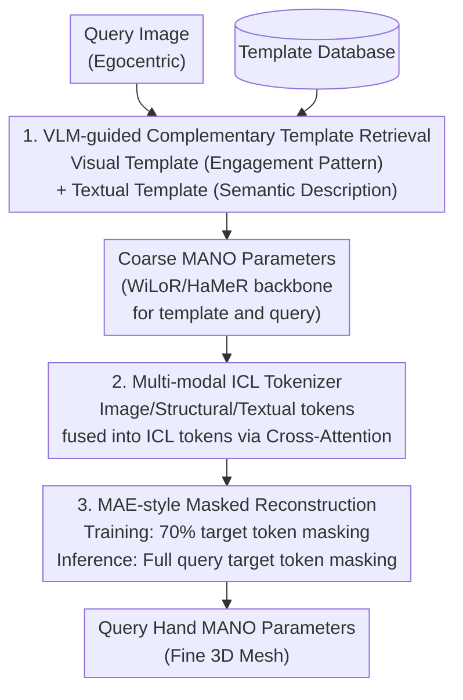

# EgoHandICL: Egocentric 3D Hand Reconstruction with In-Context Learning

**Conference**: ICLR 2026  
**arXiv**: [2601.19850](https://arxiv.org/abs/2601.19850)  
**Code**: [Available](https://github.com/Nicous20/EgoHandICL)  
**Area**: Multi-modal VLM  
**Keywords**: Egocentric perspective, 3D hand reconstruction, In-context learning, Vision-language models, MANO

## TL;DR

The first work to introduce the In-Context Learning (ICL) paradigm to 3D hand reconstruction. Through VLM-guided template retrieval, a multi-modal ICL tokenizer, and an MAE-driven reconstruction pipeline, it significantly outperforms SOTA methods on ARCTIC and EgoExo4D benchmarks.

## Background & Motivation

3D hand reconstruction from an egocentric perspective faces three core difficulties: **depth ambiguity, self-occlusion, and complex hand-object interactions**. Existing methods address these by expanding training data or introducing auxiliary cues but still perform poorly under heavy occlusion and unfamiliar scenes.

**Limitations of Prior Work**:
- SOTA models like WiLoR and HaMeR, while strong in general scenarios, are prone to **missing detections, confusing left/right hands, and distorting occluded regions** in difficult cases such as hands crossing or blending into the background.
- Methods like WildHand that utilize auxiliary supervision signals require extra annotations and still fail to resolve severe occlusions.

**Key Insight**: Humans resolve visual ambiguity by relying on prior experience and contextual reasoning—concepts naturally aligned with ICL. ICL adapts to new problems by conditioning on a few relevant examples without updating model parameters. This paper is the first to introduce the ICL paradigm to 3D hand reconstruction.

## Method

### Overall Architecture

EgoHandICL reformulates hand reconstruction as an "observing examples to answer questions" contextual reasoning process. First, a VLM retrieves a semantically and visually aligned template image for each query image. Then, off-the-shelf reconstruction backbones (WiLoR/HaMeR) calculate coarse MANO parameters for both template and query. The image, structural, and textual information of the template and query are packed into unified ICL tokens. Finally, an MAE-style Transformer decodes the query hand's MANO parameters under masked conditions. The three components—template retrieval, ICL tokenizer, and masked reconstruction—correspond to "finding a reference, assembling context, and reasoning the answer."

### Key Designs

**1. VLM-guided Complementary Template Retrieval: Countering Occlusion Ambiguity with Semantic Alignment**

In difficult scenarios, pure visual retrieval is easily misled by background and occlusion. Therefore, this paper employs two complementary strategies to select templates from the database. The first is the **predefined visual template**: Qwen2.5-VL-72B is used to classify each image into one of four engagement patterns (left hand / right hand / both hands / no hand), ensuring visual consistency in hand configuration by retrieving only within the same category. The second is the **adaptive textual template**: the VLM generates semantic descriptions for images, followed by retrieval based on text similarity. Descriptive prompts capture occlusion and interaction details, while reasoning prompts provide additional guidance for handling severe occlusions and complex interactions. For each query, only one template is selected, with the two strategies complementarily providing reliable references for subsequent reasoning.

**2. Multi-modal ICL Tokenizer: Bridging the 2D-to-3D Modality Gap with Unified MANO Parameterization**

Templates and queries generate four sets of tokens: template input $T_{\text{tpl}}^{\text{in}}$, template target $T_{\text{tpl}}^{\text{tar}}$, query input $T_{\text{qry}}^{\text{in}}$, and query target $T_{\text{qry}}^{\text{tar}}$. "Input" comes from 2D observations, while "target" represents 3D hand parameters. Each token set fuses three modalities: image tokens $F_i$ extracted by a pre-trained ViT for appearance and spatial details, structural tokens $F_m$ encoded from coarse or ground-truth MANO parameters to retain 3D joint and shape priors, and textual tokens $F_t$ embedded from VLM-generated semantic descriptions. These are fused into unified ICL tokens via cross-attention. Crucially, both input and output use the same MANO parameterization, aligning the structure between query and template. This places "2D image inputs" and "3D parameter outputs" into the same token space, directly bridging the modality gap.

**3. MAE-style Masked Reconstruction: Simulating Missing Targets during Inference via Training Conditions**

The **Key Challenge** is that while ground truth for both template and query is available during training, the query target is unknown during inference. This paper draws inspiration from MAE: during training, target tokens ($T_{\text{tpl}}^{\text{tar}}$ and $T_{\text{qry}}^{\text{tar}}$) are randomly partially masked, with an optimal mask rate of 70%. During inference, query target tokens are fully masked, forcing the Transformer to decode the query's MANO parameters solely from the remaining ICL context. In this way, the training phase simulates the incomplete supervision of inference, compelling the model to learn to infer missing information from template examples rather than memorization. The high 70% mask rate aligns with MAE findings—the more that is hidden, the more the model must rely on contextual cues, thereby strengthening reasoning capabilities.

### Loss & Training

**Triple Supervision: Parameter-level + Vertex-level + Perceptual-level**:

$$\mathcal{L} = \lambda_m \mathcal{L}_{mano} + \lambda_v \mathcal{L}_{V} + \lambda_{3D} \mathcal{L}_{3D}$$

- **MANO Parameter Loss**: $\mathcal{L}_{mano} = \|\Theta - \Theta^{gt}\|_2^2 + \|\beta - \beta^{gt}\|_2^2 + \|\Phi - \Phi^{gt}\|_2^2$
- **Vertex Loss**: $\mathcal{L}_V = \|V_{3D} - V_{3D}^{gt}\|_1$
- **3D Perceptual Loss** (Novelty): $\mathcal{L}_{3D} = \|\phi(\mathcal{P}) - \phi(\mathcal{P}^{gt})\|_2^2$, using Uni3D-ti as the 3D feature encoder $\phi$ to reinforce semantic consistency under occlusion.

For datasets lacking MANO ground truth (e.g., EgoExo4D), 3D keypoint constraints are used instead.

Loss weights: $\lambda_m = 0.05$, $\lambda_v = 5.0$, $\lambda_{3D} = 0.01$. Training for 100 epochs on a single RTX 4090.

## Key Experimental Results

### Main Results

**ARCTIC Dataset (Mesh Reconstruction, 118.2K Train / 16.9K Test)**:

| Method | P-MPJPE↓ | P-MPVPE↓ | F@5↑ | F@15↑ | Bimanual P-MPVPE↓ | MRRPE↓ |
|------|----------|----------|------|-------|-------------|--------|
| HaMeR | 9.9 | 9.6 | 0.046 | 0.911 | 9.9 | 10.1 |
| WiLoR | 5.5 | 5.5 | 0.524 | 0.994 | 5.7 | 9.8 |
| WildHand | 5.8 | 5.6 | 0.746 | 0.928 | 4.9 | 7.1 |
| **EgoHandICL** | **4.0** | **3.8** | **0.801** | **0.996** | **3.7** | **6.2** |

Compared to the **Prev. SOTA**: General P-MPVPE improved by **31.1%**, bimanual settings improved by **24.5%**, and MRRPE reduced by **12%**.

**EgoExo4D Dataset (Joint Estimation, 17.3K Train / 4.1K Test)**:

| Method | MPJPE↓ | P-MPJPE↓ | F@10↑ | F@15↑ | Bimanual MRRPE↓ |
|------|--------|----------|-------|-------|------------|
| PCIE-EgoHandPose | 25.5 | 8.5 | 0.544 | 0.910 | 130.9 |
| WiLoR | 31.1 | 12.5 | 0.528 | 0.905 | 378.0 |
| **EgoHandICL** | **21.1** | **7.7** | **0.789** | **0.935** | **110.9** |

### Ablation Study

**Backbone Versatility** (ARCTIC Dataset):

| Configuration | P-MPVPE↓ | Relative Gain |
|------|----------|-----------------|
| EgoHandICL + HaMeR | 8.1 | +10.4% |
| EgoHandICL + WildHand | 4.9 | +12.5% |
| EgoHandICL + WiLoR | 3.8 | **+30.9%** |

Regardless of the coarse MANO backbone used, ICL brings consistent and significant improvements.

**Mask Ratio Influence**: A 70% mask rate was optimal (P-MPVPE=3.8, F@5=0.801). This aligns with MAE—higher masking prompts the model to utilize stronger contextual cues.

**Loss Function Ablation**:

| Loss Combination | P-MPVPE↓ | F@5↑ |
|----------|----------|------|
| $\mathcal{L}_V$ only | 4.7 | 0.6 |
| + $\mathcal{L}_{mano}$ | 4.3 | 0.6 |
| + $\mathcal{L}_{3D}$ | 3.9 | 0.7 |
| + $\mathcal{L}_{mano}$ + $\mathcal{L}_{3D}$ | **3.8** | **0.8** |

### Key Findings

1. ICL allows EgoHandICL to **substantially outperform** direct regression methods in occlusion and bimanual crossing scenarios.
2. Contextual reasoning analysis confirms that the model utilizes retrieved templates for inference rather than simple imitation.
3. Proposed-Full achieved optimal results across all hand engagement types, proving the synergistic generalization advantage of ICL.
4. VLM reasoning prompts are more effective than descriptive prompts, indicating that semantic reasoning can enhance retrieval quality.
5. EgoHandICL can be integrated into EgoVLM to improve hand-object interaction reasoning (avg +3%).

## Highlights & Insights

1. **First Successful Transfer of ICL to 3D Vision**: Resolved the modality gap between 2D images and 3D meshes by unifying input and output via MANO parameterization.
2. **VLM as a Retrieval Engine**: Utilized the semantic understanding of large models to select contextually relevant templates, demonstrating more robustness than pure visual retrieval.
3. **Synergy of MAE and ICL**: The design of partial masking during training to simulate missing info during inference provides a general paradigm for visual ICL.
4. **High Utility**: Acts as a plugin to enhance existing hand reconstruction methods (10-31% gain) and improves EgoVLM reasoning capabilities.

## Limitations & Future Work

1. Only one template is retrieved per query; whether multi-template ICL can provide further improvements remains to be verified.
2. High overhead for retrieval preprocessing using VLMs (72B parameters), requiring significant compute resources (e.g., 4x A100).
3. Validated only in laboratory (ARCTIC) and semi-controlled (EgoExo4D) environments; robustness in industry-level complex scenes is yet to be tested.
4. The representation capacity of the MANO model itself limits modeling of extreme poses and deformations.
5. Temporal ICL reasoning in video sequences was not explored.

## Related Work & Insights

- **HaMeR/WiLoR**: Large-scale ViT-based image-to-MANO regression, serving as the baseline backbones for this work.
- **Visual ICL (PIC/HiC)**: Exploration of ICL in point cloud recognition and human motion, but without handling 2D-to-3D modality gaps.
- **MAE**: The masked auto-encoder paradigm provided a solution for the training-inference asymmetry in ICL.
- **Insight**: The combination of the ICL paradigm and VLM retrieval can be extended to other 3D reconstruction tasks involving occlusion or ambiguity (e.g., human pose, object reconstruction).

## Rating

- **Novelty**: ★★★★★ — First introduction of ICL to 3D hand reconstruction; originality in problem definition and framework design.
- **Technical Depth**: ★★★★☆ — Sophisticated design of the multi-modal tokenizer and MAE training strategy.
- **Experimental Thoroughness**: ★★★★★ — Multi-metric validation across dual datasets with comprehensive ablations.
- **Value**: ★★★★☆ — Open-source code available; serves as a plugin to improve existing methods.
- **Writing Quality**: ★★★★☆ — Clear illustrations and explicit logic for framework components.

<!-- RELATED:START -->

## Related Papers

- [\[ICLR 2026\] UniHM: Unified Dexterous Hand Manipulation with Vision Language Model](unihm_unified_dexterous_hand_manipulation_with_vision_language_model.md)
- [\[ICLR 2026\] ContextNav: Towards Agentic Multimodal In-Context Learning](contextnav_towards_agentic_multimodal_in-context_learning.md)
- [\[CVPR 2026\] VLM-3R: Vision-Language Models Augmented with Instruction-Aligned 3D Reconstruction](../../CVPR2026/multimodal_vlm/vlm-3r_vision-language_models_augmented_with_instruction-aligned_3d_reconstructi.md)
- [\[ICLR 2026\] VaseVQA-3D: Benchmarking 3D VLMs on Ancient Greek Pottery](vasevqa-3d_benchmarking_3d_vlms_on_ancient_greek_pottery.md)
- [\[CVPR 2026\] HiFICL: High-Fidelity In-Context Learning for Multimodal Tasks](../../CVPR2026/multimodal_vlm/hificl_highfidelity_incontext_learning_for_multimo.md)

<!-- RELATED:END -->
