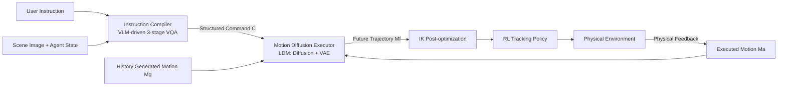

# Endowing GPT-4 with a Humanoid Body: Building the Bridge Between Off-the-Shelf VLMs and the Physical World

**Conference**: ICLR 2026  
**OpenReview**: [https://openreview.net/forum?id=aQWSEjcN9V](https://openreview.net/forum?id=aQWSEjcN9V)  
**Code**: [Shadow-Dream/BiBo](https://github.com/Shadow-Dream/BiBo)  
**Area**: multimodal_vlm  
**Keywords**: Embodied AI, Humanoid Agent, Vision-Language Model, Motion Diffusion, Human-Scene Interaction

## TL;DR

The BiBo framework utilizes a two-level structure consisting of an "Instruction Compiler + Motion Diffusion Executor," allowing off-the-shelf VLMs like GPT-4 to control humanoid agents for complex physical scene interactions without any fine-tuning, achieving a single-task success rate of 90.2%.

## Background & Motivation

**Background**: Humanoid agents have been extensively studied in scene perception and interaction. Existing solutions mainly follow two paths: training specialized models after collecting large-scale human-scene interaction data (UniHSI, HumanVLA, TokenHSI), or using text-guided diffusion models to generate action sequences followed by RL tracking policies (CLoSD).

**Limitations of Prior Work**: Specialized training routes face extremely high data collection costs due to the complexity of humanoid structures and physical world diversity. Diffusion tracking routes suffer from temporal discontinuities (jitter) between generated and executed sequences while lacking open-world semantic planning capabilities.

**Key Challenge**: Off-the-shelf VLMs (GPT-4, Gemini, etc.) possess powerful open-world reasoning but face a semantic gap with low-level motor control—VLMs output natural language, whereas humanoids require precise joint trajectories.

**Goal**: To build a framework bridging high-level VLM reasoning and low-level humanoid control without modifying VLM weights, repurposing VLM generalization to reduce data collection costs.

**Key Insight**: Analogous to the "Compiler → Assembler" abstraction in computer architecture, this work designs an "Instruction Compiler → Motion Diffusion Executor" pipeline. The compiler compiles natural language into structured execution commands, and the executor translates these into continuous physical action sequences, achieving smooth transitions via LDM fusion of physical feedback.

## Method

### Overall Architecture

BiBo consists of two modules in series: The **Instruction Compiler** feeds user high-level instructions (e.g., "sit down and rest"), scene images, and agent states into a VLM to output a structured execution command $C = \{c, l, f, J\}$ (action description $c$, position $l \in \mathbb{R}^2$, orientation $f$, and joint target set $J$). The **Motion Diffusion Executor** receives command $C$ and continuously generates future joint trajectories in the physical environment. It maintains temporal continuity by jointly decoding the executed motion $M_a$ and the previously generated motion $M_g$ using an LDM.

### Key Designs

**1. Coarse-to-Fine Three-stage VQA Compilation: Decomposing VLM reasoning into Attribute Analysis → Pose Reasoning → Joint Localization**

The compiler translates high-level instructions into precise commands in three steps: ① **Basic Attribute Analysis**: The VLM combines scene images and agent states to determine the motion description $c$, anchor object $o$, and key joint set $J$ via 5-way majority voting; ② **Pose Reasoning**: Since direct coordinate prediction is difficult for VLMs, position/orientation are converted into image label identification tasks—placing location labels around anchor objects for the VLM to select, bypassing numerical generation errors; ③ **Joint Target Generation**: An 8×8 label grid is overlaid on the target object image. The VLM selects joint target points and provides relative offsets from a predefined set of directions (Up, Down, Front, Back, Center, etc.), reducing generation difficulty. This design maps open-world reasoning to structured control parameters.

**2. LDM-based Dual-stream Fusion Executor: Causal decoding for smoothness and physical awareness**

The diffusion stage is conditioned on the latent variable $S_a = \text{Encoder}(M_a)$ of the executed motion, guiding the diffusion process to perceive physical feedback (collisions, external forces) to generate future latent $S_f$. During VAE decoding, the previous generated motion latent $S_g$ is **concatenated** with $S_f$ for joint decoding via **Causal Self-Attention**:

$$[M'_g : M_f] = \text{Decoder}([S_g : S_f])$$

The causal mechanism ensures $M'_g = \text{Decoder}(S_g) \approx M_g$, making $M_f$ naturally continuous with $M_g$. Compared to using only executed motion (causing jitter) or only generated motion (ignoring feedback), dual-stream fusion solves both issues.

**3. IK Post-optimization and RL Tracking: The last mile of precise joint control**

The executor outputs latent decoding results for joint trajectories. Before execution, **Inverse Kinematics (IK) post-optimization** precisely aligns joint targets from command $J$ to the generated trajectory, followed by a pre-trained RL tracking policy. Ablation shows IK is crucial for touch/lift tasks—removing IK drops Touch success from 86.05% to 48.94% and Lift from 65.42% to 6.80%.

## Key Experimental Results

### Main Results

**Success Rate Comparison (Randomly Generated Scenes, Tab. 1)**

| Task / Method | UniHSI | HumanVLA | TokenHSI | CLoSD | **BiBo (Ours)** |
|---------------|--------|----------|----------|-------|-----------------|
| Reach ↑       | 93.28  | 56.58    | 94.55    | 85.83 | **99.18**       |
| Watch ↑       | -      | -        | -        | 87.76 | **99.62**       |
| Sit ↑         | 81.03  | -        | 72.95    | 76.99 | **95.84**       |
| Sleep ↑       | 85.11  | -        | 33.33    | 34.67 | **94.89**       |
| Touch ↑       | 69.62  | -        | -        | 42.55 | **86.05**       |
| Lift ↑        | -      | 44.90    | 48.19    | 7.71  | **65.42**       |
| Single-task Avg ↑ | -    | -        | -        | -     | **90.2%**       |
| Compound (Hard) ↑ | -    | -        | -        | 2.38  | **27.78**       |

Note: Other methods use GT planning; BiBo performs online planning. The gap is only 4.38%.

**Text-guided Motion Quality (HumanML3D, Tab. 3)**

| Method | FID↓ | R.P.@1↑ | Arbitrary Length | Phys. Plausible |
|------|------|---------|---------|---------|
| CLoSD | 2.861 | 0.367 | ✓ | ✓ |
| MotionLCM | 0.072 | 0.510 | ✗ | ✗ |
| **BiBo** | **0.076** | **0.542** | ✓ | ✗ |
| **BiBo (Phy.)** | 1.883 | 0.411 | ✓ | ✓ |

BiBo's non-physical mode FID is 0.076 (63.8% improvement over CLoSD). Physical mode R.P.@1 is ~11.8% higher than CLoSD (relative +44.7 pp).

**Joint Control Accuracy MAE (Tab. 4)**

| Method | Head↓ | Hand↓ | Foot↓ |
|------|-------|-------|-------|
| DiP (CLoSD) | 0.0663 | 0.0830 | 0.0540 |
| MotionLCM | 0.0952 | 0.1470 | 0.0955 |
| **BiBo** | **0.0310** | **0.0571** | **0.0335** |

BiBo achieves significantly lower joint control error; Hand MAE is reduced by ~31% compared to DiP.

### Ablation Study

| Config | Sit↑ | Touch↑ | Lift↑ | Description |
|------|------|--------|-------|------|
| w/o Voting | 91.13 | 85.82 | 59.75 | Majority voting improves stability |
| w/o Label | 48.59 | 64.89 | 58.73 | Image labels are critical for pose reasoning |
| w/o Act. (Exec. Stream) | 84.18 | 81.80 | 28.34 | Removing feedback causes Lift to plummet |
| w/o Gen. (Gen. Stream) | 95.62 | 84.40 | 56.58 | Removing history stream affects continuity |
| w/o IK | 95.96 | 48.94 | 6.80 | IK is vital for precise contact tasks |
| **BiBo (full)** | **95.84** | **86.05** | **65.42** | All designs contribute to performance |

Average joint acceleration (continuity metric): BiBo 0.0379 m²/s², CLoSD 0.0610, w/o LDM 0.0879, validating LDM+Causal decoding for smoothness.

### Key Findings

- Using image labels instead of coordinate values is the largest contributor to compiler accuracy.
- Dual-stream fusion (Act.+Gen.) is the only effective path to balance physical awareness and motion smoothness.
- IK post-optimization is the indispensable "last mile" for precise contact tasks.
- In user studies, BiBo received 77/150 preference votes from 30 volunteers, outperforming MotionLCM (53) and CLoSD (20).

## Highlights & Insights

- **Zero-shot VLM Reuse**: BiBo treats GPT-4o as a black box, extracting reasoning via a 3-stage VQA prompt chain, providing a clear interface for "plug-and-play" VLM integration.
- **Compiler-Assembler Analogy**: Introducing abstraction levels from CPU architecture to Embodied AI provides a new paradigm for "Language → Action" hierarchical translation.
- **Novel LDM Application**: Feeding both executed and history generated motions into the LDM solves the long-standing conflict between physical awareness and temporal continuity in diffusion tracking.
- The small gap (4.38%) between online planning and GT planning proves VLM planning is practical for real-world tasks.

## Limitations & Future Work

- The executor trained on HumanML3D has limited generalization due to data scale; larger datasets (Motion-X, LINGO) could improve this.
- Physical feedback uses history motion but lacks explicit scene geometry modeling (heightmaps, point clouds), limiting complex contact tasks (climbing, rolling).
- Current scope is limited to human-scene interaction; hand-object and human-human interactions are not yet covered.
- FID in physical mode (Phy.) increases from 0.076 to 1.883, indicating a drop in motion realism when introducing physical constraints.

## Related Work & Insights

- **vs UniHSI / TokenHSI**: HSI methods based on contact semantics rely on predefined maps; BiBo replaces this with VLM design for better open-world adaptation.
- **vs CLoSD**: CLoSD is the closest diffusion-tracking baseline, but its single-stream approach causes poor continuity; BiBo's dual-stream LDM solves this while adding VLM planning.
- **vs HumanVLA**: HumanVLA uses end-to-end VLA paradigms requiring high initial pose alignment; BiBo's modularity is more robust to initial states.
- **Inspiration for Embodied LLM/VLM**: Structured intermediate representations ($C = \{c, l, f, J\}$) are the key bridge between VLM output and low-level execution, extensible to robotic arms or wheeled platforms.

## Rating

- Novelty: ⭐⭐⭐⭐ Compiler-assembler analogy + LDM dual-stream fusion are original and elegant.
- Experimental Thoroughness: ⭐⭐⭐⭐ Covers success rates, motion quality, control accuracy, ablations, and user studies with rigorous random scene evaluations.
- Writing Quality: ⭐⭐⭐⭐ Clear logic, intuitive analogies, excellent visualization, and complete derivations.
- Value: ⭐⭐⭐⭐ Provides a reproducible "zero-shot VLM control" solution for embodied agents, offering high value to the community.

<!-- RELATED:START -->

## Related Papers

- [\[ICML 2026\] VLANeXt: A Recipe for Building Robust VLA Models](../../ICML2026/multimodal_vlm/vlanext_recipes_for_building_strong_vla_models.md)
- [\[CVPR 2026\] PhyCritic: Multimodal Critic Models for Physical AI](../../CVPR2026/multimodal_vlm/phycritic_multimodal_critic_models_for_physical_ai.md)
- [\[CVPR 2026\] VCU-Bridge: Hierarchical Visual Connotation Understanding via Semantic Bridging](../../CVPR2026/multimodal_vlm/vcu-bridge_hierarchical_visual_connotation_understanding_via_semantic_bridging.md)
- [\[CVPR 2026\] Benchmarking Single-Factor Physical Video-to-Audio Generation](../../CVPR2026/multimodal_vlm/benchmarking_single-factor_physical_video-to-audio_generation.md)
- [\[CVPR 2026\] EMMA: Extracting Multiple physical parameters from Multimodal Data](../../CVPR2026/multimodal_vlm/emma_extracting_multiple_physical_parameters_from_multimodal_data.md)

<!-- RELATED:END -->
