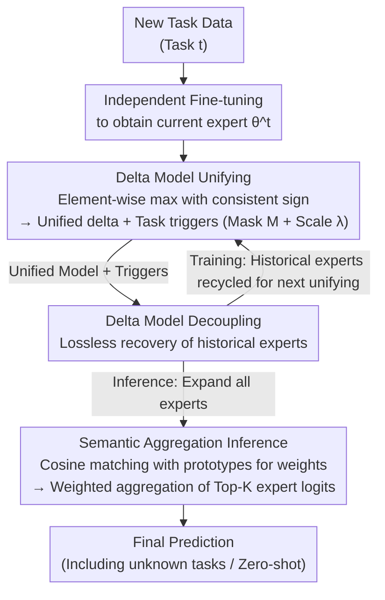

# Enhanced Continual Learning of Vision-Language Models with Model Fusion

**Conference**: ICLR 2026  
**arXiv**: [2503.10705](https://arxiv.org/abs/2503.10705)  
**Code**: [GitHub](https://github.com/zhangzicong518/ConDU)  
**Area**: Multi-modal VLM  
**Keywords**: Continual Learning, Model Fusion, Catastrophic Forgetting, CLIP, Zero-shot capability preservation

## TL;DR
This paper proposes the Continual Decoupling-Unifying (ConDU) framework, introducing model fusion into VLM continual learning for the first time. By maintaining a unified model combined with task triggers for iterative decoupling-unifying operations, it outperforms SOTA by an average of 2% on MTIL benchmarks while simultaneously enhancing zero-shot capabilities.

## Background & Motivation
VLMs (e.g., CLIP) achieve remarkable zero-shot capabilities by integrating vision and text modalities. However, when sequentially fine-tuned on multiple downstream tasks, VLMs also suffer from catastrophic forgetting. Existing VLM continual learning methods have significant limitations:

**Distillation methods** (e.g., ZSCL, Dual-RAIL) require additional reference datasets for knowledge distillation. Performance is sensitive to dataset selection and requires careful tuning of multiple hyperparameters to balance forgetting mitigation, zero-shot preservation, and current task optimization.

**Parameter-efficient fine-tuning methods** (e.g., DPeCLIP, MulKI) are only applicable to adapter or LoRA scenarios and cannot handle full-parameter fine-tuning.

**Key Insight**: If maintaining an independent fine-tuned model for each task were allowed, one could simply select the corresponding model when the task ID is known. The core idea is to extract and fuse the shared parts of these independent models into a single unified VLM, while storing task-specific differences in limited memory. Thus, "one main VLM + small auxiliary memory" can simulate the behavior of multiple specialized models. Model fusion is naturally suited for this scenario as it merges multiple models without accessing original training data.

## Method

### Overall Architecture
The core concept of ConDU is to use "one unified model + small auxiliary memory" to simulate the effect of retaining separate expert models for each task. It maintains three components throughout the continual learning process: a unified model, a set of task triggers, and a set of class prototypes. When a new task arrives, the system first independently fine-tunes a current task expert. A "Unifying" operation then compresses the current expert and historical experts into a new unified model while generating task triggers. At the start of the next round, a "Decoupling" operation uses the triggers to losslessly restore all historical experts from the unified model for the next iteration. Both Decoupling and Unifying are training-free parameter operations, with total overhead amounting to approximately 1% of the fine-tuning time. During inference, experts are expanded via decoupling, and a semantic matching mechanism using class prototypes selects the most trustworthy experts for weighted aggregation, enabling prediction even when task IDs are unknown or in pure zero-shot scenarios.

### Key Designs

**1. Delta Model Unifying: Compressing multiple experts without mutual cancellation**

Directly averaging multiple fine-tuned models causes weights to cancel out and key capabilities to be lost. Therefore, ConDU operates on delta models $\delta^t = \theta^t - \theta^0$ rather than raw weights. For unification, a "selective-max with consistent sign" decision is made per parameter dimension: the sign of the sum of all deltas in that dimension is determined; if $\sum_i \delta^i_j > 0$, $\max_i(\delta^i_j)$ is taken, otherwise $\min_i(\delta^i_j)$ is used. This preserves the most significant knowledge across tasks while avoiding positive-negative cancellation. Simultaneously, two lightweight triggers are recorded for each task: a binary mask $M^i_j$ marking whether the task's delta shares the same sign as the unified delta, and a scaling scalar $\lambda^i$ to compensate for magnitude changes. These represent all necessary "differential information" to reconstruct the expert later.

**2. Delta Model Decoupling: Lossless restoration of historical experts from the unified model**

With triggers, any historical task expert can be reconstructed without saving the full model: the unified delta is filtered and scaled using the task's scaling scalar and mask, $\tilde{\delta}^i = \lambda^i \cdot M^i \odot \delta^{1:t}$, and then added back to the pre-trained weights to obtain the expert $\tilde{\theta}^i = \theta^0 + \tilde{\delta}^i$. This step is used both in training (retrieving historical experts for the next unification round to ensure old knowledge is not overwritten) and in inference (expanding experts as needed). Since it involves only masks and scalar multiplication, it is nearly instantaneous—this is key to simulating multiple independent experts with only the "unified model + triggers."

**3. Semantic Aggregation Inference: Selecting the right expert for unknown task IDs or zero-shot scenarios**

If the task ID is unknown or in zero-shot scenarios during testing, ConDU first decouples all task experts and then uses a prototype matching mechanism to decide which to trust. It uses the original pre-trained VLM to extract features from the test image and computes cosine similarity with prototypes of all classes in each task. Each task uses its highest similarity score as the confidence weight for that expert. The Top-K experts with the highest weights are selected, and their output logits are weighted and aggregated for the final prediction. Prototypes are not just image centroids but integrate text features: $P^i_k = f(y, \theta^0) + \frac{1}{|\mathcal{D}^t_k|}\sum_m f(x_m, \theta^0)$, allowing the similarity matching to utilize both visual and semantic signals for robust routing.

### Loss & Training
The training phase involves only standard fine-tuning (either full-parameter or LoRA). It does not introduce any distillation losses or rely on external reference datasets. Decoupling and Unifying are training-free throughout the process. The only hyperparameter is the number of aggregated experts $K$ during inference, which ablation studies show is not sensitive.

## Key Experimental Results

### Main Results

**MTIL Benchmark (11 cross-domain tasks):**

| Method | Transfer↑ | Average↑ | Last↑ |
|------|-----------|----------|-------|
| Zero-shot | 65.3 | 65.3 | 65.3 |
| ZSCL | 68.1 | 75.4 | 83.6 |
| Dual-RAIL | 69.4 | 77.8 | 86.8 |
| DPeCLIP | 69.1 | 77.5 | 86.9 |
| MulKI | 70.1 | 77.3 | - |
| **ConDU (LoRA)** | **70.3** | **78.3** | **86.2** |
| **ConDU (FT)** | **70.8** | **78.8** | **87.1** |

**Task-Agnostic MTIL (No Task ID):**

| Method | Average↑ | Last↑ |
|------|----------|-------|
| Best Baseline | 76.1 | 84.6 |
| **ConDU (LoRA)** | **78.0** | **85.1** |
| **ConDU (FT)** | **78.1** | **86.4** |

### Ablation Study
- ConDU is effective for both full-parameter tuning and LoRA, making it the only method to support both paradigms simultaneously.
- Few-shot MTIL (5-shot): Transfer 70.0%/70.3% (FT/LoRA) exceeds best baseline by 1.4%; Average 72.3%/72.7% exceeds by 1.3%; Last 76.6%/77.4% exceeds by 1.3%.
- Performance is highly insensitive to the number of aggregated experts $K$ during inference (see Appendix F).
- The time overhead for Decoupling-Unifying operations is only about 1% of fine-tuning time.
- Inference time for parallel forward passes of multiple experts is close to single-model inference.
- The "selective-max with consistent sign" strategy in the Unifying operation significantly outperforms baseline fusion strategies like simple averaging.

**Few-shot MTIL Comparison:**

| Method | Transfer↑ | Average↑ | Last↑ |
|------|-----------|----------|-------|
| Best Baseline | 68.6 | 71.4 | 76.1 |
| ConDU (FT) | 70.0 | 72.3 | 76.6 |
| ConDU (LoRA) | 70.3 | 72.7 | 77.4 |

### Key Findings
- The Transfer metric exceeds the pre-trained VLM by 5.5%, indicating that the continual learning process actually enhances zero-shot capability.
- The full-parameter fine-tuning version (ConDU FT) typically outperforms the LoRA version, showing that full-parameter tuning maintains advantages in continual learning.
- The "selective-max with consistent sign" strategy in model fusion is remarkably effective at preserving multi-task knowledge.

## Highlights & Insights
- Successfully introduces model fusion into VLM continual learning for the first time, opening a new research direction.
- Elegant framework design: Decoupling-Unifying operations require no training, and task triggers (masks + scaling scalars) have extremely low storage overhead.
- Compatible with both full-parameter fine-tuning and parameter-efficient fine-tuning, offering superior flexibility compared to existing methods.
- Zero-shot capabilities are enhanced rather than degraded, which is rare in continual learning.

## Limitations & Future Work
- The binary mask in task triggers has the same dimensions as the unified delta model; storage may become a bottleneck as the number of tasks increases.
- Whether the "selective-max" strategy in the Unifying operation is optimal requires further theoretical analysis.
- Experiments were only validated on the CLIP architecture; applicability to more VLM architectures (e.g., BLIP, LLaVA) remains to be explored.
- Semantic aggregation inference requires forward passes for multiple task experts, increasing inference cost as task numbers grow very large.

## Related Work & Insights
- **Relation to Task Arithmetic**: ConDU's Unifying operation is inspired by TIES Merging but designs a decoupling mechanism specifically for continual learning scenarios.
- **Comparison with ZSCL/Dual-RAIL**: These methods require reference datasets and distillation, whereas ConDU is entirely data-independent in its fusion stage.
- **Insight**: The model fusion perspective provides a new approach to continual learning—shifting from "how to prevent forgetting" to "how to efficiently store and reconstruct multiple experts."

## Rating
- Novelty: ⭐⭐⭐⭐⭐ First to introduce model fusion to VLM continual learning with a novel framework design.
- Experimental Thoroughness: ⭐⭐⭐⭐ Covers three MTIL settings, but validated only on CLIP.
- Writing Quality: ⭐⭐⭐⭐ Clear framework diagrams, standardized method descriptions, and unified mathematical notation.
- Value: ⭐⭐⭐⭐⭐ Opens a new direction with a highly versatile framework that avoids the need for extra data or complex distillation designs.

<!-- RELATED:START -->

## Related Papers

- [\[ICLR 2026\] Memory-Free Continual Learning with Null Space Adaptation for Zero-Shot Vision-Language Models](memory-free_continual_learning_with_null_space_adaptation_for_zero-shot_vision-l.md)
- [\[ICLR 2026\] Fed-Duet: Dual Expert-Orchestrated Framework for Continual Federated Vision-Language Learning](fed-duet_dual_expert-orchestrated_framework_for_continual_federated_vision-langu.md)
- [\[ICLR 2026\] Reversible Primitive–Composition Alignment for Continual Vision–Language Learning](reversible_primitivecomposition_alignment_for_continual_visionlanguage_learning.md)
- [\[CVPR 2026\] Enhancing Continual Learning of Vision-Language Models via Dynamic Prefix Weighting](../../CVPR2026/multimodal_vlm/enhancing_continual_learning_of_vision-language_models_via_dynamic_prefix_weight.md)
- [\[AAAI 2026\] ReCAD: Reinforcement Learning Enhanced Parametric CAD Model Generation with Vision-Language Models](../../AAAI2026/multimodal_vlm/recad_reinforcement_learning_enhanced_parametric_cad_model_generation_with_visio.md)

<!-- RELATED:END -->
