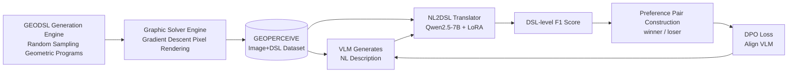

# Enhancing Geometric Perception in VLMs via Translator-Guided Reinforcement Learning

**Conference**: ICLR 2026  
**Code**: https://github.com/Longin-Yu/GeoPerceive  
**Area**: multimodal_vlm  
**Keywords**: Geometric Perception, Visual Language Models, Domain-Specific Language, Reinforcement Learning, DPO

## TL;DR

This work introduces the GEOPERCEIVE benchmark (geometric perception evaluation based on unambiguous DSL) and the GEODPO framework (translator-guided reinforcement learning). It enables VLMs to maintain natural language output while utilizing an NL→DSL translator to calculate fine-grained reward signals, significantly enhancing geometric primitive perception and downstream reasoning capabilities.

## Background & Motivation

**Background**: Geometric Problem Solving (GPS) is a critical application scenario for multimodal VLMs. Current mainstream methods employ end-to-end reasoning on graphics and text, measuring model capability via final answer accuracy. However, even state-of-the-art models like GPT-o3 and Qwen3-235B exhibit basic perception errors, such as misidentifying "tangency" as "intersection" or missing key intersection points.

**Limitations of Prior Work**: First, existing GPS benchmarks (e.g., MathVista, GeoQA) conflate perception errors with reasoning errors, failing to independently assess geometric perception. Second, existing DSLs like AlphaGeometry or Inter-GPS suffer from "one-image-multiple-programs" ambiguity, where the same graphic corresponds to multiple semantically equivalent DSLs, making precise program-level evaluation impossible. Furthermore, direct Supervised Fine-Tuning (SFT) on DSLs faces permutation equivalence explosion and causes models to deviate from pre-trained natural language distributions.

**Key Challenge**: There is a need for a geometric perception evaluation and training system that is both unambiguous and automatically generatable at scale. Simultaneously, a training paradigm is required to bypass SFT limitations and utilize fine-grained DSL-level rewards for VLM alignment.

**Goal**: To independently measure and enhance VLM perception of geometric primitives (points, lines, circles) and their spatial relationships, rather than optimizing for end-to-end final answers.

**Core Idea**: Design a normalized DSL (GEODSL) as the unique formal representation of geometric figures. Use a pipeline of "VLM generates NL description → NL2DSL translator maps description back to DSL → Calculate F1 score against ground truth DSL" as the reward function. Apply DPO for preference alignment, ensuring the model outputs in natural language space while receiving DSL-level fine-grained supervision.

## Method

### Overall Architecture

The GEODPO system consists of three synergetic components: the GEOPERCEIVE data engine for automated (image, DSL) pair generation; an NL2DSL translator trained on synthetic corpora to map VLM natural language output back to DSL; and a DPO trainer that constructs preference pairs using fine-grained scores from the translator for VLM reinforcement alignment.

### Key Designs

**1. GEODSL: Unambiguous Normalized Geometric DSL**  
Existing DSLs (AlphaGeometry, Inter-GPS, etc.) suffer from the "one-image-multiple-programs" issue—the same geometric relationship can be expressed with different construction sequences, leading to non-unique ground truths. GEODSL adopts a relational rather than constructive approach, representing figures as 4-tuples $G = \langle P, L, C, R \rangle$ (Points, Lines, Circles, Relations). Point-curve associations are embedded within curve declarations, ensuring each image corresponds to a unique DSL program. Complexity is controllable, as program length scales linearly with element count.

**2. GEOPERCEIVE Metrics: Weighted F1 based on Hungarian Matching**  
Given ground truth $G$ and prediction $\hat{G}$, similarity matrices are constructed for each primitive category (Point/Line/Circle/Relation). The maximum weight bipartite matching is solved via the Hungarian algorithm to calculate the F1 score for that category. The final score $Score(G, \hat{G})$ is the equal-weighted average of the four category F1 scores. This metric is naturally robust to permutation equivalence.

**3. Gradient Descent Graphic Solver Engine**  
Given a GEODSL program, the engine parameterizes geometric primitives (point coordinates, line coefficients, circle center/radius) and translates all geometric constraints into loss functions (e.g., squared distance of a point to a line). It incorporates regularization terms for visual plausibility (density, distribution, scale/boundary penalties) and renders pixel images via iterative optimization in PyTorch.

**4. Translator-Guided DPO Preference Alignment**  
The core strategy is that the VLM does not learn to output DSL directly (avoiding distribution drift and permutation explosion). Instead, it maintains NL output, and a separately trained NL2DSL translator (Qwen2.5-7B + LoRA, rank=4) maps the description back to DSL for scoring. For each training image, $N_\text{samples}=10$ descriptions are sampled from the reference VLM and ranked by DSL scores. The top half are winners and the bottom half are losers. A minimum margin $\delta_\text{min}=0.3$ is required to filter out uninformative pairs. The standard DPO loss is applied:
$$\mathcal{L}_\text{DPO} = -\mathbb{E}\left[\log\sigma\!\left(\beta\log\frac{\pi_\theta(S_w|D)}{\pi_\text{ref}(S_w|D)} - \beta\log\frac{\pi_\theta(S_l|D)}{\pi_\text{ref}(S_l|D)}\right)\right]$$
to align the VLM towards generating geometrically accurate natural language descriptions.

## Key Experimental Results

### Main Results (GEOPERCEIVE Main-test, In-domain Perception)

| Model | Method | Overall Score | Δ vs Raw |
|------|------|--------------|----------|
| Qwen2.5-VL 7B | Raw | 57.96 | — |
| Qwen2.5-VL 7B | SFT | 64.02 | +10.46% |
| Qwen2.5-VL 7B | **GEODPO** | **66.19** | **+14.2%** |
| InternVL3 8B | Raw | 58.44 | — |
| InternVL3 8B | SFT | 62.71 | +7.31% |
| InternVL3 8B | **GEODPO** | **67.41** | **+15.35%** |
| LLaVA-Next 7B | Raw | 41.01 | — |
| LLaVA-Next 7B | SFT | 51.10 | +24.60% |
| LLaVA-Next 7B | **GEODPO** | **51.86** | **+26.46%** |

### OOD and Downstream Reasoning

| Dataset | Model | Raw | GEODPO | Δ |
|--------|------|-----|--------|---|
| GEOPERCEIVE-OOD (Perception) | Qwen2.5-VL 7B | 58.14 | 60.28 | +3.68% |
| GEOPERCEIVE-OOD (Perception) | InternVL3 8B | 58.74 | 60.91 | +3.69% |
| MathVista Geometry (Reasoning) | Qwen2.5-VL 7B | — | — | +39.0% (Overall report) |

### Key Findings

- SFT leads to a performance **decrease** in the Constraint category (InternVL3 constraint F1 dropped by 6.32%), while GEODPO consistently improves it by +9.9% to +19.27%, indicating GEODPO's robustness for "fragile" relations.
- SFT yields almost zero gain on OOD sets (+0.46% or even −0.29%), whereas GEODPO maintains consistent positive gains, demonstrating the stronger generalization of RL preference alignment.
- The translator's performance drops significantly for circles and constraints as geometric complexity increases (iterations 4–5), identifying it as the main performance bottleneck.

## Highlights & Insights

- **Decoupling Perception and Reasoning**: Through an independent perception benchmark, it distinguishes "VLM cannot see the image clearly" from "VLM cannot reason correctly," providing a new diagnosis tool.
- **Translator as a Reward Bridge**: Utilizing an NL→DSL translator to "graft" structured formal scoring onto natural language output avoids distribution drift. This is a general "cross-modal reward injection" idea applicable to other formal language tasks like chemical structures or code.
- **Automated Data Pipeline**: The generation and solver engines require zero human annotation and can generate geometry of arbitrary complexity, facilitating large-scale pre-training.
- **SFT Negative Transfer**: The observation that SFT can degrade performance in specific categories (constraints) serves as a warning against the assumption that generic SFT is suitable for all tasks.

## Limitations & Future Work

- Translator F1 scores drop on high-complexity figures (many circles/constraints), directly limiting reward signal quality. Stronger translators or using the VLM itself as a translator could be explored.
- GEODSL currently covers Euclidean configurations; support for non-standard geometry (projective, coordinate geometry with values) is missing.
- The OOD dataset is small (100 samples annotated by 10 students); statistical confidence needs further verification.
- The DPO paradigm is sensitive to $N_\text{samples}$ and computational overhead (10 samples per image) may become a bottleneck in large-scale training.

## Related Work & Insights

- **vs SFT on DSL**: Direct SFT to DSL output faces permutation explosion and distribution drift. GEODPO bypasses this by maintaining NL output and using external scoring.
- **vs AlphaGeometry / Inter-GPS**: These DSLs have "one-image-multiple-programs" ambiguity; GEODPO solves the foundation of precise evaluation with normalized GEODSL.
- **vs MathVista / GeoQA (End-to-End)**: Existing benchmarks only consider the final answer; GEODPO reveals that perception is an independent bottleneck.
- **vs RLVR (Verifiable Reward)**: Following the trend of "answer verification as reward" in math reasoning, this work extends the paradigm to geometric perception using "DSL-level structural matching."

## Rating

- Novelty: ⭐⭐⭐⭐ The combination of unambiguous DSL and translator reward bridge is novel, filling a gap in geometric perception evaluation.
- Experimental Thoroughness: ⭐⭐⭐⭐ Comprehensive comparison across three model series, in-domain/OOD/downstream reasoning, and detailed ablation.
- Writing Quality: ⭐⭐⭐⭐ Clear problem definition, well-defined contributions, and rich visualizations.
- Value: ⭐⭐⭐⭐ The perception-reasoning decoupling framework and translator-guided reward approach offer strong insights for multimodal training.

<!-- RELATED:START -->

## Related Papers

- [\[ICLR 2026\] MMDuet2: Enhancing Proactive Interaction of Video MLLMs with Multi-Turn Reinforcement Learning](mmduet2_enhancing_proactive_interaction_of_video_mllms_with_multi-turn_reinforce.md)
- [\[CVPR 2026\] GeoTikzBridge: Advancing Multimodal Code Generation for Geometric Perception and Reasoning](../../CVPR2026/multimodal_vlm/geotikzbridge_advancing_multimodal_code_generation_for_geometric_perception_and_.md)
- [\[ICLR 2026\] Breaking the SFT Plateau: Multimodal Structured Reinforcement Learning for Chart-to-Code Generation](breaking_the_sft_plateau_multimodal_structured_reinforcement_learning_for_chart-.md)
- [\[ICML 2026\] ACTIVE-o3: Empowering MLLMs with Active Perception via Pure Reinforcement Learning](../../ICML2026/multimodal_vlm/active-o3_empowering_mllms_with_active_perception_via_pure_reinforcement_learnin.md)
- [\[ICLR 2026\] GuirlVG: Incentivize GUI Visual Grounding via Empirical Exploration on Reinforcement Learning](guirlvg_incentivize_gui_visual_grounding_via_empirical_exploration_on_reinforcem.md)

<!-- RELATED:END -->
