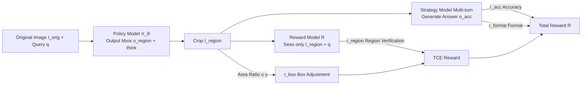

# ERGO: Efficient High-Resolution Visual Understanding for Vision-Language Models

**Conference**: ICLR 2026  
**OpenReview**: [https://openreview.net/forum?id=ehKzPoOReW](https://openreview.net/forum?id=ehKzPoOReW)  
**Code**: [github.com/nota-github/ERGO](https://github.com/nota-github/ERGO)  
**Area**: Multimodal VLM  
**Keywords**: High-resolution understanding, coarse-to-fine, thinking with images, reinforcement learning, visual token efficiency

## TL;DR
ERGO introduces a suite of RL rewards designed for efficiency (region-verification reward + box adjustment reward), enabling LVLMs to perform "reasoning-driven perception" on low-resolution coarse images. Even when target objects are downsampled to a point of indiscernibility, the model utilizes contextual cues to locate and re-encode the correct region. On the V* benchmark, ERGO outperforms Qwen2.5-VL-7B by 4.7 points while using only 23% of the visual tokens and achieving a 3x speedup in inference.

## Background & Motivation
**Background**: High-resolution image understanding is critical for LVLMs in real-world scenarios. Recent RL post-training has catalyzed the "thinking with images" paradigm, where models not only perform textual reasoning but also crop high-fidelity sub-images and output bounding box coordinates to reason within the visual modality, capturing fine-grained details.

**Limitations of Prior Work**: High-resolution inputs entail massive visual token counts, resulting in extreme computational overhead. A straightforward efficiency strategy is a two-stage "coarse-to-fine" approach: first using a downsampled coarse image to locate task-relevant regions, then re-encoding only those regions at original resolution. However, existing methods (e.g., DeepEyes, PixelReasoner) are "perception-driven reasoning"—they first precisely locate clearly visible targets before reasoning. Since they rarely encounter downsampled inputs during training, the first stage fails once the target object becomes blurred or indistinguishable after downsampling.

**Key Challenge**: Coarse images save tokens but make targets "indistinguishable"; maintaining clarity requires keeping all tokens, which sacrifices efficiency. The crux lies in whether the model can robustly identify informative regions when only coarse visual cues are available.

**Goal**: To train for explicit alignment with "visual processing efficiency," enabling the model to learn to locate correct regions even under low-resolution conditions where the target is indistinguishable.

**Core Idea**: The paradigm is shifted from "perception-driven reasoning" to "reasoning-driven perception." Multimodal context (e.g., "a straw is usually next to a coffee cup on the table") is used to infer where to look. The model is trained to tolerate perceptual uncertainty and appropriately expand its crop to cover ambiguous areas, a behavior induced by specifically designed RL rewards.

## Method

### Overall Architecture
ERGO is an RL post-training pipeline based on GRPO. The policy model $\pi_\theta$ (Qwen2.5-VL-7B) follows a two-stage multi-turn process: ① Given the original image $I_{orig}$ and a query $q$, the model outputs candidate bounding box coordinates $o_{region}$ and a thinking trajectory; ② $I_{region}=\text{crop}(I_{orig}, o_{region})$ is cropped from the original image based on these coordinates; ③ The model generates the final answer $o_{acc}$ based on historical interactions and the cropped region. The core innovation lies in the reward design, utilizing a frozen Qwen2.5-VL-72B as a Reward Model (RM) tailored for coarse-to-fine visual grounding reasoning.

### Key Designs
**1. Region-verification reward ($r_{region}$): Making cropped regions "self-sufficient."** Most thinking-with-images methods provide the original image to the RM, i.e., $R(\cdot|I_{orig}, I_{region}, q)$. This is suboptimal as the RM can "cheat" by looking at the original image, weakening the goal of making the crop independently sufficient. This is particularly fatal in coarse-to-fine scenarios where coarse images provide few cues. ERGO restricts the RM input to only the cropped region and the query: $o_{RM}\sim R(\cdot|I_{region}, q)$, and $r_{region}=\mathbb{1}[\text{match}(o_{RM}, o_{GT})]$. This transforms the complex task of "locating the optimal region" into "answering correctly with a single crop," forcing the policy model to select truly informative regions without requiring additional annotations.

**2. Box adjustment reward ($r_{box}$): Preventing degradation into "full-image cropping."** If only the region reward is used, the model might take a shortcut by always selecting the entire image (which is naturally self-sufficient), thus losing all efficiency. A step-function penalty is applied to excessively large crops: $r_{box}=\mathbb{1}\left[\frac{\text{Area}(I_{region})}{\text{Area}(I_{orig})}\le\gamma\right]$. Based on statistics from datasets like TreeVGR, VisCoT, V*, and VGR showing most ground truth regions occupy less than 60% of the image, the threshold is set to $\gamma=0.6$.

**3. TCE Reward Combination + Regular Rewards.** The region-verification and box adjustment rewards are combined into a primary reward $r_{TCE}=\alpha\cdot r_{region}+\beta\cdot r_{box}$ ($\alpha=1, \beta=0.5$, referred to as reward weighting). Additionally, two standard rewards are used: an accuracy reward $r_{acc}=\mathbb{1}[\text{match}(o_{acc}, o_{GT})]$ and a format reward $r_{format}$ to enforce the usage of `<think>`, `<answer>`, and `<zoom>` tags. The final total reward $R=r_{TCE}+r_{acc}+r_{format}$ is optimized via GRPO.

## Key Experimental Results

### Main Results
Using Qwen2.5-VL-7B-Instruct (Policy) + Qwen2.5-VL-72B-Instruct (Frozen RM), trained on 4×H100. Average scores across 6 high-resolution VQA benchmarks:

| Benchmark | Pixel Constraint | Ours (ERGO) | SOTA Baseline | Δ |
| :--- | :--- | :--- | :--- | :--- |
| Avg (6 Benches) | 1280×28×28 | **58.4** | MGPO (52.6) | +5.8 |
| Avg (6 Benches) | 640×28×28 | **55.2** | TreeVGR (49.2) | +6.0 |
| V* | 1280×28×28 | **83.8** | MiniO3 (81.2) | +2.6 |
| V* (vs. orig. 16k) | 640 | **81.7** | Qwen2.5-VL-7B (77.0) | +4.7 |

### Ablation Study
Ablation of reward designs (Average of 6 benchmarks):

| Configuration | Average Score | Description |
| :--- | :--- | :--- |
| Qwen2.5-VL-7B | 52.4 | Baseline |
| A: $r_{acc}$ only | 53.5 | Accuracy reward only |
| B: $r_{region}$ only | 51.4 | Region-verification reward only |
| C: + Box reward | 54.9 | Adding $r_{box}$ to prevent degradation |
| D: + Reward weighting | 55.3 | $\alpha/\beta$ weighting |
| E: ERGO (Full) | **58.4** | Full components including format reward |

### Key Findings
- **Significant Efficiency Gains**: On V* with a 640×28×28 constraint, ERGO uses only 1,025 visual tokens (compared to 4,471 for the original model under a 16,384 constraint). Inference latency is 1.61s vs 4.89s, representing a ~3x speedup with only a single tool call.
- **Pareto Optimality**: Under a 640 constraint, ERGO outperforms all baselines that use 1280 constraints while using fewer tokens.
- **Contextual Robustness**: In target occlusion experiments (where the target is covered by a black box), ERGO maintains the highest Target Coverage Score, proving it relies on surrounding visual/textual context rather than just memorizing target appearance.
- **Unbiased Box Prediction**: A fixed $\gamma$ does not bias the model toward a fixed size; it predicts large boxes for MMVP (where objects fill the frame) and small boxes for MME-RWL (where objects are small), adapting to data characteristics.
- **General Ability Preservation**: ERGO maintains or improves performance on general benchmarks like CV-Bench, MMVP, and Hallusion (e.g., CVBench-3D 73.0 $\rightarrow$ 80.3, Hallusion 47.1 $\rightarrow$ 52.3).

## Highlights & Insights
- **RM Input as a Design Variable**: Removing the original image and supplying only the cropped region to the RM acts as a lever to force "self-sufficient cropping." This is a clean and powerful conceptual contribution.
- **Evidence-Based Paradigm Shift**: The motivation is logically sound; the authors prove that "adding GT high-res sub-images does not degrade performance" while "existing models fail to locate targets at low resolution," establishing the necessity for reasoning-driven perception.
- **Direct Alignment of Efficiency**: Efficiency is not treated as a post-processing token-dropping step but is integrated directly into the training objective via rewards, allowing for flexible pixel constraints at inference.

## Limitations & Future Work
- Dependency on a 72B frozen RM for training increases computational costs and reproduction barriers.
- The threshold $\gamma=0.6$ is derived from dataset statistics and may require recalibration for domain-specific tasks where objects typically fill the entire frame.
- While optimized for single tool-call efficiency, the sufficiency of single-round cropping for extreme high-resolution or multi-target scenarios requiring iterative zooming remains to be fully validated.
- Rewards are based on 0/1 hard matching of ground truth answers; scalability for open-ended or long-form generation has not been extensively explored.

## Related Work & Insights
- **vs. DeepEyes / PixelReasoner**: These share the "thinking-with-images" approach but are perception-driven, failing during the first stage when targets are blurred in downsampled inputs. ERGO utilizes reasoning-driven perception to succeed via context.
- **vs. VisionThink**: VisionThink only decides whether to process the full high-res image; ERGO actively crops task-relevant sub-regions for finer token utilization.
- **vs. MGPO**: MGPO uses multiple rounds but a single inference phase; ERGO’s two-stage architecture with self-sufficiency rewards yields higher accuracy and better token economy.
- **vs. TreeVGR**: TreeVGR performs pure textual reasoning on bbox coordinates without visual re-encoding, making it inherently incompatible with coarse-to-fine; ERGO performs actual re-encoding of cropped regions.

## Rating
- Novelty: ⭐⭐⭐⭐ The shift to "reasoning-driven perception" and the specific RM input design are novel, representing the first clear demonstration of contextual reasoning's value for this task.
- Experimental Thoroughness: ⭐⭐⭐⭐⭐ Comprehensive evaluation across 6 high-res and 8 general benchmarks, including token/latency comparisons, reward ablations, and robustness analyses.
- Writing Quality: ⭐⭐⭐⭐ The transition from motivation to method and analysis is rigorous, supported by intuitive and powerful visualizations.
- Value: ⭐⭐⭐⭐⭐ Achieving higher precision with 3x speedup and 23% token usage offers massive practical value for deploying high-resolution LVLMs. Code is open-sourced.

<!-- RELATED:START -->

## Related Papers

- [\[ECCV 2024\] FlexAttention for Efficient High-Resolution Vision-Language Models](../../ECCV2024/multimodal_vlm/flexattention_for_efficient_high-resolution_vision-language_models.md)
- [\[CVPR 2026\] SenseSearch: Empowering Vision-Language Models with High-Resolution Agentic Search-Reasoning via Reinforcement Learning](../../CVPR2026/multimodal_vlm/sensesearch_empowering_vision-language_models_with_high-resolution_agentic_searc.md)
- [\[ICLR 2026\] Shuffle-R1: Efficient RL Framework for Multimodal Large Language Models via Data-centric Dynamic Shuffle](shuffle-r1_efficient_rl_framework_for_multimodal_large_language_models_via_data-.md)
- [\[ICLR 2026\] One Patch Doesn't Fit All: Adaptive Patching for Native-Resolution Multimodal Large Language Models](one_patch_doesnt_fit_all_adaptive_patching_for_native-resolution_multimodal_larg.md)
- [\[ICLR 2026\] EventFlash: Towards Efficient MLLMs for Event-Based Vision](eventflash_towards_efficient_mllms_for_event-based_vision.md)

<!-- RELATED:END -->
