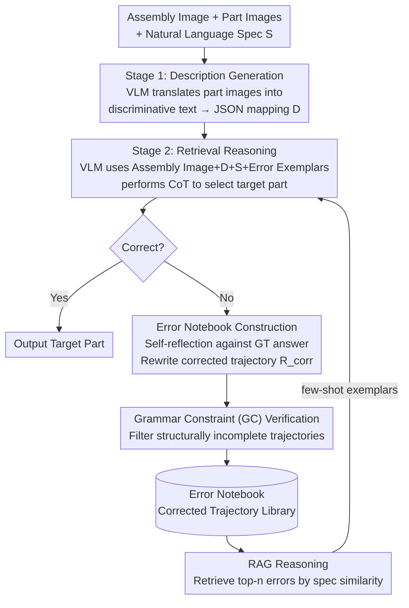

# Error Notebook-Guided, Training-Free Part Retrieval in 3D CAD Assemblies via Vision-Language Models

**Conference**: ICLR 2026  
**arXiv**: [2509.01350](https://arxiv.org/abs/2509.01350)  
**Code**: None  
**Area**: Multimodal VLM  
**Keywords**: CAD Part Retrieval, Test-time Adaptation, Error Notebook, RAG, Training-free VLM Inference

## TL;DR
A training-free two-stage VLM framework is proposed that uses an Error Notebook to record corrected reasoning trajectories combined with RAG for test-time adaptation. On specification-driven part retrieval tasks for 3D CAD assemblies, GPT-4o accuracy improves from 41.7% to 65.1% (+23.4%), with a further 4.5% gain via a Grammar Constraint verifier.

## Background & Motivation
Specification-driven part retrieval in complex CAD assemblies is a core requirement for automated engineering tasks. However, directly processing this task with LLMs/VLMs faces key challenges:

**Sequence length explosion**: CAD model metadata (such as STEP files) often exceeds model token limits.

**Non-natural language input**: CAD metadata consists of structured technical data rather than natural language.

**Inability to fine-tune**: High-performance models like GPT/Gemini typically do not provide fine-tuning interfaces.

**Difficulty in fine-grained reasoning**: Even when converting STEP data into images, off-the-shelf models frequently misidentify parts because the task requires precise reasoning about part relationships and attributes.

**Core Idea**: Draw inspiration from training methods—where paired error-reasoning chains and corrections teach models to reflect and fix errors—but operationalize this during inference. Build an Error Notebook to store corrected reasoning trajectories and use RAG to retrieve similar cases as few-shot exemplars to guide model reasoning without any weight updates.

## Method

### Overall Architecture
The entire system is a two-stage VLM pipeline requiring no weight updates. First, one VLM translates each part's image into a discriminative text description. Second, a VLM performs CoT reasoning using the assembly drawing, descriptions, and natural language specification to pick the target part. Central to this is the Error Notebook, which stores corrected trajectories from past failures (after structural validation via Grammar Constraints). During inference, relevant entries are retrieved by specification similarity as few-shot exemplars. This creates a loop where failed samples are reflected upon, corrected, validated, and stored to inform future reasoning.

### Key Designs

**1. Two-stage VLM Strategy: Bypassing the issue of STEP files being too long for context windows**

Original STEP metadata for CAD assemblies often exceeds token limits and is structured technical data. This work splits the task into two steps. Stage 1 takes the assembly image $\mathcal{I}_{assembly}$ and individual part image $\mathcal{I}_{P_i}$ to generate a concise description $d_i = f_{desc}(\mathcal{I}_{assembly}, \mathcal{I}_{P_i}, prompt_{desc})$. All descriptions are organized into a JSON mapping $\mathcal{D}$. Stage 2 performs retrieval $\hat{\mathcal{P}}^* = f_{retr}(\mathcal{I}_{assembly}, \mathcal{D}, S, prompt_{retr})$. Long geometric metadata is thus compressed into readable text.

**2. Error Notebook Construction: Moving "Reflection + Correction" from training to inference**

For samples where the initial inference fails, the VLM reflects on the standard answer and rewrites a correct reasoning chain. Given the previous error $R^{prev}$ and correct part $\mathcal{P}^{*(gt)}$, the model generates a corrected trajectory $R^{corr}$ consisting of: correct steps preserved until the error point, reflection text (TR) identifying the error, and corrected steps leading to the answer: $R^{corr} = R^{prev}_{sub} \oplus TR \oplus R^g$.

**3. Grammar Constraint (GC) Verifier: Filtering substandard trajectories to ensure notebook quality**

Self-correction can produce incomplete or contradictory trajectories. A deterministic verifier checks structural integrity: existence of a final answer line, provision of at least one filename, and ensuring predicted filenames belong to the allowed set. Two modes are used: strict (sGC) requiring explicit "Final Answer:" tags, and relaxed (rGC) allowing missing tags if the conclusion is correct. Relaxed mode is crucial for smaller models.

**4. RAG Reasoning: Retrieving errors by specification similarity for test-time few-shot adaptation**

During inference, the system calculates similarity between the current query and notebook entries. The top-n most similar corrected trajectories are used as few-shot exemplars in the prompt. This upgrades traditional "knowledge-augmented" RAG to "reasoning-augmented" RAG.

### Loss & Training
The framework is entirely training-free. VLMs are called via API with exponential backoff (up to 3 retries). The dataset is built from the Fusion 360 Gallery Assembly Dataset (archive a1.0.0_00, 752 assemblies). GPT-4o was used to generate descriptions and assembly specifications, followed by manual filtering to remove ambiguous or indistinguishable cases.

## Key Experimental Results

### Main Results

**Model performance on the human preference dataset:**

| Model | W/o E-Notebook | W/ E-Notebook | W/ E-Notebook + sGC |
|------|-------------|-------------|-----------------|
| GPT-4o (Omni) | 41.7% | 65.1% (+23.4) | 66.8% (+25.1) |
| GPT-4o mini | 19.3% | 35.4% (+16.1) | 36.4% (+17.1) |
| Gemini 2.5 Pro | 54.0% | 59.5% (+5.5) | 62.1% (+8.1) |
| Gemini 2.0 Flash | 44.2% | 56.8% (+12.6) | 57.0% (+12.8) |

**Comparison with other training-free baselines (GPT-4o):**

| Method | Overall↑ | <10 Parts | 10-20 Parts |
|------|----------|---------|-----------|
| Standard few-shot | 37.7% | 42.9% | 29.4% |
| Self-consistency | 54.8% | 61.7% | 42.6% |
| **E-Notebook (Ours)** | **65.1%** | **75.5%** | **42.6%** |

### Ablation Study
- **Exemplar Count**: Accuracy varies only slightly (~3% fluctuation) between 1 and 50 exemplars, suggesting the existence of the Error Notebook is more important than the quantity.
- **CoT vs Non-CoT**: For simple assemblies (<10 parts), direct answers are sometimes better; for complex assemblies (10-50 parts), CoT consistently outperforms non-CoT.
- **Open-source Models**: Qwen2-VL-2B improved from 0.8% to 6.4%, and further to 8.4% when using an Error Notebook built by GPT-4o.
- **Cross-model GC**: A 2B model using a notebook from GPT-4o trailed GPT-4o mini by only 4 points in the <10 parts category.

### Key Findings
- Gains from the Error Notebook are consistent across all models and part counts, including the >50 part category.
- Strict GC mode can be too harsh for small models due to missing specific tags.
- Error Notebooks can serve as a "distillation" mechanism for high-quality reasoning traces from strong models to lightweight ones.
- Additional inference latency is nearly negligible (8.04s vs 6.50s), and correction steps remain lightweight.

## Highlights & Insights
- Migrating the concept of "error reflection + correction" from training to the inference phase is both novel and practical.
- The two-stage VLM strategy effectively solves the context length issue for CAD data.
- The cross-model Error Notebook demonstrates a new training-free paradigm for knowledge transfer.

## Limitations & Future Work
- Error Notebook quality depends on the initial model's capability to reflect and correct.
- Currently only validated on part retrieval; applicability to other tasks like assembly planning needs exploration.
- The dataset size (752 assemblies) is relatively small.
- The two-stage approach increases API costs, particularly Stage 1 which requires separate calls for every part.

## Related Work & Insights
- **Rel. to Self-Consistency**: Error Notebook is more effective by using high-quality corrected exemplars rather than simple voting.
- **Rel. to RAG**: Transitions from "knowledge augmentation" to "reasoning augmentation" by retrieving reasoning trajectories.
- **Insight**: The Error Notebook paradigm can be generalized to any VLM application requiring complex reasoning.

## Rating
- Novelty: ⭐⭐⭐⭐ 
- Experimental Thoroughness: ⭐⭐⭐⭐ 
- Writing Quality: ⭐⭐⭐⭐ 
- Value: ⭐⭐⭐⭐

<!-- RELATED:START -->

## Related Papers

- [\[ICLR 2026\] Flatness-Guided Test-Time Adaptation for Vision-Language Models](flatness_guided_test-time_adaptation_for_vision-language_models.md)
- [\[CVPR 2026\] Uncertainty-guided Compositional Alignment with Part-to-Whole Semantic Representativeness in Hyperbolic Vision-Language Models](../../CVPR2026/multimodal_vlm/uncertainty-guided_compositional_alignment_with_part-to-whole_semantic_represent.md)
- [\[ICLR 2026\] CAD-Tokenizer: Towards Text-Based CAD Prototyping via Modality-Specific Tokenization](cad-tokenizer_towards_text-based_cad_prototyping_via_modality-specific_tokenizat.md)
- [\[ICLR 2026\] GPT4Scene: Understand 3D Scenes from Videos with Vision-Language Models](gpt4scene_understand_3d_scenes_from_videos_with_vision-language_models.md)
- [\[ICLR 2026\] Pay Less Attention to Function Words for Free Robustness of Vision-Language Models](pay_less_attention_to_function_words_for_free_robustness_of_vision-language_mode.md)

<!-- RELATED:END -->
