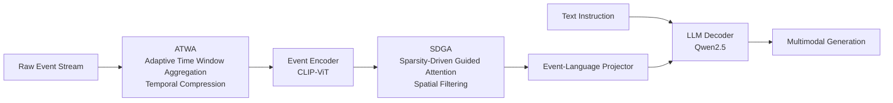

# EventFlash: Towards Efficient MLLMs for Event-Based Vision

**Conference**: ICLR 2026  
**OpenReview**: [https://openreview.net/forum?id=QuvGqzLwf6](https://openreview.net/forum?id=QuvGqzLwf6)  
**Code**: [https://github.com/XduSyL/EventFlash](https://github.com/XduSyL/EventFlash)  
**Area**: Multimodal Large Language Models / Event-based Vision  
**Keywords**: Event Camera, MLLM, Spatiotemporal Token Sparsification, Long-sequence Understanding, Curriculum Learning

## TL;DR
EventFlash leverages the inherent spatiotemporal sparsity of event streams by designing two token sparsification modules: Adaptive Time Window Aggregation and Sparsity-Driven Guided Attention. These modules increase inference throughput by 12.4× and extend the processable event bin capacity from 5 (in EventGPT) to 1000.

## Background & Motivation
**Background**: Event cameras output pixel-level brightness changes asynchronously with microsecond temporal resolution and high dynamic range, making them ideal for high-speed motion and low-light scenarios. Current methods for extending MLLMs to event vision typically convert event streams into dense, image-like representations before feeding them into off-the-shelf models like LLaVA or Qwen (e.g., EventGPT, EventVL, LLaFEA).

**Limitations of Prior Work**: This "densification" paradigm completely ignores the spatiotemporal sparsity of event streams—many pixel locations contain no events, and forcing them into dense tokens introduces massive redundancy. This leads to two consequences: extreme computational overhead and severe limitations on the length of processable event sequences (EventGPT can only handle 5 bins, effectively capturing only a "moment" and precluding long-range understanding).

**Key Challenge**: Redundancy in event streams differs from video. Video redundancy stems from spatial repetition on a regular patch grid, whereas event streams consist of irregularly distributed, sparse spatiotemporal points with high density variance. Redundancy arises from non-uniform temporal sampling, making existing video token sparsification methods expensive and ineffective.

**Goal**: Rather than prioritizing peak inference accuracy, this work specifically addresses three challenges for efficient MLLMs: (i) **Temporal Inefficiency**: Microsecond resolution generates massive tokens over long periods; (ii) **Spatial Inefficiency**: Sparsity leads to numerous empty tokens receiving uniform attention; (iii) **Data Gap**: Existing instruction datasets are private, limited in scenarios, and contain only short sequences.

**Core Idea**: `Density-aware Spatiotemporal Token Sparsification`—compressing tokens via adaptive window aggregation in the temporal dimension and filtering empty/low-density regions via density-guided attention in the spatial dimension, coupled with a short-to-long curriculum learning strategy and a self-constructed dataset of 500,000 instructions named EventMind.

## Method

### Overall Architecture
EventFlash is an end-to-end event MLLM pipeline consisting of five modules: raw event streams are first processed by **Adaptive Time Window Aggregation (ATWA)** to slice continuous streams into fine bins and adaptively merge them based on similarity/density. These compressed bins are sent to an **Event Encoder** (CLIP-ViT) to extract semantic embeddings. In parallel, **Sparsity-Driven Guided Attention (SDGA)** filters informative tokens and suppresses blank areas in the spatial dimension. Subsequently, an **Event-Language Projector** aligns event tokens to the text space, which are then fed into the **LLM Decoder** (Qwen2.5) along with text tokens for generation. The entire system is trained using a three-stage curriculum learning strategy from short to long sequences.

### Key Designs

**1. Adaptive Time Window Aggregation (ATWA): Eliminating temporal redundancy via two-level density-guided merging.** ATWA compresses the explosion of temporal tokens from microsecond streams while preserving motion dynamics. The first level performs "Density-Guided Physical Merging": slicing the stream into fine bins, treating each as a spatiotemporal point process with polarity, characterized by an intensity function $\lambda_B(x,y,t,p)=\sum_{e_n\in B} f(p_n)\cdot \exp\!\big(-\frac{(x-x_n)^2}{2\sigma_x^2}-\frac{(y-y_n)^2}{2\sigma_y^2}-\frac{(t-t_n)^2}{2\sigma_t^2}\big)$. The distance between adjacent bins is the norm of the intensity difference $D(B_i,B_{i+1})=\lVert\lambda_{B_i}-\lambda_{B_{i+1}}\rVert_2$; bins are iteratively merged into meta-windows if the distance is below a threshold $\tau$. The second level performs "Semantic-Aware Merging": each window passes through ViT to obtain a CLS token $z_i$, and cosine similarity $S_i=\frac{z_i^\top z_{i+1}}{\lVert z_i\rVert\lVert z_{i+1}\rVert}$ is calculated. A normalized density factor $r_i$ yields the final merging score $A_i=S_i\cdot\exp(-\alpha\cdot r_i)$—windows with higher semantic similarity and lower density are more likely to be merged.

**2. Sparsity-Driven Guided Attention (SDGA): Modulating attention by density to eliminate blank tokens.** After temporal compression, spatial redundancy remains due to non-uniform event distribution. SDGA applies standard multi-head attention $\text{Attention}(Q,K,V)=\text{softmax}(\frac{QK^\top}{\sqrt{d_k}})V$ to patch-level features $\{x_j\}$, but injects density signals into the scores: the event density $D_j$ of each token region is transformed via a "Linear + GELU" density encoding unit into a soft modulation signal $f(D_j)=\text{GELU}(\text{Linear}(D_j))$. This is added to the attention scores $\tilde A_{ij}=\frac{Q_iK_j^\top}{\sqrt{d_k}}+f(D_j)$, biasing the model toward denser regions. Finally, a Token Selector ranks responses and discards low-importance tokens: $\hat x_i=\text{TokenSelector}\big(\sum_j \text{softmax}(\tilde A_{ij})\cdot V_j\big)$.

**3. Short-to-Long Curriculum Learning: Scaling from alignment to long-range reasoning.** Unlike the stage-wise modular training of EventVL/EventGPT, EventFlash progresses by sequence duration. Stage 1 trains the event-language alignment (learning rate $2\times10^{-3}$, batch 64) using 200k 0–50 ms short sequences for basic cross-modal understanding. Stage 2 unfills all parameters (learning rate $2\times10^{-5}$) using 110k 50–5000 ms medium sequences to learn complex actions and event QA. Stage 3 utilizes 190k 5000–20000 ms long sequences for rich scene description and open-ended generation.

**4. EventMind Dataset: Closing the gap in long-sequence, multi-scenario instruction data.** To support curriculum training, a large-scale dataset of 500k instructions across 7 task types was constructed. Raw events come from real captures (DSEC, N-ImageNet, HARDVS, E2VID) and synthesis (using the V2E simulator to convert Kinetics-700 and UCF-101 videos, pre-filtered for quality using GPT-4o based on captions). Text instructions are derived via two paths: refining existing labels with GPT-4o to remove static attributes (texture/color) and automatically generating from video using Qwen-VL-Max followed by human quality control.

## Key Experimental Results

### Main Results
Comparison with video MLLMs and event MLLMs on EventMind and EventChat-Sub (selection):

| Model | Parameters | Max Bins | Throughput (Token/s) | GDC | FGQA | HAQA | MCQA |
|------|------|----------|---------------|-----|------|------|------|
| Qwen2.5-VL | 3B | 768 | – | 20.6 | 41.7 | 23.8 | 34.6 |
| VideoChat2-Flash | 7B | 1000 | – | 36.2 | 41.9 | 18.9 | 48.2 |
| EventGPT-7B | 7B | 5 | 42.2 | – | – | – | – |
| EventFlash-Zero | 3B | 1000 | 2.3 | 45.3 | 60.4 | 85.0 | 58.2 |
| **EventFlash-3B** | 3B | 1000 | **28.5** | 46.8 | 61.1 | 84.9 | 60.0 |
| **EventFlash-7B** | 7B | 1000 | 24.0 | **52.3** | **64.2** | **87.6** | **63.1** |

EventFlash outperforms all video MLLMs and EventGPT across all four tasks. Compared to EventGPT's 5-bin limit, it handles 1000 bins (200× capacity). The 3B version's throughput of 28.5 Token/s is **12.4×** faster than the non-sparse EventFlash-Zero (2.3).

### Ablation Study
Component ablation (S=Spatial Sparsity, T=Temporal Sparsity):

| Model | S | T | Token/s | GDC | FGQA | HAQA | MCQA |
|------|---|---|---------|-----|------|------|------|
| Baseline | ✗ | ✗ | 2.3 | 45.3 | 60.4 | 85.0 | 58.2 |
| A | ✓ | ✗ | 5.3 (2.3×) | 46.3 | 61.2 | 85.1 | 59.6 |
| B | ✗ | ✓ | 14.0 (6.1×) | 47.1 | 60.6 | 83.8 | 60.3 |
| Ours | ✓ | ✓ | 28.5 (12.4×) | 46.8 | 61.1 | 84.9 | 60.0 |

Temporal sparsification contributes more to speedup (6.1×) than spatial sparsification (2.3×). The 10 ms aggregation interval is the optimal point for accuracy and efficiency.

### Key Findings
- Temporal redundancy is the primary bottleneck in event streams; combining temporal and spatial sparsification yields a 12.4× gain.
- Massive token compression does not degrade accuracy and sometimes improves it, suggesting the removed tokens were indeed redundant.
- EventFlash maintains fine-grained descriptive accuracy in extreme scenarios where frame cameras fail, such as high-speed puppet impacts or night-time streets.

## Highlights & Insights
- **Recognizing the fundamental difference between event and video redundancy** is the key insight; building sparsification on event density rather than regular grids is crucial.
- **Combining physical intensity modeling with semantic similarity** for temporal merging is more principled than simple frame-based merging.
- **The pragmatic focus on efficiency over pure accuracy** is valuable: long-range event understanding (1000 bins) is fundamentally impossible for models like EventGPT; treating throughput and sequence length as primary objectives enables real-world applications in surveillance and autonomous driving.

## Limitations & Future Work
- Evaluation primarily relies on the self-constructed EventMind dataset; while EventChat-Sub results are reported, the lack of more independent third-party benchmarks limits absolute comparability.
- Open-ended tasks (GDC, FGQA) use GPT-4o as an LLM-Judge, which may introduce model bias.
- The 7B version throughput (24.0) is lower than the 3B version (28.5), and the relationship between sparsification gains and model scale requires more discussion.
- Synthetic events from V2E may have gaps compared to the noise/trigger characteristics of real event cameras.

## Related Work & Insights
- **Event MLLMs**: EventGPT (first event MLLM, dense tokens), EventVL (RGB+Event fusion), LLaFEA (frame-event region grounding). EventFlash differs by treating "sparsity" as a feature rather than a burden.
- **MLLM Token Sparsification**: While video methods assume grid redundancy, this work demonstrates that irregular event streams require custom sparsification.
- **Insight**: When input modalities have strong structural priors (like spatiotemporal sparsity), it is better to embed these priors directly into token design rather than using generic densification pipelines.

## Rating
- **Novelty**: ⭐⭐⭐⭐ Systematically embedding event sparsity into tokenization (physical + semantic + density criteria) is a solid, well-positioned approach.
- **Experimental Thoroughness**: ⭐⭐⭐⭐ Includes 3B/7B comparisons and video vs. event MLLM benchmarks, though depends heavily on self-constructed data.
- **Writing Quality**: ⭐⭐⭐⭐ Clear mapping between challenges and modules; complete formulas and diagrams.
- **Value**: ⭐⭐⭐⭐ Addresses the real bottleneck of long-sequence understanding (5 bin → 1000 bin) with significant throughput gains.

<!-- RELATED:START -->

## Related Papers

- [\[CVPR 2026\] RE-VLM: Event-Augmented Vision-Language Model for Scene Understanding](../../CVPR2026/multimodal_vlm/re-vlm_event-augmented_vision-language_model_for_scene_understanding.md)
- [\[ICLR 2026\] Patch-as-Decodable-Token: Towards Unified Multi-Modal Vision Tasks in MLLMs](patch-as-decodable-token_towards_unified_multi-modal_vision_tasks_in_mllms.md)
- [\[CVPR 2026\] Learning to See through Illumination Extremes with Event Streaming in Multimodal Large Language Models](../../CVPR2026/multimodal_vlm/learning_to_see_through_illumination_extremes_with_event_streaming_in_multimodal.md)
- [\[CVPR 2026\] Parameter-Efficient Adaptation for MLLMs via Implicit Modality Decomposition](../../CVPR2026/multimodal_vlm/parameter-efficient_adaptation_for_mllms_via_implicit_modality_decomposition.md)
- [\[CVPR 2025\] EventGPT: Event Stream Understanding with Multimodal Large Language Models](../../CVPR2025/multimodal_vlm/eventgpt_event_stream_understanding_with_multimodal_large_language_models.md)

<!-- RELATED:END -->
