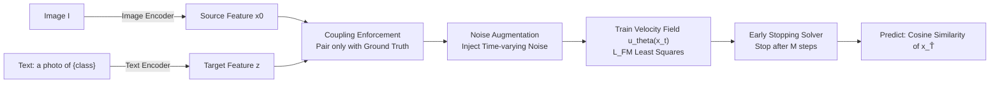

# Exploring Cross-Modal Flows for Few-Shot Learning

**Conference**: ICLR 2026  
**OpenReview**: [https://openreview.net/forum?id=ks6Gg8nd0y](https://openreview.net/forum?id=ks6Gg8nd0y)  
**Code**: [HKUST-LongGroup/FMA](https://github.com/HKUST-LongGroup/FMA)  
**Area**: Multimodal Vision-Language Models / Few-Shot Learning  
**Keywords**: Few-Shot Learning, CLIP, PEFT, Flow Matching, Cross-Modal Alignment, Velocity Field  

## TL;DR
This work reformulates image-to-text alignment from the "one-step adjustment" characteristic of existing PEFT methods into a "multi-step iterative correction" via Flow Matching. By employing a plug-and-play velocity field, it gradually aligns entangled cross-modal distributions on difficult datasets, significantly improving few-shot classification.

## Background & Motivation
**Background**: Pre-trained VLMs like CLIP and ALIGN achieve impressive zero-shot alignment by encoding images and text into a shared space via contrastive learning. However, inherent modal complexity prevents perfect alignment across all scenarios, necessitating fine-tuning for few-shot downstream tasks. Due to the high cost of full fine-tuning, the community has developed three main categories of Parameter-Efficient Fine-Tuning (PEFT): Prompt Tuning (CoOp/CoCoOp, moving text features), Adapter-based (CLIP-Adapter, adding MLPs after the image encoder), and LoRA-based (CLIP-LoRA, interpolating low-rank matrices in dual encoders).

**Limitations of Prior Work**: The authors identify that regardless of the category, existing PEFT methods are essentially **one-step adjustments**—during inference, a single forward pass maps input features directly to the target location. Using linear probing as a baseline to isolate "data-driven gains" and defining "dataset difficulty" by CLIP RN50 zero-shot performance, they find that PEFT's advantage over linear probing is evident on simple sets (OxfordPets) but nearly vanishes on difficult sets (FGVCAircraft).

**Key Challenge**: On difficult datasets, image-text distributions are highly entangled, requiring complex non-linear transformations for alignment that one-step mappings fail to model effectively.

**Goal**: To transform cross-modal alignment into an iterative multi-step process, where each step only needs to predict a local update, thereby "correcting" difficult distributions step-by-step.

**Core Idea**: **[Multi-step Alignment]** Inspired by Flow Matching (FM) theory—primarily used in image generation—which learns a velocity field to transport a source distribution to a target distribution along a multi-step trajectory. The authors treat **image features as the source distribution and class-name text features as the target distribution**, training a velocity field to achieve "image feature → corresponding text feature" transport for classification. Direct application of FM presents two hurdles: (1) standard FM does not guarantee class correspondence, potentially transporting an image to the wrong class text; (2) the inference goal of generative FM is "reaching the target distribution," whereas classification only requires being "closer to the correct class than incorrect ones." FMA addresses these via three specific designs.

## Method

### Overall Architecture
FMA (Flow Matching Alignment) consists of three stages: First, a pre-trained VLM (e.g., zero-shot CLIP, or any PEFT like CoOp/CLIP-LoRA) encodes images into source features $x_0$ and "a photo of {class}" templates into target text features $z$. Next, a velocity field $u_\theta^t$ is trained in the shared space to learn the transport of image features toward their corresponding text features along linear trajectories. During inference, an "Early Stopping Solver" iteratively transports test image features and stops when they are sufficiently discriminative for classification, using intermediate features to calculate cosine similarity with all class texts. The velocity field only takes features from the shared space and is independent of specific feature extraction methods, making it a **plug-and-play** multi-step correction module.

### Key Designs

**1. Coupling Enforcement: Learning "Classification Direction" instead of "Average Direction".** Standard FM training involves random pairs of $x_0$ and $z$, interpolating $x_t = tz + (1-t)x_0$ and regressing the conditional velocity $v_t(x_t|z) = z - x_0$. The resulting marginal velocity $v_t(x_t)$ integrates over all possible $z$, pushing image features toward the **average of all text features**, causing misclassification. The authors propose: given $x_0$, **only sample the text feature $z_c$ corresponding to its ground-truth class**. Since small datasets are sparse in high-dimensional manifolds and trajectories are approximately non-intersecting, a unique $z$ exists for a given $x_t$. Thus, the marginal velocity reduces to the conditional velocity $v_t(x_t) = v_t(x_t|z_c)$ (Proposition 1). This ensures image features move toward the correct class, theoretically guaranteeing $x_1 = z_c$ (Proposition 2).

**2. Noise Augmentation: Revitalizing Data Sparsity with Schrödinger Bridge Perturbations.** While Coupling Enforcement is elegant, it causes data scarcity—each image pairs with only one target text, reducing training pairs from $N^2$ to $N$. Large areas of the velocity field's domain remain unsampled. To fix this, the authors inject **time-varying Gaussian noise** into intermediate features $x_t$, obtaining $\hat{x}_t \sim \mathcal{N}(\hat{x}_t \mid x_t,\, t(1-t)\sigma^2(x_t))$, where $\sigma^2(x_t)$ is the per-dimension variance. This $t(1-t)$ variance profile is zero at both ends and maximal in the middle, inspired by Schrödinger Bridges—adding non-zero variance to conditional probability paths fills the neighborhood of trajectories, preventing distribution collapse (Score-based approach) and yielding more accurate velocity estimates. The ground-truth direction for augmented features becomes $v_t(\hat{x}_t|z_c) = \frac{z_c - \hat{x}_t}{1-t}$.

**3. Early Stopping Solver (ESS): Preventing Alignment from Hurting Classification.** In vanilla FM, an ODE solver (e.g., Euler) iterates $x_{t+h} = x_t + h\cdot u_\theta^t(x_t)$ over the full range $[0,1]$ to get $x_1$. However, the authors observe a critical discrepancy: as $t \to 1$, while the distance to the target text monotonically decreases, classification accuracy **increases then decreases**—imperfect velocity fields may push features toward incorrect classes in late stages (Figure 5). Since classification only requires "sufficient discriminability," the authors use a fixed step size $h$ and stop after a constant $M$ steps at $\hat{T} = h\cdot M$. $M$ is determined via a validation set. This saves inference time and mitigates the risk of late-stage misdirection.

## Key Experimental Results

### Main Results (11 Datasets, based on CLIP-LoRA + ViT-B/16)
FMA trains a velocity field (default 6 ResNet blocks, $h=0.1$) on top of features from CLIP-LoRA without additional data. Comparing across 1/4/16-shot settings against 8 SOTAs including CoOp, CLIP-Adapter, and CLIP-LoRA, FMA achieves the best performance on most datasets. Notably, **gains on difficult datasets are significantly larger than on simple ones**, validating the core argument for multi-step refinement.

### Plug-and-Play Generalization (Average over 5 Backbones)

| Backbone | D(Adapt) | +FMA | E(Adapt) | +FMA | D(Harmonic) | +FMA |
|---|---|---|---|---|---|---|
| CLIP | 48.9 | **68.9** | 78.8 | **87.6** | 48.9 | **57.5** |
| CoOp | 71.4 | **74.0** | 87.1 | **87.9** | 54.8 | **55.6** |
| CoCoOp | 64.1 | **68.5** | 85.0 | **87.3** | 55.9 | **58.2** |
| CLIP-Adapter | 62.4 | **67.9** | 86.6 | **87.4** | 53.6 | **56.0** |
| CLIP-LoRA | 76.1 | **77.8** | 88.2 | **88.8** | 57.1 | **58.4** |

FMA improves performance across all backbones. The gain on zero-shot CLIP for difficult sets (48.9 → 68.9, +20.0) is the most substantial. Meanwhile, generalization (cross-dataset transfer) metrics remain stable, showing that FMA does not sacrifice robustness.

### Key Findings
- **Difficult Datasets are the Primary Battleground**: Relative gains on hard sets (Aircraft/EuroSAT/DTD/SUN/Cars) are consistently larger, proving the value of multi-step correction for entangled distributions.
- **Early Stopping is Vital**: The accuracy curve (Figure 5) proves that running the full FM trajectory can transport features to the wrong text; ESS provides both speed and precision.
- **Method Agnostic**: Benefits stack on everything from zero-shot CLIP to various PEFTs, validating the design requiring only shared-space features.

## Highlights & Insights
- **unified-perspective**: Abstracting Prompt/Adapter/LoRA as "one-step feature movement" provides a powerful explanatory framework for their failure on difficult datasets.
- **Cross-Domain Transfer**: Ingeniously migrating the "multi-step is easier to learn than one-step" intuition from generative FM to discriminative classification, while honestly addressing the objective discrepancy.
- **Theoretical Integration**: Coupling Enforcement is not just a trick; it ensures marginal velocity equals conditional velocity via Dirac-form probability paths, providing mathematical grounding for Proposition 1 & 2.

## Limitations & Future Work
- **The early stopping step $M$** is determined by grid search on a validation set as a global constant; sample-adaptive $t$ is the ideal solution left for future work.
- **Non-crossing Assumption**: The proof for "marginal = conditional" relies on high-dimensional sparsity and small data scales. Whether this holds for extremely large-scale data or massive label spaces remains to be seen.
- **Overhead**: FMA introduces a secondary training phase for the velocity network and multi-step inference cost, which, though mitigated by ESS, is not zero-cost.

## Related Work & Insights
- **Few-shot VLM Adaptation**: FMA complements CoOp (Prompt), CLIP-Adapter (Adapter), and CLIP-LoRA (LoRA) by acting as a "multi-step refiner" on top of them.
- **Flow Matching / Diffusion**: Extends the noise-to-data generative paradigm to a feature-to-feature discriminative paradigm, utilizing Schrödinger bridges for augmentation.
- **Inspiration**: This suggests a general strategy—for any task involving "aligning representation A to B" (retrieval, domain adaptation), if one-step mapping suffices poorly, consider a multi-step iterative correction with task-specific truncation strategies.

## Rating
- **Novelty**: ⭐⭐⭐⭐⭐ First to unify PEFT as "one-step" and introduce Flow Matching to few-shot discriminative tasks.
- **Experimental Thoroughness**: ⭐⭐⭐⭐ Solid validation across 11 datasets and 5 backbones; more analysis on adaptive stopping would be welcome.
- **Writing Quality**: ⭐⭐⭐⭐ Clear motivation (one-step → failure → multi-step → two hurdles → three designs) with well-integrated propositions.
- **Value**: ⭐⭐⭐⭐ Plug-and-play and effective on difficult datasets; offers a new paradigm for cross-modal alignment.

<!-- RELATED:START -->

## Related Papers

- [\[ICCV 2025\] Causal Disentanglement and Cross-Modal Alignment for Enhanced Few-Shot Learning](../../ICCV2025/multimodal_vlm/causal_disentanglement_and_cross-modal_alignment_for_enhanced_few-shot_learning.md)
- [\[CVPR 2026\] FlowComposer: Composable Flows for Compositional Zero-Shot Learning](../../CVPR2026/multimodal_vlm/flowcomposer_composable_flows_for_compositional_zeroshot_learning.md)
- [\[ICLR 2026\] Preserve and Sculpt: Manifold-Aligned Fine-tuning of Vision-Language Models for Few-Shot Learning](preserve_and_sculpt_manifold-aligned_fine-tuning_of_vision-language_models_for_f.md)
- [\[ICLR 2026\] SpectralGCD: Spectral Concept Selection and Cross-modal Representation Learning for Generalized Category Discovery](spectralgcd_spectral_concept_selection_and_cross-modal_representation_learning_f.md)
- [\[ICLR 2026\] FlowBind: Efficient Any-to-Any Generation with Bidirectional Flows](flowbind_efficient_any-to-any_generation_with_bidirectional_flows.md)

<!-- RELATED:END -->
