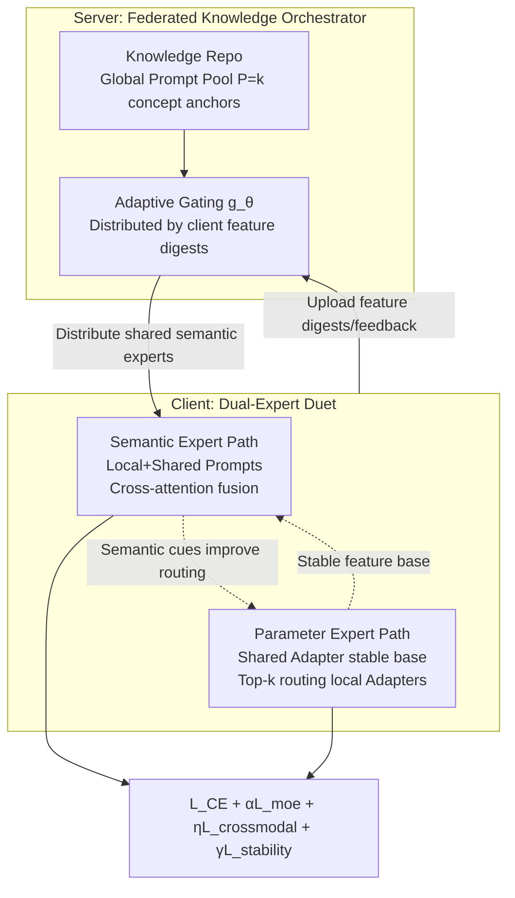

# Fed-Duet: Dual Expert-Orchestrated Framework for Continual Federated Vision-Language Learning

**Conference**: ICLR 2026  
**OpenReview**: [https://openreview.net/forum?id=Jk8g1OxyZY](https://openreview.net/forum?id=Jk8g1OxyZY)  
**Code**: Open-sourced (labeled as FedDuet in paper)  
**Area**: Multimodal VLM / Federated Continual Learning  
**Keywords**: Federated Continual Learning, CLIP, Vision-Language Models, Mixture-of-Experts, Parameter-Efficient Fine-Tuning, Catastrophic Forgetting

## TL;DR
Fed-Duet decouples VLM adaptation in federated continual learning into two complementary pathways: "semantic experts (prompts) + parameter experts (adapters)". It utilizes a server-side knowledge orchestrator for adaptive distribution of shared semantic experts and client-side cross-attention gating to fuse local/shared experts. Combined with routing consistency and expert stability losses, the framework mitigates forgetting while preserving cross-modal alignment in non-IID and streaming task scenarios.

## Background & Motivation
- **Background**: Pre-trained VLMs like CLIP provide strong multimodal representation capabilities for Federated Learning (FL). Due to large model sizes, the community generally uses Parameter-Efficient Fine-Tuning (PEFT, e.g., prompt-tuning / adapter-tuning) to minimize communication costs.
- **Limitations of Prior Work**: Real-world edge environments involve **continually evolving streaming data** and **non-IID** clients, leading to the Federated Continual Learning (FCL) paradigm. Existing solutions struggle: traditional FCL methods are single-modal and rely on full model updates, which are computationally expensive and destroy CLIP's cross-modal alignment; simply applying single PEFT strategies to FCL results in poor performance.
- **Key Challenge**: (1) **Adaptation imbalance**—high-level prompts fail to capture fine-grained client characteristics, while low-level adapters weaken global semantic consistency; (2) **Cross-modal misalignment**—aggregating sparse, heterogeneous PEFT updates across clients disrupts the inherent image-text alignment of VLMs. Existing MoE-for-FCL works (e.g., MoAFCL) only apply MoE to server-side adapters, neglecting semantic guidance.
- **Goal**: Design an orchestrated framework to simultaneously address "adaptation imbalance" and "cross-modal misalignment," achieving continuous adaptation without forgetting under efficient communication.
- **Core Idea**: **Dual-Expert Duet**—decoupling semantic alignment (prompt experts) and parametric feature transformation (adapter experts) into two complementary pathways orchestrated by a server-side component, supported by two auxiliary losses to maintain alignment and anti-forgetting.

## Method

### Overall Architecture
Fed-Duet consists of two collaborative modules: the **Federated Knowledge Orchestrator (Server)** manages knowledge coordination by distributing customized shared semantic experts based on client features using a global knowledge base and adaptive gating; the **Dual-Expert Duet (Client)** resolves adaptation imbalance via two parallel pathways—the semantic pathway uses cross-attention gating to fuse local and shared prompts for semantic guidance, while the parameter pathway fine-tunes adapters for fine-grained feature specialization. The architecture is constrained by cross-modal and stability losses to protect alignment and prevent forgetting.

### Key Designs

**1. Federated Knowledge Orchestrator: Upgrading the server from an "aggregator" to a "knowledge scheduler".** The global prompt pool $P=\{p_1,\dots,p_K\}$ is not randomly initialized. Instead, K-Means clustering is performed on word embeddings of a large vocabulary (e.g., ImageNet-1k class names) to obtain $K$ concept anchors $\{c_1,\dots,c_K\}$. Each prompt is constructed using the template "a photo of [CLS]", where the learnable [CLS] token is initialized with the corresponding centroid $c_k$, ensuring semantic diversity and linguistic structure from the start. An adaptive gating network $g_\theta$ selects the optimal experts based on **privacy-preserving feature digests** $\tilde f_c$ (batch-averaged global statistics), optimized by a weighted BCE loss: $L_{gate}=\sum_{c\in S_r} w_c\cdot \ell_{BCE}(g_\theta(\tilde f_c), y_c)$. The weights $w_c=1/(L^{final}_c+\epsilon)$ prioritize expert selections that yield lower client losses.

**2. Dual-Expert Duet: Complementary pathways for semantic and parameter decoupling.** The semantic pathway treats learnable prompts as semantic experts, using dual-stream cross-attention to simultaneously focus on **local semantic experts** (capturing client characteristics) and **shared semantic experts** (distributed by the server). Logits are fused per sample: $Logits_{final}=\lambda\cdot logits_{local}+(1-\lambda)\cdot logits_{shared}$. The parameter pathway complements this by using adapters to directly transform internal features; a shared adapter remains active to provide a stable, generalizable feature base, while local adapters are activated via Top-k routing for personalization.

**3. Progressive Decoupled Optimization: Stabilization before refinement to resolve optimization conflicts.** Training is conducted in stages: **parameter experts are trained first** to establish a stable feature foundation, followed by **training semantic experts while freezing the former** to provide precise semantic guidance. This schedule prevents mutual interference between the two expert types during simultaneous updates.

**4. Synergistic Multi-objective Loss: Protection for alignment and anti-forgetting.** The total client loss is $L_{client}=L_{CE}+\alpha L_{moe}+\eta L_{cross\,modal}+\gamma L_{stability}$. The **routing consistency loss** $L_{cross\,modal}$ constrains the expert routing of an image and its paired text to remain consistent using a symmetric cross-entropy: $L_{cross\,modal}=\tfrac{1}{2}\big(CE(S/\tau, y)+CE(S^\top/\tau, y)\big)$, where $S$ is the similarity matrix of routing distributions. The **expert stability loss** $L_{stability}=D_{KL}(p^{(t)}\Vert \bar p^{(t-1)})$ acts as knowledge distillation on the routing policy to prevent forgetting across tasks.

## Key Experimental Results

### Main Results
Average and last-task accuracy on CIFAR-100 / Tiny-ImageNet (Class-incremental T=5/10, Dirichlet $\beta$):

| Dataset | Method | IID T=10 Avg | $\beta=0.1$ T=10 Avg | $\beta=0.1$ T=10 Last |
|---|---|---|---|---|
| CIFAR-100 | FedKNOW | 79.27 | 77.55 | 72.16 |
| CIFAR-100 | pFedMoAP | 76.80 | 58.46 | 50.61 |
| CIFAR-100 | MoAFCL | 77.72 | 68.47 | 60.73 |
| CIFAR-100 | **Ours** | **86.22** | **84.22** | **75.88** |
| Tiny-ImageNet | FedKNOW | 77.68 | 75.68 | 70.18 |
| Tiny-ImageNet | MoAFCL | 74.17 | 66.84 | 59.33 |
| Tiny-ImageNet | **Ours** | **83.52** | **81.56** | **73.57** |

DomainNet Domain-incremental:

| Method | Avg Acc ↑ | Last Acc ↑ |
|---|---|---|
| FedCLIP | 62.83 | 60.04 |
| pFedMoAP | 59.98 | 56.35 |
| MoAFCL | 60.92 | 52.52 |
| **Ours** | **68.47** | **66.05** |

### Ablation Study
Ablation of core components (Avg Acc / Forgetting):

| Variant | Avg Acc ↑ | Forget ↓ |
|---|---|---|
| Base-w/o PE (Semantic only) | 64.34 | 11.89 |
| Base-w/o SE (Parameter only) | 70.64 | 8.89 |
| Base (Dual experts) | 77.96 | 9.22 |
| Base + $L_{crossmodal}$ | 79.09 | 8.96 |
| Base + $L_{stability}$ | 79.46 | 8.02 |
| **Full** | **80.43** | **7.82** |

### Key Findings
- **Superior Accuracy**: Ours outperforms the strongest baseline (FedKNOW) by 6.67% on CIFAR-100 ($\beta=0.1, T=10$).
- **Robustness to Heterogeneity**: Under severe non-IID conditions, where pFedMoAP drops by 24%, Ours only drops by approximately 2%.
- **Alignment Improvement**: Cross-modal alignment scores increase from ~0.06 (baselines) to 0.2003 (3x improvement); I2T R@1 +13.16%, T2I R@1 +6.20%.
- **Privacy Compatibility**: Under high-noise Differential Privacy ($\sigma=10$), accuracy degradation is <0.3%. Gradient reconstruction attacks show low similarity (SSIM≈0.01, PSNR<9 dB).
- **Ablation Validation**: Both semantic and parameter experts are essential; dual-expert synergy significantly boosts scores.

## Highlights & Insights
- The **decoupling of "semantic prompt + parameter adapter" experts** precisely addresses the dual needs of FCL-VLM (global semantic consistency vs. client specialization), proving more effective than unified PEFT or MoE-adapter approaches.
- The **routing consistency loss** is a clever design: while MoE routing typically disrupts cross-modal alignment, the authors use a CLIP-style symmetric contrastive objective to enforce consistent routing across modalities.
- **Progressive decoupled optimization** resolves multi-objective conflicts through training schedules rather than complex architectures, making it lightweight for implementation.
- The server's evolution into a "knowledge orchestrator" using K-Means concept anchors provides a reusable design pattern for imparting semantic priors to global prompt pools.

## Limitations & Future Work
- Experiments were conducted on a small-scale federated system (1 server + 5 clients); the performance in large-scale or asynchronous dynamics is not fully verified.
- The evaluation benchmarks focus on classification-based CL; more complex multimodal tasks like retrieval, VQA, and captioning in a continual setting are not covered.
- Multiple hyperparameters ($\lambda, \alpha, \eta, \gamma, \tau$, Top-k) and multi-stage training increase tuning and stability costs.
- Privacy analysis is limited to gradient reconstruction and DP; stronger threat models (membership/attribute inference) require further evaluation.

## Related Work & Insights
- **Federated VLM / PEFT**: Works like PromptFL and FedCLIP focus on static FL; Fed-Duet extends these to non-stationary FCL scenarios.
- **Federated Continual Learning**: Unlike FedKNOW or Fed-CPrompt which are single-modal, Fed-Duet focuses specifically on preserving cross-modal alignment.
- **MoE in FCL**: Compared to MoAFCL, Fed-Duet's uniqueness lies in the unification of "semantic guidance + parameter specialization" experts through federated orchestration.
- **Insight**: Explicitly incorporating "alignment constraints" into routing layer losses is a generalizable strategy for transferring inductive biases from foundation models to downstream continual learning.

## Rating
- **Novelty**: ⭐⭐⭐⭐ 
- **Experimental Thoroughness**: ⭐⭐⭐⭐ 
- **Writing Quality**: ⭐⭐⭐⭐ 
- **Value**: ⭐⭐⭐⭐

<!-- RELATED:START -->

## Related Papers

- [\[ICLR 2026\] Enhanced Continual Learning of Vision-Language Models with Model Fusion](enhanced_continual_learning_of_vision-language_models_with_model_fusion.md)
- [\[ICLR 2026\] Reversible Primitive–Composition Alignment for Continual Vision–Language Learning](reversible_primitivecomposition_alignment_for_continual_visionlanguage_learning.md)
- [\[ECCV 2024\] Select and Distill: Selective Dual-Teacher Knowledge Transfer for Continual Learning on Vision-Language Models](../../ECCV2024/multimodal_vlm/select_and_distill_selective_dual-teacher_knowledge_transfer_for_continual_learn.md)
- [\[ICLR 2026\] pFedMMA: Personalized Federated Fine-Tuning with Multi-Modal Adapter for Vision-Language Models](pfedmma_personalized_federated_fine-tuning_with_multi-modal_adapter_for_vision-l.md)
- [\[ICLR 2026\] Memory-Free Continual Learning with Null Space Adaptation for Zero-Shot Vision-Language Models](memory-free_continual_learning_with_null_space_adaptation_for_zero-shot_vision-l.md)

<!-- RELATED:END -->
