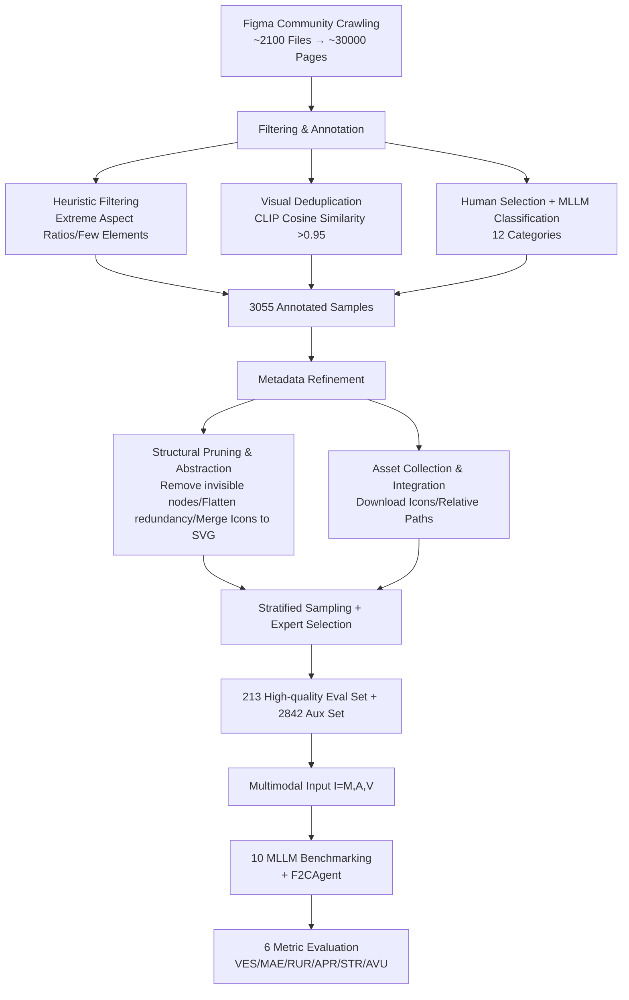

# Figma2Code: Automating Multimodal Design to Code in the Wild

**Conference**: ICLR 2026  
**OpenReview**: [https://openreview.net/forum?id=CaXZB6bI31](https://openreview.net/forum?id=CaXZB6bI31)  
**Code**: GitHub + Hugging Face (Addresses to be confirmed from the paper)  
**Area**: Multimodal / Design-to-Code / UI Code Generation  
**Keywords**: Figma2Code, Multimodal Design-to-Code, MLLM, UI Code Generation, Benchmark, Figma Metadata  

## TL;DR
This paper introduces **Figma2Code**, a novel task and dataset that advances design-to-code from unimodal image-based "screenshot-to-code" to a realistic multimodal scenario incorporating Figma metadata, design assets, and screenshots. It provides an evaluation framework measuring **visual fidelity, layout responsiveness, and code maintainability**, revealing a core contradiction where current MLLMs struggle to balance visual fidelity with code quality.

## Background & Motivation
**Background**: Frontend development constitutes a significant portion of software engineering. Translating design drafts into production-grade UI code has long been a high-cost, repetitive task. With the rise of MLLMs, automated design-to-code has progressed from concept to feasibility, evidenced by datasets like Design2Code, WebCode2M, and IW-Bench.

**Limitations of Prior Work**: Most existing benchmarks (e.g., Design2Code, CC-HARD) rely solely on **design images** as input. This is essentially "screenshot-to-code," where models must **infer** complex UI details—such as icons, hierarchy, styles, and layout—from a single image. Critical assets like background images and button icons are often missing in the image input, leading to degraded code quality. In professional workflows, designs are delivered as **Figma files** containing rich metadata (JSON) for hierarchy, layout, style, and assets.

**Key Challenge**: Unimodal image evaluation fails to reflect industrial workflows. **Rich multimodal information is discarded**, creating a gap between academic benchmarks and industrial application.

**Goal**: Redefine design-to-code as a **multimodal** task aligned with professional workflows, providing high-quality data and comprehensive evaluation to measure the gap toward industrial-grade utility.

**Core Idea**:
- **Task Redefinition (In the Wild)**: Input is no longer a single screenshot but a Figma triplet $I=(M, A, V)$, consisting of JSON metadata $M$, a set of design assets $A$, and a rendered screenshot $V$.
- **Multi-dimensional Evaluation**: The first benchmark to systematically quantify **responsiveness** and **maintainability** alongside visual similarity.
- **Key Insight**: While Figma metadata significantly improves visual fidelity, it often causes models to "blindly copy" absolute coordinates and raw visual attributes, which harms responsiveness and maintainability.

## Method

### Overall Architecture
The methodology centers on a **dataset construction pipeline and evaluation framework**, supplemented by a preliminary agentic baseline. The data side employs a four-stage pipeline (raw collection → filtering/annotation → metadata refinement → data splitting) to distill 3,055 annotated samples from the Figma Community, followed by stratified sampling of 213 high-quality evaluation samples. The evaluation side features 6 reference-less metrics across three objectives. Finally, **F2CAgent** (a ReAct-style agent) is introduced to explore solutions beyond direct prompting.

### Key Designs

**1. Multimodal Formalization: From Single Image Inference to Triplets.** Unlike vision-only design-to-code, Figma2Code defines the input as $I=(M, A, V)$, where $M$ is the JSON metadata describing UI hierarchy and attributes, $A$ is the collection of assets (icons/backgrounds), and $V\in\mathbb{R}^{H\times W\times 3}$ is the full-page screenshot. Output is a codebase $C$ (e.g., HTML/CSS, React). This is formulated as a joint optimization problem:

$$\hat{C}=\arg\max_{C}\Big[-\alpha\cdot D(V,\mathrm{Render}(C))+\beta\cdot RS(C)+\gamma\cdot MS(C)\Big]$$

Where $D(V,\mathrm{Render}(C))$ is the perceptual difference (to be minimized), $RS$ is the responsiveness score, and $MS$ is the maintainability score (both to be maximized), with $\alpha,\beta,\gamma\ge 0$ as balancing weights.

**2. Four-stage Data Distillation Pipeline.** Approximately 2,100 design files across seven categories were crawled and split into ~30,000 pages. A multi-level filter chain was applied: **heuristic rules** removed outliers, **CLIP embedding deduplication** (cosine similarity >0.95) ensured unique visual information, and **expert selection** removed incomplete pages. LLMs categorized the remaining 3,055 high-quality pages into 12 types.

**3. Metadata Refinement.** Raw Figma JSON is too verbose for models. Refinement includes: ① **Structural Pruning**: Removing non-rendering nodes, flattening redundant containers, and merging vector nodes into single **abstract SVG icons** to reduce sequence length while preserving semantics. ② **Asset Consolidation**: Downloading external dependencies, deduplicating by content, and using relative paths to make samples **self-contained and portable**.

**4. Three-dimensional 6-Metric Reference-less Evaluation.** To account for the diversity of code implementations, design-to-code is evaluated using the original design as the ground truth via:
- **Visual Fidelity**: VES (Cosine similarity using DINOv2: $\cos(\mathrm{Encode}(I),\mathrm{Encode}(\hat I))$) and MAE.
- **Responsiveness**: RUR (Ratio of relative units like %/em/rem) and APR (Ratio of absolute/fixed positioning).
- **Code Maintainability**: STR (Ratio of semantic HTML tags like `<header>`) and AVU (Ratio of arbitrary value syntax like `w-[123px]`).
The exploration agent **F2CAgent** utilizes a ReAct cycle: converting Figma JSON to an Intermediate Representation (IR), translating to code via templates, and applying a "Critic-Refiner" loop to fix visual and structural flaws.

## Key Experimental Results

### Main Results (10 MLLMs, Input = Image + Metadata)

| Model | VES↑ | MAE↓ | RUR(%)| APR(%)↓ | STR(%)↑ | AVU(%)↓ |
|------|------|------|---------|---------|---------|---------|
| GPT-5 | **0.8405** | 0.1874 | 1.73 | 14.35 | 15.37 | 37.72 |
| Gemini 2.5 Pro | 0.8110 | 0.1936 | 4.43 | 10.51 | 28.98 | 25.46 |
| Grok4 | 0.7997 | **0.1822** | 2.30 | 31.09 | 13.88 | 49.97 |
| Claude Opus 4.1 | 0.7761 | 0.1911 | 1.05 | 9.62 | 19.79 | 23.29 |
| GPT-4o | 0.7405 | 0.2227 | 3.72 | 2.94 | 25.21 | 2.46 |
| ERNIE 4.5 424B VL | 0.6983 | 0.2198 | 4.81 | 2.83 | 32.03 | 2.06 |
| Llama 4 Maverick | 0.6902 | 0.2266 | 3.30 | 6.09 | 25.28 | 7.71 |
| Qwen 2.5 VL | 0.6516 | 0.2120 | 4.40 | 2.66 | 29.54 | 0.15 |
| Llama 4 Scout | 0.6184 | 0.2375 | **4.72** | 1.42 | **35.76** | 0.87 |
| Nova Pro v1 | 0.5993 | 0.2496 | 4.59 | 3.84 | 29.28 | 1.53 |

**Key Observation**: Closed-source models (GPT-5/Gemini/Grok4) lead in visual fidelity but fail in code quality—Grok4 shows an APR of 31.09% and AVU of 49.97%. Conversely, Llama 4 Scout has the lowest visual fidelity (VES 0.6184) but produces the cleanest, most responsive code. **A clear trade-off exists between visual fidelity and code quality.**

### Cross-modal and Method Comparison (Backbone: ERNIE 4.5 424B VL)

| Method | Input | VES↑ | MAE↓ | RUR↑ | APR↓ | STR↑ | AVU↓ |
|------|------|------|------|------|------|------|------|
| Direct Prompting | Image Only | 0.5653 | 0.2203 | 6.14 | 0.01 | 31.86 | 0.00 |
| Text-Augmented | Image Only | 0.5683 | 0.2145 | 7.02 | 0.01 | 29.67 | 0.00 |
| Direct Prompting | Metadata | 0.6801 | 0.2101 | 4.97 | 5.01 | 21.46 | 6.09 |
| Template Conversion | Metadata | 0.6219 | 0.1205 | 0.00 | 58.0 | 0.01 | 24.94 |
| Direct Prompting | Image+Meta | 0.6923 | 0.2228 | 4.81 | 2.83 | 32.03 | 2.06 |
| **F2CAgent** | Image+Meta | **0.7990** | 0.1923 | 4.69 | 13.57 | 28.57 | 16.71 |

**Key Findings**: Metadata boosts fidelity significantly (0.5653→0.6801) but degrades responsiveness and maintainability. Unimodal image methods have nearly 0 APR/AVU (best maintainability). Template conversion presents an extreme: low MAE but terrible code quality (APR 58%).

## Highlights & Insights
- **Task Definition Aligned with Workflows**: Shifting "in the wild" to Figma files—the industry standard—is more practical than screenshot-only tasks.
- **Evaluation Breakthrough**: Incorporating responsive and maintainable metrics for the first time, using sophisticated reference-less metrics (e.g., DINOv2 over OpenCLIP).
- **Counter-intuitive Paradox**: Metadata is a double-edged sword. Providing more detail makes models copy absolute coordinates, sacrificing engineering quality.
- **Robust Data Engineering**: Techniques like SVG icon merging and self-contained asset localization demonstrate a deep understanding of Figma data complexity.

## Limitations & Future Work
- **Small Dataset Scale**: The evaluation set contains 213 samples; while hand-picked, the statistical robustness is limited compared to the 2,842 auxiliary samples.
- **Preliminary Agent**: F2CAgent's IR conversion introduces defects, and ReAct refinement only partially mitigates them.
- **Reference-less Evaluation**: The alignment of VES/MAE with actual human preferences requires further validation.
- **Unsolved Contradiction**: The paper identifies the fidelity-vs-quality trade-off but does not provide a definitive solution to prevent models from over-relying on absolute coordinates.
- **Framework Scope**: Focus is primarily on HTML/CSS; frameworks like React or Flutter warrant more systematic evaluation.

## Related Work & Insights
- **Screenshot-to-code**: Design2Code, WebCode2M, IW-Bench. This paper critiques the "vision-only" limitation of these works.
- **Sub-tasks**: UI code repair, complex layout generation, and mixed-asset data (MRWeb).
- **Insights**: (1) More modalities do not automatically equal better results; how models utilize metadata is the open problem. (2) Evaluation must return to production needs (responsiveness/maintainability). (3) Self-contained samples are an engineering prerequisite for realistic benchmarks.

## Rating
- **Novelty**: ⭐⭐⭐⭐⭐ High originality in moving to Figma multimodal workflows and quantifying code quality dimensions.
- **Experimental Thoroughness**: ⭐⭐⭐⭐ Comprehensive model testing and ablation; limited by eval set size.
- **Writing Quality**: ⭐⭐⭐⭐ Clear motivation, well-formalized problems, and strong qualitative analysis.
- **Value**: ⭐⭐⭐⭐⭐ Directly addresses industrial pain points and provides a reusable set of protocols and datasets.

<!-- RELATED:START -->

## Related Papers

- [\[ICLR 2026\] VisCodex: Unified Multimodal Code Generation via Merging Vision and Coding Models](viscodex_unified_multimodal_code_generation_via_merging_vision_and_coding_models.md)
- [\[ICLR 2026\] Breaking the SFT Plateau: Multimodal Structured Reinforcement Learning for Chart-to-Code Generation](breaking_the_sft_plateau_multimodal_structured_reinforcement_learning_for_chart-.md)
- [\[CVPR 2026\] Widget2Code: From Visual Widgets to UI Code via Multimodal LLMs](../../CVPR2026/multimodal_vlm/widget2code_from_visual_widgets_to_ui_code_via_multimodal_llms.md)
- [\[NeurIPS 2025\] Reading Recognition in the Wild](../../NeurIPS2025/multimodal_vlm/reading_recognition_in_the_wild.md)
- [\[ACL 2026\] From Charts to Code: A Hierarchical Benchmark for Multimodal Models](../../ACL2026/multimodal_vlm/from_charts_to_code_a_hierarchical_benchmark_for_multimodal_models.md)

<!-- RELATED:END -->
