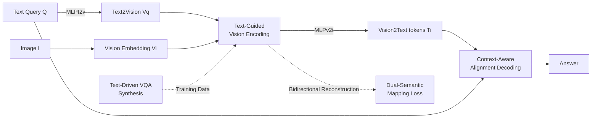

# FLARE: Fully Integration of Vision-Language Representations for Deep Cross-Modal Understanding

**Conference**: ICLR 2026  
**OpenReview**: [https://openreview.net/forum?id=LWw9yLNQfx](https://openreview.net/forum?id=LWw9yLNQfx)  
**Code**: To be open-sourced (Paper promises release of code/data/models)  
**Area**: Multimodal / Vision-Language Model (VLM)  
**Keywords**: Vision-Language Model, Modality Alignment, Text-Guided Vision Encoding, Cross-Modal Fusion, Data Synthesis  

## TL;DR
FLARE permeates "deep vision-language fusion" throughout the entire VLM workflow—guiding vision with text during encoding, dynamically aggregating vision based on text context during decoding, bridging modality spaces with dual reconstruction losses, and feeding training with "text-first" data synthesis. This enables a 3B model to outperform Cambrian-1 8B and Florence-VL 8B using only 630 visual tokens.

## Background & Motivation
**Background**: The mainstream VLM paradigm (LLaVA series, Qwen2.5-VL, etc.) involves "independent vision encoders extracting features → a single MLP projector mapping to LLM space → delaying all cross-modal interaction to the LLM decoding stage." Recent works predominantly focus on the "vision encoding itself," such as utilizing dynamic resolutions or stacking multiple vision encoders to improve representation precision.

**Limitations of Prior Work**: Through attention visualization (Figure 1), the authors demonstrate that LLaVA / LLaVA-NeXT suffer from inadequate feature mapping post-projector due to a lack of cross-modal semantic alignment, resulting in weak attention on key tokens (e.g., "flower") during decoding. The excessive visual tokens in LLaVA-NeXT further disperse this attention. Essentially, **no matter how strong the vision encoding is, if interaction is delayed and remains weak under unidirectional causal masking, modality fusion remains suboptimal.**

**Key Challenge**: Human visual perception is actively modulated by language (finding a target faster/more accurately after hearing its name), yet current VLM "vision encoding → projection → decoding" pipelines are unidirectional, shallow, and fragmented. A deeper issue is **embedding misalignment**—visual and text embedding spaces are inherently disparate and difficult to join seamlessly without explicit constraints; additionally, high-quality data specifically designed for "alignment + integration" is lacking.

**Goal**: To implement deep, dynamic vision-language integration across every stage of the pipeline—connecting pixel-level, query-level, modality-level, and data-level interactions.

**Core Idea**: **Full-Modality Alignment & Integration**—moving beyond single-point alignment to simultaneously introduce text guidance and bidirectional interaction across ① vision encoding (pixel-level), ② decoding (query-level), ③ projection space (modality-level), and ④ training data (data-level).

## Method

### Overall Architecture
FLARE consists of four synergistic components corresponding to four alignment granularities: **Text-Guided Vision Encoding** injects text into the vision encoder for pixel-level alignment; **Context-Aware Alignment Decoding** inserts semantic exchange layers between LLM decoder layers for query-level integration via dynamic visual aggregation; **Dual-Semantic Mapping Loss** uses bidirectional reconstruction to constrain the two projectors for modality-level bridging; **Text-Driven VQA Synthesis** reverses the "image-first" convention, using high-quality text as the source to generate images and QA for data-level optimization. The backbone uses SigLIP2-Giant with Phi-3.5-mini / LLaMA3.1-8B, trained in 3B/8B scales under fixed (FLARE-L) and dynamic (FLARE-X) resolution settings.

### Key Designs

**1. Text-Guided Vision Encoding: Introducing text at the encoding stage.** FLARE no longer treats vision encoding as a text-independent process. The query text embedding $T_q$ is projected into the vision space via $V_q=\mathrm{MLP}_{t2v}(T_q)$ and fed into the encoder for joint layer-wise updates: $(V_i^k,V_q^k)=\mathrm{EncoderLayer}(V_i^{k-1},V_q^{k-1})$. Since shallow features lack semantics, the authors mask "vision→text" attention in the first half of the encoder to focus on pure vision; subsequently, shallow (coarse, vision-centric) and deep (fine, text-enhanced) features are averaged as $V_i^s, V_i^d$ and concatenated as $V_i^e=\mathrm{Concat}(V_i^s,V_i^d)$. This $V_i^e$ is mapped to Vision2Text tokens $T_i$ for decoding, advancing alignment to the pixel level.

**2. Context-Aware Alignment Decoding: Breaking unidirectional interaction with latent tokens.** Traditional cross-modal interaction in the LLM suffers from causal masks. FLARE introduces **context-aware latent tokens** $T_L\in\mathbb{R}^{l\times l\times D}$ and inserts a **semantic exchange layer** every three decoding layers. In these layers, the hidden state $H_P$ of the last query token (aggregating full context) is concatenated with each latent token to form a context-aware query $I_Q[r,c]=\mathrm{MLP}(\mathrm{Concat}(H_P,T_L[r,c]))$. Cross-attention (with window size $w=m/l, h=n/l$) then updates $T_L[r,c]$ using $T_i$ as key/value. This extracts the most relevant visual features for the enriched tokens, achieving bidirectional query-level interaction.

**3. Dual-Semantic Mapping Loss: Self-supervised bridging of modality spaces.** To ensure reliable mapping for $\mathrm{MLP}_{v2t}$ and $\mathrm{MLP}_{t2v}$, symmetric cosine similarity reconstruction losses are introduced. For $\mathrm{MLP}_{v2t}$: the vision-encoded text feature $V_q^e$ is projected back to text space as $T_q^r=\mathrm{MLP}_{v2t}(V_q^e)$, targeting the original $T_q$, yielding $L_{v2t}=1-\tfrac{T_q\cdot T_q^r}{|T_q||T_q^r|}$. Symmetrically, $L_{t2v}$ reconstructs $T_i$ back to vision space $V_i$. Total loss is $L_{total}=L_{ce}+\lambda(L_{v2t}+L_{t2v})$ with $\lambda=0.1$.

**4. Text-Driven VQA Synthesis: Inverting data production to "Text-First."** FLARE reverses the typical image-to-QA workflow. High-quality captions (covering Landmark, Celebrity, Artwork, etc.) are expanded by Llama3-70B. One branch feeds these to a diffusion model (FLUX) to generate aligned images, while the other uses an LLM to generate diverse QA (multiple-choice, reasoning, etc.). This ensures textual richness first, producing FLARE-10M (pre-train) and FLARE-12M (SFT) datasets to support cross-modal integration.

## Key Experimental Results

### Main Results (Selected Benchmarks)

| Model | # Vis tok. | MMBEN | POPE | MM-Vet | Seed-Img | TextVQA | AI2D | CVBench |
|---|---|---|---|---|---|---|---|---|
| MiniCPM-V-2.0 3B | 400 | 69.1 | 86.3 | 41.0 | 67.1 | 74.1 | 62.9 | - |
| Florence-VL 3B | 576 | 71.6 | 88.3 | 51.0 | 70.6 | 69.1 | 73.8 | 70.2 |
| Qwen2.5VL 3B | 1400 | 79.1 | 87.3 | 61.4 | 74.0 | 79.3 | 81.4 | 75.5 |
| **FLARE-L 3B** | **630** | 79.6 | 88.8 | 59.1 | 74.2 | 73.3 | 79.4 | 78.2 |
| **FLARE-X 3B** | 1400 | 81.4 | 88.6 | 61.9 | 76.3 | 77.2 | 81.2 | 80.1 |
| Cambrian-1 8B | 576 | 75.9 | 87.4 | 48.0 | 74.7 | 71.7 | 73.0 | 72.2 |
| Florence-VL 8B | 576 | 76.2 | 88.4 | 56.3 | 74.9 | 74.2 | 74.2 | 73.4 |
| **FLARE-X 8B** | 1400 | 83.6 | 89.1 | 62.8 | 78.7 | 79.7 | 83.6 | 81.5 |

- FLARE-L 3B, using only **630 visual tokens**, outperforms Cambrian-1 8B and Florence-VL 8B. It gains a significant advantage over MiniCPM-V using only ~1/100 of the training data.
- FLARE-X matches or exceeds Qwen2.5VL on nearly half of the benchmarks despite using ~1/1000 of the training data.

### Ablation Study (Table 3: A=Text-Guided Encoding / B=Dual Mapping Loss / C=Context-Aware Decoding)

| A | B | C | MMBEN | MMEP | Seed-Img | CVBench | MMVP |
|---|---|---|---|---|---|---|---|
| | | | 72.5 | 1531.7 | 71.7 | 68.3 | 66.1 |
| ✓ | | | 73.5 | 1543.2 | 72.8 | 70.7 | 67.6 |
| | ✓ | | 73.7 | 1554.3 | 72.8 | 70.3 | 68.4 |
| ✓ | ✓ | | 74.5 | 1574.2 | 73.7 | 70.7 | 70.3 |
| ✓ | | ✓ | 74.4 | 1566.8 | 73.7 | 71.2 | 69.1 |
| ✓ | ✓ | ✓ | **75.3** | **1583.9** | **74.6** | 71.7 | 69.8 |

### Key Findings
- The three integration components provide monotonic improvements. The full setup (A+B+C) outperforms LLaVA-NeXT (75.3 vs 74.9), suggesting deep integration is more effective than simply stacking visual tokens.
- Attention visualization reveals that FLARE achieves consistent and progressively stronger cross-modal alignment across pixel, query, and modality levels.

## Highlights & Insights
- **From Point-wise to Full-process Alignment**: Unlike previous works focusing solely on the projector or encoder, FLARE systematically introduces text guidance and bidirectional interaction across four granularities.
- **Bypassing Causal Masks via Latent Tokens**: The use of latent tokens and semantic exchange layers allows bidirectional cross-modal interaction during decoding without disrupting the LLM's autoregressive structure.
- **Text-First Data Supremacy**: Starting with text to generate images significantly boosts QA diversity and aligns with the "text-guided vision" philosophy.
- **High Efficiency**: 3B models challenge 8B models, and 1/1000 of the data rivals Qwen2.5VL, showing great promise for compute-constrained scenarios.

## Limitations & Future Work
- **Training Complexity**: The pipeline involves three-stage training, four components, and large-scale synthetic data (~22M), making it sensitive to hyperparameters.
- **Dependency on Teacher Models**: Synthesis relies on Llama3-70B and FLUX; bias or quality ceilings in these models propagate to FLARE.
- **OCR Performance**: FLARE still trails Qwen2.5VL on high-resolution dependent tasks (OCRBench, ChartQA), indicating a gap in detail preservation under low token budgets.

## Related Work & Insights
- **VLM Paradigms**: Directly addresses the structural flaws in LLaVA and Qwen2.5-VL regarding delayed interaction.
- **Alignment Exploration**: Unlike InstructBLIP or Florence-VL, FLARE argues that alignment must be unified across the entire process rather than isolated in specific modules.
- **Insight**: When single-module optimizations plateau, systemic alignment across multiple granularities often yields superior results compared to extreme optimization of a single point.

## Rating
- **Novelty**: ⭐⭐⭐⭐ Framework-level innovation with four-granularity integration.
- **Experimental Thoroughness**: ⭐⭐⭐⭐ Comprehensive benchmarking and fair comparisons.
- **Writing Quality**: ⭐⭐⭐⭐ Clear motivation and well-structured design descriptions.
- **Value**: ⭐⭐⭐⭐ High token/data efficiency provides a transferable paradigm for VLM design.

<!-- RELATED:START -->

- **Cambrian-1**: [https://arxiv.org/abs/2406.10149](https://arxiv.org/abs/2406.10149)
- **Florence-VL**: [https://arxiv.org/abs/2412.04424](https://arxiv.org/abs/2412.04424)
- **Qwen2.5-VL**: [https://arxiv.org/abs/2412.18171](https://arxiv.org/abs/2412.18171)

<!-- RELATED:END -->

## Related Papers

- [\[CVPR 2026\] HAMMER: Harnessing MLLM via Cross-Modal Integration for Intention-Driven 3D Affordance Grounding](../../CVPR2026/multimodal_vlm/hammer_harnessing_mllm_via_cross-modal_integration_for_intention-driven_3d_affor.md)
- [\[ICML 2025\] Vision-Language Models Create Cross-Modal Task Representations](../../ICML2025/multimodal_vlm/vision-language_models_create_cross-modal_task_representations.md)
- [\[ICLR 2026\] OmniVinci: Enhancing Architecture and Data for Omni-Modal Understanding LLM](omnivinci_enhancing_architecture_and_data_for_omni-modal_understanding_llm.md)
- [\[ICLR 2026\] WebWatcher: Breaking New Frontiers of Vision-Language Deep Research Agent](webwatcher_breaking_new_frontiers_of_vision-language_deep_research_agent.md)
- [\[ICLR 2026\] XModBench: Benchmarking Cross-Modal Capabilities and Consistency in Omni-Language Models](xmodbench_benchmarking_cross-modal_capabilities_and_consistency_in_omni-language.md)

<!-- RELATED:END -->
