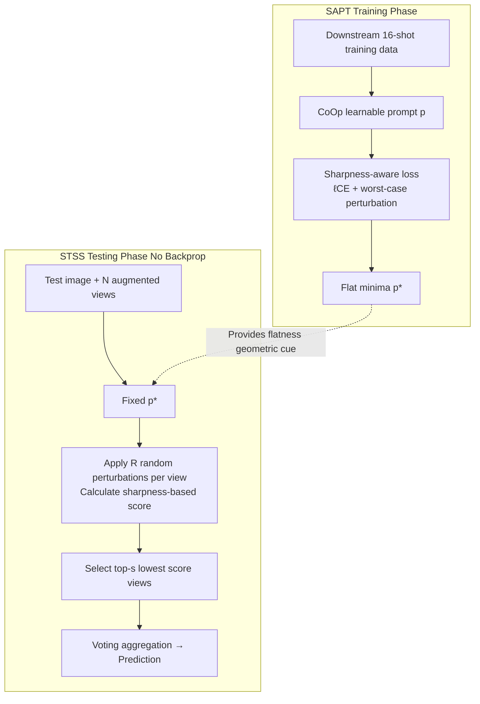

# Flatness-Guided Test-Time Adaptation for Vision-Language Models

**Conference**: ICLR 2026  
**OpenReview**: [https://openreview.net/forum?id=S90g7NE88b](https://openreview.net/forum?id=S90g7NE88b)  
**Code**: To be confirmed  
**Area**: Multi-modal / Vision-Language Models · Test-Time Adaptation  
**Keywords**: Test-Time Adaptation, Vision-Language Models, CLIP, Sharpness-Aware Minimization, Loss Landscape Flatness, Prompt Tuning  

## TL;DR
This paper proposes the **Flatness-Guided Adaptation (FGA)** framework: the training phase employs sharpness-aware prompt tuning to locate flat minima, while the testing phase avoids updating any parameters. Instead, it uses a "perturb-score-filter" approach to enhance samples, aligning the flat minima of selected test loss landscapes with the training flat minima. This significantly improves CLIP's out-of-distribution generalization with zero backpropagation and low memory overhead.

## Background & Motivation
- **Background**: Test-time adaptation (TTA) for VLMs like CLIP is exemplified by TPT (Test-time Prompt Tuning), which generates multiple augmented views for each test sample and updates prompts via backpropagation using the average entropy of low-entropy views as a loss. While effective under distribution shifts, these methods treat the test phase as an isolated optimization problem.
- **Limitations of Prior Work**: ① TPT-like methods require backpropagation for every image during testing, leading to slow inference (0.62s/image for TPT) and high memory usage (19.33GB). ② They decouple training history from test adaptation. Research indicates TTA is inherently influenced by the model's training history, but mainstream strategies fail to leverage the geometric/representative properties of pre-trained models.
- **Key Challenge**: While SAM-style methods in training have proven that "flat minima generalize better," this principle is rarely extended as a unified criterion to guide TTA. Expensive test-time optimization is "unaware" of the loss geometric structure, often leading to sub-optimal generalization.
- **Goal**: To promote "flatness" from a training-time attribute to a unified guiding principle across training and testing, enhancing the robustness of VLMs against distribution shifts without updating parameters during testing, while drastically reducing computational costs.
- **Key Insight**: **Alignment instead of Optimization**—Traditional TTA treats the test loss landscape as static and tries to move parameters to the test flat minima. FGA reverses this: **fix the parameters and adjust the test loss landscape** (via data augmentation), selecting augmented samples whose flat minima happen to align with the training flat minima for voting-based prediction.

## Method

### Overall Architecture
FGA consists of two collaborative stages: **Sharpness-Aware Prompt Tuning (SAPT)** on the training side, which pushes the prompt to the flat minima of the training loss landscape and leaves "sharpness" as a geometric cue for testing; and **Sharpness-based Test Sample Selection (STSS)** on the test side, which uses random perturbations to assign a sharpness score to each augmented view without moving parameters, allowing only the lowest-scoring (most aligned) samples to participate in voting. There is no backpropagation during the entire test process.

### Key Designs

**1. Sharpness-Aware Prompt Tuning: Nailing training minima to flat regions and leaving measurable geometric cues.** Since test samples are unknown during training and training data is unavailable during testing due to storage/privacy, FGA targets the intrinsic properties of the "training minima": they should be both low-loss and sufficiently flat. While standard CoOp uses cross-entropy $\ell_{CE}(p)=-\sum_{i}\log P_p(y_i|x_i)$ to fine-tune prompts, SAPT explicitly adds a worst-case perturbation term for sharpness: $\ell_{SAPT}(p)=\ell_{CE}(p)+\lambda\max_{\|\epsilon\|\le\rho}[\ell_{CE}(p+\epsilon)-\ell_{CE}(p)]$. Using Taylor expansion, the optimal perturbation direction is approximately $\epsilon^\star=\rho\,\nabla_p\ell_{CE}(p)/\|\nabla_p\ell_{CE}(p)\|$. Consequently, SAPT yields a prompt with stronger generalization and provides a "sharpness metric" as auxiliary information for the test phase.

**2. Sharpness-based Test Sample Selection: Modifying the loss landscape via augmentation without updating parameters.** During testing, the prompt is fixed at the training-derived flat minimum $p^\star$. FGA creates multiple different test loss landscapes for each test sample through data augmentation, aiming for $p^\star$ to fall into the flat minimum of at least one augmented landscape. To avoid the cost of backpropagation, STSS redefines sharpness as the maximum change in loss under $R$ random perturbations: $\ell_{STSS}(p)=\ell_{SRG}(p)+\lambda\max_{r=1,\dots,R;\,\epsilon_r\sim\mathcal{N}}\big[\ell_{SRG}(p+\rho'\epsilon_r/\|\epsilon_r\|)-\ell_{SRG}(p)\big]$, where the proxy loss $\ell_{SRG}$ is the entropy $-\sum_k P_r(y_k|x)\log P_r(y_k|x)$ in the absence of labels. Perturbations are only applied to the text prompt features $[e_{t,k,1},\dots,e_{t,k,R}]=E_t([l_{k,1},\dots,l_{k,R}])$, which only need to be computed once per category, resulting in minimal overhead. Finally, the top-$s$ augmented samples with the lowest sharpness scores are selected for voting.

**3. Generalization Bounds: Proving "low sharpness ⇒ more reliable."** The paper provides a generalization error upper bound $\mathbb{E}_T[\ell_\rho]\le \frac{M}{2}d(S;T)+\hat\ell^\rho_{S_n}+2\sqrt2\mu R_n(F,S)+M\sqrt{\log(1/\delta)/2n}$, where $d(S;T)$ is the distribution shift. By introducing $\beta$-tightness and $\gamma$-separability, it proves that when two test distributions are sufficiently separable, the one further from the training distribution tends to exhibit a higher sharpness score ($P(H_\rho(x_{T_1})<\xi)>P(H_\rho(x_{T_2})<\xi)$ in Theorem 4). This theoretical foundation justifies filtering samples based on sharpness scores.

## Key Experimental Results

### Main Results (Natural Distribution Shift, CLIP-ViT-B/16, Top-1 Acc %)

| Method | IN | IN-A | IN-V2 | IN-R | IN-Sketch | Avg | OOD Avg |
|------|----|----|----|----|----|----|----|
| CLIP-ViT-B/16 | 68.34 | 49.89 | 61.88 | 77.65 | 48.24 | 61.20 | 59.42 |
| TPT | 69.70 | 53.67 | 64.30 | 73.90 | 46.40 | 61.59 | 59.57 |
| TPT+CoOp | 73.30 | 56.88 | 66.60 | 73.80 | 49.40 | 64.00 | 61.67 |
| DiffTPT+CoOp | 75.00 | 58.09 | 66.80 | 73.90 | 49.50 | 64.66 | 62.07 |
| ZERO+CoOp | 73.61 | 63.17 | 66.82 | 77.71 | 48.52 | 65.97 | 64.06 |
| **FGA (Ours)** | **74.01** | **65.90** | **67.23** | **81.24** | **51.81** | **68.04** | **66.55** |

FGA improves OOD average accuracy by **4.88%** over TPT+CoOp (61.67%→66.55%), showing significant leads on IN-A, IN-R, and IN-Sketch.

### Ablation Study (Domain Generalization, CLIP-ViT-B/16)

| Configuration | Avg | OOD Avg | Description |
|------|----|----|----|
| CoOp | 61.72 | 59.28 | Baseline |
| SAPT+CoOp | 62.64 | 60.61 | Flatness only on training side, +0.92% Avg |
| STSS+CoOp | 66.48 | 64.60 | Selection only on test side, +4.76% Avg |
| **FGA (Full)** | **68.04** | **66.55** | SAPT+STSS Collaboration |

STSS is the primary driver of performance gains; stacking STSS on top of SAPT yields an additional 5.40% gain (62.64%→68.04%), surpassing the 4.76% gain of STSS alone, indicating that flatter training minima inherently enhance the effectiveness of test sample selection.

### Key Findings
- **Cross-Dataset Generalization**: ImageNet → 10 fine-grained datasets; FGA averages **67.60%**, achieving SOTA on 6/10 datasets (96.96% on Caltech101), a 1.94% improvement over TPT+CoOp.
- **Efficiency**: On a single V100, FGA takes only **0.07s/image**, which is 23.86× faster than DiffTPT (1.67s) and 8.86× faster than TPT (0.62s). Memory usage is merely **4.14GB**, 4.67× lower than TPT (19.33GB).
- **Non-monotonic $\rho'$**: Test accuracy increases then decreases with $\rho'$; as $\rho'\to0$, it degrades to entropy maximization. The parameters are fixed at $\rho'=0.5$ and $\lambda=1$ without per-dataset tuning.
- **Loss Landscape Visualization**: When parameters fall into a flat minimum, augmented samples retain semantic integrity and yield reliable predictions; outside the flat region, semantic distortion occurs, validating that the filtering mechanism removes unreliable samples.

## Highlights & Insights
- **Paradigm Inversion**: "Optimize the landscape, not the parameters"—by fixing the flat minimum and using augmented samples to align the test landscape with it, this perspective unifies training and testing under the same geometric principle (flatness).
- **Zero Backpropagation + Text Feature Reuse**: Perturbations are applied only to prompts, and text features per class are computed only once. This makes sharpness scoring nearly cost-free in terms of forward passes, the root cause of its 9× speedup over TPT.
- **Tight Coupling of Theory and Method**: The generalization bound + $\gamma$-separability directly demonstrates that "low sharpness score ⇒ closer to training distribution ⇒ more reliable prediction," moving sample selection from heuristic to theoretically grounded.

## Limitations & Future Work
- **Dependency on Downstream Training Data for SAPT**: Requires 16-shot labeled data to train the prompt first, making it not directly applicable to zero-shot scenarios without training (though STSS+CoOp alone is strong).
- **Single-Sample Setting**: FGA targets single-sample adaptation and does not utilize cross-sample information from online buffers like TDA/DPE, making it not perfectly comparable to online TTA.
- **Reliance on TPT's 63 Augmented Views**: The augmentation strategy is directly reused from TPT; the impact of augmentation quality/diversity on landscape modification remains unexplored.
- **Future Work**: The authors suggest that FGA, based on general loss landscape geometry, could migrate to more advanced prompt tuning, new TTA objectives, or other VLM architectures.

## Related Work & Insights
- **TTA / TPT Series**: TPT, DiffTPT, C-TPT, and PromptAlign focus on "updating prompts at test time," while TDA/DPE focus on "online prototype caches." FGA's fundamental difference is that it updates zero parameters at test time.
- **Flat Minima / SAM Series**: SAM, ASAM, and FisherSAM focus on training-phase flatness. While SAR and SoTTA use sharpness-aware minimization during testing, they only operate on the test side without establishing a training-test sharpness interaction—FGA bridges this gap.
- **Insights**: Explicitly encoding "training-acquired geometric properties" and reusing them as alignment criteria during testing is an effective way to reduce TTA costs. The trick of approximating sharpness with random perturbations to avoid backpropagation can be generalized to other online scoring scenarios.

## Rating
- **Novelty**: ⭐⭐⭐⭐ The perspective of "tuning the landscape rather than parameters + training/test flatness alignment" is novel, unifying SAM principles into TTA.
- **Experimental Thoroughness**: ⭐⭐⭐⭐ Covers domain generalization + cross-dataset + efficiency + ablation + visualization with comprehensive baselines; however, the main text focuses on ViT-B/16, with ResNet50 results relegated to the appendix.
- **Writing Quality**: ⭐⭐⭐⭐ Logic is coherent across motivation, method, theory, and experiments. Figure 1 clearly illustrates the core idea.
- **Value**: ⭐⭐⭐⭐ Achieving performance gains alongside a 9× speedup and 4.67× memory reduction is highly practical for resource-constrained/real-time VLM TTA deployment.

<!-- RELATED:START -->

## Related Papers

- [\[ICLR 2026\] Bilateral Information-aware Test-time Adaptation for Vision-Language Models](bilateral_information-aware_test-time_adaptation_for_vision-language_models.md)
- [\[ICLR 2026\] Long-tailed Test-Time Adaptation for Vision-Language Models](long-tailed_test-time_adaptation_for_vision-language_models.md)
- [\[CVPR 2025\] Realistic Test-Time Adaptation of Vision-Language Models](../../CVPR2025/multimodal_vlm/realistic_test-time_adaptation_of_vision-language_models.md)
- [\[CVPR 2026\] Dynamic Logits Adjustment and Exploration for Test-Time Adaptation in Vision Language Models](../../CVPR2026/multimodal_vlm/dynamic_logits_adjustment_and_exploration_for_test-time_adaptation_in_vision_lan.md)
- [\[NeurIPS 2025\] DOTA: DistributiOnal Test-time Adaptation of Vision-Language Models](../../NeurIPS2025/multimodal_vlm/dota_distributional_testtime_adaptation_of_visionlanguage_mo.md)

<!-- RELATED:END -->
