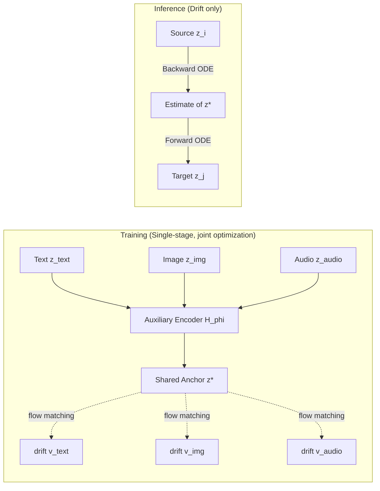

# FlowBind: Efficient Any-to-Any Generation with Bidirectional Flows

**Conference**: ICLR 2026  
**OpenReview**: [https://openreview.net/forum?id=7DeARTwvwL](https://openreview.net/forum?id=7DeARTwvwL)  
**Code**: [https://yeonwoo378.github.io/official_flowbind](https://yeonwoo378.github.io/official_flowbind)  
**Area**: Multimodal Generation / Any-to-Any Generation / Flow Matching  
**Keywords**: any-to-any generation, flow matching, shared latent, invertible flow, multimodal  

## TL;DR
FlowBind replaces fixed Gaussian priors with a **learnable shared latent anchor + per-modality invertible flows**, factorizing the multimodal joint distribution into a set of independent modality-to-anchor flows. Trained end-to-end with only a single flow matching loss, it enables arbitrary translation between text, images, and audio with 6x fewer parameters and 10x faster training.

## Background & Motivation
- **Background**: Flow models have achieved SOTA in **directional** generation tasks like text-to-image and text-to-audio. However, extending them to true any-to-any generation (arbitrary modality subset → arbitrary modality subset) remains an open problem.
- **Limitations of Prior Work**: Existing approaches are cumbersome. ① CoDi uses **text as a central anchor**, requiring every modality to be paired with text, which fails to learn direct correlations between non-text modalities (e.g., audio ↔ image); ② OmniFlow models the **full joint velocity field**, which is expressive but requires scarce fully-paired data, and its complexity grows quadratically with the number of modalities. Both rely on **multi-stage training** (alignment stage + joint generation stage), which is fragile and difficult to tune.
- **Key Challenge**: The irreconcilable contradiction between the expressivity of joint modeling and its dependence on fully-paired data, massive compute, and multi-stage pipelines—making it impractical as modalities increase.
- **Goal**: Develop a **single-stage, low-compute any-to-any framework capable of utilizing partially paired data**.
- **Core Idea**: **[Factorized Shared Anchor]** All modalities are assumed to share a latent $z^*$ representing cross-modal commonalities. Each modality only needs to learn an invertible flow connecting itself to $z^*$. The anchor and all flows are optimized jointly under a **single flow matching objective**. During inference, arbitrary translation is achieved via forward/backward integration of these flows.

## Method

### Overall Architecture
FlowBind replaces the modeling of an "$N$-modality joint distribution" with learning a "shared anchor $z^*$ + a direct flow between data and anchor for each modality." During training, an auxiliary encoder $H_\phi$ aggregates modalities present in the sample into $z^*$. Each flow $v_{\theta_i}$ learns the straight-line interpolation velocity between $z_i$ and $z^*$. In inference, the encoder is discarded, and the invertibility of flows is utilized: the source modality is integrated backward to the anchor, then forward to the target modality. Since each flow only requires "its own modality + the anchor," it naturally supports partially paired data.

### Key Designs

**1. Shared anchor replacing fixed priors, factorizing joint flows into per-modality independent flows:** Traditional generative flows bridge data to a fixed Gaussian prior $\pi_{\text{prior}}$. FlowBind replaces the prior with a **learnable shared distribution** $\pi_{\text{shared}}$. For each modality $i$ in subset $S$, a straight-line interpolation path is defined as $z_t^i = t z_i + (1-t) z^*$, with a velocity field $\partial z_t^i/\partial t = v_i(z_t^i, t)$. Crucially, given $z^*$, the multimodal flow is **factorized by modality**—each drift is only responsible for connecting its modality to the anchor. This reduces the quadratic cost of OmniFlow and allows training as long as a modality is paired with the anchor.

**2. Single flow matching objective for joint training of the anchor and all flows:** The training loss sums the flow matching terms for all present modalities: $\mathcal{L}(\theta,\phi)=\mathbb{E}_{t,z_S,z^*}\big[\sum_{i\in S}\|v_{\theta_i}(z_t^i,t)-(z_i-z^*)\|^2\big]$, where $z^*=H_\phi(z_S)$ is generated in real-time by the auxiliary encoder. The drifts learn to predict the displacement from the anchor to each modality endpoint, while the encoder is incentivized to provide an anchor from which every modality can be recovered. This **eliminates the multi-stage pipelines** of CoDi/OmniFlow.

**3. Time-dependent stop-gradient to prevent anchor collapse using flow matching alone:** The objective above has a degenerate solution—if the encoder outputs a constant $z^*=0$, the drift can trivially fit $v_i(z_t^i,t)=z_i$ with zero loss at $t\in(0,1]$, leaving the encoder without effective supervision. FlowBind solves this by **stopping the gradient to the encoder when $t\in(0,1]$** (training only the drift) and **allowing the encoder to update with the drift only at $t=0$**. Training samples $t$ from a mixed distribution $t\sim(1-\alpha)\,\text{Unif}(0,1)+\alpha\,\delta(t=0)$ to balance the two.

**4. Theoretical interpretation of the anchor objective—minimizing conditional variance (maximizing explained variance):** Substituting the Bayes optimal drift into the loss at $t=0$ yields the encoder's effective objective: $\mathcal{L}(\phi)=\mathbb{E}\big[\|\mathbb{E}[z_i\mid z^*]-z_i\|^2\big]=\mathbb{E}[\text{Var}(z_i\mid z^*)]$. This is equivalent to **minimizing the "unexplained variance" of each modality given the anchor**. By the law of total variance, this maximizes the explained variance of $z_i$ by $z^*$. Proposition 1 further proves that even if the drift is suboptimal, the loss at $t=0$ decomposes into "unexplained variance + drift approximation error," ensuring the encoder optimizes toward an information-rich anchor.

> FlowBind constructs flows in a **semantic latent space** using **frozen strong encoders** (EmbeddingGemma for text, CLIP for image, CLAP for audio), decoupling "cross-modal alignment" from "intra-modality generation." Drifts only learn cross-modal correspondences, which is the source of its data and compute efficiency.

## Key Experimental Results

### Main Results: Computation and Data Budget (Table 1)

| Model | Trainable Params | GPU-hr | Training Data | Joint Training |
|---|---|---|---|---|
| CoDi | 4.3B | — | ~405M pairs | No |
| OmniFlow | 3.2B | 480hr* | ~32.6M pairs | No |
| **Ours** | **568M** | **48hr** | **~586K pairs** | **Yes** |

FlowBind has ~1/6 the parameters of OmniFlow, ~1/10 the compute, and only 0.15% of CoDi's or 1.79% of OmniFlow's data.

### Main Results: One-to-One Generation Quality and Alignment (Table 2/3)

| Metric | Model | T→I (FID↓) | I→T (CIDEr↑) | T→A (FAD↓) | A→T (CIDEr↑) | I→A (FAD↓) | A→I (FID↓) |
|---|---|---|---|---|---|---|---|
| Quality | CoDi | 24.80 | 16.40 | 9.84 | 6.62 | 14.58 | 50.4 |
| Quality | OmniFlow | 22.97 | 44.20 | 4.20 | 31.79 | 5.67 | 106.03 |
| Quality | **Ours** | **17.39** | **46.26** | **4.19** | **55.11** | **2.50** | **26.60** |

FlowBind achieves the best quality in all 6 one-to-one tasks. It significantly leads in the **image-audio direction**, outperforming even some specialists, which is attributed to the shared anchor learned directly from image-audio pairs.

### Ablation Study

| Analysis | Result |
|---|---|
| Text vs. Shared Anchor (Table 6) | Ours (without image-audio pairs) still outperforms text-anchoring (30.04 vs 27.94 for I→T). |
| Shared Latent Alignment CKNNA (Table 7) | Shared anchor 0.2872 ≫ modality-independent latents 0.1965. |

### Key Findings
- The shared anchor is a **truly semantically aligned space**, rather than a simple feature concatenation. Decoded images/text transition smoothly during latent interpolation.
- Adding a new modality (3D point clouds) requires **adding just one drift**. It can generalize to **unseen tasks** like text ↔ point cloud using only image-point cloud pairs.

## Highlights & Insights
- **Reinterpreting "joint distribution modeling" as "direct flows to a shared anchor"** is an elegant reformulation of the any-to-any problem, unlocking efficiency and partial data training.
- The **time-dependent stop-gradient** is the most clever technical detail—preventing collapse via a simple temporal switch without needing contrastive losses, backed by a clean theoretical characterization of conditional variance.
- Operating in a **semantic latent space** rather than pixel/waveform space decouples alignment from synthesis, explaining why competitive quality is reached with 1% of the data.

## Limitations & Future Work
- Intra-modality generation quality is **outsourced to frozen pre-trained codecs**. FlowBind's upper bound is constrained by these components and may fail for modalities without strong pre-trained encoders.
- Multi-source conditioning uses a **simple average** of anchors, lacking modeling of confidence or conflicts between sources.
- Quantitative evaluation of many-to-many scenarios is limited due to the lack of standard benchmarks, relying partly on synthetic triplets.

## Related Work & Insights
- **Any-to-any approaches**: Either discrete tokenization via AR LLMs (Chameleon) or discrete diffusion (UniDisc). These often focus on text-image and require instruction tuning. FlowBind adopts continuous flows and treats modalities symmetrically.
- **Direct flow**: Typically limited to two modalities (text-image) using contrastive loss for stability. FlowBind generalizes this to **multiple modalities** and replaces auxiliary regularization with a single flow matching objective.

## Rating
- **Novelty**: ⭐⭐⭐⭐ Structural reformulation of any-to-any via learnable anchors and theoretical grounding in conditional variance.
- **Experimental Thoroughness**: ⭐⭐⭐⭐ Solid quantification of efficiency and one-to-one quality, though many-to-many evaluation is less standardized.
- **Writing Quality**: ⭐⭐⭐⭐ Clear chain of motivation-method-theory-experiments.
- **Value**: ⭐⭐⭐⭐ High practical value for resource-constrained multimodal research, achieving competitive quality with 1/10 the compute.

<!-- RELATED:START -->

## Related Papers

- [\[ICLR 2026\] NExT-OMNI: Towards Any-to-Any Omnimodal Foundation Models with Discrete Flow Matching](next-omni_towards_any-to-any_omnimodal_foundation_models_with_discrete_flow_matc.md)
- [\[CVPR 2026\] Describe Anything Anywhere At Any Moment](../../CVPR2026/multimodal_vlm/describe_anything_anywhere_at_any_moment.md)
- [\[ICLR 2026\] Grasp Any Region: Towards Precise, Contextual Pixel Understanding for Multimodal LLMs](grasp_any_region_towards_precise_contextual_pixel_understanding_for_multimodal_l.md)
- [\[ICLR 2026\] Exploring Cross-Modal Flows for Few-Shot Learning](exploring_cross-modal_flows_for_few-shot_learning.md)
- [\[NeurIPS 2025\] MDReID: Modality-Decoupled Learning for Any-to-Any Multi-Modal Object Re-Identification](../../NeurIPS2025/multimodal_vlm/mdreid_modality-decoupled_learning_for_any-to-any_multi-modal_object_re-identifi.md)

<!-- RELATED:END -->
