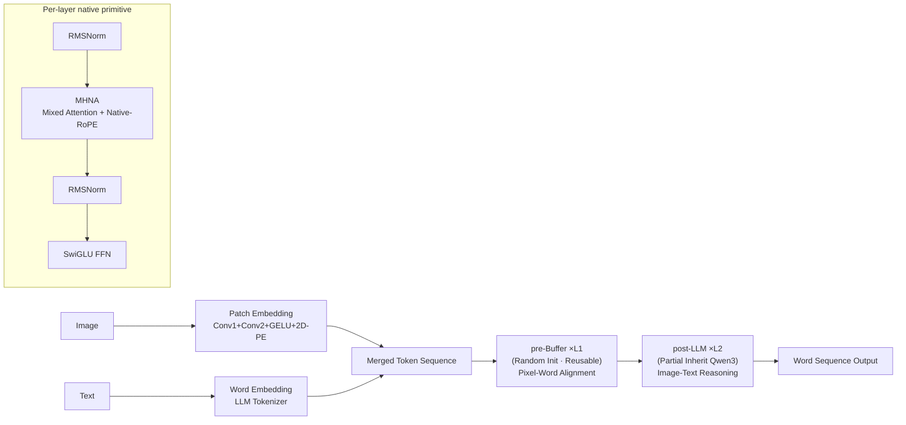

# From Pixels to Words -- Towards Native Vision-Language Primitives at Scale

**Conference**: ICLR 2026  
**OpenReview**: [https://openreview.net/forum?id=DF6udvxuvY](https://openreview.net/forum?id=DF6udvxuvY)  
**Code**: [https://github.com/EvolvingLMMs-Lab/NEO](https://github.com/EvolvingLMMs-Lab/NEO)  
**Area**: Multi-modal Vision-Language Models / Native (Monolithic) VLM  
**Keywords**: native VLM, early fusion, Native-RoPE, mixed attention, pre-Buffer, monolithic backbone  

## TL;DR
This paper introduces NEO, a family of **native (monolithic) VLMs** built from first principles. It integrates visual encoding, cross-modal alignment, and reasoning into a single decoder-only backbone using unified "native primitives." By leveraging Native-RoPE (which decouples T/H/W), mixed image-text attention, and a reusable pre-Buffer, NEO significantly narrows the gap between native VLMs and top-tier modular VLMs of the same scale using only 390M image-text samples.

## Background & Motivation
- **Background**: The mainstream VLM trajectory follows a "modular" route—the "ViT-MLP-LLM" pipeline consisting of a pre-trained visual encoder (VE), a projector, and an LLM. This has become the de facto standard (e.g., Qwen-VL, InternVL) by overcoming resolution and aspect ratio constraints through multi-stage post-training. In contrast, the "native VLM" route (Fuyu, EVE, Chameleon) feeds image patches directly into the LLM for early-fusion, seeking a monolithic architecture.
- **Limitations of Prior Work**: Modular designs carry strong inductive biases from pre-trained VEs, require complex infrastructure, and face difficult capacity trade-offs between the VE and LLM. Native routes, by forcing visual representation construction inside a pre-trained LLM, often **suffer from reduced efficiency, optimization instability, and the erasure of existing linguistic knowledge**. Even models like HoVLE or HaploVL, which map image and text to a shared space, utilize "modality-shared modules" (derived from either LLM or VE layers) that **neglect the inherent differences in encoding and interaction between the two modalities**.
- **Key Challenge**: Modular designs achieve performance through "decoupling," allowing each modality to leverage its specific traits (bidirectional vs. causal attention, distinct positional encodings, etc.), but this fragments training and raises alignment costs. Native designs pursue "unity" but often lose modality-specific strengths by forcing the use of identical modules. The core tension lies in **how to achieve unity within a monolith while retaining the unique characteristics of each modality**.
- **Goal**: To clarify the fundamental constraints distinguishing native VLMs from modular ones and provide construction principles. A qualified native primitive should: (i) align pixels and words within a shared semantic space; (ii) seamlessly integrate the strengths of previously separate vision/language modules; and (iii) inherently possess cross-modal attributes supporting unified encoding, alignment, and reasoning. Additionally, the goal is to make native VLM research **more accessible, reusable, and scalable**.
- **Core Idea**: **[Unified Native Primitive]** Evolution of the LLM block into a "native VLM primitive" equipped with the new Native-RoPE and modality-aware interaction modes; **[Pre-Buffer / Post-LLM Staged Training]** During pre-training, the monolithic backbone is split into a reusable pre-Buffer (learning vision from scratch) and a post-LLM (inheriting from the LLM), which are fused into a unified monolith after training.

## Method

### Overall Architecture
NEO belongs to a decoder-only monolithic architecture. A lightweight Patch Embedding Layer (PEL, two-layer Conv + GELU, equivalent to 32×32 patches) and a Word Embedding Layer (WEL, reusing the original LLM Tokenizer) encode images and text into token sequences. These sequences are merged and passed through a series of **native VLM primitives** (RMSNorm + MHNA + SwiGLU FFN). During pre-training, these primitives are divided into two segments: the first $L_1$ layers form a randomly initialized, modality-shared, and reusable **pre-Buffer** (responsible for pixel-word alignment / Pre-Align), while the subsequent $L_2$ layers form the **post-LLM** (responsible for image-text reasoning / Full-Align & Reason), partially inheriting from a pre-trained LLM. In mid-training and SFT phases, this division disappears, merging into a monolithic backbone that autonomously allocates capacity for encoding, alignment, and reasoning.

### Key Designs

**1. Native VLM Primitive: Elevating LLM Blocks into Endogenous Multi-modal Units** — Unlike previous methods that flatten visual tokens into 1D or merely redistribute pre-trained LLM head dimensions across T/H/W, NEO **increases the Query/Key head dimensions and explicitly decouples the relationships between H, W, and T**. This adds only approximately 10% more parameters to the original Transformer block. Specifically, it retains the temporal (T) dimension while adding H and W dimensions with their own QK-Normalization. The forward pass follows a standard residual structure: $x_m^{l'} = x_m^l + \mathrm{MHNA}(\mathrm{RMSNorm}(x_m^l))$ and $x_m^{l+1} = x_m^{l'} + \mathrm{FFN}(\mathrm{RMSNorm}(x_m^{l'}))$, where $m\in\{v,t\}$ denotes vision/text modalities. The same set of modules simultaneously handles encoding, alignment, and reasoning, fulfilling the concept of a "unified native primitive."

**2. Native-RoPE: Decoupled Indices, Channels, and Frequency Allocation for T/H/W** — This is the core design of the paper, addressing two persistent issues in 3D-RoPE: if H/W indices are zeroed for pure text while being restricted to original LLM channels, the LLM's language modeling capability is compromised; meanwhile, H and W are theoretically equivalent but often assigned different frequencies, and LLM RoPE frequencies are much lower than those of visual encoders. Given that time spans can reach millions while space spans only hundreds, local semantic modeling is often damaged. NEO therefore provides **independent channels and base frequencies for T, H, and W**:
$$\Theta_T=\{\beta^{-2k/d_T}\mid k\in[0,d/2)\},\quad \Theta_H=\{\beta^{-4i/d_H}\mid i\in[0,d/4)\},\quad \Theta_W=\{\beta^{-4j/d_W}\mid j\in[0,d/4)\}$$
where $\beta_T=10^6$ and $\beta_H=\beta_W=10^4$ (aligning with high-frequency VEs to emphasize local dependencies, while T handles both local and long-range). Regarding index allocation: text retains T indices with H/W set to zero; images have a constant T index while H/W encode spatial positions; video increments T per frame; for image pairs, H/W indices start from (0,0) with shared dependencies at corresponding positions to strengthen regional correlation. In image-text pairs, H/W is decoupled from T and constrained within (0,0) to (H,W), preventing the large T indices of long-range text from overwhelming spatial relationships.

**3. Multi-Head Native Attention (MHNA): Mixed Image-Text Masking** — NEO treats a single image as an autoregressive "meta-unit." **Text tokens utilize standard causal attention** (attending only to preceding tokens for autoregressive generation), while **image tokens utilize fully bidirectional attention** (allowing thorough interaction between visual tokens, similar to a visual encoder). This captures rich intra-image spatial/contextual dependencies while supporting image-text correspondence and complex multi-modal reasoning. This is implemented using FlexAttention to create custom CUDA kernels for variable-length block attention, reducing memory usage and increasing throughput. Ablations show mixed attention consistently outperforms pure causal attention.

**4. Pre-Buffer & Post-LLM: Split Training for Unified Results** — Pre-training splits the monolith into an modality-shared pre-Buffer (translating pixel-word inputs into unified representations with minimal interference to the post-LLM) and a post-LLM that inherits linguistic capabilities. Depths $L_1$ and $L_2$ are configured based on parameter counts and scaling properties of existing VEs and LLMs (e.g., $L_1{=}12$ for NEO-2.2B, $L_1{=}6$ for NEO-9B). The **pre-Buffer is entirely randomly initialized**, while the **post-LLM inherits RMSNorm/FFN/QKV/QK-Norm weights from a pre-trained LLM along the T dimension**. The Q for H and W is initialized with T's Q weights, K is zero-initialized, and QK-Norm is set with $\beta=0,\gamma=1$ to match LLM attention scaling. This preserves the pre-training paradigm from the start, allowing multi-modal spatial reasoning to emerge progressively in the post-LLM. The split exists only during pre-training; subsequently, it is fused into a monolith. Furthermore, the **pre-Buffer serves as a reusable pre-trained asset** for future native VLM development, significantly reducing costs.

> **Three-stage Training**: ① Pre-training (LLM weights frozen; only PEL, pre-Buffer, and new post-LLM QK H/W trained; 345M image-text, next-token loss, Lang:Multi-modal=3:7); ② Mid-training (full end-to-end; 40M caption/QA/OCR/detection); ③ SFT (4M high-quality bilingual instructions).

## Key Experimental Results

### Main Results
NEO-2.2B and NEO-9B were developed using Qwen3-1.7B and Qwen3-8B, respectively, using ~390M samples total without RL. Evaluation was performed via VLMEvalKit.

| Model (Scale) | Type | Data Vol. | MMMU | MMB | MMVet | MMStar | SEED-I | HallB |
|---|---|---|---|---|---|---|---|---|
| InternVL2.5(2B) | Modular | >6B/100M/16M | 43.6 | 74.7 | 60.8 | 53.7 | – | 42.6 |
| Modular Baseline (Qwen3-1.7B) | Modular | >6B/40M/4M | 47.1 | 75.8 | 37.4 | 52.7 | 73.6 | 44.4 |
| Mono-InternVL-1.5(2B) | Native | 400M/150M/7M | 39.1 | 64.0 | 54.0 | – | 66.9 | 32.5 |
| HoVLE(2B) | Native | 550M/50M/7M | 32.2 | 73.3 | 43.8 | – | 70.9 | 38.4 |
| **NEO(2.2B)** | **Ours** | **345M/40M/4M** | **48.6** | **76.0** | 49.6 | **54.2** | **74.2** | 43.1 |
| InternVL2.5(8B) | Modular | >6B/50M/4M | 56.0 | 84.6 | 62.8 | 64.4 | – | 50.1 |
| EVEv2(7B) | Native | 77M/15M/7M | 39.3 | 66.3 | 45.0 | – | 71.4 | – |
| SAIL(7B) | Native | 512M/86M/6M | – | 70.1 | 46.3 | 53.1 | 72.9 | 54.2 |
| **NEO(9B)** | **Ours** | **345M/40M/4M** | **54.6** | **82.1** | **53.6** | **62.4** | **76.3** | 46.4 |

NEO **matches or even exceeds modular baselines** of similar scale at both 2B and 8B levels, significantly outperforming existing native VLMs. On VQA benchmarks like AI2D, DocVQA, and ChartQA, it also approaches top-tier modular models (NEO-2.2B achieved 80.1 on AI2D and 81.2 on ChartQA).

### Ablation Study
Attention mode × RoPE design (pre-Buffer depth 4, post-LLM = Qwen3-1.7B, Avg. across 10 benchmarks):

| Config | Attention | RoPE | ChartQA | TextVQA | OCRB | Avg. |
|---|---|---|---|---|---|---|
| A | Causal | 1D-RoPE | 16.1 | 16.2 | 13.9 | 39.1 |
| B | Mixed | 1D-RoPE | 16.0 | 17.4 | 16.0 | 39.8 |
| D | Mixed | M-RoPE | 23.7 | 20.4 | 18.8 | 41.7 |
| F | Mixed | Video-RoPE | 27.4 | 23.7 | 21.3 | 43.2 |
| G | Causal | Native-RoPE | 19.2 | 19.5 | 16.7 | 40.3 |
| **H** | **Mixed** | **Native-RoPE** | **30.6** | **24.1** | **23.2** | **44.0** |
| I | Mixed | Native-RoPE⋆ (H/W base=1M) | 25.6 | 21.7 | 20.1 | 42.0 |

### Key Findings
- **Mixed Attention > Causal** (Improvements from A→B and G→H): Bidirectional intra-image attention is crucial for cross-modal alignment.
- **Native-RoPE Wins Overall**: It outperforms 1D/IL/M/MM/Video-RoPE by at least 0.8% Avg., validating the necessity of decoupling H/W/T. Setting H/W base frequency to 1M (Config I) severely damages local semantic perception, confirming the design choice of high-frequency values for spatial dimensions.
- **pre-Buffer ≈ Visual Encoder**: After two stages of training, PB3 lags behind CLIP/InternViT/SigLIP by only ~1.7/2.4/3.7% on multiple benchmarks. It reached a performance level only 2.5% below the full NEO using just 22M samples, proving the pre-Buffer is a low-cost, reusable asset.
- **Architectural Gain Over Data/Backbone**: Using the same Qwen3-1.7B backbone, EVEv1.0/1.5/2.0 scored 33.4/40.2/41.5% while NEO reached 44.0%, indicating the improvement stems from the pre-Buffer, Native-RoPE, and interaction modes themselves.

## Highlights & Insights
- **Modality-Specific Traits in a Monolith**: By using the same primitive but with different masks and decoupled T/H/W RoPE, NEO reconciles the contradiction between "unity" and "modality traits"—a key cognitive upgrade over HoVLE/HaploVL.
- **pre-Buffer as a Reusable Asset**: The expensive "vision from scratch" part is distilled into a pre-trained component that can be directly loaded by subsequent models. This significantly lowers the barrier for native VLM research.
- **Extreme Data Efficiency**: Approaching top modular VLMs with only 390M samples without RL or VE distillation demonstrates the data-scaling potential of the native route.
- **Precision in Positional Encoding Engineering**: Systematic decomposition of T/H/W into index, channel, and frequency layers, combined with specific rules (e.g., H/W shared across image pairs), provides a transferrable blueprint for video understanding and multi-modal generation.

## Limitations & Future Work
- **Weaknesses in Knowledge/OCR Dense Tasks**: Performance on MMMU, InfoVQA, and TextVQA lags behind top modular models, likely due to limited scale and quality of training corpora.
- **Scaling Anomalies**: NEO-9B failed to significantly outperform NEO-2.2B on DocVQA and InfoVQA, suggesting current corpora are insufficient to support high-resolution/document understanding at larger scales.
- **Lack of RL / VE Supervision**: There is room for performance growth through larger/higher-quality datasets, RL, or visual encoder supervision.
- The authors position NEO as a cornerstone for scalable paradigms rather than a final product, noting that larger datasets will unlock its full potential.

## Related Work & Insights
- **Modular VLMs** (Qwen-VL, InternVL, Seed-VL, GLM-V): Represent the ViT-MLP-LLM paradigm against which NEO is benchmarked.
- **Native VLMs**: Fuyu/EVE/SOLO (linear projection early-fusion), Chameleon/MoMA/MoT (discrete tokenizers), Mono-InternVL/EVEv2 (MoE/Divide-and-Conquer to suppress interference), and HoVLE/HaploVL (shared space mapping). NEO distinguishes itself through "modality-agnostic pre-Buffer + end-to-end training + first-principle primitives."
- **3D/Multi-dimensional RoPE**: Native-RoPE directly competes-with and exceeds M-RoPE, Video-RoPE, and others through complete channel and frequency decoupling.

## Rating
- **Novelty**: ⭐⭐⭐⭐ Combines native VLM's "unity vs. modality traits" into a four-part system: primitive, decoupled RoPE, mixed attention, and pre-Buffer. Native-RoPE and reusable pre-Buffer are significant contributions.
- **Experimental Thoroughness**: ⭐⭐⭐⭐ Covers two scales (2B/8B), multiple benchmarks (General/VQA/OCR/Hallucination), and systematic ablations of attention, RoPE, and pre-Buffer; slightly lacks exploration of RL/data upper bounds.
- **Writing Quality**: ⭐⭐⭐⭐ Logic from motivation to principles and experiments is clear. Figures 1-4 illustrate architecture and training well, though RoPE symbols are slightly dense.
- **Value**: ⭐⭐⭐⭐ Approaches top modular VLMs with a minimal data budget and provides reusable pre-Buffer assets and open-source weights, offering tangible engineering and research value for the native VLM ecosystem.

<!-- RELATED:START -->

## Related Papers

- [\[ICLR 2026\] Pay Less Attention to Function Words for Free Robustness of Vision-Language Models](pay_less_attention_to_function_words_for_free_robustness_of_vision-language_mode.md)
- [\[ICLR 2026\] Efficient Discriminative Joint Encoders for Large Scale Vision-Language Re-ranking](efficient_discriminative_joint_encoders_for_large_scale_vision-language_rerankin.md)
- [\[ICLR 2026\] Talking Points: Describing and Localizing Pixels](talking_points_describing_and_localizing_pixels.md)
- [\[ICLR 2026\] One Patch Doesn't Fit All: Adaptive Patching for Native-Resolution Multimodal Large Language Models](one_patch_doesnt_fit_all_adaptive_patching_for_native-resolution_multimodal_larg.md)
- [\[CVPR 2025\] Words or Vision: Do Vision-Language Models Have Blind Faith in Text?](../../CVPR2025/multimodal_vlm/words_or_vision_do_vision-language_models_have_blind_faith_in_text.md)

<!-- RELATED:END -->
