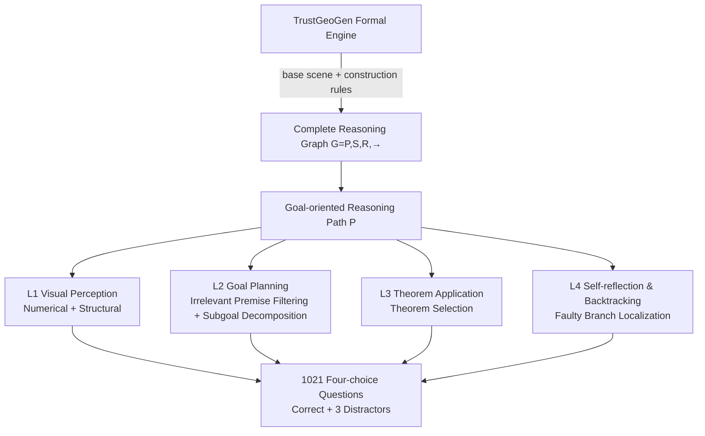

# GeoBench: Rethinking Multimodal Geometric Problem-Solving via Hierarchical Evaluation

**Conference**: ICLR 2026  
**Code**: [https://github.com/FrontierX-Lab/GeoBench](https://github.com/FrontierX-Lab/GeoBench)  
**Area**: Multimodal / VLM Geometric Reasoning Evaluation  
**Keywords**: Geometric problem solving, hierarchical evaluation, formal verification, MLLM, reasoning diagnosis, Chain-of-Thought  

## TL;DR
GeoBench utilizes the formal engine TrustGeoGen to generate 1021 verifiable synthetic geometry problems. Based on the van Hiele cognitive model, geometric reasoning is decomposed into four levels and six tasks ("Visual Perception → Goal Planning → Theorem Application → Self-reflection & Backtracking"), shifting VLM evaluation from "final answer only" to "diagnosing specific bottlenecks."

## Background & Motivation
- **Background**: Multimodal Large Language Models (MLLMs) have approached or even surpassed humans on benchmarks like GeoQA, suggesting that geometric reasoning has been largely solved.
- **Limitations of Prior Work**: Current evaluations suffer from three systemic flaws: (1) Problems are mostly sourced from public textbooks, leading to **test set contamination** where models memorize patterns rather than reason; (2) Evaluation focuses only on the final answer, ignoring the "geometric rigor" defined by theorem chains and proof generation; (3) Lack of diagnostic granularity makes it impossible to determine if a failure stems from weak spatial perception, poor theorem retrieval, or an inability to self-correct.
- **Key Challenge**: High scores mask capability blind spots—a model that memorizes GeoQA answer patterns and a model that truly performs geometric proofs may achieve identical scores on traditional benchmarks, despite vast differences in actual capability.
- **Goal**: Construct an **uncontaminated, process-diagnostic evaluation** capable of locating bottlenecks in geometric reasoning by decomposing the problem-solving process into measurable sub-capabilities.
- **Core Idea**: **Hierarchical Diagnostic Evaluation**—The problem-solving process is divided into four levels based on the van Hiele model, each corresponding to several formally verified sub-tasks. Synthetic data is used to completely avoid textbook contamination, with all reasoning steps verified for correctness via a symbolic solver.

## Method

### Overall Architecture
GeoBench construction involves two stages: First, the formal engine TrustGeoGen generates "Image + Question + Complete Reasoning Graph" triplets (with each step proof-verified by the symbolic system). Second, based on the reasoning graph, the four cognitive levels are instantiated into six multiple-choice tasks, each featuring one correct answer and three carefully designed distractors.

### Key Designs

**1. Formal Reasoning Graph as Ground Truth: Upgrading "Correct Answer" to "Verifiable Process".** GeoBench does not generate questions directly. Instead, TrustGeoGen starts from a random base scene and iteratively expands geometric elements using construction rules to generate a complete reasoning graph $G=(P,S,R,\hookrightarrow)$: where $P$ represents initial premises (relational premises $p^r_i$, e.g., "A, B, C are collinear," and numerical premises $p^n_j$, e.g., $AB=3$), $S$ represents intermediate states, $R$ is the set of deductive rules, and $\hookrightarrow$ is formalized as $S_r \xrightarrow{r} s'$ denoting "applying rule $r$ to state subset $S_r$ to derive $s'$." A goal-oriented reasoning path $\mathcal{P}=\{(S_{i-1},r_s,s)\mid S_{i-1}\xrightarrow{r_s}s\}$ is then backtracked from the target state $s_t$. This "golden reasoning chain," proven by a symbolic solver, serves as the basis for question generation and scoring across all six tasks. The correctness/incorrectness of distractors is formally guaranteed rather than manually annotated, eliminating ambiguity and contamination.

**2. van Hiele Four-Level, Six-Task Framework: Decoupling Geometric Capabilities.** The levels increase in difficulty, with tasks automatically extracted from the reasoning graph. **L1 Visual Perception** includes Numerical Perception (reading numerical premises, with distractors created via numerical tampering $AB=6\to AB=4$ or label tampering $AB\to AY$ to test hallucinations) and Structural Perception (identifying geometric relations, with distractors using negations, e.g., "D, E, F are collinear" → "not collinear"). **L2 Goal Planning** includes Irrelevant Premise Filtering (correct answer selected from unused premises $P\setminus S_0$, requiring $P\setminus S_0\neq\varnothing$ and $|S_0|\geq3$) and Subgoal Decomposition (based on backward chaining, where the correct answer is an intermediate condition $S_{r_t}\setminus P$ required for the conclusion, and distractors are irrelevant intermediate states). **L3 Theorem Application**'s Theorem Selection task picks three rules from the used rule set $R_{used}$ ($|R_{used}|\geq3$) as distractors, while the correct answer is a rule **not used** from the library, testing the model's ability to distinguish relevant from irrelevant theorems. **L4 Self-reflection & Backtracking**'s Faulty Branch Localization defines a faulty path $\mathcal{P}_{faulty}:=\mathcal{P}_{wrong}\setminus\mathcal{P}$ deviating from the golden chain, requiring the model to identify the **first erroneous step** in an 8-step reasoning process—the most difficult task reflecting true self-reflection.

**3. Dual Verification via Synthetic Data + OOD to Ensure Transferable Diagnosis.** All 1021 questions are synthesized from 76 geometric constructions, 42 deductive rules, and 40 base scenes. t-SNE analysis shows that image and solution embeddings have almost no overlap with GeoQA and feature a broader distribution. Solution token lengths often exceed 1,000 (GeoQA limit is 189), with difficulty levels reaching "beyond high school, near competition" standards. Crucially, Spearman's rank correlation $\rho$ is used to relate sub-task score vectors $X_i$ to final solving score vectors $Y$. Subgoal decomposition, irrelevant premise filtering, and theorem selection show the highest correlation, and this ranking remains consistent across GeoBench-solving, GeoQA, and Geometry3K, proving that the bottlenecks diagnosed by GeoBench generalize OOD.

## Key Experimental Results

### Main Results: Four Levels, Six Tasks (Selected Table 4, acc)

| Model | N.P. | S.P. | I.P.F. | S.D. | T.S. | F.B.L. |
|------|------|------|--------|------|------|--------|
| Random | 24.6% | 25.8% | 26.2% | 24.6% | 25.6% | 25.7% |
| Human | 100% | 100% | 77.5% | 100% | 56.7% | 52.9% |
| Qwen2.5-VL-72b | 85.7% | 40.7% | 38.5% | 77.0% | 47.4% | 26.5% |
| GPT-4o | 66.7% | 23.0% | 44.0% | 57.5% | 35.1% | 23.8% |
| OpenAI-o1 | 75.0% | 65.2% | 61.5% | 77.0% | 53.2% | 27.9% |
| **OpenAI-o3** | 81.0% | **74.8%** | **70.0%** | **91.0%** | **54.4%** | 22.5% |
| Gemini-2.5-pro | 81.0% | 60.0% | 74.0% | 87.0% | 45.0% | 18.4% |

- Performance **monotonically declines** as levels increase. Reasoning models (o1/o3/Gemini) broadly outperform general MLLMs. **L4 Faulty Branch Localization is the universal ceiling**, peaking at only 27.9% (near random 25.7%); even o3 drops to 22.5% (below random).

### Difficulty Positioning (Table 3)

| Model | GeoQA | Geometry3K | OlympiadBench-Geo | GeoBench-solving |
|------|-------|-----------|-------------------|------------------|
| Gemini-2.5-pro | 79.6% | 80.7% | 75.0% | 49.6% |
| GPT-4o | 42.3% | 31.5% | 13.4% | 22.1% |

Ours solving difficulty is slightly higher than the competition-level OlympiadBench-Geo and far exceeds high school problems.

### Correlation between Sub-tasks and Final Solving (Table 6, Spearman ρ)

| | N.P. | S.P. | I.P.F. | S.D. | T.S. | F.B.L. |
|---|------|------|--------|------|------|--------|
| vs GeoBench-solving | 0.40 | 0.76 | **0.98** | **0.89** | 0.83 | 0.50 |
| vs GeoQA (OOD) | 0.66 | 0.67 | 0.75 | **0.93** | 0.85 | 0.50 |

### Ablation Study (Table 7 Perturbation / Table 8 Text-only, acc)

| Setting | N.P. | S.P. | S.D. | T.S. |
|------|------|------|------|------|
| Qwen2-VL-72b (Original) | 86.3% | 29.6% | 60.5% | 37.1% |
| Qwen2-VL-72b (Perturbed) | 81.0% | 33.3% | 56.5% | 39.8% |
| Qwen2-VL-72b (Text-only) | 47.6% | 19.3% | 59.5% | 31.0% |
| Qwen2-VL-72b (Img+Text) | 86.3% | 29.6% | 60.5% | 37.1% |

Visual tasks (N.P. 86.3%→47.6%) crash without images, while planning tasks (S.D.) remain stable, proving visual grounding is a genuine requirement rather than a text-shortcut.

### Key Findings
- **Bottleneck Identification**: Irrelevant Premise Filtering (I.P.F.), Subgoal Decomposition (S.D.), and Theorem Selection (T.S.) correlate most strongly with final solving ($\rho$ up to 0.98/0.89/0.83) and are core determinants of success. Faulty Branch Localization shows the weakest correlation.
- **Counter-intuitive CoT Failure**: Ablations on Qwen and GPT-4o ("let's think step by step" vs. "only answer") show that **CoT is not universally beneficial**. It **actually reduces performance on Faulty Branch Localization (F.B.L.)**, suggesting that misleading reasoning steps in the prompt lead CoT to ineffective error correction.
- **Robustness Verification**: Experiments with perturbed datasets and text-only comparisons show significant drops in N.P./S.P. visual tasks without images, confirming the benchmark evaluates visual grounding.

## Highlights & Insights
- **From "Answer Checking" to "Medical Check-ups"**: The four-level, six-task framework acts as a diagnostic suite, pinpointing whether a model fails at perception, planning, theorem application, or correction.
- **Formal Verification = Zero Contamination + Trusted Distractors**: Using a symbolic solver ensures that reasoning steps are mathematically sound, eliminating human annotation noise and ambiguity while preventing textbook leakage.
- **Correlation Analysis Links Diagnosis to Solving**: Quantifying which sub-capability determines final performance via Spearman’s $\rho$ and validating this OOD transforms fragmented task scores into generalizable conclusions.
- **Universal F.B.L. Failure**: The fact that all models, including o3, approach random performance on error localization is a valuable negative signal. It suggests current MLLM "self-reflection" may be performative rather than substantive, highlighting a clear research gap.

## Limitations & Future Work
- **Dependency on a Single Engine**: Data is limited to the 76 constructions/42 rules of TrustGeoGen. While diverse, it remains within a rule-enumerable synthetic distribution, differing from hand-drawn or highly complex real-world diagrams.
- **Multiple-choice Format**: While facilitating automatic scoring, this format introduces a guessing baseline and does not evaluate free-form proof generation.
- **Mechanism Analysis of CoT Failure**: The hypothesis that "misleading steps interfere with correction" needs deeper mechanistic analysis and corresponding prompt/training improvements.
- **Future Directions**: Diagnostic signals could be used for training (e.g., targeted data augmentation for S.D./I.P.F.), expanding to non-Euclidean/solid geometry, and upgrading from multiple-choice to process-level scoring.

## Related Work & Insights
- **Geometric Benchmarks**: GeoQA, Geometry3K, PGPS9K, etc., are mostly textbook-derived and only verify final answers. GeomRel (structure) and GeoSense (theorems) focus on narrow sub-capabilities without systematically linking them to solving efficacy. Ours is the first to cover F.A./V.P./G.P./R.T.A./S.B. across five dimensions (Table 1).
- **Solving Models**: MAVIS (834K CoT), G-LLaVA (170K), and GeoX focus on final answers, echoing the need for structured reasoning assessments proposed here.
- **Synthetic Data**: TrustGeoGen provides the verifiable foundation for this evaluation's credibility.
- **Inspiration**: The combination of hierarchical diagnosis, formal verification, and correlation analysis can be transferred to other reasoning domains like algebraic proof, physics, and program synthesis.

## Rating
- **Novelty**: ⭐⭐⭐⭐ — Combining the van Hiele model with formal reasoning graphs for diagnostic evaluation is innovative; findings on CoT failure on correction tasks are particularly valuable.
- **Experimental Thoroughness**: ⭐⭐⭐⭐ — Covers 18+ models, multiple tasks, human baselines, OOD validation, and robustness tests; Spearman correlations are robust, though F.B.L. sample sizes are relatively small.
- **Writing Quality**: ⭐⭐⭐⭐ — Clear framework, rigorous formal definitions, and information-dense tables.
- **Value**: ⭐⭐⭐⭐ — Provides a diagnostic benchmark for locating reasoning bottlenecks; identifies specific key capabilities (I.P.F./S.D./T.S.) and clear weaknesses (F.B.L.) to guide future research.

<!-- RELATED:START -->

## Related Papers

- [\[ACL 2026\] A Survey of Deep Learning for Geometry Problem Solving](../../ACL2026/multimodal_vlm/a_survey_of_deep_learning_for_geometry_problem_solving.md)
- [\[ICCV 2025\] Pi-GPS: Enhancing Geometry Problem Solving by Unleashing the Power of Diagrammatic Information](../../ICCV2025/multimodal_vlm/pi-gps_enhancing_geometry_problem_solving_by_unleashing_the_power_of_diagrammati.md)
- [\[ICLR 2026\] On Discriminative vs. Generative Classifiers: Rethinking MLLMs for Action Understanding](on_discriminative_vs_generative_classifiers_rethinking_mllms_for_action_understa.md)
- [\[ICLR 2026\] VideoChat-Flash: Hierarchical Compression for Long-Context Video Modeling](videochat-flash_hierarchical_compression_for_long-context_video_modeling.md)
- [\[ICLR 2026\] MME-Emotion: A Holistic Evaluation Benchmark for Emotional Intelligence in Multimodal Large Language Models](mme-emotion_a_holistic_evaluation_benchmark_for_emotional_intelligence_in_multim.md)

<!-- RELATED:END -->
