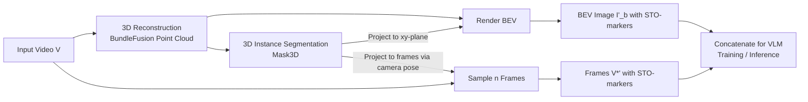

# GPT4Scene: Understand 3D Scenes from Videos with Vision-Language Models

**Conference**: ICLR 2026  
**OpenReview**: [https://openreview.net/forum?id=0fib2BYc0L](https://openreview.net/forum?id=0fib2BYc0L)  
**Code**: TBD  
**Area**: Multimodal Vision-Language Models / 3D Scene Understanding  
**Keywords**: VLM, 3D Scene Understanding, Visual Prompting, Bird's Eye View (BEV), Spatio-Temporal Object Markers, ScanNet  

## TL;DR
Without modifying the VLM architecture or introducing point cloud modalities, this work augments 2D vision-language models with 3D indoor scene understanding capabilities using only a visual prompting paradigm consisting of "videos + reconstructed Bird’s Eye Views (BEV) + cross-frame consistent object ID markers." It achieves SOTA performance in both zero-shot and fine-tuning settings.

## Background & Motivation
- **Background**: 2D VLMs are already highly proficient in image and video understanding. The mainstream approach to extending them to 3D involves incorporating point clouds (3D Point LLM) or a combination of point clouds and multi-view images (Point-Vision-LLM), utilizing richer geometric cues to enhance scene understanding.
- **Limitations of Prior Work**: The additional modality of point clouds is difficult to align with text, requires architectural modifications, and necessitates retraining alignment modules. This is engineering-heavy and possesses poor transferability. Conversely, humans can perceive 3D space using vision alone, suggesting a pure vision-based route is feasible.
- **Key Challenge**: Simply feeding scene videos into a VLM for 3D understanding fails. The authors empirically identify two root causes: **a lack of global scene representation** and a **lack of correspondence between frame-wise local observations and their spatio-temporal context (broken global-local correspondence)**.
- **Goal**: To maximize the visual perception capabilities of pretrained VLMs for understanding 3D scenes directly from pure videos **without modifying the VLM architecture** or introducing point clouds as an input modality.
- **Key Insight**: **[Visual Prompting Paradigm]** Use 3D reconstruction to generate a BEV with a global layout to provide "global" context, and use object markers with consistent IDs across the BEV and individual frames to provide "local-global correspondence." This transforms the 3D understanding problem into a 2D image understanding problem that the VLM handles expertly.

## Method

### Overall Architecture
GPT4Scene is a pipeline that preprocesses video into "multi-view frames with markers + a marked BEV image" to be fed into a VLM. For the input video, 3D reconstruction is performed to obtain a point cloud and render a BEV. 3D instance segmentation is then used to extract objects, and their IDs are projected simultaneously onto the BEV and sampled frames to create cross-view consistent markers. Finally, the "marked video frames + marked BEV" are concatenated and sent to the VLM for training or inference. This paradigm is applicable for zero-shot use with large models or for fine-tuning smaller models.

### Key Designs
**1. Global Information — BEV Image: Transforming "incomplete egocentric views" into an "all-at-once top-down view."** Egocentric videos naturally lack global context, leaving the model unaware of the overall room layout. The authors reconstruct a point cloud $P=R(\{(I_t,E_t)\}_{t=1}^N)$ from the video sequence $V=\{I_1,\dots,I_N\}$ and camera parameters $E$, then render a BEV image $I_b=T(P,E_{top})$ using a top-down camera pose $E_{top}$. The key design choice is providing global 3D information as a **top-down image** rather than a point cloud, staying within the visual modality and preserving the VLM's existing image understanding pathways. Ablations prove that BEV reconstruction quality has minimal impact (using SLAM3R / GS-SLAM / MAST3R-SLAM yields nearly identical ROUGE), suggesting the BEV serves as a "global overview" rather than precise geometry.

**2. Local Correspondence — Spatio-Temporal Object Markers (STO-markers): Stitching frames and the BEV together with consistent object IDs.** A BEV alone is insufficient; the model must know that "the chair in this frame" corresponds to "the object at that position in the BEV." The authors perform 3D instance segmentation (Mask3D) on point cloud $P$ to obtain $K$ object masks $M=\{M_1,\dots,M_K\}$. For the BEV, masks are projected to the xy-plane and annotated at their bounding box center $C^{xy}$. For sampled frames, 3D masks are projected back to 2D based on camera poses, using centroids as markers $C^{uv}_{i,k}$, resulting in marked frames and BEVs: $V^{*\prime}=\{F(I_i,C^{uv}_i)\}$ and $I'_b=F(I_b,C^{xy})$. Since the same object ID is used across all frames and the BEV, **spatial (frame ↔ BEV) and temporal (frame ↔ frame) alignments** are achieved, restoring the broken global-local relationship.

**3. Zero-shot Prompting vs. ScanAlign Fine-tuning: Large models use it directly; small models need a "refresher course."** In zero-shot settings, feeding the marked video into large models significantly improves performance (GPT-4o ScanQA ROUGE 34.2 → 39.3, Gemini-1.5-Pro 35.1 → 39.4). However, 2B/7B models struggle to parse BEV logic or align markers due to weaker cross-modal fusion, often seeing no gain or even a decline. To address this, the authors construct **ScanAlign**: a dataset of 165K text annotations from five ScanNet-based benchmarks (ScanQA, SQA3D, etc.), **reformatted into a VLM-friendly $(V^{*\prime}, I'_b, T)$ visual prompt format**. This is used to fine-tune 7B-scale open-source VLMs.

**4. Endogenous 3D Capability — Removing explicit prompts after training.** A significant finding is that models fine-tuned with the GPT4Scene paradigm **exhibit superior 3D understanding even if the BEV and markers are removed during inference** (Ablation Table 6: ScanQA CIDEr 95.4 vs. 96.3 with prompts, vs. 85.9 for pure video SFT). This suggests the paradigm allows the VLM to internalize "global-local correspondence" as an endogenous capability rather than relying on it as a one-time input trick.

## Key Experimental Results
Benchmarks are based on ScanNet, covering 3D QA (ScanQA/SQA3D), 3D dense captioning (Scan2Cap), and 3D visual grounding (ScanRefer/Multi3DRef). BundleFusion is used for reconstruction and Mask3D for segmentation. 32 frames (512×490) are sampled per video, with training for 1 epoch at 5e-6 lr on 8×A100.

### Main Results (3D Question Answering)

| Method | Modality | ScanQA CIDEr | ScanQA BLEU-1 | SQA3D EM-1 |
|---|---|---|---|---|
| Chat-scene (Point-based SOTA) | Point+Vision | 87.7 | 43.2 | 54.6 |
| LLaVA-3D | Vision | 91.7 | - | 55.6 |
| Video-3D-LLM | Vision | 102.1 | 47.1 | 58.6 |
| ROSS3D | Vision | 107.0 | 49.2 | 63.0 |
| Qwen2-VL-7B (GPT4Scene) | Vision | 96.3 | 44.4 | 60.6 |
| **Qwen2.5-VL-7B (GPT4Scene)** | Vision | **105.7** | **49.2** | **63.5** |

In visual grounding, Qwen2.5-VL-7B (GPT4Scene) achieved 65.6 Acc@0.25 on ScanRefer and 67.3 F1@0.25 on Multi3DRef, significantly leading over point-based SOTA.

### Ablation Study (Training/Inference Components, Qwen2-VL-7B, ScanQA)

| GPT4Scene in Training | GPT4Scene in Inference | METEOR | ROUGE | CIDEr |
|---|---|---|---|---|
| ✓ | ✓ | 18.9 | 46.5 | 96.3 |
| ✓ | ✗ | 18.6 | 45.9 | 95.4 |
| Video-only SFT | ✓ | 17.3 | 43.5 | 88.2 |
| Video-only SFT | ✗ | 16.7 | 42.1 | 85.9 |
| No Training | ✓ | 14.1 | 33.2 | 68.7 |
| No Training | ✗ | 12.4 | 30.8 | 64.7 |

### Key Findings
- **Training is more critical than inference prompting**: Models fine-tuned with the paradigm retain performance even without BEV/markers at inference (96.3 → 95.4), confirming "endogenous 3D capability."
- **Robustness to reconstruction and marker accuracy**: Changing SLAM methods or frame intervals resulted in minimal ROUGE fluctuations.
- **Strengths at the object level**: GPT Score evaluations show GPT4Scene excels most in object-centric tasks like Relational Refer and Existence & Counting.
- **Zero-shot effectiveness depends on scale**: Parameter size determines whether a model can independently parse BEV logic and cross-frame consistency.

## Highlights & Insights
- **"Translating" 3D understanding back to 2D image understanding**: By avoiding architecture changes and point clouds—relying instead on BEV images and consistent ID markers—2D VLMs can tackle 3D tasks with extremely low transfer costs.
- **Endogenous capability as the "Easter Egg"**: The fact that performance holds after removing scaffolding suggests the paradigm truly changes the model's internal representation.
- **Clean data contribution**: ScanAlign is not newly collected data but a reformatting of 165K annotations into a unified visual prompt format, offering high reusability.

## Limitations & Future Work
- **Reliance on offline preprocessing**: BEV and markers require offline 3D reconstruction and Mask3D, which is a heavy pipeline currently unsuitable for real-time end-to-end use.
- **Weaknesses in small object understanding**: Performance decreases as object size diminishes.
- **Limited to indoor ScanNet scenes**: Generalization to outdoor or open-world environments remains unverified.
- **Future Work**: Developing lightweight online modules for "reconstruction+BEV" or enabling VLMs to "imagine" the BEV could lead to a truly end-to-end 3D understanding system.

## Related Work & Insights
- **3D Point LLM / Point-Vision-LLM** (Chat-scene, LL3DA, LEO, etc.): This work provides a vision-only alternative to these point-cloud-reliant methods.
- **Vision-only 3D LLM** (LLaVA-3D, Video-3D-LLM, ROSS3D, etc.): Sharing the same "no point cloud" goal, this work uses "visual prompting" instead of structural changes to bridge the 3D gap.
- **Insight**: Visual prompting combined with top-down views and consistent ID markers is a low-cost, general paradigm for transferring strong foundation models to new tasks requiring global-local correspondence.

## Rating
- Novelty: ⭐⭐⭐⭐ The observation of "pure visual prompts replacing point clouds + endogenous 3D capability after training" is novel. The BEV + consistent marker combination effectively addresses the global-local gap.
- Experimental Thoroughness: ⭐⭐⭐⭐ Five benchmarks across three categories, zero-shot/fine-tuning settings, and multi-angle ablations provide comprehensive coverage.
- Writing Quality: ⭐⭐⭐⭐ Clear logic from problem identification to methodology and validation.
- Value: ⭐⭐⭐⭐ Provides a low-cost, reusable, and "scaffold-free" paradigm for extending 2D VLMs to 3D, holding practical significance for embodied AI and scene understanding.

<!-- RELATED:START -->

## Related Papers

- [\[NeurIPS 2025\] Learning from Videos for 3D World: Enhancing MLLMs with 3D Vision Geometry Priors](../../NeurIPS2025/multimodal_vlm/learning_from_videos_for_3d_world_enhancing_mllms_with_3d_vision_geometry_priors.md)
- [\[ICLR 2026\] SR-3D: 3D-Aware Region Prompted Vision Language Model](3d_aware_region_prompted_vision_language_model.md)
- [\[ICLR 2026\] Error Notebook-Guided, Training-Free Part Retrieval in 3D CAD Assemblies via Vision-Language Models](error_notebook-guided_training-free_part_retrieval_in_3d_cad_assemblies_via_visi.md)
- [\[ACL 2025\] Can Vision Language Models Understand Mimed Actions?](../../ACL2025/multimodal_vlm/can_vision_language_models_understand_mimed_actions.md)
- [\[ICLR 2026\] Mordal: Automated Pretrained Model Selection for Vision Language Models](mordal_automated_pretrained_model_selection_for_vision_language_models.md)

<!-- RELATED:END -->
