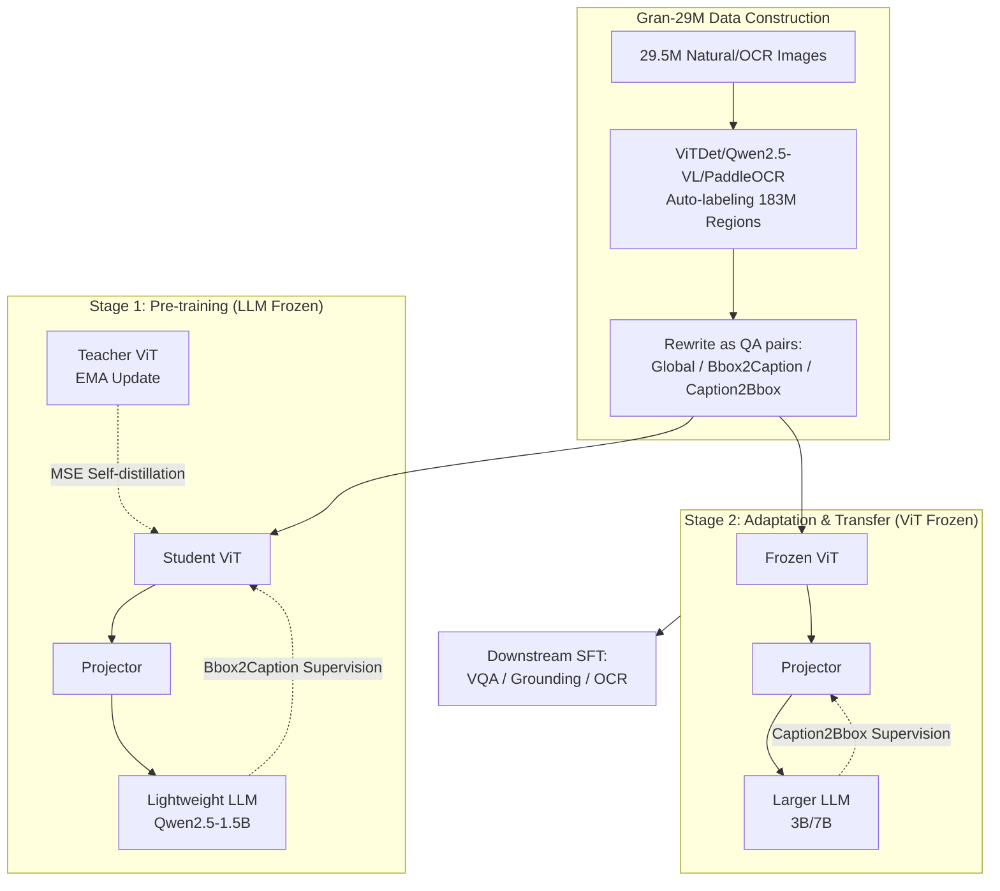

# GranViT: A Fine-Grained Vision Model For Autoregressive Multimodal Large Language Models

**Conference**: ICLR 2026  
**OpenReview**: [https://openreview.net/forum?id=dQ6LWE0LnG](https://openreview.net/forum?id=dQ6LWE0LnG)  
**Code**: TBD  
**Area**: Multimodal Vision Encoder / Fine-grained Perception  
**Keywords**: Vision Encoder, MLLM, Fine-grained Perception, Autoregressive Pre-training, Region-level Annotation, Self-distillation  

## TL;DR
By constructing the Gran-29M dataset with 29.51 million images and 183 million region-level annotations, and pre-training a vision encoder using bidirectional "Bbox→Caption / Caption→Bbox" autoregressive tasks along with local self-distillation, GranViT enables a ViT to possess fine-grained local perception capabilities aligned with the LLM semantic space for the first time, achieving new SOTAs in visual grounding and OCR understanding.

## Background & Motivation

**Background**: Modern MLLMs generally consist of a "pre-trained vision encoder + projection module + LLM" trinity. The training paradigms for vision encoders (such as CLIP, SigLIP, AIMv2, InternViT, etc.) involve either contrastive learning (CLIP/SigLIP) or autoregressive modeling (AIMv2/InternViT), both aiming to align global representations of the **entire image** with textual semantics.

**Limitations of Prior Work**: These encoders focus almost exclusively on image-level global features, **neglecting fine-grained local analysis capabilities**. Attention visualizations (Fig.1b) show that existing encoders exhibit diffuse and misaligned attention when a query token points to a small object. There are two root causes: first, **data scarcity**, characterized by a lack of high-quality fine-grained (region-level bbox + caption) annotation data; second, **paradigm deficiency**, as there is no pre-training framework specifically designed to train fine-grained vision encoders and align their features with LLMs.

**Key Challenge**: MLLMs require vision encoders to **output finer-grained local features** and LLMs to **have the ability to utilize these local features** for localization and reasoning. However, existing paradigms do not optimize these aspects separately, making fine-grained perception (referring expression comprehension, OCR, counting, spatial relations) a significant weakness.

**Goal**: To directly inject fine-grained localization capabilities into the "vision encoder ↔ LLM" cascade structure, allowing the encoder to maintain global perception while gaining region-level understanding, with the capability to transfer to LLMs of different scales.

**Core Idea**: **Utilize an LLM as a decoder and employ region-level bidirectional autoregressive tasks to provide backward supervision for the vision encoder**. Bbox2Caption (generating a caption given a box) strengthens the encoder's local feature extraction; Caption2Bbox (generating a box given a caption) strengthens the LLM's localization using visual features; additionally, a **local self-distillation** mechanism exerts explicit constraints on the encoder's local features. These components are combined in two stages to both strengthen the encoder and ensure transferability.

## Method

### Overall Architecture

GranViT decomposes the process into "data + two-stage training." First, automated labeling using ViTDet, Qwen2.5-VL-7B, and PaddleOCR is used to create Gran-29M (29.51M images, 183M region annotations), with all annotations rewritten into three types of QA pairs: Global Caption, Bbox2Caption, and Caption2Bbox. Training is divided into two stages: **Stage 1 Pre-training** freezes the LLM and only trains the vision encoder and projector, using the Bbox2Caption task to inject local feature supervision into the encoder while introducing a frozen teacher encoder for local self-distillation; **Stage 2 Adaptation & Transfer** freezes the vision encoder and only trains the projector and LLM, using the Caption2Bbox task to develop the LLM's localization capability and complete the transfer to larger LLMs. The Global Caption task is maintained throughout to preserve global perception.

### Key Designs

**1. Gran-29M: Creating an ocean of region-level annotations via existing model pipelines.** The biggest bottleneck for fine-grained pre-training is data. This paper bypasses manual costs using a fully automated labeling pipeline. For natural images, bboxes from UMG-41M are reused, and Qwen2.5-VL-7B regenerates global/local captions; for LAION and FLICKR30k, ViTDet is used for detection and Qwen2.5-VL-7B for descriptions; for OCR images, since global descriptions are too vague (e.g., "a page of a paper"), PaddleOCR is used to label local text boxes and content only. Strict filtering is then applied—short side > 448px, image/bbox aspect ratio within $[\frac{1}{3}, 3]$, bbox area > $100^2$ pixels, and at least one bbox per image—resulting in 29.51M images and 183.55M region annotations. All bbox coordinates are normalized to relative coordinates to eliminate dependence on absolute resolution.

**2. Bbox2Caption / Caption2Bbox: Bidirectional autoregressive tasks to train the encoder and LLM.** This is the core insight. **Bbox2Caption** ("describe the content in this box within 10 words") treats the LLM as a decoder translating visual features into text. Supervision signals are backpropagated through the LLM directly to the selected local visual features, forcing the encoder to extract discriminative fine-grained features. **Caption2Bbox** ("give the bbox coordinates for this description") conversely requires the LLM to understand visual features to output coordinates, training the LLM's ability to utilize fine-grained features for localization. Both tasks use a unified autoregressive caption loss for supervision:

$$L_{caption} = \mathrm{CrossEntropy}(O_{LLM}, T)$$

where $T$ is the ground-truth text and $O_{LLM}$ is the LLM output. The authors observed a key phenomenon in Fig.4: when freezing the LLM in Stage 1, Bbox2Caption ROUGE-L reached 52% but Caption2Bbox ACC@IOU0.5 was only 13%, as generating coordinates depends more on linguistic capacity. After training the LLM in Stage 2, Caption2Bbox improved significantly while Bbox2Caption only increased by 3%. Since continuing Bbox2Caption optimization in Stage 2 yields marginal gains at double the computational cost, the paper **decouples the two tasks into two stages**, forming the "Pre-training—Adaptation" paradigm.

**3. Local Self-distillation: Explicit localization constraints for encoder local features.** Relying solely on $L_{caption}$ for implicit supervision through LLM text output lacks **explicit** constraints on local region features. The paper introduces an additional frozen teacher encoder: the original image is cropped into region blocks $x_{crop}$ and fed into the teacher to obtain local features $x'_{crop}$, while ROIAlign extracts corresponding regions from the student's full-image features. The two are aligned via MSE:

$$L_{distill} = \mathrm{MSE}\big(x'_{crop}, \mathrm{ROIAlign}(x')\big)$$

Teacher weights are updated from the student via EMA: $\theta_{tea} = \alpha\theta_{tea} + (1-\alpha)\theta_{stu}$ (default $\alpha=0.9$). This forces the local features extracted by the student from the full image to approximate the "pure" local features extracted by the teacher from cropped blocks, thereby strengthening region reasoning. The total loss is $L = L_{caption} + \lambda L_{distill}$ (default $\lambda=1$).

**4. Frozen Encoders for Transferability.** The reason for freezing the vision encoder in Stage 2 while training only the LLM and projector is that the encoder is sufficiently pre-trained in Stage 1; continuing its training provides only marginal gains while significantly increasing adaptation costs. Remarkably, this allows the same fine-grained encoder to be attached to LLMs of different scales (Qwen2.5-3B/7B, LLaMA3-8B). Stage 1 uses a lightweight 1.5B LLM to force the encoder to extract **general** fine-grained features (rather than relying on large model reasoning), and Stage 2 transfers to larger LLMs, balancing training efficiency and cross-architecture versatility.

## Key Experimental Results

### Main Results

Comparison of average scores across four task categories with various vision encoders at low resolution (LLM is Qwen2.5-1.5B):

| Task Category | CLIP | SigLip | SigLip2 | AIMv2 | InternViT | SAILViT | **GranViT** |
|---|---|---|---|---|---|---|---|
| Fine-Grained | 66.41 | 57.67 | 75.61 | 73.50 | 70.53 | <u>77.95</u> | **80.78** |
| Multimodal VQA | 51.02 | 49.58 | 52.97 | 53.53 | 50.48 | **53.85** | <u>53.57</u> |
| Multimodal Reasoning | 49.20 | 47.41 | 51.09 | 50.09 | 50.38 | **52.02** | 50.60 |
| OCR Understanding | 38.82 | 37.06 | 51.55 | 48.18 | 45.08 | <u>53.33</u> | **55.97** |

GranViT exceeds the runner-up by 2.83 and 2.64 in Fine-Grained and OCR tasks, respectively. VQA is only 0.3 behind SAILViT, and Reasoning is about 0.4 behind SigLIP2 (the authors explain that reasoning does not heavily rely on fine-grained features and no specific reasoning data was used for training).

### Transferability

Average scores after transferring vision encoders to larger LLMs (GranViT pre-trained with 1.5B then transferred, others used large LLMs for direct SFT):

| LLM | SigLip2 | AIMv2 | SAILViT | **GranViT** |
|---|---|---|---|---|
| Qwen2.5-3B | 62.30 | 62.23 | <u>64.11</u> | **64.94** |
| Qwen2.5-7B | 64.69 | 63.41 | <u>67.11</u> | **67.47** |
| LLaMA3-8B | 65.62 | 63.33 | <u>67.60</u> | **69.02** |

GranViT leads across all three LLMs, validating the strong transferability of the fine-grained encoder. DocVQA metrics are particularly outstanding (77.24 on LLaMA3-8B vs SAILViT's 68.97).

### Ablation Study

Cumulative component addition (trained on small-scale 8M+8M):

| SigLip2 | Stage1 | Self-Distill | Stage2 | Fine-Grained | VQA | Reasoning | OCR |
|:---:|:---:|:---:|:---:|---|---|---|---|
| ✓ | | | | 73.20 | 52.97 | 51.09 | 51.55 |
| ✓ | ✓ | | | 75.06 | 53.64 | 49.89 | 52.77 |
| ✓ | ✓ | ✓ | | 75.55 | 53.90 | 50.32 | 53.02 |
| ✓ | ✓ | ✓ | ✓ | **76.54** | 53.77 | 48.99 | **53.78** |

### Key Findings
- **Reasonable two-stage task division confirmed**: In Stage 1, Bbox2Caption ROUGE-L reached 52% while Caption2Bbox ACC@IOU0.5 was only 13%. Stage 2 training of the LLM significantly improved Caption2Bbox while Bbox2Caption increased by only 3%, proving that the two tasks should be optimized separately.
- **Scaling law for fine-grained pre-training**: In Stage 1 (8M→16M→130M) and Stage 2 (8M→24M→130M region data), fine-grained and OCR performance improved consistently with data volume.
- **Initialization Independence**: Initializing GranViT with InternViT/AIMv2 also yielded gains (e.g., InternViT OCR 45.08→50.13), indicating the paradigm is a plug-and-play enhancement rather than dependent on a specific starting point.
- **Cost**: There is a slight loss in reasoning tasks (GranViT 50.60 vs SAILViT 52.02), as the model prioritized capacity for fine-grained perception over reasoning.

## Highlights & Insights
- **Decoupling "encoder fine-grainedness" and "LLM localization" into two symmetric tasks for staged optimization** is a clean design. Bbox2Caption trains the former while Caption2Bbox trains the latter, with the Fig.4 observation directly justifying why they shouldn't be mixed.
- **Utilizing LLM for backward supervision of the vision encoder** instead of traditional contrastive learning or reconstruction allows encoder features to naturally align with the LLM semantic space, reducing alignment friction.
- **High data pipeline engineering value**: Generating 183 million region annotations automatically via Gran-29M is a significant asset and proves the feasibility of using off-the-shelf LLMs to create fine-grained data.
- **Frozen encoder + lightweight LLM pre-training** achieves both training efficiency and cross-LLM transferability, offering high practical utility.

## Limitations & Future Work
- **Trade-off in reasoning capability**: Fine-grained performance comes at a cost; reasoning benchmarks like MMMU/MathVista are lower than SigLIP2/SAILViT. The authors acknowledge the need for additional reasoning VQA data.
- **Annotation quality depends on upstream models**: Bboxes from ViTDet and captions from Qwen2.5-VL-7B mean systemic biases or hallucinations from upstream models might be inherited by Gran-29M.
- **Homogeneous self-distillation teacher**: Since the teacher is updated via student EMA, the upper bound of additional information gain may be limited.
- **Insufficient exploration of high/native resolution**: While image tiling is mentioned in the appendix, the main experiments use 512×512, leaving room for native high-resolution fine-grained perception.

## Related Work & Insights
- **Vision Encoder Paradigms**: Moving from contrastive learning (CLIP, SigLIP, SigLIP2) to autoregressive (AIMv2, the first pure autoregressive encoder; InternViT, hybrid contrastive+autoregressive), GranViT follows the autoregressive path but introduces **region-level** bidirectional tasks for the first time, evolving "global alignment" into "local alignment."
- **Comparison with SAILViT**: SAILViT also employs LLM alignment and multi-stage pre-training but remains focused on global features. GranViT significantly outperforms it in fine-grained and OCR tasks due to region-level annotations and self-distillation.
- **Insight**: The paradigm of "using downstream consumers (LLM) to supervise upstream producers (Encoder)" + "staged optimization of bidirectional tasks" is generalizable to video, 3D, and other modalities requiring fine-grained understanding. The automated region labeling pipeline also provides a cold-start strategy for other fine-grained tasks.

## Rating
- **Novelty**: ⭐⭐⭐⭐ — The combination of region-level bidirectional autoregressive tasks, LLM backward supervision, and local self-distillation is new. The Fig.4-driven two-stage split is compelling even if individual components are existing techniques.
- **Experimental Thoroughness**: ⭐⭐⭐⭐⭐ — Comprehensive comparisons across 6 encoders, 3 LLMs, 4 task categories, and nearly 20 benchmarks, plus ablations, scaling laws, initialization studies, and visualizations. Very solid.
- **Writing Quality**: ⭐⭐⭐⭐ — Clear logic regarding Motivation-Challenge-Method. Fig.3 and Fig.4 make the framework and intuition very accessible, though some tables are dense and rely on the appendix.
- **Value**: ⭐⭐⭐⭐⭐ — Both the Gran-29M dataset and the plug-and-play fine-grained enhancement paradigm are of direct practical value to the MLLM community. Grounding/OCR SOTAs are significant.

<!-- RELATED:START -->

## Related Papers

- [\[ICLR 2026\] UniF2ace: A Unified Fine-grained Face Understanding and Generation Model](unif2ace_a_underlineunified_underlinefine-grained_underlineface_understanding_an.md)
- [\[CVPR 2026\] DiG: Differential Grounding for Enhancing Fine-Grained Perception in Multimodal Large Language Models](../../CVPR2026/multimodal_vlm/dig_differential_grounding_for_enhancing_fine-grained_perception_in_multimodal_l.md)
- [\[CVPR 2026\] OddGridBench: Exposing the Lack of Fine-Grained Visual Discrepancy Sensitivity in Multimodal Large Language Models](../../CVPR2026/multimodal_vlm/oddgridbench_exposing_the_lack_of_fine-grained_visual_discrepancy_sensitivity_in.md)
- [\[CVPR 2025\] Multimodal Autoregressive Pre-training of Large Vision Encoders](../../CVPR2025/multimodal_vlm/multimodal_autoregressive_pre-training_of_large_vision_encoders.md)
- [\[ICLR 2026\] MotionSight: Boosting Fine-Grained Motion Understanding in Multimodal LLMs](motionsight_boosting_fine-grained_motion_understanding_in_multimodal_llms.md)

<!-- RELATED:END -->
