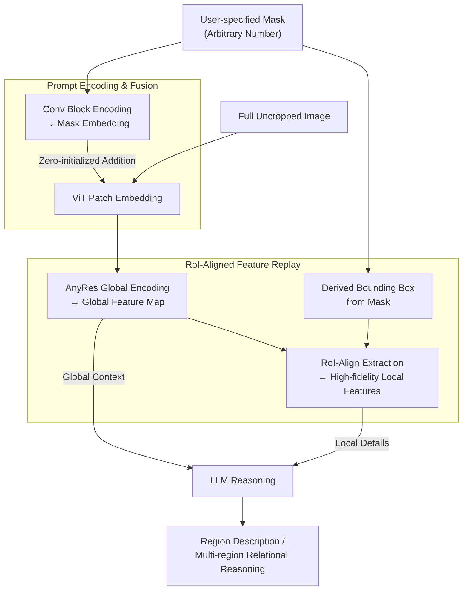

# Grasp Any Region: Towards Precise, Contextual Pixel Understanding for Multimodal LLMs

**Conference**: ICLR2026  
**arXiv**: [2510.18876](https://arxiv.org/abs/2510.18876)  
**Code**: [GitHub](https://github.com/Haochen-Wang409/Grasp-Any-Region)  
**Area**: Multimodal VLM  
**Keywords**: Region-Level MLLM, RoI-Aligned Feature Replay, Multi-Prompt Reasoning, Visual Grounding  

## TL;DR
GAR (Grasp Any Region) is proposed to extract high-fidelity local features while maintaining global context via RoI-aligned feature replay. It achieves precise single-region description, multi-region interaction modeling, and complex reasoning, with the 1B model outperforming InternVL3-78B.

## Background & Motivation
Multimodal Large Language Models (MLLMs) excel at global image understanding but lack the ability to understand fine-grained regions in dense scenes. Region-level MLLMs are a promising direction, yet existing methods face a fundamental trade-off:

- **Local feature pooling methods** (e.g., GPT4RoI, GLaMM): Compress region features into a single vector, losing details.
- **Cropping-based methods** (e.g., DAM): Process only cropped regions, losing global context—for instance, misidentifying frog-shaped slippers as real frogs due to the lack of a bedroom scene context.
- **Single-prompt paradigm** (e.g., DAM, PAM): Treat each region in isolation, failing to model relationships between multiple regions.

The **Key Challenge** lies in simultaneously preserving global scene context and fine-grained local details.

## Core Problem
1. How to maintain global context awareness in region-level understanding to avoid misjudgments caused by isolated analysis?
2. How to support interaction modeling between an arbitrary number of visual prompts?
3. How to upgrade from passive description to active conversational reasoning (including positional reasoning, non-entity recognition, relational reasoning, etc.)?

## Method

### Overall Architecture
The core contradiction GAR aims to resolve is the need for both fine-grained observation of a specific region and the retention of its global context. It follows the standard MLLM backbone (ViT + LLM) but adds two new components on the visual side. First, user-specified masks are encoded as prompts and injected into the ViT without disrupting the original image representation. Second, on the global feature map encoded from the **full uncropped image**, the high-fidelity features of the target region are "replayed" using RoI-Align. This ensures the LLM receives both the overall scene context and zoomed-in local details—unlike cropping methods that only see the local part or pooling methods that only provide a coarse vector. To enable this architecture to learn fine-grained recognition first and then multi-region relational reasoning, the authors developed a two-round iterative data engine. The forward pipeline is: Image + mask prompt → AnyRes global feature map encoding → (Global context + RoI local features via RoI-Align) → LLM reasoning.

### Key Designs

**1. Prompt Encoding and Fusion: Informing the Model "Where to Look" without Disrupting the Image**

Given binary masks, the first hurdle is informing a pre-trained visual backbone without disrupting existing representations. GAR transforms masks into mask embeddings using a lightweight convolutional block, then adds them to the ViT patch embeddings via **zero-initialization**. Zero-initialization ensures that at the start of training, this path outputs zero and does not disturb the pre-trained visual features. Influences from the prompt are learned gradually. Since prompts are added patch-wise, the architecture naturally supports an **arbitrary number** of simultaneous mask inputs—a prerequisite for multi-region relationship modeling.

**2. RoI-Aligned Feature Replay: Extracting Local Features from the Global Map**

This is the core technical contribution, addressing the "global context vs. local detail" trade-off. It involves three steps: encoding the full uncropped image (with encoded mask prompts) via AnyRes to obtain a context-rich feature map; deriving bounding boxes from the input masks; and using RoI-Align (from Mask R-CNN) to extract the target region's features from this global map. The **Key Insight** is that since extracted local features originate from the full image feature map, they inherently carry context while providing high-resolution local representations. This surpasses cropping methods—for example, frog-shaped slippers might be misidentified as real frogs if cropped, but GAR corrects this using the bedroom context. Global context and local detail features are then jointly fed to the LLM.

**3. Tworound Data Engine: From "Fine Recognition" to "Relational Reasoning"**

To cultivate region-level fine-grained understanding and multi-region reasoning, a two-round captioning-judging data engine was designed. **Round 1 (Enhanced Recognition)** uses DAM’s Describe Anything-1.5M as a base and incorporates a fine-grained classification subset from ImageNet-21K. A seed captioner generates descriptions, which are then verified by an LLM against ground-truth labels to filter 456K fine-grained samples for training a fine-grained captioner. **Round 2 (Multi-Prompt Support)** utilizes the Panoptic Scene Graph (PSG) dataset. The fine-grained captioner writes descriptions for each region, and Qwen2.5-72B acts as an LLM-Merger to integrate these with original PSG annotations into relational data. This produces 144K region descriptions with relational context, 144K relational VQA samples, and 126K multiple-choice questions (414K total). This data flow ensures the architecture learns to describe relationships effectively.

## Key Experimental Results

The authors constructed **GAR-Bench** for systematic region-level evaluation. **GAR-Bench-Cap** focuses on multi-prompt relationship descriptions using Simple (direct relationship questions) and Detailed (detail generation with relationships) protocols. **GAR-Bench-VQA** covers multi-dimensional VQA: Perception (198 questions on color, shape, texture, material, etc.) and Reasoning (226 questions), including Position (spatial reasoning), Non-Entity (recognizing reflections, faces on screens), and Relation (complex reasoning between multi-prompts with distractors).

### GAR-Bench-VQA Core Comparison

| Model | Overall | Texture | Non-Entity | Relation |
|------|---------|---------|------------|----------|
| GPT-4o | 53.5 | 48.3 | 60.2 | 61.4 |
| InternVL3-78B | 50.5 | 58.6 | 47.5 | 45.5 |
| DAM-3B | 38.2 | 41.4 | 36.1 | 31.7 |
| **Ours-1B** | **50.6** | **69.0** | **62.3** | **56.4** |
| **Ours-8B** | **59.9** | **75.9** | **60.7** | **68.3** |

- **Ours-1B** (1B parameters) outperforms the total score of InternVL3-78B.
- **Ours-8B** surpasses GPT-4o (standard mode).

### GAR-Bench-Cap Relational Description

| Model | Overall | Simple | Detailed |
|------|---------|--------|----------|
| Gemini-2.5-Pro | 59.3 | 51.6 | 66.4 |
| DAM-3B | 13.1 | 17.5 | 10.3 |
| **Ours-1B** | **57.5** | **56.7** | **63.6** |
| **Ours-8B** | **62.2** | **66.0** | **64.5** |

### DLC-Bench Detailed Captioning
- **Ours-1B**: 67.9 (**Gain**: +3.4 vs. DAM-3B), **Ours-8B**: 67.4.
- Using GPT-4o with cropped images as a judge: **Ours-1B** reaches 77.1, **Ours-8B** reaches 77.0.

### Category-Level Recognition (LVIS / PACO)
- **Ours-8B** leads significantly on LVIS (Sim=93.6 / IoU=88.7) and PACO (Sim=95.5 / IoU=91.8).

### Zero-Shot Video Transfer
- Zero-shot **Ours-8B** surpasses the supervised VideoRefer-7B on VideoRefer-Bench^Q, indicating direct transferability to video.

## Highlights & Insights
1. **Elegant RoI-aligned feature replay**: Performing RoI-Align on global feature maps naturally unifies context and detail without complex dual-branch designs.
2. **High Parameter Efficiency**: The 1B model surpasses a 78B model on GAR-Bench-VQA, proving that architecture matters more than scale.
3. **Multi-Prompt Interaction**: The first to systematically handle relational reasoning between arbitrary numbers of regions, moving beyond the single-prompt paradigm.
4. **Rich Evaluation in GAR-Bench**: Innovative scenarios like non-entity recognition and relational reasoning under distractors.
5. **Zero-Shot Video Transfer**: Outperforms video-specific models using only image training, demonstrating robust representation.

## Limitations & Future Work
1. **Weak Temporal Understanding**: Sole image training results in lower scores for video temporal descriptions (TD) and future prediction.
2. **Dependency on External Masks**: Requires pre-existing segmentation results; segmentation is not yet end-to-end.
3. **LLM-Generated Data Dependence**: Round 2 relies heavily on Qwen2.5-72B, which may introduce LLM bias.
4. **Computational Overhead**: High-resolution global encoding plus RoI feature extraction leads to higher inference costs than cropping methods.
5. **Performance on Position Tasks**: **Ours-1B** scores only 21.9 on Position tasks, significantly lower than general models, suggesting room for improvement in grid-based reasoning.

## Related Work & Insights

| Dimension | DAM | PAM | GPT4RoI / GLaMM | GAR (Ours) |
|------|-----|-----|-----------------|-----|
| Region Representation | Mask (Crop) | Mask (Crop) | Box → Pooled Vector | Mask → RoI-Align |
| Global Context | ✗ | ✗ | ✓ (Limited Detail) | ✓ |
| Local Details | ✓ | ✓ | ✗ | ✓ |
| Multi-Prompt | ✗ | ✗ | Limited | ✓ (Arbitrary) |
| Relational Reasoning | ✗ | ✗ | ✗ | ✓ |

The core advantage of GAR lies in resolving the fundamental conflict between global context and local detail through feature replay, a problem previously left unaddressed.

## Rating
- Novelty: 8/10 — RoI-aligned feature replay is simple yet effective; multi-prompt interaction is a new direction.
- Experimental Thoroughness: 9/10 — Covers 7+ benchmarks with ablation studies and video transfer.
- Writing Quality: 8/10 — Clear problem definition, solid structure, and rich visualization.
- Value: 8/10 — Resolves a fundamental MLLM conflict; GAR-Bench could become a standard benchmark.

## Related Papers

- [\[ICLR 2026\] FlowBind: Efficient Any-to-Any Generation with Bidirectional Flows](flowbind_efficient_any-to-any_generation_with_bidirectional_flows.md)
- [\[ACL 2025\] R-VLM: Region-Aware Vision Language Model for Precise GUI Grounding](../../ACL2025/multimodal_vlm/r-vlm_region-aware_vision_language_model_for_precise_gui_grounding.md)
- [\[ICLR 2026\] NExT-OMNI: Towards Any-to-Any Omnimodal Foundation Models with Discrete Flow Matching](next-omni_towards_any-to-any_omnimodal_foundation_models_with_discrete_flow_matc.md)
- [\[ICLR 2026\] WorldSense: Evaluating Real-World Omnimodal Understanding for Multimodal LLMs](worldsense_evaluating_real-world_omnimodal_understanding_for_multimodal_llms.md)
- [\[ICLR 2026\] MotionSight: Boosting Fine-Grained Motion Understanding in Multimodal LLMs](motionsight_boosting_fine-grained_motion_understanding_in_multimodal_llms.md)

<!-- RELATED:END -->

<!-- RELATED:START -->

## Related Papers

- [\[ICLR 2026\] WorldSense: Evaluating Real-World Omnimodal Understanding for Multimodal LLMs](worldsense_evaluating_real-world_omnimodal_understanding_for_multimodal_llms.md)
- [\[ICLR 2026\] MotionSight: Boosting Fine-Grained Motion Understanding in Multimodal LLMs](motionsight_boosting_fine-grained_motion_understanding_in_multimodal_llms.md)
- [\[ICLR 2026\] NExT-OMNI: Towards Any-to-Any Omnimodal Foundation Models with Discrete Flow Matching](next-omni_towards_any-to-any_omnimodal_foundation_models_with_discrete_flow_matc.md)
- [\[ICLR 2026\] FlowBind: Efficient Any-to-Any Generation with Bidirectional Flows](flowbind_efficient_any-to-any_generation_with_bidirectional_flows.md)
- [\[ICLR 2026\] Visual Self-Refine: A Pixel-Guided Paradigm for Accurate Chart Parsing](visual_self-refine_a_pixel-guided_paradigm_for_accurate_chart_parsing.md)

<!-- RELATED:END -->
