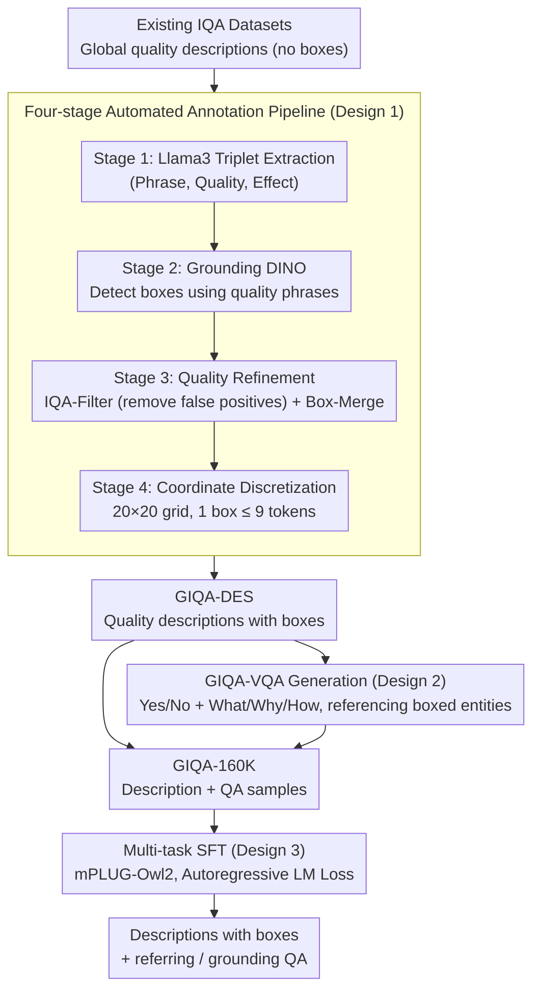

# Grounding-IQA: Grounding Multimodal Language Models for Image Quality Assessment

**Conference**: ICLR 2026  
**arXiv**: [2411.17237](https://arxiv.org/abs/2411.17237)  
**Code**: [https://github.com/zhengchen1999/Grounding-IQA](https://github.com/zhengchen1999/Grounding-IQA)  
**Area**: Object Detection / Multimodal VLM / Image Quality Assessment  
**Keywords**: Image Quality Assessment, Spatial Localization, Multimodal LLM, Fine-grained Perception, Grounding

## TL;DR
By combining spatial localization (referring + grounding) with image quality assessment, the GIQA-160K dataset was constructed to train multimodal LLMs to generate quality descriptions with bounding boxes and spatial VQA, significantly outperforming general MLLMs in fine-grained quality perception.

## Background & Motivation

**Background**: Image Quality Assessment (IQA) has evolved from traditional metrics ($PSNR$/$SSIM$) to semantic IQA based on multimodal LLMs (e.g., Q-Instruct), which can generate natural language descriptions for quality evaluation.

**Limitations of Prior Work**: Existing IQA methods only provide image-level quality descriptions (e.g., "the overall image is blurry") and cannot precisely indicate which regions have specific quality issues. For complex images (e.g., partially clear, partially blurry), global descriptions are too coarse.

**Key Challenge**: IQA requires fine-grained spatial localization capabilities, but existing IQA datasets lack spatial annotations, and the spatial perception capabilities of MLLMs have not been fully utilized in low-level vision tasks.

**Goal**: (a) Construct an IQA dataset with spatial annotations, and (b) train MLLMs to simultaneously perform quality assessment and spatial localization.

**Key Insight**: Define two new sub-tasks—GIQA-Description (quality descriptions with boxes) and GIQA-VQA (quality QA with spatial information).

**Core Idea**: Enable the IQA model not only to state "the image is blurry" but also to point out that "the billiard table area (bbox) is clear, while the background area (bbox) is blurry."

## Method

### Overall Architecture
The paper addresses the issue where "IQA only provides global scores and cannot pinpoint specific problematic areas." The pipeline consists of two stages: first, an automated annotation pipeline is used to "upgrade" existing global quality descriptions into fine-grained annotations with bounding boxes, forming the GIQA-160K dataset; then, this data is organized into "Description with Boxes (GIQA-DES)" and "Spatial QA (GIQA-VQA)" samples for standard SFT on MLLMs such as mPLUG-Owl2. The trained model can output descriptions with coordinates like "the billiard table region (bbox) is clear" and answer quality questions in both referring and grounding directions.

### Key Designs

**1. Four-stage Automated Annotation Pipeline: Automatically adding spatial coordinates to box-less quality descriptions**

Existing IQA datasets only provide image-level text descriptions without any spatial annotations, and manual labeling is extremely costly. The pipeline extracts boxes in four steps: Stage 1 uses Llama3 to extract triplets (descriptive phrase, quality, effect) from original descriptions to locate "which object, what quality, what effect"; Stage 2 feeds the descriptive phrases (rather than just object names) into Grounding DINO to detect bounding boxes—detection with quality context is more precise than using bare object names; Stage 3 involves quality refinement, using an IQA-Filter (based on Q-Instruct) to verify if the detected box actually contains the specified quality issue, followed by Box-Merge to combine fragmented boxes pointing to the same area; Stage 4 performs coordinate discretization, mapping continuous coordinates to indices on a $20 \times 20$ grid. A box is represented by at most 9 tokens, making it easy to insert into the language model's text sequence. This Filter + Merge refinement improved box localization mIoU from 0.562 to 0.585.

**2. GIQA-VQA Generation: Rewriting boxed descriptions into bidirectional QA pairs**

Having boxed descriptions alone is not flexible enough. The paper further automatically generates spatial QA from GIQA-DES descriptions. LLMs generate approximately 50,000 samples for two types of questions: Yes/No judgment questions and What/Why/How open-ended questions, forcing each question to reference boxed entities. This allows the VQA format to naturally support two query directions—referring (asking about quality given a location) and grounding (asking for the location given a quality), covering more scenarios than a single description format.

**3. Multi-task SFT: Joint training of descriptions and QA for mutual benefit**

Finally, standard supervised fine-tuning is performed on GIQA-160K with the training objective of autoregressive language model loss, without introducing extra structures. The key choice was to mix GIQA-DES and GIQA-VQA samples for multi-task training rather than training them separately. Ablation results support this choice: compared to training only on descriptions (Only-DES), multi-task training achieved higher VQA accuracy; compared to training only on QA (Only-VQA), it achieved better description quality (LLM-Score). The two tasks share the same fine-grained spatial-quality representation, providing positive supervision to each other.

## Key Experimental Results

### Main Results (GIQA-Bench, mPLUG-Owl2-7B)

| Metric | Before Tuning | After Tuning | Gain |
|------|--------|--------|------|
| BLEU@4 | 3.62 | 22.87 | +19.25 |
| LLM-Score | 48.25 | 63.00 | +14.75 |
| mIoU (Box Localization) | N/A | 0.5955 | - |
| Total VQA Accuracy | 56.3% | 74.2% | +17.9% |

### Cross-model comparison

| Model | mIoU | BLEU@4 | Total VQA Accuracy |
|------|------|--------|------------|
| LLaVA-v1.5-7B | 0.528 | 19.02 | 68.5% |
| LLaVA-v1.6-7B | 0.598 | 19.17 | 72.5% |
| **mPLUG-Owl2-7B** | **0.596** | **22.87** | **74.2%** |

### Ablation Study

| Configuration | Tag-Recall | LLM-Score | VQA Accuracy |
|------|-----------|-----------|----------|
| Only-DES | 0.550 | 61.75 | 59.0% |
| Only-VQA | 0.328 | 38.50 | 72.2% |
| **GIQA-160K (DES+VQA)** | **0.547** | **63.00** | **74.2%** |

### Key Findings
- Multi-task training improved VQA accuracy by 2.0% compared to Only-VQA and increased description quality by 1.25 LLM-Score compared to Only-DES.
- Quality refinement (IQA-Filter + Box-Merge) increased mIoU from 0.562 to 0.585.
- Coordinate discretization into a $20 \times 20$ grid requires only 9 tokens, ensuring high efficiency.

## Highlights & Insights
- **Cross-innovation of IQA + Grounding**: Introducing referring/grounding into IQA is a natural yet previously unexplored interdisciplinary direction.
- **Automated Annotation Pipeline**: The four-stage pipeline is highly automated and applicable to other low-level vision tasks requiring spatial annotations.
- **Dataset Contribution**: GIQA-160K contains 167,000 annotated samples, making it the first IQA dataset with spatial localization.

## Limitations & Future Work
- The annotation pipeline relies on multiple models (Llama3, Grounding DINO, Q-Instruct), which may lead to cumulative errors.
- The spatial resolution of the $20 \times 20$ grid is limited, resulting in lower localization precision for quality issues in small regions.
- Validation was only performed on 7B models; the effectiveness on larger models remains unknown.
- The quality descriptions used for training originate from existing IQA datasets, limiting the types of quality issues covered.

## Related Work & Insights
- **vs Q-Instruct**: Q-Instruct provides text-only IQA and does not support spatial localization; this work adds spatial annotations to its outputs.
- **vs Grounding DINO**: Grounding DINO is used within the annotation pipeline but cannot perform IQA directly.

## Rating
- Novelty: ⭐⭐⭐⭐ The task definition of IQA + Grounding is novel, though the method (SFT fine-tuning of MLLMs) is relatively standard.
- Experimental Thoroughness: ⭐⭐⭐⭐ Includes multi-model validation and ablations, but lacks detailed comparisons with specialized IQA methods.
- Writing Quality: ⭐⭐⭐⭐ Detailed description of the annotation pipeline.
- Value: ⭐⭐⭐⭐ The contributions of the dataset and task definition outweigh the method itself.

<!-- RELATED:START -->

## Related Papers

- [\[ICLR 2026\] Self-Evolving Vision-Language Models for Image Quality Assessment via Voting and Ranking](self-evolving_vision-language_models_for_image_quality_assessment_via_voting_and.md)
- [\[CVPR 2026\] R4-CGQA: Retrieval-based Vision Language Models for Computer Graphics Image Quality Assessment](../../CVPR2026/multimodal_vlm/r4-cgqa_retrieval-based_vision_language_models_for_computer_graphics_image_quali.md)
- [\[CVPR 2026\] Probabilistic Prompt Adaptation for Unified Image Aesthetics and Quality Assessment](../../CVPR2026/multimodal_vlm/probabilistic_prompt_adaptation_for_unified_image_aesthetics_and_quality_assessm.md)
- [\[CVPR 2026\] UARE: A Unified Vision-Language Model for Image Quality Assessment, Restoration, and Enhancement](../../CVPR2026/multimodal_vlm/uare_a_unified_vision-language_model_for_image_quality_assessment_restoration_an.md)
- [\[ICLR 2026\] VisJudge-Bench: Aesthetics and Quality Assessment of Visualizations](visjudge-bench_aesthetics_and_quality_assessment_of_visualizations.md)

<!-- RELATED:END -->
