# Guided Query Refinement: Multimodal Hybrid Retrieval with Test-Time Optimization

**Conference**: ICLR 2026  
**OpenReview**: [https://openreview.net/forum?id=4GRsedu43K](https://openreview.net/forum?id=4GRsedu43K)  
**Code**: Open source ("We release our code here" in the paper)  
**Area**: Multimodal Retrieval / Visual Document Retrieval / Hybrid Retrieval  
**Keywords**: Visual Document Retrieval, Hybrid Retrieval, Test-Time Optimization, ColPali, Query Refinement, Late Interaction  

## TL;DR
The paper proposes **Guided Query Refinement (GQR)**: an approach that uses scores from a lightweight text retriever as guidance signals at test-time to iteratively refine the query embeddings of a visual retriever (ColPali series) via gradient descent. This allows ColPali models to approach or even exceed the retrieval quality of significantly larger models while maintaining a small representation footprint, achieving up to 14× speedup and 54× memory savings.

## Background & Motivation
- **Background**: Visual document retrieval (retrieving PDF pages containing charts/tables) follows two main technical routes. The text-centric route relies on OCR/VLM to convert documents into text followed by semantic encoder indexing. The vision-centric route, represented by ColPali (based on ColBERT late interaction), treats document pages directly as images and performs fine-grained matching between query tokens and image patches, achieving SOTA on public leaderboards.
- **Limitations of Prior Work**: ① ColPali-based models aggressively increase the length and dimension of query and document representations to improve performance, leading to high deployment costs—for instance, LLAMA-NEMORETRIEVER-COLEMBED-3B requires 10 MB per document page, three orders of magnitude higher than single-vector dense retrievers, making latency and storage difficult to scale. ② Pure vision routes suffer from the inherent **modality gap** of modern VLMs, which limits matching performance between text queries and text-rich documents.
- **Key Challenge**: While hybrid retrieval could bridge these gaps using complementary representations, existing methods only perform coarse-grained fusion at the **ranking level** (RRF, Average Ranking) or **scoring level** (weighted addition after Min-Max / Softmax normalization). These compress each query-document pair into an integer rank or scalar score, discarding rich query-document interaction information in the representation space. Ideal **representation-level fusion** is the most informative but difficult to implement due to heterogeneous encoder dimensions/scales, lack of supervision, and strict latency/memory budgets.
- **Goal**: To tap into the potential of the representation layer—letting a weak text retriever "guide" a stronger visual retriever—while remaining architecture-agnostic, lightweight, and practical.
- **Core Idea** (**Test-Time Query Refinement**): Instead of redefining scoring rules, GQR treats the scores of a complementary retriever as a learning signal to perform gradient descent on the main retriever's query embeddings. The **key constraint** is that gradients backpropagate only through the main retriever's similarity function. Any change in ranking must be "interpretable" within the main model's own embedding space, allowing the weak model's signal to be **soft-filtered** by the main model's concept of similarity rather than overriding scores directly.

## Method

### Overall Architecture
GQR operates between the "scoring layer" and "representation layer" in two phases. **Phase 1 (Candidate Pool Construction)**: The main retriever $m_1$ (vision-based, e.g., Colnomic-7B) and the complementary retriever $m_2$ (text-based, e.g., Linq-Embed) independently encode the query and retrieve top-K results. Their union $C(q)=\bigcup_m \pi_m(q)$ forms the candidate pool. **Phase 2 (Query Refinement)**: Fixing the $m_2$ query embedding, the $m_1$ query embedding is treated as an optimizable variable. KL divergence is used over $T$ iterations to pull the main distribution Toward a "consensus distribution." Finally, the refined query embedding is used to rescore and rerank the candidate pool. GQR is architecture-agnostic and works for both single-vector and multi-vector query embeddings.

```mermaid
flowchart LR
    Q[Query q] --> R1[Main Retriever m1<br/>Vision ColPali]
    Q --> R2[Complementary Retriever m2<br/>Text Dense]
    R1 -->|top-K| Pool[Candidate Pool C&#40;q&#41;<br/>Union]
    R2 -->|top-K| Pool
    Pool --> Opt[Phase 2: Iterative Refinement<br/>Gradient Descent on z^t for T steps]
    R2 -. Fixed Score p2 .-> Opt
    Opt --> Score[Rescore with z^T<br/>from m1 only]
    Score --> Out[Final top-K Ranking]
```

### Key Designs

**1. Consensus distribution as a soft target:** GQR first converts each retriever's scores on the candidate pool into a probability distribution via Softmax: $p_j(d_i\mid e^q_j)=\frac{\exp(s_j(q,d_i))}{\sum_k \exp(s_j(q,d_k))}$. Let the initial query embedding be $z^{(0)}=e^q_1$. In step $t$, the **consensus distribution** is defined as the average of the main and (fixed) auxiliary distributions: $p^{(t)}_{avg}(d)=\tfrac12\big(p_1(d\mid z^{(t)})+p_2(d\mid e^q_2)\big)$, where only $p_1$ changes with $z^{(t)}$. This averaging design accounts for the reality that the **complementary retriever might be weaker** than the main retriever. Unlike traditional methods using pseudo-relevance feedback from a strong cross-encoder, GQR utilizes $p_{avg}$ to gently inject signals from a lightweight bi-encoder.

**2. KL divergence-driven query embedding refinement:** The optimization objective is to pull the main distribution toward the consensus distribution by minimizing $L^{(t)}=\mathrm{KL}\big(p^{(t)}_{avg}(d)\,\|\,p_1(d\mid z^{(t)})\big)$. In each step, a gradient step is applied to the query representation $z^{(t+1)}=z^{(t)}-\alpha\nabla_z L(z^{(t)})$ (the paper adopts Adam as it performed better than SGD). After $T$ steps, top-K are selected using $s^{(T)}_1(q,d)=s_1(z^{(T)},d)$. Minimizing KL pushes $p_1$ to align with high-probability areas of the auxiliary distribution while suppressing low-probability ones. $T$ and step size $\alpha$ are the only two hyperparameters.

**3. Non-uniform soft fusion via "moving in the main space":** This is the fundamental difference between GQR and score-level fusion. In score-level fusion, each document's probability is shifted by a **fixed amount** from the auxiliary retriever (weighted average). In GQR, gradients backpropagate through $s_1(z,d)$. Documents influence the update based on their own embeddings and relative probabilities, meaning **different documents can move by different magnitudes along non-linear trajectories** determined by the geometry of the main space. When $m_2$ is weak or misaligned with $m_1$, its signals are filtered by the main model's similarity structure, leading to more robust fusion.

## Key Experimental Results

Datasets: ViDoRe 1 / 2 / 3 Visual Document Retrieval benchmarks; Metric: NDCG@5. Main retrievers (ColPali series): Colnomic-7B, Jina-v4(vision), Llama-Nemo-3B. Complementary retrievers (text): Jina(text), Linq-Embed, Qwen3. Total 9 pairs.

### Main Results (ViDoRe 2, NDCG@5)

| Main Retriever | GQR Complementary Model | Avg | Δ |
|---|---|---|---|
| Colnomic-7B | No Refinement | 60.3 | — |
| Colnomic-7B | Jina(text) | 63.1 | ↑+2.8 |
| Colnomic-7B | Linq-Embed | 62.8 | ↑+2.5 |
| Jina(vision) | No Refinement | 57.2 | — |
| Jina(vision) | Linq-Embed | 61.2 | ↑+4.0 |
| Jina(vision) | Jina(text) | 60.7 | ↑+3.5 |
| Llama-Nemo | No Refinement | 63.0 | — |
| Llama-Nemo | Linq-Embed | 65.2 | ↑+2.2 |

Highlight: Even when Qwen3 (46.8) is 16.2 points lower than Llama-Nemo (63.0), as a complementary signal, it still provides a +0.3 gain—weak models do not drag down performance.

### Ablation Study (ViDoRe 2, Avg. % Gain in NDCG@5 relative to base, 9-pair average)

| Method | Avg Gain | Std |
|---|---|---|
| Average Ranking | ↓-3.0% | 2.5 |
| RRF | ↓-2.8% | 2.6 |
| Score Agg (Min-Max) | ↑+0.4% | 2.6 |
| Score Agg (Softmax) | ↑+1.5% | 1.9 |
| Score Agg (Min-Max, Tuned) | ↑+3.4% | 2.1 |
| Score Agg (Softmax, Tuned) | ↑+2.6% | 2.3 |
| **GQR** | **↑+3.9%** | **1.9** |

GQR achieves the highest gain with the lowest standard deviation. It is the only method that provides consistently positive gains; ranking-level fusion (RRF/Average) often leads to performance drops.

### Key Findings
- **Efficiency Pareto Frontier Shift**: A single Llama-Nemo model (NDCG@5=62.9) requires 2591 ms per query. Colnomic+GQR(Linq) achieves 62.7 in only 181 ms (≈14× speedup), while Colnomic+GQR(Jina) reaches 63.0 in 350 ms (≈7× speedup), surpassing Nemo. GQR also excels on the index storage Pareto frontier.
- **Zero-shot Generalization**: Using a fixed hyperparameter configuration (transferred from ViDoRe 2) on ViDoRe 3, GQR consistently outperforms the no-refinement baseline across all model pairs and subsets (e.g., Colnomic-7B 55.7→57.4, +4.4 on the fin_en subset).
- ViDoRe 1 is largely saturated (many subsets 90+), where GQR remains competitive with the base.

## Highlights & Insights
- **Interpreting "Scores" as "Gradient Signals"**: While traditional hybrid retrieval treats complementary scores as components to be added, GQR treats them as loss directions to guide query representation movement. This accesses the rich interactions of the representation layer without defining new scoring rules.
- **Weak Models Guiding Strong Models**: A core counter-intuitive conclusion is that even if a complementary retriever is weaker or uses a different modality, its soft-constrained injection via KL allows it to consistently improve the main model without "dragging it down."
- **Addressing Deployment Pain Points**: Rather than chasing incremental rank gains, the approach uses small representations and a few test-time optimization steps to achieve order-of-magnitude savings in latency and memory.
- **Architecture-Agnostic**: Works for single/multi-vector systems and is plug-and-play at test-time without retraining or extra supervision.

## Limitations & Future Work
- Test-time iterative optimization introduces extra online latency per query (though relatively small); this remains an overhead for extreme low-latency scenarios. $T$ and $\alpha$ require tuning or transfer from a dev set.
- Validated primarily for $M=2$ (one vision, one text); the scalability for multi-retriever or multi-modal scenarios is not fully explored.
- The consensus distribution is fixed as an equal average; it does not adapt according to the confidence of the complementary retriever.
- Evaluated only on visual document retrieval (ViDoRe); effectiveness in general text retrieval or cross-lingual tasks remains to be verified.

## Related Work & Insights
- **Hybrid Retrieval**: Classic RRF and Score Aggregation operate at the ranking/score level. This paper demonstrates these often fail to provide gains for ColPali visual retrieval.
- **Late Interaction Retrieval**: Evolution from ColBERT to ColPali systems (Colnomic, Jina-v4, Llama-Nemo) provides fine-grained matching but at the cost of massive representation sizes.
- **Test-Time Optimization / Pseudo-Relevance Feedback**: Inspired by cross-encoder feedback methods, but GQR innovates by using lightweight bi-encoders and an averaged consensus distribution to tolerate weak complementary models.

## Rating
- **Novelty**: ⭐⭐⭐⭐ — The representation-layer compromise of "turning complementary scores into KL gradient signals" is novel and distinct from existing hybrid or feedback methods.
- **Experimental Thoroughness**: ⭐⭐⭐⭐ — Covers ViDoRe 1/2/3, 9 model pairs, tuning vs. zero-shot settings, and double Pareto analysis for latency/storage.
- **Writing Quality**: ⭐⭐⭐⭐ — The conceptual framework of three fusion layers (ranking/score/representation) is clear, and the derivation is coherent.
- **Value**: ⭐⭐⭐⭐ — Directly addresses the latency/memory pain points of ColPali deployment with significant practical gains.

<!-- RELATED:START -->

## Related Papers

- [\[ICLR 2026\] Flatness-Guided Test-Time Adaptation for Vision-Language Models](flatness_guided_test-time_adaptation_for_vision-language_models.md)
- [\[CVPR 2026\] Intra-class Distribution-guided Generative Hashing with Neighbor Refinement for Cross-modal Retrieval](../../CVPR2026/multimodal_vlm/intra-class_distribution-guided_generative_hashing_with_neighbor_refinement_for_.md)
- [\[ICLR 2026\] A-TPT: Angular Diversity Calibration Properties for Test-Time Prompt Tuning of Vision-Language Models](a-tpt_angular_diversity_calibration_properties_for_test-time_prompt_tuning_of_vi.md)
- [\[ICLR 2026\] Manzano: A Simple and Scalable Unified Multimodal Model with a Hybrid Vision Tokenizer](manzano_a_simple_and_scalable_unified_multimodal_model_with_a_hybrid_vision_toke.md)
- [\[ICLR 2026\] Bilateral Information-aware Test-time Adaptation for Vision-Language Models](bilateral_information-aware_test-time_adaptation_for_vision-language_models.md)

<!-- RELATED:END -->
