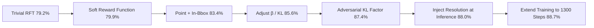

# GuirlVG: Incentivize GUI Visual Grounding via Empirical Exploration on Reinforcement Learning

**Conference**: ICLR 2026  
**OpenReview**: [https://openreview.net/forum?id=zrH2A1upAo](https://openreview.net/forum?id=zrH2A1upAo)  
**Code**: TBD  
**Area**: Multimodal / GUI Visual Grounding / Reinforcement Fine-Tuning  
**Keywords**: GUI Visual Grounding, GRPO, Reinforcement Fine-Tuning, MLLM, Data Efficiency  

## TL;DR
This paper decomposes Rule-based Reinforcement Fine-Tuning (RFT/GRPO) into "reward function, prediction format, KL penalty, and training configuration" for systematic controlled ablation. By introducing an **Adversarial KL Factor** that adaptively suppresses reward over-optimization, it surpasses methods utilizing tens of millions of SFT samples on the ScreenSpot benchmark with only 5.2K samples.

## Background & Motivation
**Background**: GUI Visual Grounding (GUI-VG, locating operable elements in screenshots given instructions) is a core capability for GUI agents. The mainstream approach involves supervised fine-tuning (SFT) of Multimodal Large Language Models (MLLMs), which requires massive domain-specific data and expensive training.

**Limitations of Prior Work**: As MLLMs continue to improve and absorb GUI data during pre-training, the cost-effectiveness of re-performing large-scale SFT for each model generation is becoming questionable. While migrating DeepSeek-R1 style rule-based RFT (GRPO) to GUI-VG shows potential, **no systematic study has investigated its proper implementation**.

**Key Challenge**: The authors find that under a fair experimental setup, **naive RFT underperforms SFT** (ScreenSpot 79.2% vs 82.6%). This indicates that applying RFT to GUI-VG is not a simple matter of changing the objective function; the optimal form of each component requires recalibration.

**Goal**: Rather than purely chasing benchmarks, this study aims to perform step-by-step fair ablations to derive reproducible conclusions on how to design RFT for GUI-VG and resolve training instability (reward over-optimization).

**Core Idea**: **Deconstruct GRPO into independently ablatable components**—identifying optimal configurations for format rewards, accuracy rewards, prediction formats, KL coefficients, fine-tuning strategies, group/batch sizes, and resolution prompts. Furthermore, **reward-driven dynamic KL scaling** is proposed to stabilize training.

## Method

### Overall Architecture
GuirlVG uses Qwen2.5-VL + LoRA as the backbone and performs rule-based RFT within the GRPO framework. The model samples a group of candidate responses for each instruction, which are scored by auto-verifiable rule rewards, and the policy is updated using group-normalized advantage with a KL penalty. The "Method" section is essentially an **exploration trajectory**: starting from trivial RFT (79.2%), it sequentially replaces components with superior alternatives, eventually reaching 88.7% on ScreenSpot.

### Key Designs
**1. Soft Reward Function (SRF): Replacing "all-or-nothing" rewards with decomposable partial scores.** The default GRPO format reward requires outputs to strictly match `<think>...</think><answer>...</answer>` with coordinates in a JSON list. Missing a single tag or using a tuple results in a zero score even if the reasoning is correct, which injects noise. SRF provides partial points for each tag (`<think>`/`</think>` +0.5 each, `<answer>`/`</answer>` +1/3 each, correct coordinate count +1/3, normalized to $[0,1]$), while the accuracy reward extracts values regardless of style. This alone improves performance from 79.2% to 79.9%, suggesting that "strictly adhering to pre-trained output styles is unnecessary."

**2. Point + In-Bbox Reward: Aligning rewards with the actual mission objective.** Downstream actions in GUI-VG only require a point within the target element. Therefore, rather than predicting a bbox and calculating IoU (Continuous IoU 81.6%, IoU@0.5 threshold 79.9%) or using Distance@80 (82.7%), it is better to **directly predict a point and use a binary reward based on whether the point falls within the GT bbox** (In-Bbox 83.4%). The conclusion is simple but critical: rewards work best when aligned with functional goals.

**3. Adversarial KL Factor: Using rewards to adaptively scale KL penalties to suppress over-optimization.** This is the primary technical novelty. The intuition is that high-reward responses are more prone to over-optimization; if the base model already assigns these high probabilities, static KL terms fail to provide sufficient suppression. The KL coefficient is multiplied by a factor $\alpha_i = r_i / m$ (where $m=2$ is the maximum possible reward), rewriting the objective as:
$$J_i = A_i - \alpha_i\,\beta\, D_{KL}(o_i \| o_i^{orig}),\qquad A_i = \frac{r_i - \mathrm{Mean}(\{r\})}{\mathrm{Std}(\{r\})}$$
Higher rewards trigger stronger regularization, achieving dynamic balance. This yields an +1.8% improvement (85.6%→87.4%) over the optimal $\beta=10^{-4}$. Experiments also show GRPO is extremely sensitive to $\beta$.

**4. Empirical Optimal Training Configuration: LoRA, group/batch size, and resolution prompt timing.** These are "best practices" derived from controlled ablations: (a) LoRA achieves precision nearly equal to full fine-tuning (87.4% vs 87.5%) while being over 25x faster per step; (b) A group size of 6 and batch size of 4 is optimal, while increasing group size to 8 causes a significant drop (87.4%→83.9%); (c) **Injecting resolution prompts only during inference works best** (88.0%). Withholding resolution during training forces the model to learn better spatial reasoning.

## Key Experimental Results

### Main Results (Data Efficiency Comparison)

| Method | Training Samples | ScreenSpot Avg | ScreenSpot v2 Avg |
|------|---------|----------------|-------------------|
| SeeClick | 364K | 53.4 | 55.1 |
| UGround (7B) | 1.3M | 73.3 | — |
| OS-Atlas (7B) | 13.58M | 81.0 | 84.1 |
| **GuirlVG (7B)** | **2K** | **88.0** | **90.9** |
| **GuirlVG (7B)** | **5.2K** | **88.7** | **91.9** |

Using only 5.2K samples, the method outperforms OS-Atlas (13.58M samples) by +7.7% on ScreenSpot and +7.8% on ScreenSpot v2. Despite no mobile samples in the training set, it leads OS-Atlas by +11.8% on the Mobile-Icon subset, confirming that "SFT prioritizes memory, while RL enhances generalization."

### Ablation Study (Key Steps in Exploration Trajectory)

| Step | ScreenSpot Acc (%) |
|------|--------------------|
| RFT (trivial) | 79.2 |
| + Soft Reward Function | 79.9 |
| + Point & In-Bbox | 83.4 |
| + Tune β=1e-4 | 85.6 |
| + Adversarial KL Factor | 87.4 |
| + Inference-time Resolution Prompt | 88.0 |
| + Train to 1300 steps | 88.7 |

### Key Findings
- Naive RFT does not beat SFT; component-wise tuning is mandatory (Finding 1).
- Reward functions should align with functional goals (point prediction + In-Bbox) rather than using bbox/IoU (Finding 3).
- GRPO is extremely sensitive to "seemingly minor" implementation details like KL coefficients and group/batch sizes (Finding 4/6).
- Hiding resolution during training and providing it only at test time is more effective (Finding 7).

## Highlights & Insights
- **Methodological value outweighs the specific technique**: Treating RFT as a system for controlled ablation rather than a black box provides a reproducible recipe for tuning RFT in GUI-VG.
- **Adversarial KL Factor is simple and transferable**: Dynamically scaling KL using "reward / max reward" is low-cost and applicable to other GRPO tasks with rule-based rewards.
- **Startling Data Efficiency**: Surpassing OS-Atlas with 5.2K vs 13.58M samples (~2600x difference) strongly supports the emergence of RL-driven generalization in GUI grounding.

## Limitations & Future Work
- The study is centered on a single base model (Qwen2.5-VL) and the ScreenSpot series; cross-model/task generalizability remains to be verified.
- The form of the Adversarial KL Factor ($\alpha_i = r_i/m$) is heuristic and depends on knowing the maximum reward $m$; its extension to continuous/composite rewards is not explored.
- Several findings (group size, resolution timing) are counter-intuitive and sensitive, suggesting RFT robustness remains an open problem.
- Focuses only on GUI-VG (single-step grounding) without addressing multi-step GUI agent decision-making.

## Related Work & Insights
- **GRPO / DeepSeek-R1**: The algorithmic foundation and source of the "RL-stimulated reasoning" concept.
- **SFT-based GUI-VG** (SeeClick / UGround / OS-Atlas / UI-TARS / ShowUI): The established big-data SFT route used as a baseline for efficiency.
- **MLLM Empirical Studies** (LLaVA-1.5 / Prismatic / Eagle / Idefics2): The "controlled ablation empirical study" paradigm followed by the authors.
- **Insight**: When a new paradigm (RFT) underperforms on a new task, rather than adding new modules, it is better to deconstruct and recalibrate—significant gains often hide in "minor" implementation details.

## Rating
- Novelty: ⭐⭐⭐⭐ While the Adversarial KL Factor is a minor technical change, the systematic empirical research and deconstruction of RFT for GUI-VG are novel.
- Experimental Thoroughness: ⭐⭐⭐⭐ Progression through seven controlled ablations and comparison across three benchmarks is clear, though base models are limited.
- Writing Quality: ⭐⭐⭐⭐ Organized by "Exploration Trajectory + Findings," making the logic flow well and figures self-consistent.
- Value: ⭐⭐⭐⭐ Provides a reproducible RFT-for-GUI-VG recipe with extreme data efficiency, offering strong guidance for practitioners.

<!-- RELATED:START -->

## Related Papers

- [\[ICLR 2026\] Breaking the SFT Plateau: Multimodal Structured Reinforcement Learning for Chart-to-Code Generation](breaking_the_sft_plateau_multimodal_structured_reinforcement_learning_for_chart-.md)
- [\[ICLR 2026\] MMDuet2: Enhancing Proactive Interaction of Video MLLMs with Multi-Turn Reinforcement Learning](mmduet2_enhancing_proactive_interaction_of_video_mllms_with_multi-turn_reinforce.md)
- [\[CVPR 2026\] DRS-GUI: Dynamic Region Search for Training-Free GUI Grounding](../../CVPR2026/multimodal_vlm/drs-gui_dynamic_region_search_for_training-free_gui_grounding.md)
- [\[ACL 2025\] Aria-UI: Visual Grounding for GUI Instructions](../../ACL2025/multimodal_vlm/aria-ui_visual_grounding_for_gui_instructions.md)
- [\[CVPR 2026\] Explore with Long-term Memory: A Benchmark and Multimodal LLM-based Reinforcement Learning Framework for Embodied Exploration](../../CVPR2026/multimodal_vlm/explore_with_long-term_memory_a_benchmark_and_multimodal_llm-based_reinforcement.md)

<!-- RELATED:END -->
