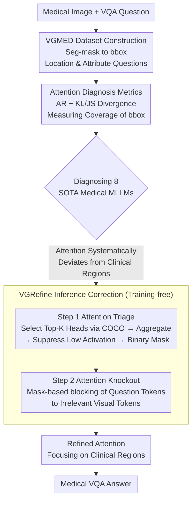

# How Do Medical MLLMs Fail? A Study on Visual Grounding in Medical Images

**Conference**: ICLR 2026  
**arXiv**: [2603.14323](https://arxiv.org/abs/2603.14323)  
**Code**: [Project Page](https://guimeng-leo-liu.github.io/Medical-MLLMs-Fail/)  
**Area**: Multimodal VLM  
**Keywords**: Medical VQA, Visual Grounding, Attention Analysis, MLLM Failure Modes, Inference-time Correction

## TL;DR

This study systematically diagnoses the root cause of poor medical MLLM performance in zero-shot medical VQA as insufficient visual grounding—where model attention systematically deviates from clinically relevant regions. To address this, the authors propose VGRefine, a training-free inference-time attention correction method that achieves SOTA results across 8 imaging modalities and 110K+ samples in 6 benchmarks.

## Background & Motivation

**Background** Multimodal Large Language Models (MLLMs) excel in general vision-language tasks. Recent efforts (e.g., LLaVA-Med, HuatuoGPT-Vision, VILA-M3) extend these to the medical domain to support clinical decision-making. However, these models still underperform in zero-shot medical VQA scenarios, particularly when no downstream task samples are used for training or fine-tuning.

**Limitations of Prior Work** Existing research primarily focuses on "how to improve" (e.g., building larger medical multimodal datasets, introducing external experts), but lacks a systematic analysis of "why they fail." Failure on medical images may stem from semantic grounding (not knowing which clinical concepts to focus on) or visual grounding (knowing what to find but failing to locate it correctly)—dimensions that were previously not clearly distinguished or quantified.

**Key Challenge** Prior work has shown that MLLMs possess strong visual grounding in natural images, where attention aligns with target regions. It remains unclear if this holds for medical images. If visual grounding is indeed the bottleneck, current efforts to inject medical knowledge to enhance semantic grounding might be misdirected—the true bottleneck may lie on the visual side.

**Key Insight** This paper designs a comprehensive diagnosis-verification-repair pipeline: constructing the VGMED dataset specifically for visual grounding analysis with clinical experts, introducing new quantitative metrics, systematically verifying 8 SOTA medical MLLMs, and proposing a concise inference-time repair method.

**Core Idea** By decoupling semantic and visual grounding, the authors pinpoint the failure mode and demonstrate that insufficient visual grounding is a universal, fixable bottleneck across all mainstream medical MLLMs.

## Method

### Overall Architecture

The study aims not to determine "how to make medical MLLMs stronger," but to identify "exactly where they fail" and provide a lightweight fix. The logic follows a "Metric -> Diagnosis -> Prescription" pipeline: first, constructing the VGMED dataset where questions require accurate localization; second, using metrics like Attention Ratio, KL divergence, and JS divergence to evaluate 8 SOTA models and locate systematic attention deviations; finally, proposing the training-free VGRefine to pull deviated attention back to relevant regions during inference.

### Key Designs

**1. VGMED Dataset: Decoupling Visual and Semantic Grounding**  
Existing Med-VQA datasets often contain noise—questions that don't require localization (e.g., "What is the modality?") or require deep expertise. These make it impossible to attribute failure to either semantic or visual causes. The authors collaborated with 3 certified clinicians to filter 13,962 samples from 40+ public segmentation datasets, converting masks to bboxes. They generated ~28K image-bbox-question triplets focusing on location (what is this organ/lesion) and attributes (size, shape, features). Since each question is tied to a specific region, failures can be directly attributed to "looking at the wrong place."

**2. KL/JS Divergence: Beyond "Entering" to "Covering"**  
Traditional Attention Ratio (AR) only measures the total attention within a bbox but ignores distribution—attention could be concentrated in a single corner. Because VGMED requires focusing on the entire bbox, the authors treat spatial attention maps and normalized bbox masks as probability distributions. They use KL and JS divergence to measure disparity. Lower divergence indicates that attention more uniformly covers the clinically relevant region.

**3. VGRefine: Training-free Inference-time Attention "Knockout"**  
Diagnosis revealed that attention partially covers relevant regions but leaks significantly into irrelevant ones. VGRefine uses a two-step mechanism: **Step 1 (Attention Triage)** selects the top-$K$ heads most relevant to visual grounding based on their KL divergence on COCO natural images (avoiding medical data leakage). It aggregates these and applies thresholding to create a binary mask. **Step 2 (Attention Knockout)** uses this mask to block attention connections from question tokens to irrelevant visual tokens, forcing the model to focus. This works because heads relevant in natural images remain relevant in the medical domain, though their grounding quality is poorer.

### Training Strategy

Ours is completely training-free and modifies attention strictly during inference. Hyperparameters include top-$K=20$ attention heads and an $L=50\%$ activation percentile threshold. The attention knockout is applied to specific layers based on model scale: layer 16 for 7B models and layers 34–36 for 34B models. These parameters are held constant across all benchmarks.

## Key Experimental Results

### Visual Grounding Diagnosis (Key Findings)

| Metrics | Medical Image | Natural Image | Conclusion |
| :--- | :--- | :--- | :--- |
| Attention Ratio (AR) ↑ | Low | High | All 8 SOTA medical MLLMs deviate from clinical regions |
| KL Divergence ↓ | High | Low | Large disparity between attention and GT regions |
| JS Divergence ↓ | High | Low | Consistent across models/layers |

Note: General MLLMs (LLaVA-v1.5) also fail on medical images, while medical MLLMs ground correctly on natural images, suggesting the issue is domain-specific rather than a capacity defect.

### Main Results (Med-VQA Performance)

| Model | VQA-RAD | SLAKE | PathVQA | PMC-VQA | Weighted Avg. |
| :--- | :--- | :--- | :--- | :--- | :--- |
| HuatuoGPT-V-7B | 67.4% | 76.5% | 60.7% | 53.9% | 65.3% |
| **VGRefine (Ours)** | **71.2%** | **76.9%** | **67.6%** | **56.2%** | **68.4%** |

Ours shows Gain across 8 modalities in OmniMedVQA: CT +7.5%, MRI +6.4%, X-Ray +8.1% (Avg: 71.3% → 74.4%). MMMU Health & Medicine: 45.8% → 47.2%.

### Ablation Study

| Configuration | VQA-RAD | SLAKE | PathVQA | PMC-VQA | Average |
| :--- | :--- | :--- | :--- | :--- | :--- |
| $K=1$ | 68.6% | 75.8% | 64.9% | 53.7% | 68.3% |
| $K=10$ | 70.9% | 76.8% | 67.7% | 56.1% | 68.3% |
| **$K=20$** | **71.2%** | **76.9%** | **67.6%** | **56.2%** | **68.4%** |
| $p=30\%$ | 70.8% | 76.8% | 67.6% | 55.7% | 68.2% |
| **$p=50\%$** | **71.2%** | **76.9%** | **67.6%** | **56.2%** | **68.4%** |

### Key Findings

- 8 SOTA medical MLLMs consistently fail in visual grounding on medical images despite succeeding on natural images—a domain-specific phenomenon.
- VGRefine achieves consistent Gain without injecting medical knowledge, proving that visual grounding is the limiting factor.
- Human Evaluation: 5 clinicians preferred VGRefine attention maps in 76% of blind test cases.
- Compared to recent attention methods (PAI, AdaptVis, ViCrop), VGRefine provides the most consistent improvements.

## Highlights & Insights

- The "diagnosis before therapy" paradigm is highly valuable: by decoupling grounding types, it identifies a universal bottleneck for future research.
- Comparative analysis between medical and natural images is the most compelling evidence, ruling out general capacity issues.
- VGRefine follows a "less is more" philosophy: correcting attention without adding new knowledge reaches SOTA, suggesting current models possess sufficient knowledge but lack focus.
- Clever cross-domain transfer: selecting heads on COCO natural images avoids leakage while demonstrating the domain-invariant nature of grounding mechanisms.

## Limitations & Future Work

- Focuses solely on visual grounding, leaving other potential bottlenecks like semantic grounding or reasoning defects unexplored.
- VGRefine uses static projections; adaptive attention correction based on image types could be beneficial.
- Hallucination subspace definitions depend on specific layer selections which may vary across model architectures.
- The existence of this issue in newer closed-source models (GPT-4V, Gemini) has not been verified.

## Related Work & Insights

- Comparison with Zhang et al. (2025): While they show MLLMs ground well in natural images, this work finds the opposite in the medical domain.
- Complementary to external-expert methods (e.g., VILA-M3): While others enhance externally, VGRefine corrects internally.
- VGRefine aligns with attention manipulation literature but innovates by automatically selecting the most relevant head subsets.

## Rating

- Novelty: ⭐⭐⭐⭐⭐ 
- Experimental Thoroughness: ⭐⭐⭐⭐⭐ 
- Writing Quality: ⭐⭐⭐⭐ 
- Value: ⭐⭐⭐⭐⭐ 

<!-- RELATED:START -->

## Related Papers

- [\[ACL 2026\] How Do LLMs and VLMs Understand Viewpoint Rotation Without Vision? An Interpretability Study](../../ACL2026/multimodal_vlm/how_do_llms_and_vlms_understand_viewpoint_rotation_without_vision_an_interpretab.md)
- [\[ICLR 2026\] The Unseen Bias: How Norm Discrepancy in Pre-Norm MLLMs Leads to Visual Information Loss](the_unseen_bias_how_norm_discrepancy_in_pre-norm_mllms_leads_to_visual_informati.md)
- [\[ICLR 2026\] AttTok: Marrying Attribute Tokens with Generative Pre-trained Vision-Language Models towards Medical Image Understanding](atttok_marrying_attribute_tokens_with_generative_pre-trained_vision-language_mod.md)
- [\[ICML 2026\] MedSIGHT: Towards Grounded Visual Comprehension in Medical Large Vision-Language Models](../../ICML2026/multimodal_vlm/medsight_towards_grounded_visual_comprehension_in_medical_large_vision-language_.md)
- [\[ICML 2026\] MoDA: Modulation Adapter for Fine-Grained Visual Grounding in Instructional MLLMs](../../ICML2026/multimodal_vlm/moda_modulation_adapter_for_fine-grained_visual_grounding_in_instructional_mllms.md)

<!-- RELATED:END -->
