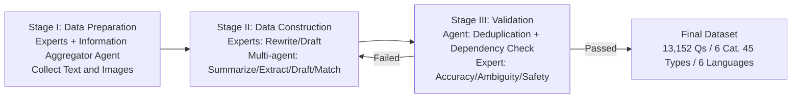

# HSSBench: Benchmarking Humanities and Social Sciences Ability for Multimodal Large Language Models

**Conference**: ICLR 2026  
**OpenReview**: [https://openreview.net/forum?id=iQsKotob31](https://openreview.net/forum?id=iQsKotob31)  
**Code**: [https://github.com/Zhaolu-K/HSSBench](https://github.com/Zhaolu-K/HSSBench)  
**Area**: Multimodal Evaluation / Benchmark  
**Keywords**: Multimodal Large Language Models, Humanities and Social Sciences, VQA Benchmark, Multilingual Evaluation, Multi-agent Data Generation  

## TL;DR
Ours proposes HSSBench—the first large-scale multimodal benchmark focused on Humanities and Social Sciences (HSS), covering 6 main categories and 45 subcategories with 13,152 multiple-choice questions in the six official UN languages. Constructed through an "Expert + Multi-agent" collaborative pipeline, HSSBench demonstrates that HSS tasks remain a significant challenge for current mainstream MLLMs (with accuracies generally below 60%).

## Background & Motivation
**Background**: The rapid advancement of Multimodal Large Language Models (MLLMs) has led to numerous benchmarks like MMMU and MathVista. However, these benchmarks predominantly focus on general common sense or STEM subjects (Mathematics, Science, Programming), emphasizing **vertical reasoning** characterized by top-down, step-by-step solving for unique correct answers.

**Limitations of Prior Work**: HSS (Geography, Art, Culture, Social Sciences, History, Economy) operates on a different logic—**horizontal reasoning**. This requires cross-contextual associations and interdisciplinary integration, often involving multiple reasonable interpretations rather than a single solution. HSS symbolic systems are deeply rooted in regional cultures and rely on historical/cultural context; knowledge validation depends on cross-referencing literature and expert consensus rather than logical deduction. Existing benchmarks involving HSS are neither deep nor systematic.

**Key Challenge**: The authors use a vivid example (Figure 2) to highlight the core issue—**the failure of cross-modal knowledge transfer**. While a model can correctly answer a text-based question about "Business Penmanship," it fails to associate visual features from an image of handwriting with the abstract concept. Models can isolate abstract concepts but cannot establish meaningful mappings between HSS images and the concepts they represent.

**Goal**: To construct a specialized, multilingual multimodal benchmark for HSS to systematically measure the true capabilities of MLLMs in horizontal reasoning and cross-modal knowledge transfer.

**Core Idea**: **(1) Task Positioning**—extending evaluation from STEM vertical reasoning to HSS horizontal reasoning, forcing the examination of bidirectional binding between images and abstract concepts; **(2) Method**—designing a VQA Generation Pipeline (VGP) that synergizes "expert annotation + multi-agent automation" to balance quality and scale; **(3) Multilingual Coverage**—presenting the same questions in the six official UN languages to investigate the impact of language on model performance.

## Method

### Overall Architecture
The core of HSSBench is a three-stage VQA Generation Pipeline (VGP): **Stage I: Data Preparation** → **Stage II: Data Construction** → **Stage III: Validation**. In each stage, "domain experts" and "multi-agents" work in parallel—either can independently produce the content required, and failed data is rolled back to Stage II until it meets the standard or is discarded. The final dataset consists of 13,152 single-choice questions (the 6-6-45 structure), all in VQA format and translated into six languages.

### Key Designs
**1. Three-Stage Expert-Agent Collaborative Pipeline**: HSS data faces challenges such as image scarcity and knowledge density. VGP decomposes the construction into preparation, construction, and validation. In Stage I, experts extract high-credibility data from textbooks and exams, while a **Networked Information Aggregation Agent** mimics experts by indexing keywords to search, score, and filter professional content based on uniqueness and logical structure.

**2. Multi-agent Automated Questioning**: In Stage II, questioning is split into four roles: a **summarizer** provides global document abstracts; an **extractor** pulls high-quality text segments; an LLM scores these based on **information density and logical coherence**; a **question generator** uses Chain-of-Thought (CoT) to generate questions, options, and explanations; and finally, an **image matcher** pairs the questions with corresponding images.

**3. Dual Validation for "Essential Modality"**: This ensures multimodal validity. Agent validation calculates text similarity to ensure diversity and performs a **bidirectional image-text dependency check**: (1) the question cannot be answered with text alone; (2) the question cannot be answered with the image alone. Only when both modalities are indispensable is the task considered truly multimodal. Expert validation ensures accuracy, lack of ambiguity, and safety.

**4. Multilingual Alignment**: Initial questions created by experts (mostly in Chinese) are translated into English, Chinese, French, Russian, Spanish, and Arabic using LLM translation models, then reviewed by bilingual experts to ensure semantic consistency across cultures.

## Key Experimental Results

### Main Results (EN-I English Test, % Accuracy for "All" column, Ct.=CoT, C.=Choice, O.=Open)

| Model | Ct.C. (Choice) | Ct.O. (Open) |
|------|------|------|
| Random | 24.62 | 0.00 |
| **Human (Expert Avg.)** | **93.83** | - |
| Qwen2.5-VL-7B | 38.19 | 17.89 |
| InternVL3-8B | 41.42 | 12.31 |
| Qwen2.5-VL-32B | 50.75 | 15.00 |
| Qwen2-VL-72B | 54.22 | 20.43 |
| **Qwen2.5-VL-72B (Best Open Source)** | **54.17** | 19.73 |
| GPT-4o | 46.09 | 20.05 |
| GPT-4.1 | 45.02 | **39.97** |
| GPT-4.1-mini | 45.75 | 24.32 |

The strongest models reach only ~54% in choice questions, significantly trailing human experts (93.83%). Performance in open-ended questions is poorer, with most models below 15%, except for GPT-4.1 at 39.97%.

### Key Findings
- **HSS tasks remain a significant challenge for SOTA MLLMs**: Choice accuracy is generally below 60%, revealing a vast gulf compared to human expertise.
- **Cross-modal knowledge transfer is the core bottleneck**: Models can recognize isolated concepts but fail to internalize visual knowledge and associate it with abstract concepts in HSS divergent thinking scenarios.
- **The gap between open and closed-source models is narrowing in specific HSS tasks**, though closed-source models maintain an overall lead in open-ended evaluations.

## Highlights & Insights
- **Precise Problem Definition**: The use of the "Business Penmanship" contrast makes the abstract "cross-modal knowledge transfer failure" highly intuitive.
- **First Systematic HSS Multimodal Multilingual Benchmark**: The scale (13k questions) and coverage of 6 categories × 6 languages fill the gap left by STEM-dominated evaluations.
- **Essential Modality Constraint**: Forcing bidirectional dependency ensures that "text-only" or "image-only" shortcuts are eliminated, improving the benchmark's discriminative power.
- **Reusable Pipeline**: Distilling expert logic into multi-agent roles provides a paradigm for large-scale data construction in other high-threshold domains.

## Limitations & Future Work
- **Single Question Format**: The reliance on multiple-choice or open-choice questions limits the evaluation of open-ended discourse, value judgments, and ethical considerations.
- **Cultural and Language Bias**: A majority of Chinese experts may favor the Qwen series on Chinese-related content; cross-cultural fairness requires more balanced data sources.
- **Reliance on GPT-4 Generation**: Automated data quality is capped by the base models and may inherit their biases or blind spots.
- **Diagnostic Focus**: The work identifies HSS shortcomings but how to specifically improve cross-modal transfer and horizontal reasoning remains an open question.

## Related Work & Insights
- **Contrast with STEM Benchmarks**: Unlike MMMU or MathVista which emphasize vertical reasoning, HSSBench pushes evaluation toward horizontal, interdisciplinary, and multi-interpretation dimensions.
- **Multi-agent Data Synthesis**: The summary-extraction-questioning-matching workflow aligns with modern LLM-as-data-generator trends but adds an expert-in-the-loop and dependency validation for stricter quality control.
- **Implication**: MLLM training might require specialized objectives to optimize the bidirectional binding between images and abstract concepts. Furthermore, CoT is not a silver bullet—it may amplify hallucinations in tasks with dense visual details or divergent reasoning.

## Rating
- **Novelty**: ⭐⭐⭐⭐ — First large-scale HSS benchmark with unique bidirectional dependency constraints.
- **Experimental Thoroughness**: ⭐⭐⭐⭐ — Covers 20+ models, 6 categories, 6 languages, two prompting strategies, and human baselines.
- **Writing Quality**: ⭐⭐⭐⭐ — Clear motivation and well-structured pipeline.
- **Value**: ⭐⭐⭐⭐ — Highlights a 40% performance gap between SOTA models and humans, providing a clear path for future research in interdisciplinary reasoning.

<!-- RELATED:START -->

## Related Papers

- [\[ICLR 2026\] Benchmarking Large Vision-Language Models on Fine-Grained Image Tasks: A Comprehensive Evaluation](benchmarking_large_vision-language_models_on_fine-grained_image_tasks_a_comprehe.md)
- [\[CVPR 2026\] Venus: Benchmarking and Empowering Multimodal Large Language Models for Aesthetic Guidance and Cropping](../../CVPR2026/multimodal_vlm/venus_benchmarking_and_empowering_multimodal_large_language_models_for_aesthetic.md)
- [\[ICLR 2026\] Thinking as Society: Multi-Social-Agent Self-Distillation for Multimodal Misinformation Detection](thinking_as_society_multi-social-agent_self-distillation_for_multimodal_misinfor.md)
- [\[ICLR 2026\] XModBench: Benchmarking Cross-Modal Capabilities and Consistency in Omni-Language Models](xmodbench_benchmarking_cross-modal_capabilities_and_consistency_in_omni-language.md)
- [\[ICLR 2026\] InternSVG: Towards Unified SVG Tasks with Multimodal Large Language Models](internsvg_towards_unified_svg_tasks_with_multimodal_large_language_models.md)

<!-- RELATED:END -->
## Related Papers

- [\[ICLR 2026\] InternSVG: Towards Unified SVG Tasks with Multimodal Large Language Models](internsvg_towards_unified_svg_tasks_with_multimodal_large_language_models.md)
- [\[CVPR 2026\] Venus: Benchmarking and Empowering Multimodal Large Language Models for Aesthetic Guidance and Cropping](../../CVPR2026/multimodal_vlm/venus_benchmarking_and_empowering_multimodal_large_language_models_for_aesthetic.md)
- [\[ICLR 2026\] Thinking as Society: Multi-Social-Agent Self-Distillation for Multimodal Misinformation Detection](thinking_as_society_multi-social-agent_self-distillation_for_multimodal_misinfor.md)
- [\[ICLR 2026\] XModBench: Benchmarking Cross-Modal Capabilities and Consistency in Omni-Language Models](xmodbench_benchmarking_cross-modal_capabilities_and_consistency_in_omni-language.md)
- [\[ICLR 2026\] Investigating Redundancy in Multimodal Large Language Models with Multiple Vision Encoders](investigating_redundancy_in_multimodal_large_language_models_with_multiple_visio.md)

<!-- RELATED:END -->
