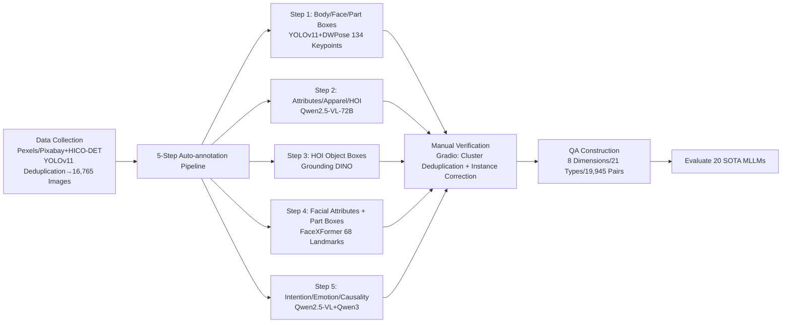

# Human-MME: A Holistic Evaluation Benchmark for Human-Centric Multimodal Large Language Models

**Conference**: ICLR 2026  
**OpenReview**: [https://openreview.net/forum?id=4qIK0UV2Nt](https://openreview.net/forum?id=4qIK0UV2Nt)  
**Code**: [https://github.com/Yuan-Hou/Human-MME](https://github.com/Yuan-Hou/Human-MME)  
**Area**: Multimodal Large Language Models / Evaluation (Human-Centric MLLM Benchmark)  
**Keywords**: MLLM Evaluation, Human-Centric Understanding, Fine-Grained Perception, Causal Reasoning, Visual Grounding  

## TL;DR
Human-MME is the first comprehensive MLLM evaluation benchmark specifically for "human-centric scenarios." Utilizing a five-step auto-annotation pipeline followed by expert manual verification, the authors constructed a dataset covering 43 sub-scenarios and 8 progressive dimensions—from "fine-grained perception" to "high-dimensional causal reasoning." Comprising nearly 20,000 real image-text QA pairs, the benchmark systematically exposes shortcomings in fine-grained human grounding and high-order reasoning across 20 SOTA MLLMs.

## Background & Motivation
**Background**: Multimodal Large Language Models (MLLMs) have demonstrated strong capabilities in general image understanding. As humans are the most frequent and valuable objects in real-world images, understanding them requires not only fine-grained perception (e.g., eyebrows, accessories, left vs. right hands) but also high-level inference of intentions, emotions, and causality, which is significantly more challenging than general scenes.

**Limitations of Prior Work**: The authors identify three systematic defects in existing human-related benchmarks (e.g., MMBench, MME, Seed-Bench, Face-Human-Bench, HumaniBench): (1) Evaluation settings are too simplistic to cover the full spectrum of human activities; (2) Dimensions are incomplete, failing to balance fine-grained perception with high-level spatial/reasoning tasks; (3) Annotation quality is low and QA paradigms are monotonous, making it difficult to support complex reasoning tasks. Most are limited to single-person, single-image, and single-question formats without fine-grained grounding.

**Key Challenge**: The high physical complexity of the human body and the difficulty of annotating fine-grained structures (facial parts, limbs) have led to a lack of high-quality human-centric benchmarks. Achieving both broad coverage and fine-grained annotation simultaneously is a significant hurdle.

**Goal**: To build a truly "holistic" benchmark that starts from fine-grained facial/body perception and ascends through multi-image, multi-person, intention, emotion, and causal reasoning, while ensuring high annotation quality.

**Core Idea**: **[Progressive Dimensional Design]** Organizing evaluation into 8 monotonically progressive dimensions from "granular perception" to "high-dimensional reasoning." **[Auto-annotation + Expert Verification]** Using a five-step pipeline (Detection + Pose + VLM + Grounding + Text Model) to produce rich annotations, followed by expert deduplication and error correction on a Gradio platform to eliminate "self-preference bias." **[Multi-Paradigm QA]** Extending from single-image/single-person to multi-image/multi-person mutual understanding, while designing Choice, BBox, Short-Answer, Ranking, and Judgment components.

## Method

### Overall Architecture
The construction of Human-MME involves four sequential steps: (1) **Data Collection**: Filtering 16,765 high-quality images from Pexels/Pixabay and the HICO-DET dataset; (2) **Auto-annotation Pipeline**: A five-step person-by-person extraction of facial/body/part boxes, attributes, apparel, Human-Object Interaction (HOI), facial features, and high-dimensional features like intention and causality; (3) **Manual Verification**: Experts perform cluster-level deduplication and instance-level corrections via a custom interface; (4) **QA Construction**: Generating 19,945 QA pairs covering 8 dimensions and 21 question types based on annotated features, evaluated with dimension-specific metrics.

### Key Designs

**1. Progressive 8-Dimension Evaluation System.** This serves as the backbone of the benchmark, deconstructing human-centric capabilities into eight monotonically progressive dimensions: Facial Understanding (FU), Body Understanding (BU), Human-Object Interaction (HU), Multi-Image Understanding (MIU), Multi-Person Reasoning (MPR), Intention Determination (ID), Causal Determination (CD), and Emotion Determination (ED). The first three focus on fine-grained granular perception, while the latter five introduce cross-image/cross-person relationships and latent reasoning regarding intentions, emotions, and causal chains (what happened in the past and what will happen in the future). This design allows the benchmark to pinpoint whether a model's failure is due to "failing to see" or "failing to think."

**2. Five-Step Auto-annotation Pipeline.** To obtain fine-grained annotations for complex human subjects, the authors string together multiple expert models to extract features for each person $i$. Step 1 uses YOLOv11 for body/face candidates and DWPose for 134 keypoints, aligning parts with boxes via geometric relationships. Step 2 uses Qwen2.5-VL-72B to extract general attributes $A_i$ (age/gender/ethnicity), apparel $W_i^j$ (type/color), and HOI triplets $O_i^j$. Step 3 employs Grounding DINO for HOI object boxes. Step 4 uses FaceXFormer for 40 binary facial attributes and 68 landmarks. Step 5 uses Qwen2.5-VL-72B to produce intermediate descriptions, which are then passed to a text-only Qwen3 to generate de-identified emotion/intention/causal narratives.

**3. Breaking "Self-Preference Bias" with Independent Text Models.** A critical detail is that the models under evaluation include the Qwen series. If annotations were generated directly by Qwen2.5-VL, it would grant the Qwen family an unfair advantage. The authors mitigate this by using Qwen2.5-VL only for intermediate descriptions in Step 5, while the final ground truth text (emotion/intention/causality) is generated/rewritten by a text-only Qwen3. Manual verification also prioritizes correcting fields dependent on Qwen2.5-VL to weaken bias toward specific model families.

**4. Five QA Components + Combined Task Types.** Answer formats include Choice, Bounding Box (BBox), Short-Answer, Ranking, and Judgment, along with composite forms (e.g., Judgment+BBox). Choice questions use "same-type apparel" or "swapped left/right hands" as distractors. BBox directly tests visual grounding. Ranking requires models to sort four images based on feature frequency. **Judgment is the key design for anti-hallucination**—questions include pre-conditions (e.g., "If there is a person with feature X, provide their part box, otherwise return [-1,-1,-1,-1]"); models must first judge the condition's validity, targeting the tendency to hallucinate answers for non-existent targets.

**5. Tailored Evaluation Metrics.** Different components use targeted metrics: Choice uses Accuracy; Short-Answer uses a composite score of BERT F1, embedding cosine similarity, and keyword coverage; BBox uses IoU; Ranking uses Kendall's $\tau$; Judgment uses F1 score to balance precision and recall.

## Key Experimental Results

### Main Results (20 MLLMs, Avg. Score across 8 Dimensions, Selection)

| Model | FU | BU | HU | MIU | MPR | ID | CD | ED | **Avg.** |
|------|-----|-----|-----|-----|-----|-----|-----|-----|------|
| GLM-4.5V | 61.6 | 77.4 | 82.5 | 79.2 | 71.5 | 83.9 | 85.4 | 66.6 | **76.0** |
| Qwen2.5-VL-72B | 61.1 | 70.2 | 70.6 | 75.4 | 65.2 | 88.1 | 86.3 | 65.3 | 72.8 |
| InternVL3.5-241B | 50.7 | 74.6 | 71.4 | 76.4 | 59.4 | 83.7 | 82.5 | 66.4 | 70.6 |
| GLM-4.1V-9B | 55.2 | 74.1 | 69.5 | 71.8 | 64.3 | 82.7 | 76.0 | 58.8 | 69.1 |
| Intern-S1 | 41.0 | 65.2 | 65.5 | 79.8 | 59.3 | 82.9 | 83.2 | 68.3 | 68.2 |
| MiniCPM-V-4.5 | 38.9 | 62.6 | 62.4 | 73.5 | 52.1 | 81.5 | 67.8 | 63.3 | 62.8 |
| Llama-4-Scout | 27.3 | 50.6 | 49.4 | 48.9 | 33.9 | 66.5 | 57.1 | 50.4 | 48.0 |
| Phi-4 | 29.5 | 48.1 | 48.6 | 39.6 | 29.6 | 62.9 | 38.1 | 46.4 | 42.9 |
| *Gemini-2.5-Pro* (Closed) | 42.4 | 66.5 | 70.0 | 83.6 | 48.6 | 79.4 | 86.1 | 64.5 | 67.6 |
| *GPT-5* (Closed) | 34.4 | 67.8 | 71.1 | 75.8 | 43.1 | 82.3 | 89.2 | 42.6 | 63.3 |
| *GPT-4o* (Closed) | 28.8 | 58.8 | 59.8 | 74.7 | 34.4 | 79.2 | 76.2 | 52.7 | 58.1 |

Open-source models with explicit grounding training (GLM-4.5V, Qwen2.5-VL-72B) lead in perception dimensions. Gemini-2.5-Pro is the strongest closed-source model but, like Intern-S1, excels at high-level reasoning while remaining weaker in fine-grained grounding.

### Ablation Study (Component Scores, Selection)

| Model | Bounding Box | Choice | Short-Answer | Ranking | Judgment |
|------|------|------|------|------|------|
| GLM-4.5V | **66.3** | 70.8 | 83.5 | 86.2 | 68.3 |
| Qwen2.5-VL-72B | 50.8 | 70.4 | 81.7 | 83.9 | **71.3** |
| Intern-S1 | 22.1 | 72.6 | 82.0 | **86.6** | 68.9 |
| Gemini-2.5-Pro | 23.5 | 72.4 | 83.9 | **90.9** | 72.0 |
| GPT-4o | 11.5 | 57.6 | 78.3 | 83.8 | 48.6 |
| Llama-4-Scout | 6.4 | 47.9 | 69.5 | 71.0 | 38.6 |

BBox scores show the largest disparity: GLM-4.5V reaches 66.3, while GPT-4o and Llama-4-Scout trail significantly. Fine-grained spatial localization is the primary bottleneck for current MLLMs and is heavily influenced by the presence of grounding supervision in training data (BBox correlation with model size $r=0.00$).

### Key Findings
- **Scaling Effects in Choice/Ranking**: These categories correlate most strongly with model size (Choice $r=0.78$, Ranking $r=0.75$). Larger models are better at integrating multiple visual features for ranking.
- **Grounding Depends on Data, Not Scale**: BBox performance is determined by whether the training data includes human-centric grounding samples and normalized/JSON box formats, rather than model architecture.
- **Left/Right Limb Confusion**: All models consistently struggle to distinguish between left and right hands/feet, whereas they are reliable with left/right eyes/eyebrows due to the more stable spatial layout of facial parts.
- **Judgment Exposes Hallucinations**: Models generally show high recall and low precision, answering even when the target is absent. Improving anti-hallucination increases precision but leads to over-rejection.
- **Difficulty Ladder**: Accuracy follows the trend of Intention > Cause > Emotion, indicating increasing difficulty with abstraction.
- **Closed vs. Open Source Gap**: While closed-source models perform well on high-level tasks, they suffer in fine-grained grounding (e.g., GPT-4o's IoU for "left eye" is near 0.000).

## Highlights & Insights
- **Progressive Dimensions provide diagnostic value**: By organizing capabilities from "seeing" to "inferring," the benchmark identifies exactly which layer of the reasoning chain fails.
- **Active Elimination of Self-Preference Bias**: Using an independent Qwen3 for final annotations while evaluating Qwen2.5-VL demonstrates a high standard for benchmark fairness.
- **Judgment Component quantifies hallucination**: By forcing a "judgment before response" logic, the benchmark transforms overconfidence into a quantifiable precision-recall trade-off.
- **Grounding vs. Scale**: The fact that fine-grained grounding has zero correlation with model size ($r=0.00$) serves as a reminder that scaling up alone does not solve all vision-language alignment problems.

## Limitations & Future Work
- **Manual verification was performed by the authors**, which ensures consistency but limits scale and may introduce subjective bias compared to large-scale crowdsourcing.
- **"Ground Truth" for high-level features** (intentions/emotions) is essentially generated by VLMs/LLMs and filtered by humans, which may lack definitive objectivity.
- **Data Source Bias**: Images from free stock galleries and HICO-DET may carry aesthetic or photography-specific biases distinct from surveillance or medical distributions.

## Related Work & Insights
- **Comparison with Prior Benchmarks**: Unlike Face-Human-Bench or HumaniBench, Human-MME is the first to cover facial features, body features, HOI, multi-image, and high-order reasoning while supporting fine-grained grounding.
- **Model Development Direction**: The results suggest three actionable directions: fine-grained grounding requires specific data, left/right limb ambiguity requires structural supervision, and the Judgment task requires a balance between precision and recall.

## Rating
- **Novelty**: ⭐⭐⭐⭐ First comprehensive human-centric MLLM benchmark with a progressive dimensional design and anti-hallucination QA.
- **Experimental Thoroughness**: ⭐⭐⭐⭐⭐ Systematic evaluation of 20 SOTA models with detailed analysis across 8 dimensions and 5 question types.
- **Writing Quality**: ⭐⭐⭐⭐ Clear structure and informative visualizations.
- **Value**: ⭐⭐⭐⭐⭐ Effectively fills the gap in human-centric evaluation and provides specific pointers for developing next-generation human-centric models.

<!-- RELATED:START -->

## Related Papers

- [\[ICLR 2026\] MME-Emotion: A Holistic Evaluation Benchmark for Emotional Intelligence in Multimodal Large Language Models](mme-emotion_a_holistic_evaluation_benchmark_for_emotional_intelligence_in_multim.md)
- [\[ICLR 2026\] HumanPCR: Probing MLLM Capabilities in Diverse Human-Centric Scenes](humanpcr_probing_mllm_capabilities_in_diverse_human-centric_scenes.md)
- [\[ICLR 2026\] MME-Unify: A Comprehensive Benchmark for Unified Multimodal Understanding and Generation Models](mme-unify_a_comprehensive_benchmark_for_unified_multimodal_understanding_and_gen.md)
- [\[ICLR 2026\] Shuffle-R1: Efficient RL Framework for Multimodal Large Language Models via Data-centric Dynamic Shuffle](shuffle-r1_efficient_rl_framework_for_multimodal_large_language_models_via_data-.md)
- [\[ICLR 2026\] GranViT: A Fine-Grained Vision Model For Autoregressive Multimodal Large Language Models](granvit_a_fine-grained_vision_model_for_autoregressive_multimodal_large_language.md)

<!-- RELATED:END -->
