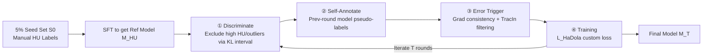

# Human Uncertainty-Aware Data Selection and Automatic Labeling in Visual Question Answering

**Conference**: ICLR 2026  
**OpenReview**: [https://openreview.net/forum?id=LuZjiUNuFL](https://openreview.net/forum?id=LuZjiUNuFL)  
**Code**: [https://github.com/emsuno/hadola](https://github.com/emsuno/hadola)  
**Area**: Multimodal Vision-Language Models / VQA / Data Selection & Labeling  
**Keywords**: Human Uncertainty (HU), Visual Question Answering, Supervised Fine-Tuning, Data Efficiency, Model Calibration, Automatic Labeling  

## TL;DR
This paper systematically reveals the impact of Human Uncertainty (HU) on Supervised Fine-Tuning (SFT) in VQA—demonstrating that high HU samples are ineffective or even harmful. It proposes the HaDola framework, a four-stage pipeline of "Discriminate-Self Annotate-Error Trigger-Training," which matches or exceeds strong baselines fine-tuned on 100% data using only 5% seed annotations in both accuracy and calibration.

## Background & Motivation
**Background**: Large Vision-Language Models (VLMs) demonstrate strong performance in VQA, but the mainstream SFT paradigm relies heavily on massive manual annotations, which are expensive. Simultaneously, datasets like VQAv2 and VizWiz naturally contain "Human Uncertainty"—for the same image-question pair, 10 annotators may provide different answers, each with different confidence levels (mapping yes/maybe/no to 0.99/0.5/0.01).

**Limitations of Prior Work**: Standard SFT optimizes only toward the "most frequent answer," discarding HU distribution information. Furthermore, indiscriminate data scaling focuses only on "how much data" without questioning "the contribution of each sample." This leads to two issues: models fail to learn the real human uncertainty distribution (poor calibration) and waste annotation budgets on potentially harmful samples.

**Key Challenge**: Should HU be treated as "noise" to be smoothed or a "signal" to be utilized? Given that HU labels are extremely expensive and difficult to obtain at scale, how can strong performance be maintained in both accuracy and calibration with only a small fraction of HU annotations?

**Goal**: To answer three research questions—how HU affects SFT and which samples are beneficial/harmful (RQ1); how to integrate HU into training to balance accuracy and calibration (RQ2); and how to sustain strong performance using only a small portion of HU labels (RQ3).

**Key Insight**: **Treat HU as a guiding signal for data selection and evaluation rather than noise to be eliminated**. The authors conduct a systematic evaluation finding that "high HU samples are harmful, while low/medium HU samples provide effective supervision." Based on this, they design HaDola, a data-efficient framework that evolves from a 5% seed set by actively rejecting high HU samples, auto-labeling informative samples, and using a customized loss to align with human uncertainty distributions.

## Method

### Overall Architecture
HaDola is a model-agnostic iterative framework: it first fine-tunes an initial VLM using a 5% manual HU-labeled seed set $S_0$ to obtain a reference model $M_{HU}$ (one copy is frozen as the HU reference, another serves as the training starting point). In each round, for the unlabeled pool $S_r$, it sequentially performs four stages: Discriminate (excluding high HU), Self-Annotate (generating pseudo-labels), Error Trigger (filtering bad pseudo-labels), and Training (fine-tuning with custom loss), expanding reliable supervision in a "self-evolving" manner.

Before detailing the key designs, two metric foundations are established: the authors use HUD to measure sample-level HU, segmenting data into low/medium/high tiers ([0.66, 0.99] for low, (0.33, 0.66) for medium, [0.01, 0.33] for high). They also note that traditional VQA-acc ignores HU, thus proposing HU-weighted HU-acc $= \text{HaConf}(a)\times\text{VQA-Acc}(a)$ as a more sensitive evaluation and supervision signal.

### Key Designs

**1. Discriminate: Excluding High HU Samples via KL Intervals**
Acting as the "gatekeeper" of HaDola, this stage filters out high HU samples that are difficult to learn and consume unnecessary computation. The authors first calculate the average KL divergence $\tau_1, \tau_2$ (where $\tau_1 < \tau_2$) between the human distribution and the reference model $M_{HU}$ on low and medium HU seed subsets of $S_0$, alongside the mean human confidence distribution $h_\omega$. For each candidate unlabeled sample $u$, the KL divergence $kl_u = D_{KL}(h_\omega \| M_t(u))$ is computed. Only samples falling within $[\tau_1-\sigma, \tau_2+\sigma]$ ($\sigma$ being the standard deviation) are retained; others are discarded as high HU or outliers. The intuition is that good samples should align with the uncertainty of the low/medium seed sets.

**2. Self-Annotate: Expanding Supervision via the Previous Round Model**
Retained samples lack manual labels. HaDola uses the model from the previous round $M_{t-1}$ to provide predictions $\hat{y}_u = M_{t-1}(u)$, constructing pseudo-training pairs $(u, \hat{y}_u)$. This step reduces the manual annotation requirement from "every sample" to "a 5% seed," allowing the model to refine its own supervision signals.

**3. Error Trigger: Dual Gradient Criteria to Prevent Error Accumulation**
To prevent pseudo-label errors from snowballing, HaDola implements two gates. First is **Gradient Consistency**: it calculates the cosine similarity $s_g = \frac{\langle g, g_{ref}\rangle}{\|g\|\|g_{ref}\|}$ between the pseudo-sample gradient $g(u,\hat{y}_u;\theta_t)$ and the average reference gradient $g_{ref}(\theta_t)$ from the seed set, ensuring update directions align with reliable supervision. Second is **TracIn-mini Influence Estimation**: approximating $s_{tracin}(u,\hat{y}_u) \approx \langle g(u,\hat{y}_u;\theta_0), \nabla_\theta L_{val}(\theta_0)\rangle + \langle g(u,\hat{y}_u;\theta_t), \nabla_\theta L_{val}(\theta_t)\rangle$ to track the global impact of pseudo-samples on validation loss. Only pseudo-labels satisfying both $s_g \ge \tau_g$ and $s_{tracin} \le \tau_t$ are kept.

**4. Loss & Training: Balancing Accuracy and Human Uncertainty Calibration**
The training phase employs a three-term loss to pursue correct answers and human alignment simultaneously:
$$L_{HaDola} = \mathbb{E}[\text{CE}(y, M_\theta)] + \beta\,\Phi + \lambda\big(D_{KL}(H\|M_\theta) - D_{KL}(H\|M_{HU})\big),\quad \Phi = D_{KL}(M_{HU}(\cdot|x)\|M_\theta(\cdot|x))$$
The standard Cross-Entropy (CE) ensures prediction correctness; $\Phi$ regularizes $M_\theta$ toward the HU reference model $M_{HU}$; and the third term encourages $M_\theta$ to be closer to the human distribution $H$ than the reference model, improving calibration.

## Key Experimental Results

### Main Results
Evaluations were conducted on VQAv2 and VizWiz using Qwen2.5VL-2B/7B, LLaVA1.6-7B, InternVL2.5-2B/8B, and task-specific BEiT3, comparing against 6 baseline types (Zero-shot, LoRA SFT, Meta pseudo-labeling, Active Learning, DPO, Selective Prediction LYP). Key metrics are HU-acc (accuracy) and KL divergence (calibration).

| Finding | Performance |
|------|------|
| Three Zero-shot VLMs | HaDola exceeds **100% SFT** using only **5% annotations** |
| BEiT3 (No zero-shot) | Reaches comparable levels to full SFT and significantly outperforms all other baselines |
| KL Divergence (Calibration) | HaDola and LYP lead; LYP is occasionally lower by "dropping difficult samples," while HaDola achieves competitive calibration without discarding data during inference |

### Ablation Study

| Method (T=15) | VQAv2 Qwen | VQAv2 LLaVA | VizWiz Qwen | VizWiz LLaVA |
|---|---|---|---|---|
| HaDola (Full) | **76.75** | **77.63** | **65.72** | **66.58** |
| Selector replaced by Random | 72.23 | 73.51 | 62.11 | 63.02 |
| Self-annotation replaced by Manual | 73.91 | 75.02 | 64.53 | 64.88 |
| Without Error Trigger | 71.56 | 72.47 | 60.92 | 61.73 |
| Loss replaced by standard CE | 72.37 | 73.28 | 61.89 | 62.15 |

All components are essential: **Removing the Error Trigger causes the largest performance drop**; replacing self-annotation with manual labels shows a smaller drop, suggesting self-evolved supervision can even surpass the raw quality of fixed manual labels in this iterative context.

### Key Findings
- **HU Level Monotonicity**: Under simple SFT, performance follows: Low HU subset (L) > Medium (M) > High (H). This holds for both training and validation sets, proving high HU samples are both difficult and harmful.
- **S-shaped Training Curve**: Performance surges at 5–10% annotation, slows at 10–15%, and converges after 15%—questioning the necessity of large-scale SFT.
- **Metric Flaws**: Traditional VQA-acc fails to capture the harm of high HU samples, whereas HU-acc clearly differentiates subsets, highlighting the limitations of frequency-based evaluation.

## Highlights & Insights
- **Rebranding "Label Noise" as "Training Signal"**: This paper systematically demonstrates that HU is not a byproduct to be smoothed, but a useful signal for data selection and evaluation.
- **Strong Evidence for Data Efficiency**: 5% annotation outperforming 100% SFT provides solid empirical support for the idea that choosing better data is superior to blindly scaling data.
- **Win-win for Calibration and Accuracy**: The customized loss performs KL alignment in a "relative to reference model" manner, avoiding overfitting that results from directly approximating human distributions.
- **Reflecting on Evaluation Metrics**: The advocacy for incorporating HU into evaluation protocols addresses a methodological gap in the community.

## Limitations & Future Work
- **Seed Set Dependency**: HaDola requires a well-constructed manual HU seed set; though cost-controlled, its quality dictates threshold calibration and overall performance.
- **Further Label Reduction**: Future work may utilize zero-shot capabilities of VLMs to construct seed sets, further reducing human reliance.
- **Limited Dataset Scope**: Validated only on VQAv2 and VizWiz; migration to datasets without HU labels like OK-VQA or GQA remains to be explored.
- **Hyperparameter Sensitivity**: The numerous thresholds ($\tau_1, \tau_2, \sigma, \tau_g, \tau_t, \beta, \lambda$) require careful calibration on subsets.

## Related Work & Insights
- **VQA and Human Uncertainty**: Antol et al. first introduced VQA; Lan et al. (2025a) quantified HU on VQAv2 but did not explore its use in training. This work acts as a direct extension.
- **Sample-Aware Training**: Previous works (Karamcheti et al., Tan & Bansal, Sun et al.) either found active learning fails on difficult samples or assumed training distributions were perfect. This paper fills the gap by systematically selecting and utilizing HU-aware samples.
- **Inspiration**: The approach of explicitly modeling "annotation disagreement" for data selection is transferable to other subjective tasks like sentiment analysis, toxicity detection, or medical imaging.

## Rating
- **Novelty**: ⭐⭐⭐⭐ Repositioning HU as a selection signal and the self-evolution framework are innovative.
- **Experimental Thoroughness**: ⭐⭐⭐⭐ Broad coverage of VLMs and datasets with deep analysis of training dynamics, though cross-domain evidence is limited to HU-labeled sets.
- **Writing Quality**: ⭐⭐⭐⭐ Clarity in RQs, motivations, and formulas; highly informative visualizations.
- **Value**: ⭐⭐⭐⭐ Practical significance in reducing VQA costs and improving calibration, while pushing for a rethink of evaluation standards.

<!-- RELATED:START -->

- **Lan et al. (2025a)**: Quantifying human uncertainty in VQA datasets.
- **Antol et al. (2015)**: The original VQA dataset and challenge.
- **Karamcheti et al. (2021)**: Active learning limitations on hard samples.

<!-- RELATED:END -->

## Related Papers

- [\[ICLR 2026\] Meta-Adaptive Prompt Distillation for Few-Shot Visual Question Answering](meta-adaptive_prompt_distillation_for_few-shot_visual_question_answering.md)
- [\[CVPR 2026\] VQ-VA World: Towards High-Quality Visual Question-Visual Answering](../../CVPR2026/multimodal_vlm/vq-va_world_towards_high-quality_visual_question-visual_answering.md)
- [\[ICLR 2026\] Knowledge Exchange with Confidence: Cost-Effective LLM Integration for Reliable and Efficient Visual Question Answering](knowledge_exchange_with_confidence_cost-effective_llm_integration_for_reliable_a.md)
- [\[CVPR 2026\] CC-VQA: Conflict- and Correlation-Aware Method for Mitigating Knowledge Conflict in Knowledge-Based Visual Question Answering](../../CVPR2026/multimodal_vlm/cc-vqa_conflict-_and_correlation-aware_method_for_mitigating_knowledge_conflict_.md)
- [\[AAAI 2026\] MacVQA: Adaptive Memory Allocation and Global Noise Filtering for Continual Visual Question Answering](../../AAAI2026/multimodal_vlm/macvqa_adaptive_memory_allocation_and_global_noise_filtering_for_continual_visua.md)

<!-- RELATED:END -->
