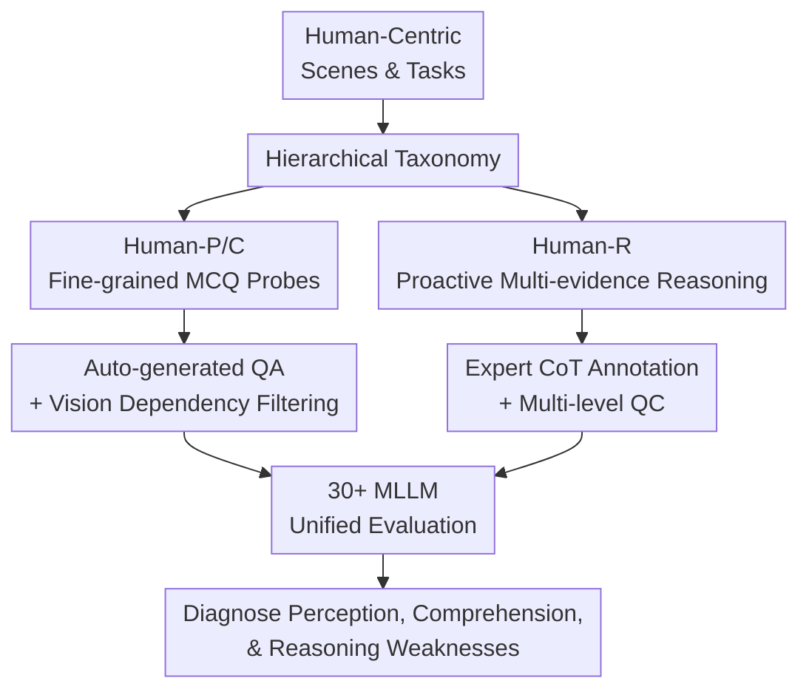

# HumanPCR: Probing MLLM Capabilities in Diverse Human-Centric Scenes

**Conference**: ICLR2026  
**OpenReview**: [https://openreview.net/forum?id=I6LUSZMJLa](https://openreview.net/forum?id=I6LUSZMJLa)  
**Paper**: [OpenReview](https://openreview.net/forum?id=I6LUSZMJLa)  
**Code**: TBD  
**Area**: Multimodal VLM / Evaluation Benchmark / Human-Centric Visual Understanding  
**Keywords**: MLLM Evaluation, Human-Centric Scenes, Video Reasoning, Proactive Visual Evidence, Multimodal Benchmark  

## TL;DR

HumanPCR constructs a hierarchical evaluation suite for human-centric visual scenes. It diagnoses model weaknesses across three levels—Perception, Comprehension, and Reasoning—covering human details, social behaviors, temporal processes, and multi-evidence video reasoning. The study finds that the most significant bottleneck for current models is not "seeing more frames," but rather the inability to proactively seek critical visual evidence not explicitly stated in the prompt.

## Background & Motivation

**Background**: Multimodal Large Language Models (MLLMs) have achieved the capability to process images, videos, and long contexts. Many general benchmarks report aggregate scores for tasks like VQA, video understanding, and action recognition. Meanwhile, human-centric scenes are indispensable for real-world MLLM applications; models must understand human poses, gaze, contact, action sequences, group relationships, intentions, and future plans to support robotics, decision assistance, education, and service applications.

**Limitations of Prior Work**: Existing evaluations are either too narrow, focusing only on action recognition, facial expressions, or specific professional movements, or too broad, mixing few human-related questions into general visual understanding and providing only a coarse total score. This masks critical failure modes: a model might identify "there is a person" and "they are moving" but fail to accurately perceive hand-object contact, body orientation, temporal dependencies of actions, or changes in interpersonal relationships. Furthermore, video reasoning benchmarks are often susceptible to shortcuts via explicit cues in the prompt or single snippets, failing to force models to integrate multiple scattered pieces of evidence.

**Key Challenge**: Human-centric scene understanding is not a simple classification problem but a layered capability built from fine-grained perception, commonsense comprehension, and evidence-driven reasoning. If evaluations only query explicit targets or rely on single-segment evidence, it becomes difficult to distinguish whether a model truly understands human behavior or has simply retrieved a contextually relevant segment based on prompt keywords. Therefore, a benchmark must cover sufficiently granular capability dimensions and explicitly penalize reasoning shortcuts.

**Goal**: The authors aim to answer three specific questions: first, which basic human-centric capabilities of current MLLMs are most unreliable; second, whether models can integrate multiple visual evidences in long-video, multi-person, and multi-event scenes; and third, whether models will proactively search for implicit visual cues when critical evidence is not directly mentioned in the question.

**Key Insight**: Instead of proposing a new model, HumanPCR decomposes evaluation into three layers: Perception, Comprehension, and Reasoning. The first two layers use large-scale multiple-choice questions (MCQs) for fine-grained probing across dimensions like human bodies, poses, appearances, contact, identity, behavior, processes, relationships, and scenes. The third layer features open-ended video reasoning questions requiring the model to identify multiple visual evidences, including at least one "proactive evidence"—an implicit cue not explicitly named in the prompt but essential for reasoning.

**Core Idea**: Replace single coarse-grained scores with a "hierarchical fine-grained taxonomy + manually curated proactive multi-evidence video reasoning" to systematically expose the true capability gaps of MLLMs in human-centric visual understanding.

## Method

### Overall Architecture

The workflow of HumanPCR comprises two complementary evaluation tracks: Human-P/C for large-scale, structured, and statistically fine-grained probes, and Human-R for high-quality, small-scale, shortcut-resistant open-ended video reasoning. The former identifies foundational weaknesses in "seeing people, actions, and relationships," while the latter checks if the model can proactively gather evidence, chain events, and make judgments in long videos like a human.

Specifically, the authors define a taxonomy based on human-centric perception and comprehension tasks, then match each task with multi-source datasets or manually supplemented samples. Human-P/C primarily generates MCQ QA pairs by converting original annotations via templates or LLMs, followed by blind filtering and manual review to remove questions answerable without visual input. Human-R collects videos from 11 life and professional domains, with domain annotators writing open-ended questions, answers, and CoT evidence chains, followed by multi-round selection by reviewers and meta-reviewers to ensure each question requires multi-evidence integration and at least one proactive evidence.

The emphasis of this framework is not "the more questions, the better," but the distinct diagnostic goal of each layer: Human-P/C decomposes fine-grained capabilities, while Human-R prevents laziness by prohibiting reliance on explicit prompt references or single evidence. The final output provides failure profiles by level, dimension, task, evidence type, and error category.

### Key Designs

**1. Hierarchical Taxonomy: Decomposing Human-Centric Understanding into Diagnostic Profiles**

HumanPCR organizes human-centric visual understanding into three layers: Human-P (Perception: people, objects, poses, appearance, contact, identity), Human-C (Comprehension: behaviors, processes, relationships, scenes), and Human-R (Reasoning: complex video inference). This decomposition ensures that "aggregate scores" do not obscure failure causes. For instance, if a model fails a video QA, it might be due to a failure to perceive hand-object contact, a lack of understanding of action sequences, or a failure to find implicit earlier events. The hierarchical taxonomy prevents these failures from merging into a single, vague low score.

In Human-P/C, the authors further refine 9 dimensions and 34 tasks, covering spatiality, posture, appearance, contact, identity, behavior, procedure, relation, and scene. This granularity provides diagnostic value: experiments show many models perform adequately in coarse spatial localization (Spatiality) but drop significant points in Posture, Contact, Procedure, and Relation, indicating that representations of human details, temporal sequences, and social relationships remain crude.

**2. Proactive Multi-Evidence Reasoning: Preventing Prompt-Induced Shortcuts**

The core of Human-R is not standard open-ended video QA, but the requirement that every question satisfies multi-evidence necessity and proactivity. Visual evidence is defined as an information unit (action, attribute, relation, or event) supporting reasoning. **Referred evidence** is explicitly mentioned in the prompt, while **proactive evidence** is implicit and must be retrieved by the model from context. This distinction is critical because many video benchmarks provide explicit timestamps or keywords in the question, allowing models to answer via keyword-based localization without holistic understanding.

Human-R requires at least two distinct visual evidences and at least one proactive evidence. For example, if asked "Does the person know a group will arrive?", the model cannot just look for the "feeding dogs" or the "man with glasses" mentioned in the prompt. It must proactively discover that she later prepped a sled but didn't use it, left on a snowmobile, and then the team arrived to use the sled. This design moves evaluation from "retrieving what was asked" to "establishing causal chains in long videos."

**3. Generation & Quality Control: Automated Scaling with Manual Complexity Guardrails**

Human-P/C leverages existing annotations by converting pose, action, and identity data into MCQ format using LLMs or templates. To ensure vision dependency, all QA pairs undergo "blind filtering" where models try to answer without visual input; if the model succeeds consistently, the question is discarded as a language-shortcut or too commonsense-reliant. Human-R involves higher quality control. Annotators write questions, answers, and CoT rationales; reviewers check objectivity and complexity; meta-reviewers confirm the necessity of multiple evidences and at least one proactive evidence. Human-R contains 442 open-ended questions with an acceptance rate of ~20%, prioritizing difficulty over volume.

**4. Diagnostic Evaluation Protocol: Linking Scores to Failures**

The evaluation includes 9 proprietary and 30 open-source MLLMs. Human-P/C uses accuracy, while Human-R uses an o3-mini judge for open-ended answers, validated against human ratings. The authors analyze frame counts, retrieval strategies, test-time scaling, CoT, and evidence-prompt interventions. A key finding was that Human-R's bottleneck is not the number of input frames. Increasing frames yielded marginal gains; however, providing "proactive evidence guidance" (vague hints toward implicit segments) improved multiple models by 10-13 points, suggesting that MLLMs perform query-driven retrieval but fail to actively construct a search process for missing evidence.

### A Complete Example

Consider a video of a sled-dog scene in Human-R. The question asks: "Did the woman know a group, including a man with glasses, would arrive at the yard later while she was feeding the dogs?" The only **referred evidence** is "woman feeding dogs" and "man with glasses." A model retrieving only based on these terms will see two isolated segments and likely answer "unsure."

HumanPCR requires the model to perform a different chain of reasoning: it sees the woman feeding dogs, then notices her prepping a sled but not using it, instead leaving on a snowmobile. Later, a team arrives and uses the sled she prepared. The evidence chain expands to "prepping sled," "her leaving," and "team using the sled"—none of which were explicitly mentioned but are essential for the inference. This shifts the task from finding a "red sock" to constructing a causal explanation across time points.

## Key Experimental Results

### Main Results

Experimental results indicate that current MLLMs are far from reliable in human-centric scenes. Human baseline accuracy is 81.95% on Human-P/C and 73.17% on Human-R. Even the best MLLMs significantly lag behind, particularly in reasoning. Open-source models can rival proprietary ones in perception and comprehension but fall behind in open-ended video reasoning, showing a gap between "seeing visual concepts" and "integrating complex human evidence."

| Model / Baseline | Human-P Avg. | Human-C Avg. | Human-P/C Total | Human-R | Key Observations |
| :--- | :--- | :--- | :--- | :--- | :--- |
| **Human** | 88.43 | 73.86 | 81.95 | 73.17 | Humans lead across all three layers. |
| **InternVL3-78B** | 65.34 | 60.20 | 62.77 | 37.56 | Top open-source P/C, but reasoning remains weak. |
| **o4-mini** | 64.13 | 60.42 | 62.28 | 53.39 | Proprietary reasoning models are significantly stronger in Human-R. |
| **Gemini-2.5-Flash** | 64.66 | 55.38 | 60.02 | 43.44 | Strong overall, but far below human reasoning. |
| **GPT-4o** | 47.41 | 49.33 | 48.37 | 41.40 | P/C is mediocre, but R is higher than most open-source. |
| **Random** | 23.00 | 20.25 | 21.78 | 0.00 | MCQ random baseline vs. open-ended invalid baseline. |

Models perform relatively better in Spatiality but drop significantly in Posture, Contact, Procedure, and Relation. This confirms that human-centric understanding exposes general MLLM flaws, particularly in fine-grained spatial perception, sequence modeling, and social relationship modeling.

### Ablation Study

Analyses focused on evaluation difficulty and reasoning mechanisms. Test-time scaling (BoN) provides some gains, but Self-Refine is limited. Substantial improvements (10-13 points) are seen when prompts reduce the difficulty of proactive evidence extraction.

| Setting / Model | Original Human-R | Post-Intervention | Change | Note |
| :--- | :--- | :--- | :--- | :--- |
| o4-mini + Level 3 proactive guidance | 53.39 | 63.35 | +9.96 | Significant gain when proactive evidence is hinted. |
| GPT-4o + Level 3 proactive guidance | 41.40 | 52.35 | +10.95 | Gap lies in proactive evidence localization. |
| Gemini-2.5-Flash + L3 guidance | 43.44 | 53.40 | +9.96 | Benefited from proactive evidence prompts. |
| Qwen2.5-VL-72B + L3 guidance | 34.39 | 47.74 | +13.35 | Strong open-source models also lack proactive search. |
| GPT-4o BoN, reward=o4-mini, $M=2$ | 41.40 | 46.38 | +4.98 | Test-time compute helps less than solving evidence extraction. |
| GPT-4o Self-Refine, $M=3$ | 41.40 | 40.95 | -0.45 | Refinement fails if evidence is missed or misperceived. |

Frame count analysis shows that simply increasing input frames yields minimal improvement. More frames provide more possible evidence but also more noise; without a mechanism to proactively select and integrate evidence, long context does not translate to better reasoning.

### Key Findings

- HumanPCR's 6,176 Human-P/C MCQs and 442 Human-R questions provide complementary diagnostics: fine-grained profiles vs. proactive multi-evidence reasoning.
- The gap between MLLMs and humans is vast; the strongest model (o3) reports 59.28 on Human-R, compared to human 73.17.
- Visual evidence extraction is a primary failure source; specifically, **missed proactive evidence** is more prevalent than missed referred evidence, indicating over-reliance on prompt cues.
- Human-R has very low text-only and single-frame bias. GPT-4o scores only 2.94 (text-only) and 11.08 (single-image) vs. 41.40 (video), unlike benchmarks like Video-MME where static scores are much higher relative to video scores.
- CoT benefits proprietary models but can sometimes lead to performance drops in open-source models for specific tasks, implying that "asking for an explanation" does not inherently fix visual perception.

## Highlights & Insights

- **Benchmark as a Diagnostic Tool**: HumanPCR's value lies in decomposing total scores into layers, tasks, and error types. This allows researchers to identify specific bottlenecks like posture, contact, and proactive evidence extraction.
- **Proactive Evidence as an Evaluation Pivot**: Instead of vaguely defined "complex reasoning," the concept of "implicit evidence necessary for the answer" provides a concrete target for future benchmarks.
- **Frames are not a Panacea**: Long-video understanding is not just about frame counts. Models must distinguish relevant evidence from noise and model causal/procedural links.
- **P/C and R Capacity Disconnect**: Many models excel at perceiving local visual concepts (P/C) but fail in reasoning (R), suggesting that future training needs more data oriented toward evidence search and domain-specific commonsense.

## Limitations & Future Work

- HumanPCR relies on public datasets and web videos; future work could expand into professional domains like nursing, industrial safety, and robotic collaboration.
- The scale of Human-R (442 questions) is high-quality but small. Expanding it for training purposes would require more efficient, automated pipelines that still avoid shortcuts.
- Dependence on o3-mini as a judge, while validated against human agreement, might still be influenced by answer granularity or domain knowledge. Future work could explore evidence-level scoring.
- The benchmark identifies gaps but does not provide solutions. Subsequent research could focus on training proactive evidence retrievers or procedural graph reasoning modules.

## Related Work & Insights

- **Comparison to HumanVBench/Face-Human-Bench**: HumanPCR expands human-centric understanding from basic perception to procedural sequences, social relations, and proactive reasoning.
- **Comparison to Video-MME/LongVideoBench**: Unlike general benchmarks with high text/static bias, Human-R forces video input and multi-evidence integration, making it a truer measure of temporal reasoning.
- **Inspiration for Future Methods**: To improve on HumanPCR, models may need to separate prompt understanding, candidate evidence search, relation modeling, and answer generation, rather than simply feeding more frames into a single context. Proactive evidence could be treated as a retrieval target.

## Rating

- Novelty: ⭐⭐⭐⭐☆ (Strong conceptual contribution with proactive evidence).
- Experimental Thoroughness: ⭐⭐⭐⭐⭐ (30+ models, multi-dimensional ablation, and diagnostic analysis).
- Writing Quality: ⭐⭐⭐⭐☆ (Logical structure; dense data in appendices).
- Value: ⭐⭐⭐⭐⭐ (Critical for diagnosing MLLM bottlenecks in human-centric and long-video tasks).

<!-- RELATED:START -->

## Related Papers

- [\[ICLR 2026\] UrbanFeel: A Comprehensive Benchmark for Temporal and Perceptual Understanding of City Scenes through Human Perspective](urbanfeela_comprehensive_benchmark_for_temporal_and_perceptual_understanding_of_.md)
- [\[ICLR 2026\] Human-MME: A Holistic Evaluation Benchmark for Human-Centric Multimodal Large Language Models](human-mme_a_holistic_evaluation_benchmark_for_human-centric_multimodal_large_lan.md)
- [\[CVPR 2026\] HumanVBench: Probing Human-Centric Video Understanding in MLLMs with Automatically Synthesized Benchmarks](../../CVPR2026/multimodal_vlm/humanvbench_probing_human_centric_video_understanding_in_mllms_with_automatica.md)
- [\[CVPR 2026\] VisualOverload: Probing Visual Understanding of VLMs in Really Dense Scenes](../../CVPR2026/multimodal_vlm/visualoverload_probing_visual_understanding_of_vlms_in_really_dense_scenes.md)
- [\[ICLR 2026\] CapRL: Stimulating Dense Image Capabilities via Reinforcement Learning](caprl_stimulating_dense_image_caption_capabilities_via_reinforcement_learning.md)

<!-- RELATED:END -->
