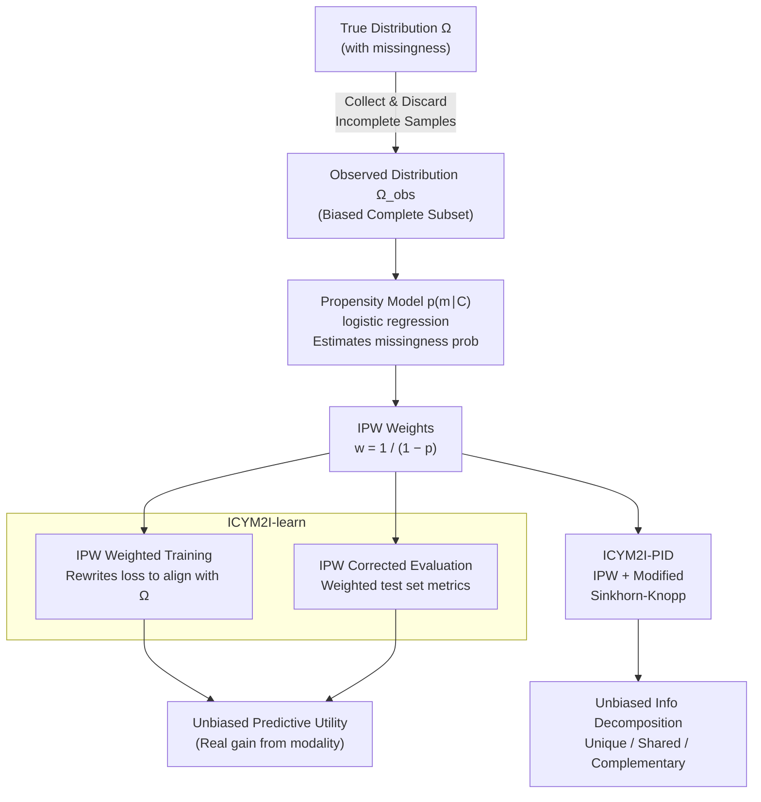

# ICYM2I: The Illusion of Multimodal Informativeness under Missingness

**Conference**: ICLR 2026  
**arXiv**: [2505.16953](https://arxiv.org/abs/2505.16953)  
**Code**: [https://github.com/reAIM-Lab/ICYM2I](https://github.com/reAIM-Lab/ICYM2I)  
**Area**: Multimodal VLM / Machine Learning Theory  
**Keywords**: Multimodal missingness, distribution shift, Inverse Probability Weighting (IPW), information decomposition, modality valuation

## TL;DR

Ours reveals an overlooked problem in multimodal learning: distribution shifts caused by modality missingness lead to severe biases in modality valuation. The ICYM2I framework is proposed to correct biases in both training and evaluation via dual Inverse Probability Weighting (IPW), achieving unbiased estimation of modality predictive utility and information-theoretic value under the MAR assumption.

## Background & Motivation

**Background**: Multimodal learning is widely applied in scenarios such as healthcare, autonomous driving, and recommendation systems, with the core assumption being "multimodal > unimodal." In practice, modality value is often evaluated through ablation experiments (observing performance degradation when a modality is removed).

**Limitations of Prior Work**: In reality, data collection involves significant missingness—sensor failures, cost constraints, and privacy restrictions make certain modalities unavailable for some samples. The current practice is to discard incomplete samples and train/evaluate on the complete subset. However, if the missingness is not completely random (i.e., not MCAR), the distribution of the discarded data subset differs from the true distribution, leading to biased modality valuation.

**Key Challenge**: Confounding between the missingness mechanism and modality signals—if the missingness of a modality is correlated with labels (MAR), the "performance" of that modality in the complete subset will be systematically overestimated or underestimated. This bias is almost entirely ignored in current research.

**Goal**: How to unbiasedly evaluate a modality's (a) predictive utility (performance gain after adding the modality) and (b) information-theoretic value (unique, shared, and complementary information carried by the modality) under conditions of non-random missingness?

**Key Insight**: Borrowing the Inverse Probability Weighting (IPW) method from causal inference, the distribution shift caused by missingness is treated as a correctable selection bias.

**Core Idea**: Use Inverse Probability Weighting to simultaneously correct training losses and evaluation metrics, enabling multimodal models to achieve unbiased modality valuation even on observed data with missingness.

## Method

### Overall Architecture

ICYM2I addresses how to obtain unbiased judgments of modality value when certain modalities in the training data are missing non-randomly. It starts from a "polluted" reality—the true distribution $\Omega$ contains missingness, and incomplete samples are discarded during data collection, leaving a "selected" and biased complete subset $\Omega_{obs}$. ICYM2I first employs a propensity model (logistic regression trained on observed covariates $C$) to estimate the probability of each sample being fully observed, which is then converted into Inverse Probability Weighting (IPW) weights. These weights are fed into two parallel correction pipelines. One is **ICYM2I-learn**, which trains and evaluates multimodal/unimodal models on the observed data with missingness but uses weighting to ensure that both training and evaluation reflect the true distribution rather than the polluted observed distribution. The other is **ICYM2I-PID**, which injects the same weighting into Partial Information Decomposition (PID) estimation to unbiasedly decompose modality information into unique, shared, and complementary components. The entire framework is built on two premises: MAR (Missing At Random, where missingness depends only on observed covariates) and Positivity (the probability of complete observation is greater than 0 for any combination of covariates), the latter ensuring that the IPW weights do not have a zero denominator.

### Key Designs

**1. IPW Weighted Training: Aligning Observed Training with the True Distribution**

The risk of training only on complete samples is that these samples are "selected"—samples more likely to be fully observed are overrepresented in the subset. The model learns a mapping of the observed distribution $\Omega_{obs}$ rather than the true distribution $\Omega$. ICYM2I-learn rewrites the loss by multiplying each complete sample $(x_1, x_2, y)$ by an inverse probability weight $w = \frac{1}{1 - p(m_1, m_2, m_y \mid C)}$, where $p(m \mid C)$ is the missingness probability model (logistic regression) trained on observed covariates $C$. Samples more likely to be fully observed (lower missingness probability) receive smaller weights, while rare complete samples receive larger weights, re-aligning the overall distribution to the true distribution. This applies the IPW concept used for correcting selection bias in causal inference to the multimodal missingness scenario.

**2. IPW Corrected Evaluation: Correcting the Test Set**

Correcting training alone is insufficient—if metrics are still calculated on the biased complete subset, the resulting AUC remains a biased estimate on $\Omega_{obs}$. Therefore, the evaluation phase also applies IPW: use the same inverse probability weights to weight the metric contribution of each test sample, adjusting standard metrics into unbiased estimates for the true distribution $\Omega$. Correcting both training and evaluation ensures that the final "performance gain from adding a modality" is credible (Ours validates that both are necessary).

**3. ICYM2I-PID: Recovering Information Decomposition from Missingness Bias**

Performance metrics alone cannot distinguish whether the information carried by a modality is "unique" or "redundant" with other modalities. Partial Information Decomposition (PID) can subdivide modality information into Unique, Shared, and Complementary components, but standard PID estimates are also polluted by missingness bias. ICYM2I-PID combines the PID framework of Bertschinger et al. with IPW. The core lies in correcting the estimation of the three-way mutual information $I(Y:(X_1,X_2))$: first, use IPW weighted samples to reconstruct mutual information under the true distribution, then use a modified Sinkhorn-Knopp process to constrain marginal distribution matching, thereby obtaining unbiased information decomposition on data with missingness.

### Loss & Training

Weighted cross-entropy is the implementation point of the framework:

$$l_{\Omega}(x_1,x_2,y) = \frac{1}{1-p(m_1,m_2,m_y \mid C)} \cdot l_{\Omega_{obs}}(x_1,x_2,y)$$

The missingness probability model $p(m \mid C)$ is provided by a logistic regression trained on observed covariates $C$. The PID component uses a parameterized neural network with Sinkhorn-Knopp iterations to solve the constrained optimization.

## Key Experimental Results

### Main Results

Bitwise logic operation experiments (AND/OR/XOR, 50% MAR missingness):

| Op | Method | X1 AUC | X2 AUC | Unique1 | Unique2 | Shared | Compl. |
|----|--------|--------|--------|---------|---------|--------|--------|
| AND | Oracle | 0.83 | 0.84 | 0.05 | 0.03 | 0.26 | 0.47 |
| AND | Observed | 0.66 | 0.93 | **0.44** | 0.00 | 0.15 | 0.36 |
| AND | **ICYM2I** | **0.83** | **0.85** | **0.03** | **0.03** | **0.27** | **0.45** |
| XOR | Oracle | 0.51 | 0.49 | 0.00 | 0.00 | 0.00 | 0.99 |
| XOR | Observed | 0.52 | **0.80** | **0.34** | 0.07 | -0.07 | 0.62 |
| XOR | **ICYM2I** | **0.53** | **0.49** | **0.00** | **0.00** | **0.01** | **0.96** |

The Observed method severely overestimates X2's AUC in XOR (0.80 vs true 0.49) and Unique1 (0.34 vs true 0.00). ICYM2I corrects this perfectly.

### Ablation Study

Correction combination analysis (AUC RMSE vs Oracle):

| Training Type | Evaluation Type | AUC RMSE ↓ |
|---------------|-----------------|------------|
| Standard | Standard | High (Biased) |
| IPW | Standard | Mid (Train corrected but Eval still biased) |
| Standard | IPW | Mid |
| **IPW** | **IPW** | **Lowest (Dual Correction)** |

### Key Findings

- The direction of missingness bias depends on the missingness mechanism: for the OR operator, X1 is overestimated (as X2 is more likely missing when X1=1, amplifying X1's predictive power in the observed subset); the opposite occurs for the AND operator.
- **XOR is the most extreme case**: unique information for both modalities is 0 (all information is complementary), but without correction, Unique1 is estimated as 0.34—this leads to the misleading conclusion that "X1 has value on its own."
- Correction for both training and evaluation is necessary; neither can be omitted.
- The effectiveness of ICYM2I was also validated on real-world medical data (breast cancer screening).

## Highlights & Insights

- **Unique Perspective and Far-reaching Impact**: Previous multimodal work implicitly assumed the "complete sample subset represents the whole population." ICYM2I is the first to formalize the fragility of this assumption. This is not a marginal issue—in high-risk scenarios like healthcare and autonomous driving, missingness is often related to key factors, and the consequences of bias are severe.
- **Causal Tools in Multimodal Learning**: IPW is a classic tool in causal inference. Ours skillfully applies it to the missingness problem in multimodal learning, representing an excellent cross-domain methodological transfer.
- **Distinguishing Two Different Missingness Problems**: (1) Target-environment missingness (traditional problem: how to be robust to sensor failure during deployment) and (2) source-environment missingness (Ours' focus: how missingness in training data biases modality valuation).

## Limitations & Future Work

- **MAR Assumption May Not Hold**: If missingness depends on unobserved variables (MNAR), IPW cannot correct it. The paper discusses robustness under MNAR in the appendix but acknowledges this limitation.
- **Accuracy of the Propensity Model is Crucial**: IPW weights come from logistic regression estimates. If this model is inaccurate, the correction remains biased.
- **Extreme IPW Weight Issues**: When the observation probability of certain samples is extremely low, the IPW weights become very large, leading to high variance. Stabilization strategies like weight clipping were not discussed.
- **Small Experimental Scale**: Validation was mainly on synthetic/semi-synthetic data and small-scale medical data. Verification on large-scale multimodal benchmarks is needed.

## Related Work & Insights

- **vs. Standard Multimodal Robustness Methods** (e.g., imputation, knowledge distillation): These methods focus on "maintaining performance when modalities are missing in the target environment," whereas ICYM2I focuses on the more fundamental question—"how missingness in source data biases our judgment of modality value."
- **vs. PID Decomposition Methods** (Liang et al. 2024a): PID decomposition implicitly assumes observed distribution = true distribution. ICYM2I proves this creates severe bias under missingness and provides a correction scheme.
- **Insights for Practical Systems**: When deciding "whether it is worth collecting an expensive modality" (e.g., biopsy in medicine), one cannot simply look at the results of ablation studies on retrospective data—missingness bias must be corrected first.

## Rating

- Novelty: ⭐⭐⭐⭐⭐ First to formalize the multimodal missingness bias problem; unique perspective with broad impact.
- Experimental Thoroughness: ⭐⭐⭐ Smaller scale experiments; lacks validation on large multimodal benchmarks.
- Writing Quality: ⭐⭐⭐⭐⭐ Rigorous formalization; intuitive and powerful motivational examples (bitwise logic).
- Value: ⭐⭐⭐⭐ Important guidance for multimodal learning evaluation practices, though more empirical support is needed.

<!-- RELATED:START -->

## Related Papers

- [\[CVPR 2026\] Breaking the Illusion: When Positive Meets Negative in Multimodal Decoding](../../CVPR2026/multimodal_vlm/breaking_the_illusion_when_positive_meets_negative_in_multimodal_decoding.md)
- [\[ICML 2026\] Are VLMs Seeing or Just Saying? Uncovering the Illusion of Visual Re-examination](../../ICML2026/multimodal_vlm/are_vlms_seeing_or_just_saying_uncovering_the_illusion_of_visual_re-examination.md)
- [\[CVPR 2026\] BALM: A Model-Agnostic Framework for Balanced Multimodal Learning under Imbalanced Missing Rates](../../CVPR2026/multimodal_vlm/balm_a_model-agnostic_framework_for_balanced_multimodal_learning_under_imbalance.md)
- [\[CVPR 2025\] COUNTS: Benchmarking Object Detectors and Multimodal Large Language Models under Distribution Shifts](../../CVPR2025/multimodal_vlm/counts_benchmarking_object_detectors_and_multimodal_large_language_models_under_.md)
- [\[ICML 2026\] Certified Robustness under Heterogeneous Perturbations via Hybrid Randomized Smoothing](../../ICML2026/multimodal_vlm/certified_robustness_under_heterogeneous_perturbations_via_hybrid_randomized_smo.md)

<!-- RELATED:END -->
