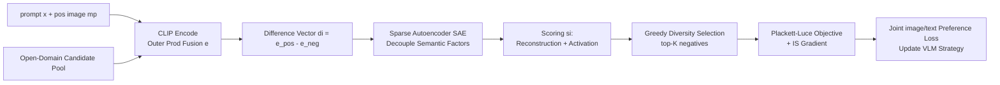

# Importance Sampling for Multi-Negative Multimodal Direct Preference Optimization

**Conference**: ICLR 2026  
**OpenReview**: [https://openreview.net/forum?id=HEFPwoGtTj](https://openreview.net/forum?id=HEFPwoGtTj)  
**Code**: TBD  
**Area**: Multimodal Alignment / Vision-Language Models / Preference Optimization  
**Keywords**: Multimodal DPO, Plackett-Luce, Sparse Autoencoder, Importance Sampling, Hallucination Reduction  

## TL;DR
MISP-DPO extends multimodal DPO from "one positive, one negative" to "one positive, multiple negatives": it utilizes Sparse Autoencoders (SAE) in CLIP space to extract interpretable visual bias factors for selecting semantically diverse negative images, then employs a Plackett-Luce objective with importance sampling for efficient training, significantly reducing hallucinations in VLMs.

## Background & Motivation
**Background**: DPO has become the mainstream method for aligning LLMs due to its stability and avoidance of explicit reward modeling. Recently, a series of works (mDPO, CHiP, S-VCO, Re-Align, etc.) have extended this to Vision-Language Models (VLMs) using image-text preference feedback to improve multimodal alignment and suppress hallucinations.

**Limitations of Prior Work**: Existing methods construct negative samples in a primitive manner—each comparison involves only a **single negative image**, obtained via adversarial cropping, random perturbation, or similarity retrieval. This compresses the supervision signal into a "one-dimensional direction deviating from the positive image." The paper highlights this issue with an intuitive example: if a negative image merely replaces a "red apple" with a "green apple," the model might only learn to "reject green" while remaining blind to context mismatches like "kitchen counter" or object misidentifications like "pear." Even listwise extensions that introduce multiple negatives mostly involve perturbations of the same positive image, resulting in highly homologous and semantically overlapping variants where learning signals cluster around a small set of similar biases.

**Key Challenge**: Unlike text, which has explicit compositional units like tokens, it is difficult to cleanly isolate "meaningful visual biases" in images. Naive perturbations often destroy global coherence without clearly identifying what was changed, causing **orthogonal error dimensions**—such as object identity, color, spatial layout, and context matching—to be entangled within a single negative image. Consequently, models remain blind to most of these failure modes.

**Goal**: To construct "multi-faceted" visual negative samples that cover diverse semantic biases, providing richer and more structured signals for preference learning.

**Core Idea**: **Multi-negatives + Semantic Decoupling + Efficient Sampling**. First, an SAE is used to decompose the differences between positive and negative images into interpretable latent factors, which are then used to filter semantically diverse negatives. Second, a Plackett-Luce objective is employed to let the positive image simultaneously outperform a set of negatives. Finally, importance sampling is used to compress the computational load of a "large candidate pool" into a manageable "small candidate pool."

## Method

### Overall Architecture
MISP-DPO is a two-stage framework: The first stage involves **negative image selection** from an open-domain gallery (COCO). Prompts and candidate images are embedded into CLIP space, where an SAE decomposes their semantic differences from the positive image into decoupled factors. Top-K negative images are then greedily selected based on "informativeness + semantic deviation + mutual diversity." The second stage feeds these negatives into a **Plackett-Luce multi-negative DPO objective**, utilizing gradients estimated via importance sampling guided by SAE scores, combined with text-side preference supervision for joint optimization.

### Key Designs

**1. Multi-negative Plackett-Luce Objective: Letting the positive image simultaneously outperform a whole set of negatives.** Standard multimodal DPO uses Bradley-Terry for pairwise comparisons. This paper adopts the Plackett-Luce model, setting the objective such that the positive image $m_p$ is ranked above the entire set of negative images $S_n=\{m_n^i\}_{i=1}^N$. The loss aggregates all negatives via softmax: $L_{img}(\theta;S_n)=\log\sigma\!\big(-\log\sum_{i\in S_n}\exp(\beta\Delta_i)\big)$, where $\Delta_i=\log\frac{\pi_\theta(y_p|x,m_n^i)}{\pi_{ref}(y_p|x,m_n^i)}-\log\frac{\pi_\theta(y_p|x,m_p)}{\pi_{ref}(y_p|x,m_p)}$ represents the preference advantage of each negative relative to the positive. At $N=1$, it degrades exactly to single-negative DPO. The paper further provides a gradient decomposition (Lemma 4.1): the gradient is a weighted combination of correction signals $\Delta_\theta(m_n^i,m_p)$ for each negative image according to the preference distribution $p_\theta(m_n^i)\propto\exp(a_i)$. This makes it interpretable how the model corrects different visual biases, forcing the strategy to satisfy multiple constraints simultaneously rather than taking shortcuts along a single direction.

**2. SAE for Decoupling Visual Bias + Importance Sampling Gradient Estimation.** Unbiased updates require sampling many negatives and calculating a full-set softmax, which is infeasible in the real image domain. This work introduces a learnable distribution $q_\phi(m_n|x,m_p,y_p)$ to sample a small candidate pool $\tilde S_n$ and rewrites the gradient as an **importance sampling estimate** under $q_\phi$: $\nabla_\theta L_{img}(\theta;\tilde S_n)=\beta\sigma(\cdot)\sum_{i\in\tilde S_n}\frac{\exp(a_i)}{q_\phi(m_n^i)}\Delta_\theta(m_n^i,m_p)$. The appendix proves this estimate is **strictly unbiased** with bounded variance, converging at $O(1/K)$ with a constant controlled by the maximum importance weight, providing theoretical support for stable optimization with small candidate pools. Implementation-wise, CLIP image-text embeddings are fused via outer product $e=\mathrm{vec}(h_v\times h_t^\top)$. For each candidate negative, a difference vector $d_i=e(m_p,x)-e(m_n^i,x)$ is computed. An SAE with KL sparsity constraints (reconstruction loss + $\sum_j\mathrm{KL}(\rho\|\hat\rho_j)$) decouples $d_i$ into sparse latent factors (e.g., object, color, layout), which form the basis for $q_\phi$.

**3. Reconstruction Difficulty + Diversity Greedy Selection.** With SAE decomposition, each candidate negative is scored as $s_i=\frac{\|d_i-D(E(d_i))\|_2^2}{\max_j\ell_j}+\frac{\|E(d_i)\|_1}{\max_j v_j}$. The first term is normalized reconstruction error (higher meaning harder/novel hard negatives), and the second is latent activation strength (semantic deviation). Then, Algorithm 1 performs **greedy diversity selection**: each step selects $\arg\max_i[s_i+\beta\min_{j\in\tilde S_n}(1-\cos(E(d_i),E(d_j)))]$, balancing high scores with latent space orthogonality to ensure the $K$ negatives are informative and cover different error types.

**4. Joint Image-Text Preference Supervision.** In addition to image-side multi-negative loss, the framework adds a text-side DPO supervision $L_{text}$. While keeping the positive image $m_p$ fixed, image-grounded negative responses $y_n$ replace traditional pure text preferences. The final loss is $L(\theta;\tilde S_n)=L_{img}+\lambda L_{text}$ (with $\lambda=1$). This ensures alignment occurs at both the visual discrimination and cross-modal text levels, further strengthening grounding.

## Key Experimental Results

### Main Results
Evaluated on LLaVA-1.5-7B, Qwen2.5-VL-7B, and Qwen2.5-VL-3B backbones across five benchmarks (MMHalBench / HallusionBench / POPE for hallucinations; WildVision / MMVP for vision-centric reasoning). Relative average improvement over Base is reported:

| Backbone | Method | MMHal Score↑ | MMHal HalRate↓ | HallusionBench aA↑ | POPE Acc↑ | MMVP Acc↑ | avg impr. |
|---|---|---|---|---|---|---|---|
| LLaVA-1.5-7B | Base | 2.78 | 51.04 | 47.73 | 84.37 | 60.67 | 0% |
| | DPO | 3.29 | 37.50 | 55.62 | 83.02 | 62.66 | +21.13% |
| | mDPO | 2.99 | 49.81 | 47.32 | 83.25 | 58.33 | +0.22% |
| | CHiP | 3.13 | 34.04 | 51.95 | 82.56 | 52.33 | +5.59% |
| | Random(Multi-Neg) | 3.42 | 36.46 | 55.94 | 82.61 | 60.33 | +22.23% |
| | **MISP-DPO** | **3.51** | **32.29** | **57.52** | **83.94** | **63.00** | **+30.09%** |
| Qwen2.5-VL-7B | Base | 4.61 | 18.09 | 70.45 | 87.65 | 77.67 | 0% |
| | **MISP-DPO** | **5.05** | **11.46** | **71.24** | **88.66** | **79.00** | **+5.35%** |
| Qwen2.5-VL-3B | Base | 4.20 | 22.34 | 64.67 | 87.48 | 70.60 | 0% |
| | **MISP-DPO** | **4.61** | **13.54** | **65.51** | 87.77 | **74.25** | **+19.89%** |

MISP-DPO consistently leads across all backbones and evaluation domains; the largest gain is observed in hallucination benchmarks (+30.09% on LLaVA). Notably, single-negative methods like mDPO / CHiP even show performance degradation (-1.16% / -1.33%) on the stronger Qwen2.5-VL-7B, while MISP-DPO maintains positive gains.

### Ablation Study
Comparison of different negative construction methods on Qwen2.5-VL-7B (subset):

| Negative Construction | MMHal Score↑ | MMHal HalRate↓ | HallusionBench aA↑ | POPE Acc↑ | MMVP Acc↑ |
|---|---|---|---|---|---|
| mDPO (Single Neg) | 5.01 | 14.89 | 67.40 | 87.02 | 76.33 |
| diffusion perturbation | 5.12 | 12.50 | 69.50 | 87.52 | 78.00 |
| crop + diffusion | 4.92 | 13.54 | ... | ... | ... |
| **MISP-DPO (SAE Multi-Neg)** | **5.05** | **11.46** | **71.24** | **88.66** | **79.00** |

Ablation on the number of negative images (Figure 2 right) shows performance increases as $K$ goes from 1 to 3 before saturating, so $K=3$ is selected as default. t-SNE visualizations show that negatives selected via SAE importance sampling are highly scattered semantically, whereas random sampling produces tight clusters with low diversity. $\beta$ scanning shows optimal performance in the 0.45–0.75 range, with extremes (0.1/1.0) causing degradation; hence, $\beta=0.5$ is used.

### Key Findings
- **Multi-negatives are inherently useful, and semantic diversity is an amplifier**: Random multi-negatives already outperform single-negative mDPO/CHiP, and SAE-guided diversity selection further minimizes hallucination rates.
- **Concentrated effect on hallucination suppression**: MMHal hallucination rates across three backbones dropped to 32.29% / 11.46% / 13.54%. Concurrent improvements in POPE/HallusionBench indicate that multi-faceted negatives effectively expose orthogonal failure modes like object misidentification and attribute distortion.
- **No degradation on stronger models**: While single-negative methods fail on strong backbones, multi-negative + importance sampling maintains positive gains, demonstrating scalability.

## Highlights & Insights
- **Elevating "Negative Engineering" to Interpretable Latent Factor Selection**: Using SAE to decouple visual biases in CLIP space turns negative selection from heuristic perturbation into a structured, interpretable sampling problem. This is the fundamental difference from mDPO/CHiP.
- **Closed Loop of Theory and Engineering**: The importance sampling estimate is proven to be unbiased with $O(1/K)$ variance, ensuring that "efficient training with small pools" is backed by convergence guarantees rather than just an engineering compromise.
- **Elegant Generalization of DPO via Plackett-Luce**: At $N=1$, the approach degrades precisely to the original DPO. The gradient decomposition into weighted sums of correction signals provides clear interpretability and compatibility.

## Limitations & Future Work
- **Dependence on Open-Domain Galleries and CLIP/SAE Quality**: Negatives are retrieved from COCO and SAE is trained in CLIP space. If the target domain distribution deviates from CLIP's coverage, the relevance of decoupled factors and negatives may decrease.
- **Multi-negative Limited to Image-side**: The text-side still uses single-negative DPO; the potential for "multi-negative" cross-modality remains unexplored.
- **SAE Hyperparameters and Latent Dimensions Need Tuning**: Parameters (latent dim=128, $\gamma=1, \rho, K=3, \beta=0.5$) are sensitive. Semantic naming of interpretable factors (object/color/layout) is largely qualitative, lacking quantitative attribution metrics.
- **Computational Overhead**: Each sample requires CLIP encoding of the candidate pool + SAE decoupling + greedy selection. Preprocessing costs are higher than pure perturbation methods (though importance sampling mitigates training-side overhead).

## Related Work & Insights
- **Multimodal DPO Genealogy**: mDPO (conditional preference + reward anchoring), CHiP (hierarchical text supervision + visual contrastive loss), S-VCO / Re-Align (counterfactual / retrieval-based negatives). The common pain point is that negative construction is limited to local perturbations; this work provides a scalable generation scheme via hallucination-centric preference optimization.
- **Multi-negative Preference Optimization**: Softmax-DPO and DMPO have improved robustness in text/recommendation domains using soft ranking or Plackett-Luce. This paper systematically migrates these ideas to VLMs for the first time, addressing the challenge of how visual negatives capture fine-grained cross-modal semantic shifts.
- **Insights from Attribute Recognition**: Compact, well-curated small subsets can rival large noisy sets. This work's use of SAE to select semantically diverse negatives confirms that "quality over quantity" holds true in multimodal preference learning.
- **Inspiration**: Using interpretability tools (SAE) as data filters rather than just for post-hoc analysis is a valuable paradigm. The combination of "multi-negatives + importance sampling + unbiased variance bounds" can be applied to other alignment tasks requiring contrastive samples.

## Rating
- Novelty: ⭐⭐⭐⭐ The first framework to use SAE for decoupling visual biases in CLIP space for multi-negative multimodal DPO, reframing negative engineering as interpretable latent factor sampling with theoretical support.
- Experimental Thoroughness: ⭐⭐⭐⭐ Covers three backbones and five benchmarks, including ablations on construction, quantity, $\beta$, and t-SNE. Compares with solid baselines, though lacking quantitative evaluation of OOD generalization and overhead.
- Writing Quality: ⭐⭐⭐⭐ The motivation is clearly illustrated with the "green apple" example. The derivation from objective to gradient to sampling is complete and the charts are clear.
- Value: ⭐⭐⭐⭐ Provides a practical, scalable, and theoretically grounded solution for VLM hallucination suppression. Shows stable gains even on strong models where single-negative methods fail.

<!-- RELATED:START -->

## Related Papers

- [\[ICML 2026\] TUR-DPO: Topology- and Uncertainty-Aware Direct Preference Optimization](../../ICML2026/multimodal_vlm/tur-dpo_topology-_and_uncertainty-aware_direct_preference_optimization.md)
- [\[ICML 2025\] Importance Corrected Neural JKO Sampling](../../ICML2025/multimodal_vlm/importance_corrected_neural_jko_sampling.md)
- [\[ICLR 2026\] Uni-DPO: A Unified Paradigm for Dynamic Preference Optimization of LLMs](uni-dpo_a_unified_paradigm_for_dynamic_preference_optimization_of_llms.md)
- [\[CVPR 2025\] SymDPO: Boosting In-Context Learning of Large Multimodal Models with Symbol Demonstration Direct Preference Optimization](../../CVPR2025/multimodal_vlm/symdpo_boosting_in-context_learning_of_large_multimodal_models_with_symbol_demon.md)
- [\[ICLR 2026\] Multimodal Prompt Optimization: Why Not Leverage Multiple Modalities for MLLMs](multimodal_prompt_optimization_why_not_leverage_multiple_modalities_for_mllms.md)

<!-- RELATED:END -->
