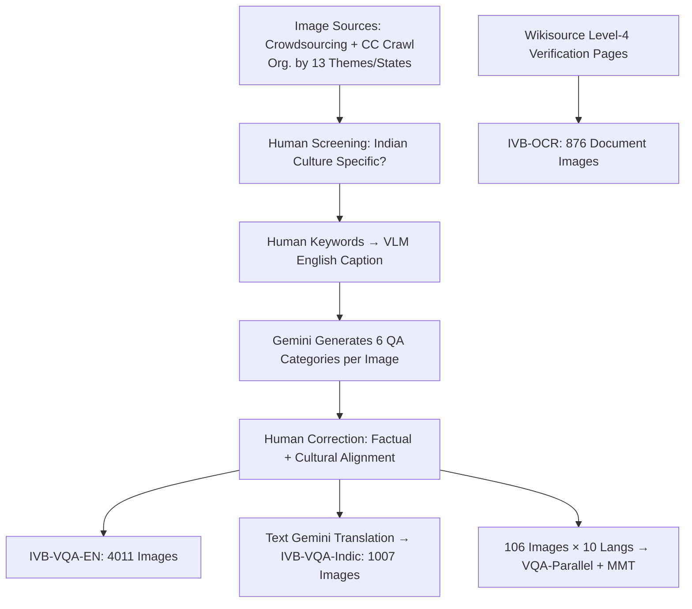

# IndicVisionBench: Benchmarking Cultural and Multilingual Understanding in VLMs

**Conference**: ICLR 2026  
**OpenReview**: [https://openreview.net/forum?id=LmJoLn04iL](https://openreview.net/forum?id=LmJoLn04iL)  
**Code/Data**: [https://huggingface.co/datasets/krutrim-ai-labs/IndicVisionBench](https://huggingface.co/datasets/krutrim-ai-labs/IndicVisionBench)  
**Area**: Multimodal VLMs / Cultural and Multilingual Evaluation Benchmarks  
**Keywords**: VLM evaluation, cultural understanding, Indic languages, OCR, multimodal translation, cultural VQA  

## TL;DR
IndicVisionBench is the first large-scale culture-multilingual VLM evaluation benchmark focusing on the Indian subcontinent. Covering English + 10 Indic languages across three multimodal tasks (VQA / OCR / MMT) with 5K images and over 37K QA pairs, it systematically reveals the significant performance gaps of current VLMs in culturally diverse contexts.

## Background & Motivation
**Background**: Vision-Language Models (VLMs) demonstrate strong performance in general multimodal tasks. However, the vast majority of evaluation benchmarks (VQA, MME, VQAv2, etc.) are "Western-centric," primarily constructed around English and Euro-American cultural contexts.

**Limitations of Prior Work**: India is one of the most culturally and linguistically diverse regions globally, with 22 official languages and 36 states/union territories, each possessing unique ethnic, visual, and cultural identities. Existing efforts (CVQA, CulturalVQA, ALM-Bench) only "partially touch" the Indian context by either having narrow language coverage (most open-source VLMs support only 2–4 mid-resource Indic languages), lacking cultural targeting, or focusing on a single task. No unified framework exists to simultaneously characterize Indian cultural diversity and multilingual multimodal evaluation.

**Key Challenge**: While VLMs claim "generalization," it remains unknown whether they truly hold up for low-resource languages and culture-specific content due to a lack of reproducible, sufficiently fine-grained probes.

**Goal**: To construct an India-centric, culturally grounded, and reproducible evaluation suite that incorporates "cultural knowledge," "multilingual robustness," and "text recognition" to quantify the actual performance gap in mainstream VLMs.

**Core Idea**: By using "states/union territories as proxies for cultural groups," the benchmark is built around 13 Indian cultural themes covering three complementary multimodal tasks (VQA, OCR, MMT). It also includes a parallel annotated corpus across 10 languages, allowing "cross-lingual cultural understanding" to be analyzed comparison-wise per language.

## Method

### Overall Architecture
IndicVisionBench (IVB) is a "collection-synthesis-human review-evaluation" benchmark construction pipeline, resulting in three task tracks and one parallel corpus. Images are sourced from crowdsourcing and CC-licensed web crawling, with manual quality checks at every step. Annotations begin with human-provided keywords, which are expanded into detailed English captions by a VLM. Subsequently, an LLM generates six categories of questions and translations, followed by full manual correction to ensure factual and cultural accuracy.

### Key Designs
**1. Three complementary tracks to approximate "cultural understanding."** A single task cannot fully characterize cultural capability; thus, IVB uses three orthogonal tracks: The VQA track (4,011 English + 1,007 multilingual cultural images, 6 questions per image) measures recognition and reasoning; the OCR track (876 Wikisource document images across 10 Indic scripts, including printed and handwritten) measures recognition of low-resource scripts; the MMT track (106 image-caption pairs translated into 10 languages) measures "visually grounded translation." These cover the full chain from script recognition to cultural semantic understanding and cross-lingual semantic transmission.

**2. Six question types + Adversarial questions to test deep judgment.** Each VQA image includes six types of questions: 2 short-answer, 1 long-answer, 1 multiple-choice (MCQ), 1 True/False, and a critical **adversarial question**. Adversarial questions deliberately embed **false premises**, requiring the model to explicitly reject them rather than follow the incorrect assumption. This elevates the evaluation from "can it recognize a specific cultural element" to "can it avoid being misled by suggestive cultural presets," serving as a sharp probe for the depth of cultural knowledge.

**3. Parallel corpus to quantify "cross-lingual cultural degradation."** The authors extract a disjoint subset of 106 images and translate the same set of 6 questions into all 10 Indic languages to form VQA-Parallel. Because the questions and images are strictly parallel across languages, a decline in score can be cleanly attributed to "language resources/scripts" rather than "differences in question difficulty." The MMT track reuses these 106 images, translating each English caption into 10 languages under **image context** with full manual verification to avoid the data contamination issues prevalent in older MMT data based on Visual Genome.

**4. Mixed deterministic and judge-based evaluation.** MCQ and True/False use Exact Match ($0–1$). Short-answer, long-answer, and adversarial questions use GPT-4o as LLM-as-a-Judge ($0–10$ score) to capture contextual and cultural appropriateness. MMT uses BLEU and RIBES, while OCR primarily uses ANLS (robust to outliers) supplemented by WER/CER. Metrics are "customized" by question type to avoid misjudgment of open-ended cultural QA by rigid benchmarks.

## Key Experimental Results
The study evaluated 8 mainstream VLMs classified into three groups: closed-source (Gemini-2.5 Flash, GPT-4o), large open-source (Gemma-3-27B, LLaMA-4-Maverick-17B), and 7B-class open-source (Maya, PALO, Pangea, Chitrarth-1). Specialized models (Chitrapathak, Surya, Chitranuvad) were added for OCR/MMT tracks.

### Main Results (English VQA, average score across 6 categories; 0–1 for MCQ/TF, 0–10 for others)

| Model | MCQ ↑ | True/False ↑ | Long ↑ | Short-1 ↑ | Short-2 ↑ | Adversarial ↑ |
|---|---|---|---|---|---|---|
| Maya (7B) | 0.69 | 0.71 | 6.98 | 5.00 | 5.50 | 0.16 |
| PALO (7B) | 0.72 | 0.43 | 7.12 | 5.51 | 5.81 | 0.19 |
| Pangea (7B) | 0.85 | 0.37 | 7.01 | 6.72 | 6.95 | 0.67 |
| Chitrarth-1 (7B) | 0.81 | 0.68 | 7.53 | 6.22 | 6.33 | 0.03 |
| LLaMA-4 | 0.87 | 0.92 | 8.55 | 7.98 | 7.91 | 2.62 |
| Gemma-3 | 0.87 | 0.88 | 8.56 | 7.68 | 7.61 | 1.50 |
| GPT-4o | 0.90 | 0.91 | 8.75 | 8.19 | 8.02 | 2.95 |
| **Gemini-2.5** | **0.94** | **0.95** | **9.30** | **8.58** | **8.49** | **5.79** |

### Adversarial Results (Selected languages, 0–10; 7B models omitted as scores approach 0)

| Model | English ↑ | Hindi ↑ | Bengali ↑ | Tamil ↑ | Telugu ↑ | Kannada ↑ |
|---|---|---|---|---|---|---|
| LLaMA-4 | 2.62 | 1.18 | 0.38 | 1.14 | 0.07 | 0.14 |
| Gemma-3 | 1.50 | 1.66 | 1.07 | 1.85 | 1.13 | 1.02 |
| GPT-4o | 2.95 | 2.25 | 2.23 | 1.70 | 2.04 | 0.67 |
| **Gemini-2.5** | **5.79** | **4.46** | **5.17** | **5.15** | **2.73** | **3.17** |

### Key Findings
- **Closed-source Gemini-2.5 dominates all tracks**: It ranks first in VQA, MMT, and OCR tracks. GPT-4o and LLaMA-4 are the strongest challengers, though GPT-4o lags behind LLaMA-4/Gemma-3 in multilingual VQA.
- **Adversarial questions are the greatest weakness**: Even for the strongest Gemini-2.5, adversarial scores (5.79 in English) are significantly lower than other types (9.30 for Long Answer). 7B models almost entirely fail (approaching 0), suggesting models generally "recognize cultural elements but cannot resist misleading false premises."
- **Performance drops sharply on low-resource and culture-specific content**: Cross-lingual experiments show systematic degradation as language resources decrease, with Malayalam being the most challenging in MMT and OCR.
- **Significant closed-source vs. open-source gap**: Open-source models generally lag in capturing subtle linguistic and cultural nuances, with the 7B models showing the largest gap.
- **Counter-intuitive OCR findings**: GPT-4o performs unexpectedly poorly on Indic scripts (e.g., Malayalam word-level ANLS of 94.67 is much lower than expected), while Indic-specific models like Surya/Chitrapathak rank second in their respective languages.

## Highlights & Insights
- **"States as cultural proxies"** is an intelligent and scalable organization method for annotation, turning vague "culture" into enumerable, balance-sampled, and region-analyzable dimensions.
- **The introduction of adversarial questions** is the benchmark's most valuable design. It decouples "cultural recognition" from "cultural judgment/robustness," exposing a universal vulnerability across models and providing direct guidance for future training objectives.
- **Strictly parallel cross-lingual corpora + visually grounded human-verified MMT** transform "cross-lingual degradation" from a vague impression into a quantifiable and attributable conclusion, while proactively avoiding data contamination from older datasets.
- The public release of the dataset and code fills a genuine gap in multilingual multimodal evaluation within the Indian context.

## Limitations & Future Work
- **States as proxies** facilitate operations but may overlook significant internal cultural heterogeneity within a single state.
- **Scale remains relatively small**: The parallel/MMT subset contains only 106 images, and the OCR track has only 876 document images. Expanding to more images and question types would increase statistical power.
- **Reliance on LLM generation + LLM judgment**: QA pairs were generated by Gemini and open-ended questions were scored by GPT-4o, which may introduce preferential biases inherent in the judge models (despite manual correction).
- **Subcontinent focus**: It remains to be verified if the conclusions generalize to other non-Western cultural regions. Future work could migrate this "proxy-multitrack-adversarial-parallel" paradigm to other regions.

## Related Work & Insights
- **Cultural VQA**: GD-VCR, Henna (Arabic), and WorldCuisines (food) focus on single cultures/languages. CVQA, CulturalVQA, and ALM-Bench partially touch on the Indian context but lack a unified characterization of both diversity and multilinguality; IVB fills this gap.
- **Multilingual Multimodal**: MaRVL and xGQA expanded languages but lack Indian cultural grounding. Most open-source VLMs support only 2–4 Indic languages, with Chitrarth being a rare exception covering all 10.
- **OCR / MMT**: Standard OCR benchmarks (RVL-CDIP, FUNSD, DocVQA) are English-dominant. MMT has historically focused on English-European pairs. IVB avoids data contamination by using cultural images with human-verified grounded translations.
- **Insight**: This paper provides a reusable paradigm for "cultural capability" evaluation—regional proxy annotation + orthogonal tracks + adversarial probes + strictly parallel corpora—which is highly transferable to VLM evaluation in any non-Western context.

## Rating
- **Novelty**: ⭐⭐⭐⭐ First India-centric large-scale cultural multimodal benchmark covering 10 languages and 3 tracks. The combination of adversarial questions and parallel corpora is innovative.
- **Experimental Thoroughness**: ⭐⭐⭐⭐ Evaluates 8+ models across three families and three tracks, including adversarial, cross-lingual, and statistical significance analysis. Minor deduction for the small MMT/OCR subset size.
- **Writing Quality**: ⭐⭐⭐⭐ Clear pipeline diagrams, standardized tables, and well-structured findings.
- **Value**: ⭐⭐⭐⭐⭐ Directly addresses the "Western-centric" blind spot in VLM evaluation. Publicly available data and a reproducible framework provide long-term infrastructure value for inclusive multimodal research.

<!-- RELATED:START -->

## Related Papers

- [\[CVPR 2026\] M4-RAG: A Massive-Scale Multilingual Multi-Cultural Multimodal RAG](../../CVPR2026/multimodal_vlm/m4-rag_a_massive-scale_multilingual_multi-cultural_multimodal_rag.md)
- [\[ICLR 2026\] VaseVQA-3D: Benchmarking 3D VLMs on Ancient Greek Pottery](vasevqa-3d_benchmarking_3d_vlms_on_ancient_greek_pottery.md)
- [\[ICLR 2026\] Kaleidoscope: In-language Exams for Massively Multilingual Vision Evaluation](kaleidoscope_in-language_exams_for_massively_multilingual_vision_evaluation.md)
- [\[ACL 2026\] VULCA-Bench: A Multicultural Vision-Language Benchmark for Evaluating Cultural Understanding](../../ACL2026/multimodal_vlm/vulca-bench_a_multicultural_vision-language_benchmark_for_evaluating_cultural_un.md)
- [\[ICLR 2026\] Teaching VLMs to Admit Uncertainty in OCR from Lossy Visual Inputs](teaching_vlms_to_admit_uncertainty_in_ocr_from_lossy_visual_inputs.md)

<!-- RELATED:END -->
