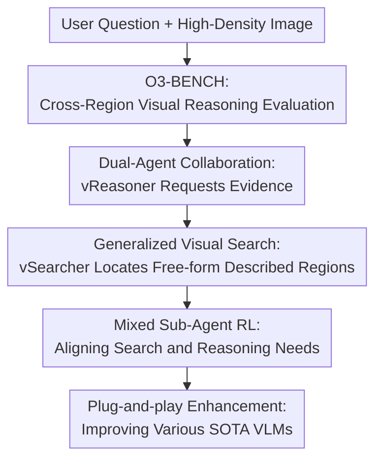

# InSight-o3: Empowering Multimodal Foundation Models with Generalized Visual Search

**Conference**: ICLR2026  
**OpenReview**: [https://openreview.net/forum?id=vlraTIgUD3](https://openreview.net/forum?id=vlraTIgUD3)  
**Code**: https://github.com/m-Just/InSight-o3  
**Area**: Multimodal VLM  
**Keywords**: Visual search, multimodal reasoning, high-resolution images, multi-agent, reinforcement learning

## TL;DR
InSight-o3 introduces O3-BENCH to evaluate the capability of models to find details while reasoning within high-information-density images. It utilizes a two-agent framework comprising a vReasoner and a vSearcher to train generalized visual search as a plug-and-play component, significantly enhancing multimodal foundation models such as GPT-5-mini and Gemini-2.5-Flash.

## Background & Motivation
**Background**: Multimodal large models are already capable of answering many visual question-answering, chart understanding, and OCR-related questions. However, common evaluations focus either on holistic image-level semantics or require the model to find a single prominent object. Recent visual search research has begun allowing models to invoke tools like cropping and zooming to perceive local regions in high-resolution images, aligning with the "thinking with images" direction demonstrated by OpenAI o3.

**Limitations of Prior Work**: Real-world tasks extend beyond simply determining "whether an object exists in the image." When viewing a map, a user might ask, "Which amusement facility is closest to a specific dining spot and satisfies height restrictions?" When analyzing composite charts, a user might first need to locate a sub-chart, read the legend, units, and values, and finally perform comparisons or calculations. Existing open models often fail at such tasks because they must simultaneously decide where to search next, what to read from a local region, and how to chain evidence together. The context and attention of a single model are easily overwhelmed by high-resolution details.

**Key Challenge**: The contradiction identified in this paper is that visual reasoning requires tight interleaving of high-level planning and fine-grained perception, yet these abilities impose different requirements on the model. A strong reasoning model is not necessarily proficient at precisely locating vaguely described regions in arbitrary screenshots, maps, posters, or charts; conversely, a localization model may not be able to perform cross-regional, multi-step logical inference. Consolidating both capabilities into a single MLLM makes both training and inference cumbersome.

**Goal**: The authors aim to solve two problems simultaneously. First, to establish a benchmark that truly measures "thinking while looking," rather than just single-step OCR or single-target localization. Second, to train a visual search sub-agent that can be invoked by different multimodal models, allowing an existing vReasoner to actively request "help me find this area" when details are needed.

**Key Insight**: Instead of directly training an end-to-end universal visual reasoning model, the paper decouples the task into a vReasoner and a vSearcher. The vReasoner handles problem decomposition, maintains the reasoning chain, and decides where to look next; the vSearcher is responsible for locating and returning relevant regions based on natural language descriptions. The advantage of this approach is that "generalized visual search" can be trained independently as a plug-in for various cutting-edge models.

**Core Idea**: Use a specialized trained generalized visual search agent, InSight-o3-vS, to replace the coarse internal local attention of a single model, enabling multimodal foundation models to retrieve evidence on demand and complete multi-hop reasoning in high-information-density images.

## Method

### Overall Architecture
The overall workflow of InSight-o3 can be understood as "a model that thinks + a model that finds visual evidence." After a user provides a question and an image, the vReasoner performs high-level reasoning to determine the missing visual evidence. it sends a free-form regional description of the missing evidence to the vSearcher, which then locates and crops the relevant area in the original image and returns the result to the vReasoner. This cycle can iterate for multiple rounds until the vReasoner aggregates all evidence to output an answer.

The core of the paper is not just the dual-agent interface but the definition and training of generalized visual search: targets can be relational, fuzzy, or conceptual regions, such as "the area to the left of the wooden chair," "the chart showing company revenue for the last ten years," or "the amusement facility near a specific dining marker on the map," rather than specific object boxes in traditional detection.

### Key Designs
**1. O3-BENCH: Advancing evaluation from "seeing targets" to "evidence collection and reasoning"**

The design focus of O3-BENCH is high resolution, high information density, and multi-hop solution paths. It consists of 204 images and 345 multiple-choice questions, including 117 composite charts and 87 high-resolution maps; questions are distributed as 163 chart-related and 182 map-related questions. Each question has six options, where option F is "no correct option," forcing the model to actually inspect visual evidence rather than guessing a plausible option from the candidates.

The difficulty lies in the fact that answers are usually not contained within a single local region. Chart questions may require reading values from multiple sub-charts, aligning units, and performing subtraction or ratio calculations. Map questions may require finding an entity ID in an index, locating it on the map, reading a legend for symbol interpretation, and finally judging spatial relationships. The authors also use strong models to filter out samples that three SOTA models could all answer correctly, making the remaining questions difficult even for OpenAI o3, which achieves only 40.8% accuracy on O3-BENCH.

**2. Dual-Agent Collaboration: Reasoning models focus on "what to find," search models focus on "where it is"**

InSight-o3 splits the system into a vReasoner and a vSearcher. The vReasoner can be a powerful multimodal model like GPT-5-mini or Gemini-2.5-Flash, responsible for understanding the question, decomposing goals, identifying missing evidence, and issuing regional requests to the vSearcher in natural language. The vSearcher does not need to solve the full problem; it only needs to translate descriptions into image coordinates and confirm local content using tools like cropping.

This separation addresses a key burden of single-agent systems: if a model must both plan a reasoning path and search for tiny text, legends, or markers in 4K to 10K resolution images, it is prone to missing details in long contexts. The dual-agent structure decouples abstract reasoning from fine-grained localization, allowing the vReasoner to act like a human saying "I need to see the height restriction section in the left legend," followed by the vSearcher bringing back that specific evidence.

**3. Generalized Visual Search: Extending from object boxes to conceptual regions via free-form language**

Traditional visual search is more like "find the dog in the image" or "crop the red license plate," targeting discrete objects in natural images. The vSearcher in this work is oriented toward more open targets: arbitrary image types, arbitrary regional granularities, and arbitrary free-form descriptions. A region could be a corner of a map, a specific sub-chart in a diagram, a paragraph of instructional text in a poster, or "the area near a certain facility containing both legend and index number."

This is crucial because search requests in real-world visual reasoning often emerge from the reasoning process rather than predefined categories. The descriptions generated by the vReasoner might not be precise; it only knows it needs to verify an intermediate fact, such as the "left legend region showing Draken Valley attraction height requirements." The vSearcher must map such semantic requests to coordinate boxes and return local views that are most helpful for problem-solving.

**4. Mixed Sub-Agent RL: Leveraging both annotated localization supervision and real reasoning loop feedback**

When training the vSearcher, the authors do not rely on a single reward. Out-of-loop RL uses pre-generated regional descriptions and ground-truth boxes to train localization capabilities directly using IoU rewards. The reward is summarized as: points are awarded based on formatting and IoU rewards only if the vSearcher invokes a tool; the IoU reward is thresholded as $r_{IoU}=\max(0, IoU(b,b^*)-\alpha)/(1-\alpha)$ to prevent positive rewards for low-quality boxes.

In-loop RL is closer to real reasoning: the vReasoner dynamically generates search requests during problem-solving. After the vSearcher returns a region, the vReasoner judges whether it helps solve the problem and combines this with the correctness of the final answer to form a pseudo-IoU reward $\hat r_{IoU}=I[s=c=1]$, where $s$ indicates the search result was useful and $c$ indicates the final answer was correct. The authors optimize the vSearcher based on the GRPO objective and use global mean and variance for advantage normalization in in-loop tasks, as dynamically generated search tasks are no longer naturally grouped.

**5. Synthetic Training Data: Using collages and infographics to supplement high-density tasks**

High-quality, high-resolution reasoning samples are difficult to manually annotate at scale, so the authors construct data for two training branches. In-loop RL uses Visual CoT and V* training data to create multi-image collages, placing one target image and several distractors on the same canvas. After difficulty filtering, 15,303 hard problems are obtained where the vReasoner must rely on the vSearcher to solve them reliably.

Out-of-loop RL uses InfographicVQA as the image source and PP-DocLayout plus-L to detect layout regions. After filtering, 10,186 high-quality layout boxes are obtained. GPT-5-nano then generates high-level regional descriptions for each area, similar to those that would appear during real invocations. In this way, the training data provides precise box supervision while ensuring the description style remains close to the natural requests of the vReasoner in the reasoning loop.

### A Complete Example
Take the theme park map question in Figure 1 of the paper as an example: the user asks, "Which facility in Draken Valley allows a 128cm child to ride alone and is closest to Draken Snack?" Instead of guessing, the vReasoner decomposes the question into three sub-goals: locate Draken Snack on the map, find nearby Draken Valley facilities, and confirm height and supervision rules for each.

In the first round, the vReasoner requests the vSearcher to find the meals list and the Draken Valley area at the bottom of the map. The vSearcher returns a cropped area containing the Draken Snack ID and nearby map markers. The vReasoner learns that "Draken Snack is #2, located near Valkyrie." In the second round, the vReasoner requests the Draken Valley height rules from the attractions legend on the left. After the vSearcher returns the legend region, the vReasoner reads that Valkyrie is 120cm+, while Draken and Klake are 135cm+. Finally, the vReasoner combines spatial distance and height constraints to output Valkyrie.

This example demonstrates the core value of the method: search requests are not fixed-category detections but natural language descriptions generated as the reasoning state changes; the final answer is not derived from a single crop but from a combination of multiple regional evidences.

### Loss & Training
InSight-o3-vS uses Qwen2.5-VL-7B-Instruct as the base vSearcher and is paired with GPT-5-mini-2025-08-07 as the vReasoner during training. The training objective is based on GRPO, with two modifications for the sub-agent scenario: first, out-of-loop and in-loop samples are mixed in the same batch for optimization; second, a loss mask is applied to tokens returned by the tool, as these tokens are not generated by the policy model itself.

For the out-of-loop branch, advantage estimation follows standard intra-group normalization of GRPO. For the in-loop branch, global normalization is applied to rewards of all dynamically generated tasks, i.e., $\hat A_t=(r-mean(r))/std(r)$. This is because vReasoner generates different search tasks in each interaction, making it impossible to sample a comparable set of outputs for the same query as in standard GRPO.

A practical detail of the training strategy is that the authors only allow the vSearcher to use the basic image cropping tool. While the framework does not limit tool types, the paper first focuses on whether it can reliably find useful regions. During experiments, the authors observed that Qwen2.5-VL-7B-Instruct tends to under-invoke tools, so a tool-invocation condition was added to the reward to encourage the model to at least use cropping to verify its returned region.

## Key Experimental Results

### Main Results
The paper evaluates InSight-o3-vS on natural images, mixed high-resolution scenes, and the custom O3-BENCH. The most critical result is that, as a plug-and-play vSearcher connected to different vReasoners, it is generally stronger than the vReasoner solving the problem alone and more stable than connecting an un-tuned Qwen2.5-VL-7B.

| vReasoner Setting | V*-Bench | HR-Bench4K | VProbeHard | O3-BENCH | Average |
|--------|------:|------:|------:|------:|------:|
| GPT-5-mini | 73.8 | 72.0 | 26.4 | 39.0 | 53.7 |
| GPT-5-mini + Qwen2.5-VL-7B | 80.6 | 83.2 | 37.7 | 47.5 | 55.4 |
| GPT-5-mini + InSight-o3-vS | 86.9 | 86.7 | 41.2 | 61.5 | 64.9 |
| Gemini-2.5-Flash | 80.1 | 83.5 | 39.6 | 60.4 | 61.7 |
| Gemini-2.5-Flash + InSight-o3-vS | 87.6 | 82.3 | 36.2 | 69.7 | 63.7 |

On GPT-5-mini, performance on O3-BENCH increased from 39.0% to 61.5%, a gain of 22.5 percentage points; the average score increased from 53.7 to 64.9. Gemini-2.5-Flash, which was already strong on O3-BENCH, still saw an improvement from 60.4 to 69.7 after integrating InSight-o3-vS. In contrast, simply adding an un-tuned Qwen2.5-VL-7B sometimes hindered the model, indicating that search agents are not beneficial by default and must be trained to understand requests and return useful evidence as sub-agents.

### Ablation Study
The ablation study validates mixed RL, reward design, and input resolution. Below are the results highlighting the necessity of the training strategies.

| Configuration | V*-Bench | VisualProbe-Hard | O3-BENCH | Avg / Note |
|------|------:|------:|------:|------|
| Proposed | 86.9 | 41.2 | 61.5 | Full reward and advantage design |
| w/o tool cond. | 86.4 | 39.3 | 60.6 | Avg drops 1.1 without tool condition |
| w/o feedback | 86.5 | 37.1 | 58.1 | O3-BENCH drops 3.4 without vReasoner feedback |
| w/o outcome | 86.9 | 38.7 | 60.9 | VisualProbe-Hard drops 2.5 without outcome supervision |
| w/o GN | 87.3 | 36.8 | 61.3 | Avg drops 1.4 without global normalization |

| Training Branch | GPT-5-mini + vSearcher: V*-Bench | VisualProbe-Hard | O3-BENCH | Step Latency |
|------|------:|------:|------:|------:|
| Untrained Baseline | 80.6 | 37.7 | 47.5 | - |
| in-loop RL only | 86.4 | 39.0 | 59.6 | 1223s |
| out-of-loop RL only | 84.8 | 41.2 | 58.8 | 105s |
| in-loop + out-of-loop RL | 86.9 | 41.2 | 61.5 | 941s |

### Key Findings
- O3-BENCH effectively measures the ability to "actively find key visual regions": GPT-5-mini improves from 39.0% to 67.5% when given ground-truth layout targets, showing that the bottleneck is largely in evidence retrieval rather than logic reasoning.
- InSight-o3-vS generalizes well to out-of-distribution evaluations. Training data comes from collages and InfographicVQA, while testing covers V*-Bench, HR-Bench4K, Tree-Bench, VisualProbe-Hard, MME-RealWorld Lite, and O3-BENCH.
- High resolution is critical for the vReasoner, but the vSearcher is less sensitive to input resolution. GPT-5-mini + InSight-o3-vS accuracy on O3-BENCH goes from 56.0 to 61.5 as vSearcher max pixels increase from 0.8M to 12.8M (peaking at 62.3 at 3.2M), suggesting the trained search strategy does not purely rely on ultra-high resolution.
- The gain from mixed RL comes from complementary supervision: out-of-loop provides precise localization signals and high efficiency; in-loop provides the request distribution and vReasoner feedback from the real reasoning loop. Using either branch individually improves performance, but the combination yields best results on O3-BENCH.

## Highlights & Insights
- Redefining "visual search" as generalized visual search is highly valuable. It is no longer restricted to object detection-style category boxes but caters to free-form language regional requests during reasoning, closer to real human-computer collaboration.
- The dual-agent split is more manageable than directly stacking larger models. The authors acknowledge that joint training of vReasoner and vSearcher encounters credit assignment and non-stationary update issues. Fixing a strong vReasoner and focusing on vSearcher makes the problem tractable and allows the trained searcher to migrate between frontier models.
- The design of O3-BENCH helps expose blind spots in existing multimodal evaluations. Many benchmarks focus on single-step recognition or single-region OCR, whereas this requires iterative localization, reading, and evidence synthesis, thus better reflecting the complexity of "thinking with images."
- The outcome safeguard in the reward design is practical. Relying solely on the vReasoner to judge "is this crop useful" might be affected by the vReasoner's own errors; adding final answer correctness reduces the risk of misclassifying ineffective searches as successful.
- This approach can be transferred to GUI agents, document review, remote sensing, and medical report analysis—any task where evidence is scattered across large images and requires multi-round local inspection.

## Limitations & Future Work
- The vReasoner remains part of the system's upper bound. The authors note that even with InSight-o3-vS, failure cases often involve vReasoner misjudgments, incorrect tool calls, or misinterpreting correctly cropped evidence.
- vSearcher training relies on strong external models for request generation and feedback. In in-loop RL, GPT-5-mini generates descriptions and provides feedback, binding training quality to proprietary model capabilities. Future work should explore cheaper, more transparent feedback mechanisms.
- The tool space is currently narrow. To simplify, the vSearcher is only allowed to use cropping, but real "thinking with images" may require zooming, rotation, enhancement, OCR, table parsing, or code-based calculation. A crop-only vSearcher remains limited for low-quality images and complex visual transformations.
- O3-BENCH is relatively small in scale. With 345 QA samples, it is high quality but limited, making it suitable for challenging evaluations but insufficient to cover all real-world high-density reasoning scenarios.
- The dual-agent communication protocol remains natural language-based. While flexible, requests can be ambiguous. Future research could focus on structuring regional descriptions, confidence scores, search history, and failure feedback to inform the vReasoner more clearly about what was or wasn't found.

## Related Work & Insights
- **vs V* / Mini-o3 / DeepEyes**: These works advance visual search and multi-round cropping but mostly focus on single-region or single-target search in natural images. InSight-o3 differs by extending search targets to relational, fuzzy, and conceptual regions in high-density images and treating the searcher as an independent sub-agent.
- **vs MME-RealWorld / HR-Bench**: These benchmarks emphasize high-resolution real-world scenes and fine-grained recognition, but many questions can be answered once the target region is found. O3-BENCH emphasizes cross-regional evidence aggregation and multi-hop reasoning, making it better for interleaved perception-reasoning.
- **vs Multimodal RL Reasoning Models**: DeepSeek-R1-style GRPO has been used by various VLMs to enhance chain-of-thought reasoning, but these often treat visual input as static. This work applies RL to the visual search sub-agent, teaching the model when and where to crop to serve higher-level reasoning.
- **vs Tool-use Visual Agents**: Methods like VisProg, ViperGPT, and HYDRA use programs or tool combinations for visual tasks. The advantage of InSight-o3 is that training "finding relevant visual regions" as a reusable module might be more universal than hand-writing tool chains for every task.

## Rating
- Novelty: ⭐⭐⭐⭐⭐ The paper redefines and trains generalized visual search as an independent capability decoupled from the reasoning agent.
- Experimental Thoroughness: ⭐⭐⭐⭐ Covers multiple frontier vReasoners, six benchmarks, and extensive ablations; however, the O3-BENCH scale is small.
- Writing Quality: ⭐⭐⭐⭐ The main logic is clear, and figures 1-2 explain the tasks and training well; some experimental tables are dense.
- Value: ⭐⭐⭐⭐⭐ This paper is highly relevant for open multimodal systems, particularly in inspiring "evidence retrieval agent + high-level reasoning model" architectures.

<!-- RELATED:START -->

## Related Papers

- [\[ICML 2026\] CVSearch: Empowering Multimodal LLMs with Cognitive Visual Search for High-Resolution Image Perception](../../ICML2026/multimodal_vlm/cvsearch_empowering_multimodal_llms_with_cognitive_visual_search_for_high-resolu.md)
- [\[ICML 2026\] ACTIVE-o3: Empowering MLLMs with Active Perception via Pure Reinforcement Learning](../../ICML2026/multimodal_vlm/active-o3_empowering_mllms_with_active_perception_via_pure_reinforcement_learnin.md)
- [\[CVPR 2026\] SenseSearch: Empowering Vision-Language Models with High-Resolution Agentic Search-Reasoning via Reinforcement Learning](../../CVPR2026/multimodal_vlm/sensesearch_empowering_vision-language_models_with_high-resolution_agentic_searc.md)
- [\[ICLR 2026\] DaVinci: Reinforcing Visual-Structural Syntax in MLLMs for Generalized Scientific Diagram Parsing](davinci_reinforcing_visual-structural_syntax_in_mllms_for_generalized_scientific.md)
- [\[ICLR 2026\] ViPER: Empowering the Self-Evolution of Visual Perception Abilities in Vision-Language Models](viper_empowering_the_self-evolution_of_visual_perception_abilities_in_vision-lan.md)

<!-- RELATED:END -->
