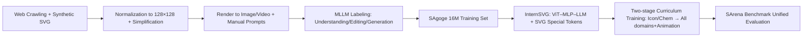

# InternSVG: Towards Unified SVG Tasks with Multimodal Large Language Models

**Conference**: ICLR 2026  
**OpenReview**: [https://openreview.net/forum?id=YxqnNNs3sf](https://openreview.net/forum?id=YxqnNNs3sf)  
**Project Page**: [https://hmwang2002.github.io/release/internsvg](https://hmwang2002.github.io/release/internsvg)  
**Area**: Multimodal Large Language Models / SVG Understanding-Editing-Generation  
**Keywords**: SVG, MLLM, Unified Modeling, Vector Graphics, Special Tokens, Curriculum Learning  

## TL;DR
InternSVG introduces a "triad" of resources—dataset SAgoge, benchmark SArena, and model InternSVG—to unify SVG understanding, editing, and generation tasks within a single MLLM. By utilizing specialized SVG tokens, subword-mean initialization, and two-stage curriculum training, it outperforms both open-source and closed-source models across self-built and existing benchmarks.

## Background & Motivation
**Background**: SVG is an XML-based 2D vector graphics standard characterized by compact storage, lossless scalability, and precise editability, widely used in web design, scientific visualization, and CAD. Enabling models to "understand, edit, and generate" SVG is a valuable goal for multimodal intelligence, as SVG's text-based code naturally fits the processing paradigm of LLMs/MLLMs.

**Limitations of Prior Work**: The authors identify three core deficiencies. First, **fragmented dataset tasks**—SGP-Bench focuses on semantic understanding, SVGEditBench on editing, and MMSVG/SVG-Stack on generation, resulting in fragmented supervision and evaluation that prevents cross-task transfer. Second, **limited scale and diversity**—UniSVG contains only ~525k samples, and SVGenius offers only ~2400 queries (insufficient for training), with most data concentrated on common icons/illustrations while neglecting professional domains like chemical structures and animations. Third, **lack of transferability in methods**—optimization-based/differentiable rendering pipelines (DiffVG, LIVE) have poor scalability and lack semantic reasoning; diffusion pipelines (VectorFusion, SVGDreamer) focus on visual fidelity but lack editability; recent LLM-based methods (StarVector, OmniSVG, LLM4SVG) show progress in generation but struggle with long sequences and complex structures, often ignoring understanding and editing.

**Key Challenge**: SVG tasks should ideally share underlying knowledge of "semantics + geometry + hierarchy" to benefit each other. However, the current landscape of "single-task datasets + specialized architectures" treats them in isolation, hindering large-scale training and cross-task positive transfer.

**Goal**: Construct a unified resource covering understanding/editing/generation across static images and animations that is sufficiently large and diverse, and train an MLLM capable of handling all three tasks simultaneously.

**Core Idea**: **[Unified Modeling]** Leveraging the strong transfer and generalization capabilities of MLLMs to integrate the three SVG tasks into a "ViT–MLP–LLM" framework for joint training. **[SVG Native Representation]** Designing specialized SVG tokens with subword-mean initialization to process vector code as efficiently as natural language. **[Curriculum Training]** Employing a two-stage approach that progresses from simple, short icons to long illustrations and complex animations.

## Method

### Overall Architecture
InternSVG is a coordinated suite involving data, benchmarks, and models. On the data side, **SAgoge** utilizes "web crawling + synthesis pipelines" to produce ~16 million training samples (icons, illustrations, chemical structures, animations), normalized to a 128×128 canvas with code simplification. On the benchmark side, **SArena** provides 4 sub-benchmarks with standardized metrics. The **InternSVG** model uses InternViT-300M as the visual encoder and Qwen2.5-7B as the language model, incorporating specialized SVG tokens and two-stage training. The pipeline is shown below:

### Key Designs

**1. SVG Special Tokens: Compressing vector code.** Standard tokenizers process SVG with excessively long sequences and fragmented coordinate values, consuming context and slowing training. The authors designed 55 tag tokens (covering `svg`, `path`, `circle`, etc., and animation elements like `animateMotion`) and 42 attribute tokens (`viewBox`, `cx`, `d`, `dur`, etc.). Numerical values are represented by integer tokens from -128 to 128 and 100 decimal tokens (from `.0` to `.99`). Since all graphics are normalized to 128×128, this finite vocabulary precisely covers coordinates. This preserves geometric and hierarchical information while significantly shortening sequence lengths, mitigating computational and reliability issues for long SVGs.

**2. Subword Mean Embedding Initialization: Providing semantic priors for new tokens.** Randomly initialized special tokens can lead to unstable early training and slow convergence. The authors adopt a subword decomposition strategy: each new token $t_{new}$ is decomposed into $n$ subwords $\{s_1,\dots,s_n\}$ using a pre-trained tokenizer, taking their mean embedding as the initial embedding:

$$e_{t_{new}} = \frac{1}{n}\sum_{i=1}^{n} e_{s_i}$$

This anchors new tokens in the semantic space of the pre-trained vocabulary, inheriting existing priors. This strategy significantly reduces initial loss and accelerates convergence compared to random initialization.

**3. Two-stage Curriculum Training: Progressing from simple icons to complex sequences.** SVG corpora are naturally imbalanced—icons are plentiful and simple, while illustrations/animations are scarce and complex. To prevent simple samples from dominating, the authors designed a curriculum: Phase 1 uses shorter Icon and Chemistry data (including descriptions, all editing sub-tasks, and Text/Image-to-SVG generation) to establish basic representation and generation capabilities. Phase 2 expands to all domains and tasks, with resampling of Icon/Chemistry data to maintain balance. This significantly improved FID-C for long illustrations from 25.67 to 5.14.

**4. Unified Joint Training for Positive Transfer.** Integrating understanding, editing, and generation is not just for convenience but for performance. Experiments on 100k Icon samples (Table 5) show that understanding accuracy rose from 62.9 (single-task) to 75.4 (G+U+E), editing PSNR rose from 42.1 to 54.6, and generation FID dropped from 15.55 to 12.39. This confirms that unified modeling facilitates cross-task knowledge transfer and richer representations.

## Key Experimental Results

### Main Results (SArena-Icon, Excerpt)

| Model | Understanding Overall ↑ | Editing PSNR ↑ | Text→SVG FID ↓ | Image→SVG SSIM ↑ |
|---|---|---|---|---|
| GPT-4o | 71.0 | 55.26 | 15.18 | 0.616 |
| Gemini-2.5-Flash | 73.0 | 54.20 | 16.72 | 0.587 |
| Claude-Sonnet-4 (SOTA closed) | 77.1 | 57.60 | 15.84 | 0.665 |
| OmniSVG 3B | – | – | 28.29 | 0.756 |
| **InternSVG 8B** | **85.1** | **77.33** | **8.72** | **0.811** |
| Gain over best | +8.0 | +19.7 | −6.2(FID) | +0.146 |

On the Icon benchmark, InternSVG outperforms the next best model by ~8 points in understanding and ranks first in all editing/generation metrics. Compared to Claude-Sonnet-4, understanding accuracy improved by ~11%, editing PSNR by ~34%, and Text-to-SVG FID decreased by ~56%.

### Ablation Study

| Ablation Dimension | Configuration Comparison | Key Change |
|---|---|---|
| Unified Modeling (Table 5) | Single-task → G+U+E | Understanding 62.9→75.4, Editing PSNR 42.1→54.6, FID 15.55→12.39 |
| Two-stage Training (Table 6) | One-stage → Two-stage | Illustration FID-C 25.67→5.14, DINO 0.830→0.924 |
| Special Tokens + Init (Table 7) | Raw / T / T+E | T+E is optimal; special tokens significantly improve success rate on long illustrations |

### Key Findings
- **Unified beats Specialized**: Joint training across three tasks outperforms single-task training in all metrics, confirming positive transfer.
- **Curriculum Training benefits long sequences most**: Complex samples like illustrations and animations benefit most from two-stage progression.
- **Token Compression Efficiency**: For Image-to-SVG, InternSVG achieves visual similarity comparable to optimization-based methods (e.g., LIVE) using only ~1.3k tokens versus LIVE's ~18k tokens (a 14x reduction).
- **Cross-Benchmark Generalization**: InternSVG leads on existing benchmarks like SGP-Bench, SVG-Stack, and UniSVG (UniSVG Final Score 0.826), proving robustness beyond its own data distribution.

## Highlights & Insights
- **Triad Integration**: Co-designed data (SAgoge, 16M), benchmarks (SArena, 31k), and models (InternSVG) ensure alignment across task definitions, metrics, and training domains.
- **Professional Domain Coverage**: Includes chemical structures (via PubChem) and animations (SANI tasks), moving SVG modeling beyond simple icons to scientific and dynamic graphics.
- **SVG as Code**: Utilizing a finite numerical vocabulary and subword initialization is a highly effective engineering choice for the SVG grammar, saving tokens while stabilizing training—a methodology applicable to other structured code generation tasks.

## Limitations & Future Work
- **Fixed 128×128 Canvas**: While normalization simplifies the vocabulary, it limits high-resolution or large-canvas scenarios; real-world SVGs may require more flexible coordinate representations.
- **Reliance on MLLM Auto-labeling**: Labels generated by models like GPT-4o or InternVL3 may carry biases or inaccuracies, especially for long-tail semantics.
- **Image-to-SVG Similarity**: While more compact, InternSVG still lags behind optimization-based methods (LIVE) in pure visual similarity.
- **Computational Cost**: Training 16M samples in two stages on 96×A800 GPUs presents a high barrier to entry for replication.

## Related Work & Insights
- **SVG Datasets/Benchmarks**: Compared to SGP-Bench, UniSVG, or SVGenius, SAgoge dominates in scale (16M), task coverage (U+E+G), and multi-domain inclusivity.
- **SVG Modeling Methods**: Moving from early specialized architectures (DeepSVG) and differentiable rendering (DiffVG) to current LLM-based approaches—this is the first work to unify understanding, editing, and generation in a single MLLM.
- **Insight**: Integrating fragmented single-task benchmarks into a "unified data-benchmark-model" resource is a reproducible paradigm for other fields. For structured text (SVG/code/molecules), the combination of specialized tokens, subword initialization, and curriculum learning is an effective strategy to unlock MLLM capabilities.

## Rating
- **Novelty**: ⭐⭐⭐⭐ First to unify SVG U-E-G tasks in one MLLM with the largest multimodal SVG dataset; pioneering coverage of professional domains (chemistry/animation).
- **Experimental Thoroughness**: ⭐⭐⭐⭐⭐ Comprehensive evaluation against open/closed/traditional/LLM baselines across 7 benchmarks; robust ablation studies provided.
- **Writing Quality**: ⭐⭐⭐⭐ Clear logic from motivation to verification with rich visualizations; however, the complex metric system has a learning curve.
- **Value**: ⭐⭐⭐⭐⭐ The release of the integrated data, benchmark, and model provides a unified research foundation for the structured multimodal task of SVG.

<!-- RELATED:START -->

## Related Papers

- [\[ICLR 2026\] Patch-as-Decodable-Token: Towards Unified Multi-Modal Vision Tasks in MLLMs](patch-as-decodable-token_towards_unified_multi-modal_vision_tasks_in_mllms.md)
- [\[CVPR 2026\] DuetSVG: Unified Multimodal SVG Generation with Internal Visual Guidance](../../CVPR2026/multimodal_vlm/duetsvg_unified_multimodal_svg_generation_with_internal_visual_guidance.md)
- [\[ICLR 2026\] Benchmarking Large Vision-Language Models on Fine-Grained Image Tasks: A Comprehensive Evaluation](benchmarking_large_vision-language_models_on_fine-grained_image_tasks_a_comprehe.md)
- [\[ICLR 2026\] Lavida-O: Elastic Large Masked Diffusion Models for Unified Multimodal Understanding and Generation](lavida-o_elastic_large_masked_diffusion_models_for_unified_multimodal_understand.md)
- [\[ICLR 2026\] Reconstruction Alignment Improves Unified Multimodal Models](reconstruction_alignment_improves_unified_multimodal_models.md)

<!-- RELATED:END -->
