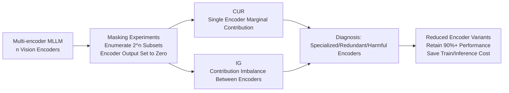

# Investigating Redundancy in Multimodal Large Language Models with Multiple Vision Encoders

**Conference**: ICLR 2026  
**OpenReview**: [https://openreview.net/forum?id=cAopJVLKvi](https://openreview.net/forum?id=cAopJVLKvi)  
**Code**: [https://github.com/MaoSong2022/Encoder-Redundancy](https://github.com/MaoSong2022/Encoder-Redundancy)  
**Area**: Multimodal Large Language Models / Vision Encoder Architecture Analysis  
**Keywords**: Multiple Vision Encoders, Encoder Redundancy, MLLM Efficiency, Conditional Utilization Rate (CUR), Information Gap (IG)  

## TL;DR
By systematically masking individual vision encoders in multi-encoder MLLMs, this paper reveals that the "more encoders the better" assumption is a fallacy. It proposes two metrics, CUR and IG, to quantify the marginal contribution and redundancy of each encoder, proving that most tasks can maintain over 90% performance with only 1–2 encoders while significantly reducing training and inference costs.

## Background & Motivation
- **Background**: Recent Multimodal Large Language Models (MLLMs) popularly combine multiple vision encoders—CLIP/SigLIP for global semantics, SAM/DINO for pixel-level details, and ConvNext/Pix2Struct for OCR structures. The intuition is that "encoders with different pre-training objectives provide complementary signals," leading models like Eagle, Cambrian-1, and SPHINX to stack 4–5 encoders.
- **Limitations of Prior Work**: Significant research effort has been devoted to designing complex fusion mechanisms (channel concat, cross-attention, SVA), but the fundamental question of "how much **unique and irreplaceable** information each encoder provides" remains largely unanswered. While models like Eagle and Mousi sporadically mention "diminishing returns," they lack a quantifiable and diagnostic framework.
- **Key Challenge**: While multiple encoders bring potential complementary information, they also introduce **noise, conflicting signals, and redundancy**—leading to fusion difficulties, distracted attention from irrelevant signals, and wasted computation. The hypothesis that "more encoders $\neq$ better" may hold, but its severity and task-specific nature have not been quantified.
- **Goal**: To systematically and quantitatively confirm encoder redundancy in multi-encoder MLLMs and provide actionable diagnostic tools to guide more efficient multimodal architecture design.
- **Core Idea**: **[Diagnostic Analysis]** Instead of proposing a new model, this work quantifies redundancy through "encoder masking + two principled metrics (CUR and IG)," demonstrating that masking certain encoders does not degrade—and sometimes even improves—performance.

## Method

### Overall Architecture
The paper analyzes the mainstream "ViT-adapter-LLM" architecture in multi-encoder MLLMs: given an image $I$ and text $T$, the output $Y = \text{LLM}(\text{proj}(\text{fusion}(E_1(I),\cdots,E_n(I)), T))$. The analysis proceeds in two steps: first, **masking experiments** (replacing an encoder output with a zero tensor of the same shape) are conducted to observe performance variations across $2^n$ subsets. Second, the **CUR** and **IG** metrics quantify the "marginal contribution of a single encoder" and the "contribution imbalance between encoders," leading to the derivation of efficient variants with fewer encoders.

### Key Designs

**1. Conditional Utilization Rate (CUR): Measures the unique contribution of an encoder given that "all other encoders are present."** The utility of an encoder should not be viewed in isolation; rather, it should be measured by the performance drop when it is removed from the full set. The paper defines the CUR of encoder $E_i$ as $u(E_i) = \dfrac{\text{acc}(f_{E_n}) - \text{acc}(f_{E_n\setminus\{E_i\}})}{\text{acc}(f_{E_n})}$. Since $\text{acc}(\cdot)\in[0,1]$, $u(E_i)\in(-\infty, 1]$. A **large positive value** indicates the encoder contributes unique, irreplaceable information; a **value near 0** suggests its information is redundant; a **negative value** indicates the encoder is harmful, introducing noise or conflicts the fusion mechanism cannot resolve.

**2. Information Gap (IG): Characterizes the contribution imbalance within an encoder set using the range of CUR.** While CUR evaluates individual encoders, the Information Gap is defined as $\Delta_{\text{gap}}(E_n) := \max_i u(E_i) - \min_j u(E_j)$. A small $\Delta_{\text{gap}}$ indicates balanced contributions and a reasonable configuration; a large $\Delta_{\text{gap}}$ represents severe imbalance—where one encoder is indispensable while others are redundant or harmful. Experiments confirm that models with more than two encoders generally have higher IG (e.g., Eagle-X4 8B Plus reaches 70.27%), especially in OCR & Chart and Vision-Centric tasks.

**3. Attention KL Divergence Attribution: Explaining encoder dominance via LLM attention distributions.** To understand how dominance manifests internally, the authors activate only a single encoder ($n=1$) and extract the LLM's attention distribution over visual tokens in the last layer. They calculate the KL divergence between this and the full model's distribution. **A smaller KL suggests the single encoder approximates the full model's attention pattern.** In the Eagle series, EVA-02 showed the lowest KL (0.98), and in Cambrian-1, ConvNext showed the lowest, aligning with CUR findings. "Infinite KL" for ConvNext and SAM in Eagle-X4 8B Plus confirms they focus on locations the full model ignores.

## Key Experimental Results

### Main Results: Replicating Performance with Fewer Encoders (Table 3)

| Model | Encoders | General | Knowledge | OCR & Chart | Vision-Centric | Overall |
|------|---------|---------|-----------|-------------|----------------|---------|
| Eagle-X5 7B | 5 | 70.77 | 54.79 | 66.60 | 67.55 | 64.93 |
| –X3 (Keep 0,1,2) | 3 | 69.87 | 53.64 | 66.02 | 67.29 | 64.20 ↓1.1% |
| –X2 (Keep 0,1) | 2 | 69.04 | 52.77 | 62.04 | 66.05 | 62.48 ↓3.8% |
| –X1 (Keep 0) | 1 | 64.60 | 47.70 | **10.68 ↓84%** | 62.83 | 46.45 ↓28% |
| Eagle-X4 8B Plus | 4 | 66.49 | 61.88 | 71.92 | 70.62 | 67.73 |
| –X2 (Keep 0,1) | 2 | 67.28 ↑1% | 59.83 | 70.57 | 69.60 | 66.82 ↓1.1% |

**Key Points**: Masking two encoders in Eagle results in only a ~1% drop; on non-OCR tasks, single-encoder variants retain 90%+ of the full model's performance. OCR & Chart tasks highly depend on specific encoders (performance crashes to 10.68 with only 1), but recover when ConvNext is added back.

### Information Gap Comparison (Table 1, Abridged)

| Model | n | OCR & Chart IG | Overall IG |
|------|---|----------------|------------|
| Eagle-X4 8B Plus | 4 | 92.89% | 70.27% |
| Cambrian-1 13B | 4 | 76.22% | 27.82% |
| DeepSeek-VL 7B | 2 | 0.51% | 1.15% |

More encoders correlate with higher IG and more severe redundancy; the 2-encoder DeepSeek-VL is nearly balanced.

### Key Findings
- **Masking Can Improve Performance**: A 3-encoder subset of Cambrian-1 8B outperformed the full model by 3.5%; masking specific encoders for certain task categories yielded gains up to 16%.
- **Strong Specialization**: In OCR & Chart tasks, the CUR of a single encoder can exceed 90% (e.g., EVA-02 in Eagle-X4 8B Plus reached 92.89%).
- **Harmful Encoders**: SigLIP in Cambrian-1 8B showed a CUR of -16% in Vision-Centric tasks, actively hindering performance.
- **Efficiency Gains**: Transitioning Eagle-X5 7B to the dual-encoder Eagle-X2 7B reduced training time by 34%, inference latency by 19.5%, and vision FLOPs to 61.4% (total FLOPs down ~12.1%) while maintaining 96%+ overall performance.
- **Encoder Size $\neq$ Contribution**: The 304M EVA-02 in Eagle-X4 8B Plus outperformed the 1.2B Pix2Struct; contributions of contrastive-learning encoders (ConvNext/CLIP/SigLIP) varied significantly.

## Highlights & Insights
- **Challenging Default Hypotheses**: The study uses robust masking experiments to falsify the widely accepted heuristic that "more encoders are better."
- **Actionable and Model-Agnostic Metrics**: CUR/IG require only masking and benchmarking, making them directly transferable to any multi-encoder MLLM as a diagnostic tool.
- **Closed-loop from Phenomenon to Mechanism**: Beyond reporting redundancy, the work uses Attention KL Divergence to explain how dominant encoders are formed within the LLM.
- **Clear Efficiency Implementation**: The analysis translates redundancy into tangible savings in GPU hours, latency, and FLOPs, offering direct value for model pruning in industry.

## Limitations & Future Work
- **Approximation via Zero-Masking**: Replacing encoder outputs with zero tensors is a coarse intervention that may differ from true counterfactuals where the encoder was never part of training.
- **Fusion Scope**: The conclusions are primarily based on channel concat (Eagle) and cross-attention SVA (Cambrian-1); architectures like MoE routing or token selection require further verification.
- **Benchmark Dependency**: Task-level conclusions rely on Cambrian-1’s four-category taxonomy; a finer-grained classification might reveal different specialization patterns.
- **Future Work**: Extending CUR/IG from "post-hoc diagnosis" to "training-time regularization or Architecture Search" to automatically eliminate redundant encoders during training.

## Related Work & Insights
- **Multi-encoder MLLMs**: DeepSeek-VL (SigLIP+SAM), Mini-Gemini, SPHINX, and Cambrian-1 (up to 4 encoders) are the core subjects of this analysis. Findings echo CoMM’s observation that CLIP+DINO is strong while MAE+DeiT is weak.
- **Vision Token/Expert Selection**: MoVA, MOVE, and Mixpert utilize routing to the most suitable encoder, but they implicitly assume integrated encoders are complementary. This paper challenges that premise by quantifying the underlying redundancy.
- **Insight**: Before stacking any "multi-expert/multi-module" structure, conducting a "redundancy checkup" using marginal contribution metrics like CUR/IG may be more valuable than designing elaborate fusion mechanisms.

## Rating
- **Novelty**: ⭐⭐⭐⭐ This is the first diagnostic framework to systematically quantify multi-encoder redundancy; CUR/IG are concise, model-agnostic, and original.
- **Experimental Thoroughness**: ⭐⭐⭐⭐ Covers multiple architectures (Eagle/Cambrian-1/DeepSeek-VL), four task types, $2^n$ subset masking, and provides multi-dimensional evidence including Attention KL, FLOPs, and latency.
- **Writing Quality**: ⭐⭐⭐⭐ Clear metric definitions and logical progression (phenomenon → quantification → attribution → efficiency).
- **Value**: ⭐⭐⭐⭐ Directly falsifies popular heuristics and provides a practical pruning guide for multimodal architecture design and efficiency optimization.

<!-- RELATED:START -->

## Related Papers

- [\[ICLR 2026\] Efficient Discriminative Joint Encoders for Large Scale Vision-Language Re-ranking](efficient_discriminative_joint_encoders_for_large_scale_vision-language_rerankin.md)
- [\[ICML 2026\] Referring Multiple Regions with Large Multimodal Models via Contextual Latent Steering](../../ICML2026/multimodal_vlm/referring_multiple_regions_with_large_multimodal_models_via_contextual_latent_st.md)
- [\[ICLR 2026\] Multimodal Prompt Optimization: Why Not Leverage Multiple Modalities for MLLMs](multimodal_prompt_optimization_why_not_leverage_multiple_modalities_for_mllms.md)
- [\[ICLR 2026\] GranViT: A Fine-Grained Vision Model For Autoregressive Multimodal Large Language Models](granvit_a_fine-grained_vision_model_for_autoregressive_multimodal_large_language.md)
- [\[CVPR 2026\] Unified Multimodal Models as Auto-Encoders](../../CVPR2026/multimodal_vlm/unified_multimodal_models_as_auto-encoders.md)

<!-- RELATED:END -->
