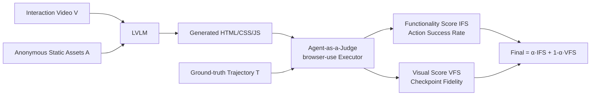

# IWR-Bench: Can LVLMs Reconstruct Interactive Webpage from a User Interaction Video?

**Conference**: ICLR 2026  
**OpenReview**: [https://openreview.net/forum?id=1zOp2WPMdZ](https://openreview.net/forum?id=1zOp2WPMdZ)  
**Code**: To be open-sourced (The paper promises to release the benchmark and evaluation code)  
**Area**: Multimodal / Vision-Language Model Evaluation (Video-to-Code)  
**Keywords**: LVLM Evaluation, Webpage Reconstruction, Video Understanding, Interactive Code Generation, Agent-as-a-Judge  

## TL;DR
This paper introduces IWR-Bench, the first benchmark for Large Vision-Language Models (LVLMs) to reconstruct **interactive** webpages from "user interaction videos + complete static assets." Using an agent-as-a-judge protocol to evaluate both functional correctness and visual fidelity, experiments on 28 models reveal that even the strongest model scores only 36.35, with functionality scores (IFS 24.39%) significantly lagging behind visual scores (VFS 64.25%).

## Background & Motivation
**Background**: Translating webpage screenshots into HTML code (screenshot-to-code) is a mature capability for LVLMs. Benchmarks like Design2Code and WebSight show strong performance in static reconstruction. A few works (e.g., Interaction2Code) have begun to explore interaction but only use "before-and-after image pairs" to model single-step, stateless events.

**Limitations of Prior Work**: Real webpage applications are essentially **continuous, stateful workflows**, such as clicking search results, inputting comments, rating with stars, or playing games like 2048 with complex logic. Existing benchmarks suffer from three defects: (1) They only evaluate static layouts, avoiding temporal dynamics; (2) They **deliberately remove static assets** (images, icons, videos) to simplify tasks, which is detached from real-world development; (3) Evaluation relies on pixel similarity, failing to measure functional correctness (e.g., whether a button correctly responds to a click).

**Key Challenge**: A gap exists between the "video/multi-image" input capabilities of models and interactive webpage generation benchmarks. No study has systematically asked: **Can LVLMs restore the dynamic interactive functions of a webpage simply by watching a user operation video?**

**Goal**: To formalize this problem as the Interactive Webpage Reconstruction (IWR) task and build a benchmark that covers diverse interactions, provides complete real-world assets, and utilizes an evaluation protocol that can actually execute interactions.

**Core Idea**: **Use "interaction video + full original assets" as input and an "agent capable of executing action sequences in a browser" as the judge.** This forces the model to infer interaction logic from temporal visual evidence while determining functional correctness through programmatic execution rather than pixel comparison.

## Method

### Overall Architecture
IWR-Bench decomposes a task into four components: an **interaction video** $V=\{f_1,...,f_n\}$ recording a complete stateful operation flow, a set of **static assets** $A=\{a_1,...,a_m\}$ (with anonymized filenames), a structured **action trajectory** $T=\{(a_i,p_i,d_i,v_i,l_i)\}$, and **steady-state checkpoint screenshots** $S$ after each key action. The model generates a self-contained HTML (including CSS/JS) $C$ from $V$ and $A$. A deterministic executor based on browser-use then acts as the judge, replaying the trajectory $T$ step-by-step, measuring functionality via IFS and visuals via VFS to calculate a final weighted score.

### Key Designs

**1. Forcing real reasoning via "Real Videos + Complete Assets + Anonymous Filenames."** All 113 tasks originate from 100 real websites (balanced across domain, visual complexity, and interaction logic). Each task includes all crawled static assets (images, icons, embedded videos), which were often removed in previous benchmarks. A key strategy is **anonymizing all asset filenames** (e.g., `logo.png` → `asset_001.png`), cutting off the shortcut of guessing based on semantic filenames and forcing the model to perform true "visual element ↔ static asset" matching. A four-tier taxonomy categorizes interaction logic from L1 static display to L4 algorithm/game logic.

**2. Programmatic execution protocol with Agent-as-a-Judge.** The judge evaluates whether functionality is correct by **actually executing** ground-truth actions $a_i$ one by one on the rendered page using browser-use. An action fails if it is operationally infeasible (target element not found) or if its associated logical assertion $l_i$ is not met (e.g., "Success message 'Rating Updated: 9/10' should appear"). Assertions are determined by Gemini-2.5-Pro as an MLLM judge comparing screenshots before and after the action. This design isolates evaluation at the "code execution" level, ensuring reproducibility.

**3. IFS / VFS Dual Metrics + Weighted Final Score.** The functionality score is the proportion of successful actions: $\text{IFS}=N_{succ}/N_{total}$. The visual score is calculated only at checkpoints where the action succeeded and visual evaluation is required ($v_i=\text{true}$). Each checkpoint fuses low-level visual score $S_{LVS}$ (mean of OCR Levenshtein similarity and DINO cosine similarity) with high-level visual score $S_{HVS}$ (overall MLLM evaluation), using weight $w=0.5$:
$$\text{VFS}=\frac{1}{|I_{v,succ}|}\sum_{i\in I_{v,succ}}\big(w\cdot S_{LVS,i}+(1-w)\cdot S_{HVS,i}\big)$$
The final score weights these by $\alpha=0.7$:
$$\text{Final Score}=\alpha\cdot\text{IFS}+(1-\alpha)\cdot\text{VFS}$$
The high weight for IFS ensures that "unreachable states" are appropriately penalized.

## Key Experimental Results

### Main Results (Selected from 28 LVLMs)

| Model | LVS | HVS | VFS | IFS | Final |
|------|-----|-----|-----|-----|-------|
| GPT-5 | 68.29 | 60.21 | **64.25** | **24.39** | **36.35** |
| Claude-3.5-Sonnet (thinking) | 64.90 | 55.51 | 60.20 | 23.65 | 34.62 |
| Claude-3-Opus (thinking) | 63.53 | 53.80 | 58.67 | 23.61 | 34.13 |
| Doubao-seed-1.6 | 65.95 | 55.62 | 60.79 | 22.55 | 34.02 |
| Claude-3.5-Sonnet | 65.75 | 56.92 | 61.34 | 22.29 | 34.00 |
| GPT-4o (latest) | 63.39 | 51.71 | 57.55 | 17.55 | 29.55 |
| Qwen3-VL (thinking) (Best Open-source) | 58.55 | 46.13 | 52.34 | 22.07 | 31.15 |
| Qwen2.5-VL-72B | 47.83 | 28.25 | 38.04 | 17.42 | 23.61 |
| VideoLLaMA3-7B (Video-specific) | 31.29 | 11.86 | 21.58 | 10.29 | 13.67 |
| InternVideo-2.5-Chat-8B (Video-specific) | 17.27 | 3.33 | 10.30 | 9.97 | 10.07 |

- **Performance Stratification**: Closed-source MLLMs > Top Open-source (Qwen3-VL) > Lower-end Open-source > Video-specific models. This indicates that **general multimodal reasoning and code generation are more critical than specialized video architectures.**
- The strongest model's Final Score is only 36.35, and no model exceeds an IFS of 25, suggesting interactive webpage reconstruction remains an **unresolved problem**.

### Ablation Study

| Item | Setting | Conclusion |
|--------|------|------|
| Weights $w,\alpha$ | Human alignment study | $w=0.5, \alpha=0.7$ aligns best with human judgment. |
| Agent Reliability | Manual check of 100 generated pages | Only 3 evaluation failures occurred due to locator ambiguity, fixed by refining descriptors. |
| Assertion Verification | Gemini-2.5-Pro comparison | Successfully automated logical assertion verification. |

### Key Findings
- **Functionality is the bottleneck**: VFS is generally much higher than IFS (GPT-5: 64.25 vs 24.39). Models can replicate static layouts but lack the ability to synthesize event-driven logic.
- **Static-to-Interactive Cliff**: Performance drops sharply from L1 static tasks to L2–L4 interactive tasks.
- **Reasoning gains are limited**: The "thinking" variants show small improvements, but **base capability determines the performance ceiling**.

## Highlights & Insights
- **Upgrade from "Stateless Single-step" to "Stateful Full-trajectory"**: The benchmark captures the essence of real webpage interaction—continuous workflows with state transitions—making it a substantial advancement over prior works like Interaction2Code.
- **Anti-cheating Design**: Anonymizing asset filenames prevents models from using semantic priors, ensuring the benchmark tests true visual-asset grounding.
- **Executable Evaluation Protocol**: By using browser-use and logical assertions, functional correctness becomes a quantifiable and reproducible metric for the first time.
- **Diagnostic Value**: The gap between VFS and IFS indicates that the next breakthrough lies not in visual understanding, but in temporal reasoning and dynamic event logic synthesis.

## Limitations & Future Work
- **Small Scale**: 113 tasks is a limited number for a benchmark, particularly with sparser samples in sub-dimensions like L4 games.
- **Heavy Reliance on Gemini-2.5-Pro as Judge**: Bias or capability limits of the judge model could propagate to the scores.
- **Video Sampling Constraints**: To maintain compatibility, videos are sampled at 1fps (max 64 frames), potentially losing rapid interaction details in long videos.
- **Future Directions**: The authors suggest focusing on temporal reasoning, dynamic resource binding, and robust code synthesis.

## Related Work & Insights
- **Static Webpage Reconstruction**: Pix2Code, WebSight, Design2Code—largely image-to-code benchmarks, often using synthetic data without real assets.
- **Interactive Predecessors**: Interaction2Code uses image pairs for single-step interaction but remains stateless; IWR-Bench serves as a critical completion of this research direction.
- **Agent-as-a-Judge**: Adapts the agent-based judge paradigm to the verifiable scenario of "executing webpage interactions."

## Rating
- **Novelty**: ⭐⭐⭐⭐ — The integration of full stateful trajectories and executable evaluation protocols fills a significant gap in the field.
- **Experimental Thoroughness**: ⭐⭐⭐⭐ — Comprehensive evaluation of 28 models with human alignment studies, though the task scale could be larger.
- **Writing Quality**: ⭐⭐⭐⭐ — Logical progression with clear definitions and well-organized visualizations.
- **Value**: ⭐⭐⭐⭐ — Precisely identifies the current shortfall of LVLMs in functional logic despite visual proficiency.

<!-- RELATED:START -->

<!-- RELATED:END -->

## Related Papers

- [\[CVPR 2026\] Interactive Episodic Memory with User Feedback](../../CVPR2026/multimodal_vlm/interactive_episodic_memory_with_user_feedback.md)
- [\[ICLR 2026\] ODI-Bench: Can MLLMs Understand Immersive Omnidirectional Environments?](odi-bench_can_mllms_understand_immersive_omnidirectional_environments.md)
- [\[ICLR 2026\] MMDuet2: Enhancing Proactive Interaction of Video MLLMs with Multi-Turn Reinforcement Learning](mmduet2_enhancing_proactive_interaction_of_video_mllms_with_multi-turn_reinforce.md)
- [\[ICLR 2026\] SpatialViz-Bench：一个认知科学驱动、用于诊断 MLLM 空间可视化能力的基准](spatialviz-bench_a_cognitively-grounded_benchmark_for_diagnosing_spatial_visuali.md)
- [\[CVPR 2026\] HAVE-Bench: Hierarchical Audio-Visual Evaluation from Perception to Interaction](../../CVPR2026/multimodal_vlm/have-bench_hierarchical_audio-visual_evaluation_from_perception_to_interaction.md)

<!-- RELATED:END -->
