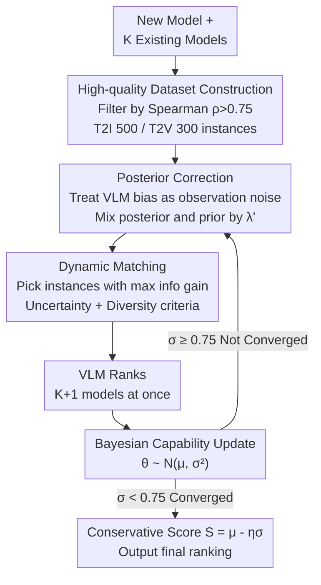

# K-Sort Eval: Efficient Preference Evaluation for Visual Generation via Corrected VLM-as-a-Judge

**Conference**: ICLR 2026  
**arXiv**: [2602.09411](https://arxiv.org/abs/2602.09411)  
**Code**: [GitHub](https://github.com/zkkli/K-Sort-Eval)  
**Area**: Multimodal VLM  
**Keywords**: VLM-as-a-Judge, Preference Evaluation, Posterior Correction, Dynamic Matching, Visual Generation

## TL;DR
The K-Sort Eval framework is proposed, which, through posterior correction and dynamic matching strategies, enables VLMs to reliably and efficiently replace humans for preference evaluation of visual generation models, typically requiring fewer than 90 model runs to achieve results consistent with the human Arena.

## Background & Motivation
- Visual generation models (text-to-image, text-to-video) are developing rapidly, but evaluation methods lag behind; traditional metrics (FID, IS, FVD) fail to reflect human preferences.
- Arena platforms (such as K-Sort Arena) collect human preferences through crowdsourced voting, but are costly, time-consuming, and poorly scalable.
- Using VLMs (e.g., GPT-4o) directly as a replacement for human judges is promising, but VLMs suffer from hallucinations and biases, leading to poor alignment with human preferences.
- Existing methods use static evaluation approaches that require traversing the entire dataset, which is inefficient.

## Method

### Overall Architecture
K-Sort Eval is built upon K-Sort Arena. The new model to be evaluated engages in a $(K+1)$-wise free competition with $K$ existing models in the dataset, where the VLM provides a ranking in one go. The entire process is linked by three components: first, a set of high-quality comparison instances is filtered from human votes; next, a posterior correction handles VLM-to-human bias; finally, dynamic matching selects only the most informative instances for the VLM, allowing the credible ranking to converge within dozens of runs. The entire evaluation is an online loop: each round corrects the current capability posterior, selects the next most valuable instance to query, allows the VLM to rank and update the posterior, and stops only when uncertainty drops below a threshold.

### Key Designs

**1. High-quality Dataset Construction: Ensuring Reliability of the Supervision Signal**

VLM correction relies on human preference as a reference, but the thousands of crowdsourced votes in K-Sort Arena contain significant noise; local rankings of single instances often conflict with global leaderboard rankings. Directly using these as ground truth propagates errors. The authors use the Spearman rank correlation coefficient to measure the consistency between each instance's local ranking $R_k^i$ and the global leaderboard ranking $R_k^{(L)}$: $\rho_i = \frac{\sum_{k=1}^K (R_k^i - \bar{R}^i)(R_k^{(L)} - \bar{R}^{(L)})}{\sqrt{\sum_{k=1}^K (R_k^i - \bar{R}^i)^2} \cdot \sqrt{\sum_{k=1}^K (R_k^{(L)} - \bar{R}^{(L)})^2}}$. Only instances where $\rho_i$ exceeds the threshold $\tau=0.75$ are retained. Post-filtering, 500 T2I and 300 T2V instances remain, ensuring that subsequent correction refers to samples highly consistent with the collective consensus.

**2. Posterior Correction: Absorbing VLM Misalignment as Observation Noise**

VLM judgments exhibit hallucinations and biases, causing the resulting capability posterior to systematically deviate from human preferences. Instead of fine-tuning the VLM, the authors model this bias directly as observation noise. Lemma 1 provides a clean conclusion: the noisy posterior is equivalent to a weighted mixture of the noise-free posterior and the prior, $\tilde{P}(\theta|D) = \lambda' P(\theta|D) + (1-\lambda') P(\theta)$. When the VLM is more trustworthy, the weight $\lambda'$ approaches 1 (trusting data given by the VLM); when less trustworthy, it reverts to the prior. This trustworthiness is obtained by mapping the Spearman coefficient $\rho'$ between VLM and human rankings via a sigmoid function, $\lambda' = \text{Sigmoid}(\kappa \rho')$ ($\kappa=5.0$). Ultimately, correction is applied to the mean and variance of the capability distribution, $\hat{\mu}_c = \lambda' \hat{\mu} + (1-\lambda') \mu$, $\hat{\sigma}_c^2 = \lambda'^2 \hat{\sigma}^2 + (1-\lambda')^2 \sigma^2$, which essentially pulls the VLM estimate toward the direction of human supervision while automatically expanding or tightening uncertainty based on reliability.

**3. Dynamic Matching: Querying Only the Most Informative Instances**

Static evaluation traverses the entire dataset, querying the VLM hundreds or thousands of times, even though most comparisons yield no new information. The authors switch to selecting the instance with the maximum information gain at each step based on the criterion $i^* = \arg\max_i (U_{\text{unc}}^i + \alpha U_{\text{div}}^i)$. The uncertainty term $U_{\text{unc}}$ favors instances where competing model capabilities are close (win rates near 50%), as evenly matched duels are most discriminative; the diversity term $U_{\text{div}}$ minimizes the overlap of model capability distributions within the same instance to avoid repetitive comparisons, with $\alpha=0.5$ balancing the two. Combined with the natural stopping signal from probabilistic modeling, matching often converges in dozens of steps.

### Loss & Training
The method does not train any network but estimates capability online in a Bayesian manner. The capability of each model is modeled as a Gaussian distribution $\theta \sim \mathcal{N}(\mu, \sigma^2)$. After each round of VLM ranking, a posterior update is performed followed by the correction mentioned above, until the uncertainty $\sigma$ drops below the stopping threshold of 0.75. The final ranking uses a conservative score $S = \mu - \eta \sigma$ ($\eta=3.0$), which deducts a penalty for uncertainty from the mean capability to avoid over-ranking models with unstable estimates.

## Key Experimental Results

### Main Results

| Model | K-Sort Arena Rank | K-Sort Arena Score | K-Sort Eval Rank | K-Sort Eval Score |
|------|-------------------|-------------------|------------------|-------------------|
| FLUX.1-dev | 5 | 28.83 | 5 | 28.86 |
| Midjourney-v5.0 | 11 | 27.44 | 11 | 27.50 |
| SD-v1.5 | 29 | 20.10 | 29 | 20.03 |
| Runway-Gen3 (Video) | 2 | 33.93 | 2 | 33.98 |
| CogVideoX-5b (Video) | 3 | 33.60 | 3 | 33.63 |

### Ablation Study

| Configuration | Rank | Score | #Runs |
|------|------|-------|-------|
| K-Sort Eval (Full) | 5 | 28.86 | 81 |
| w/o Posterior Correction | 3 | 29.32 | 70 |
| w/o Dynamic Matching | 5 | 28.79 | 500 |
| w/o Swapping | 4 | 28.93 | 79 |
| w/o Rule Augmentation | 9 | 28.13 | 119 |

### Key Findings
- K-Sort Eval results are highly consistent with the human preference-based K-Sort Arena (score deviation < 0.1).
- 91% of image model and 93% of video model evaluations complete within 90 runs, vastly superior to FID (50K runs) and GenAI-Bench (1600 runs).
- GPT-4o consistently outperforms CLIP-based scoring methods as a judge, with correlation further improved after correction.
- Can be used to evaluate compressed models (distillation, quantization), providing both absolute scores and relative rankings.

## Highlights & Insights
- Misalignment in VLM judgment is modeled as observation noise, elegantly integrating human supervision into VLM evaluation via a Bayesian framework.
- The dynamic matching strategy eliminates the need to traverse the entire dataset, utilizing probabilistic modeling to provide a natural stopping criterion.
- High practical value: Provides a fast, low-cost, automated preference evaluation solution for new models.
- Applicable to both T2I and T2V tasks.

## Limitations & Future Work
- Relies on existing K-Sort Arena data as supervision signals; coverage for new model types may be insufficient.
- VLM judging still has inherent biases; correction can only mitigate rather than eliminate them.
- Currently only validated on GPT-4o and Qwen-VL-Max; applicability to more VLMs remains to be verified.
- Dataset sizes (T2I 500, T2V 300) are relatively limited.

## Related Work & Insights
- The K-wise comparison and probabilistic modeling of K-Sort Arena provide the core foundation for this work.
- LLM-as-a-Judge strategies (swapping, rule augmentation) are migrated to visual evaluation.
- Could inspire construction of similar automated evaluation frameworks in other modalities (e.g., audio, 3D generation).

## Technical Details
- VLM judgment utilizes swapping (randomizing order to eliminate position bias) and rule augmentation (providing the same judging instructions as K-Sort Arena).
- Dataset: T2I uses 35 models, 1800+ votes, 10800+ pairwise comparisons; T2V uses 14 models, 700+ votes.
- Uses Llama Guard to filter harmful/offensive prompts, ensuring general applicability of the dataset.
- Conservative score $S = \mu - \eta\sigma$ ($\eta=3.0$) reflects both capability estimation and uncertainty.
- Supports 512×512 images and 512×512@8FPS@5s video formats.
- GPT-4o is used for T2I judgment, while Qwen-VL-Max is used for T2V judgment (GPT-4o API does not support video input).

## Rating
- Novelty: ⭐⭐⭐⭐ Combination of posterior correction and dynamic matching is novel, though individual techniques are known.
- Experimental Thoroughness: ⭐⭐⭐⭐⭐ Covers T2I/T2V, multiple models, compressed model applications, and full ablation.
- Writing Quality: ⭐⭐⭐⭐ Clear structure and rigorous theoretical derivation.
- Value: ⭐⭐⭐⭐⭐ Extremely high practical value, addressing actual pain points in visual generation evaluation.

<!-- RELATED:START -->

## Related Papers

- [\[ICLR 2026\] FlowBind: Efficient Any-to-Any Generation with Bidirectional Flows](flowbind_efficient_any-to-any_generation_with_bidirectional_flows.md)
- [\[ICLR 2026\] A High Quality Dataset and Reliable Evaluation for Interleaved Image-Text Generation](a_high_quality_dataset_and_reliable_evaluation_for_interleaved_image-text_genera.md)
- [\[ICLR 2026\] OmniVideoBench: Towards Audio-Visual Understanding Evaluation for Omni MLLMs](omnivideobench_towards_audio-visual_understanding_evaluation_for_omni_mllms.md)
- [\[ICLR 2026\] DualToken: Towards Unifying Visual Understanding and Generation with Dual Visual Vocabularies](dualtoken_towards_unifying_visual_understanding_and_generation_with_dual_visual_.md)
- [\[ICLR 2026\] Simulation to Rules: A Dual-VLM Framework for Formal Visual Planning](simulation_to_rules_a_dual-vlm_framework_for_formal_visual_planning.md)

<!-- RELATED:END -->
