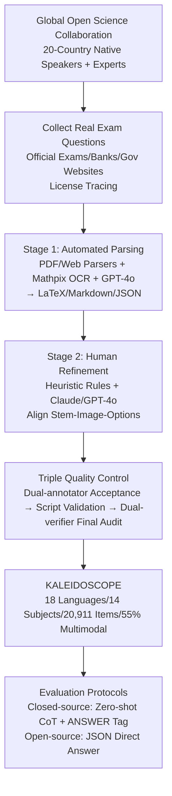

# Kaleidoscope: In-language Exams for Massively Multilingual Vision Evaluation

**Conference**: ICLR 2026  
**OpenReview**: [https://openreview.net/forum?id=zCYXhSy9UH](https://openreview.net/forum?id=zCYXhSy9UH)  
**Code/Data**: TBD  
**Area**: Multimodal / Vision-Language Model Evaluation  
**Keywords**: Multilingual, Multimodal, VLM Evaluation, In-language Exams, Cultural Inclusivity, MCQA  

## TL;DR
KALEIDOSCOPE, built through global open-science collaboration, manually collects 20,911 real-world multiple-choice exam questions across 18 languages and 14 subjects (55% requiring visual context). It establishes the largest "in-language" multilingual multimodal VLM benchmark to date, revealing systematic deficiencies in current VLMs regarding low-resource languages, multimodal reasoning, and STEM subjects.

## Background & Motivation
**Background**: VLM performance evaluation has long been dominated by English-centric and Western-centric benchmarks. While multilingual text evaluation has expanded and multimodal benchmarks are emerging, the intersection—reliable evaluation that is both multilingual and multimodal—remains scarce.

**Limitations of Prior Work**: Common shortcuts involve translating English benchmarks into other languages, which suffers from two fundamental flaws: (1) Translation fails to capture cultural context and local knowledge, instead solidifying Western-centric assumptions; (2) Automated pipelines amplify noise such as "translationese," contaminating evaluation signals. "In-language" benchmarks reflecting regional culture and knowledge are largely missing.

**Key Challenge**: Frontier generative models are rapidly expanding across modalities and languages, claiming to represent a diverse world. However, the metrics used to measure them remain monolingual and monocultural, creating a systematic misalignment between capability claims and evaluation coverage.

**Goal**: To construct a large-scale, in-language, multimodal, and culturally authentic exam-based benchmark that tests VLMs as humans are tested globally, thereby diagnosing gaps across linguistic, modal, and disciplinary dimensions.

**Core Idea**: **[In-language Exams]** eschew translation in favor of manual collection from official national exams, question banks, and government websites by native speakers and experts, preserving original linguistic and cultural contexts. **[Global Open Science Collaboration]** utilizes contributors across 20 countries and four continents to ensure linguistic and cultural authenticity. **[Image-grounded MCQA]** adopts a unified 4-option multiple-choice format close to human testing, requiring 55% of questions to be answered only through visual understanding, making "visually grounded reasoning" the core testing point.

## Method

### Overall Architecture
KALEIDOSCOPE is a "benchmark + evaluation protocol" rather than a model. The construction pipeline follows three stages: **Collection** of real exam questions by the global community; **Automated Parsing + Human Refinement** to convert PDFs, web pages, and scans into structured JSON; and a **Triple-Pass Manual Quality Control**. The evaluation side employs distinct CoT or direct-answer protocols for open-weight and closed-source VLMs, respectively, using accuracy as the metric.

### Key Designs
**1. Three Design Principles: Multimodality, Multilinguality, Diversity** The benchmark enforces strict data selection. Multimodality places images at the core (11,459/20,911 items require visuals, covering diagrams, photos, maps, formulas, and tables). Multilinguality focuses on both low-resource (Nepali, Lithuanian, Bengali, Telugu, etc.) and high-resource languages (English, Spanish, Portuguese, Russian, French, German, Arabic, Hindi, Dutch) across 8 language families. Diversity spans 14 subjects and 6 domains (e.g., Mathematics, Sociology, Medicine, Driving Tests), tracking education levels (High School/University Entrance/Vocational) for fine-grained analysis.

**2. Two-Stage Annotation Pipeline: Automated Parsing + Human Refinement** Source formats vary (PDFs, web pages, scans). Stage one uses PDF/Web parsers or OCR APIs (e.g., Mathpix) with GPT-4o to extract text and image elements into LaTeX/Markdown/JSON. Stage two uses heuristic rules and high-performance LLMs (Claude 3.5 Sonnet, GPT-4o) to reconstruct output for correct alignment, followed by manual verification of image-item bindings and formula formats. Each item contains 17 fields, including source country, language, and subject labels in both English and the source language.

**3. Triple-Pass Manual Quality Control + Failure Mode Review** To mitigate risks in international collaboration, three manual checkpoints are implemented: (1) Dual independent annotator acceptance (including license compliance); (2) Automated scripts checking for JSON errors and duplicates; (3) Final manual audit by two independent verifiers. During evaluation, suspicious outputs (ambiguous, empty, or consistent cross-model failures) are manually reviewed, leading to the correction or removal of problematic items.

**4. Split Evaluation Protocols for Open/Closed Models** Closed-source models use zero-shot Chain-of-Thought (CoT) with in-language prompt translations, requiring final answers inside `<ANSWER></ANSWER>` tags. Since small open-source models gain little from CoT in preliminary tests, they use direct answering with a mandatory `{'choice': ...}` JSON structure and English instructions. Metrics reported include Accuracy, Format Error (F.E.), and Valid Accuracy (Valid Acc.).

## Key Experimental Results

### Main Results Table (Macro-average Accuracy %, weight-equalized by language)

| Model | Overall Acc. | F.E. | Multimodal Acc. | Text-only Acc. |
|---|---|---|---|---|
| Claude 3.5 Sonnet | **62.91** | 1.78 | **55.63** | 73.54 |
| Gemini 1.5 Pro | 62.10 | 1.62 | 55.01 | 72.35 |
| GPT-4o | 58.32 | 6.52 | 49.80 | 71.40 |
| Qwen2.5-VL-72B | 52.94 | 0.02 | 48.40 | 60.00 |
| Qwen2.5-VL-32B | 48.21 | 0.88 | 44.90 | 53.77 |
| Qwen2.5-VL-7B | 39.56 | 0.08 | 36.85 | 43.91 |
| Aya-Vision-32B | 39.27 | 1.05 | 35.74 | 44.73 |
| Aya-Vision-8B | 35.09 | 0.07 | 32.35 | 39.27 |
| Qwen2.5-VL-3B | 35.56 | 0.19 | 33.67 | 38.51 |
| Molmo-7B-D | 32.87 | 0.04 | 31.43 | 35.12 |
| Pangea-7B | 31.31 | 7.42 | 27.15 | 37.84 |

Closed-source models lead (Claude/Gemini ~62%), yet even the strongest overall accuracy (63%) remains far from human-level performance. GPT-4o suffers from high format error rates in multimodal settings (10.5%), though its Valid Acc. recovers significantly. In the open-source camp, Qwen2.5-VL-72B is the strongest (52.94%).

### Image Type Analysis (Valid Accuracy %)

| Model | Diagram | Figure | Graph | Map | Photo | Formula | Table | Text |
|---|---|---|---|---|---|---|---|---|
| Claude 3.5 Sonnet | 62.9 | 50.5 | 74.2 | 80.1 | 77.8 | 52.1 | 75.0 | 85.2 |
| Gemini 1.5 Pro | 59.4 | 51.3 | 67.9 | 69.4 | 75.8 | 68.3 | 76.0 | 85.2 |
| GPT-4o | 59.6 | 48.2 | 68.4 | 78.8 | **81.5** | 64.4 | **76.5** | 86.2 |
| Qwen2.5-VL-72B | 51.1 | 43.9 | 59.4 | 66.1 | 70.5 | 48.7 | 61.5 | 86.0 |

Models perform well on Tables (76.5%) and Photos (81.5%), but struggle significantly on Diagrams (62.9%), which require abstract visual reasoning.

### Key Findings
- **Modality Gap**: Text-only performance significantly exceeds multimodal performance across all models. Larger models show wider gaps (GPT-4o: 21.6% gap vs. Molmo: 3.69% gap).
- **Subject Gap**: Humanities and Social Sciences yield an average accuracy of 83.7%, while STEM is only 59.2%. Research suggests models can identify visual content and retrieve knowledge but lack required reasoning chains for STEM.
- **Cross-lingual Gap**: High-resource languages outperform low-resource ones; Latin-script languages generally outperform non-Latin scripts, suggesting cross-lingual transfer effects.

## Highlights & Insights
- **"Examination" as Evaluation Paradigm**: Real-world exams (driving licenses, vocational certifications, university entrance) naturally provide human difficulty scales and culturally grounded reasoning requirements.
- **In-language vs. Translation**: Prioritizing native-language collection directly addresses Western-centric bias and "translationese" contamination typical in translated benchmarks.
- **Three-dimensional Diagnosis**: Metrics across Modality × Subject × Language, combined with 17 metadata fields, transform the benchmark from a leaderboard into a diagnostic tool for failure attribution.
- **Evaluation-to-Data Feedback**: Integrating suspicious output reviews into the quality control loop is a best practice for large-scale crowdsourced benchmarks.

## Limitations & Future Work
- **MCQA Ceiling**: The 4-option format simplifies automated scoring but introduces a 25% random guess baseline and fails to assess open-ended generation or long-chain reasoning.
- **Imbalance**: Sample sizes per language range from 126 to 2,000, limiting statistical reliability for certain low-resource languages (e.g., Nepali).
- **LLM Dependence**: Using GPT-4o/Claude for parsing and refinement may introduce model-specific biases or favor related architectures in evaluation.
- **Contamination Risk**: Publicly sourced data risks inclusion in pre-training corpora; continuous updates and contamination detection are necessary.
- **Outlook**: Expansion to more language families, introduction of open-ended responses, human-AI comparative analysis, and utilizing diagnostic results to refine multimodal training data ratios.

## Related Work & Insights
- **Multilingual Text Evaluation**: Continues the lineage of Global-MMLU and INCLUDE with native-speaker participation, extending it to the multimodal domain.
- **Multimodal Benchmarks**: Complements MMMU, MMBench, and Pangea, but advances in "native exam questions + cultural authenticity + 18-language scale."
- **Insight**: For developers of multilingual/multimodal models, evaluation must move beyond translating English benchmarks. STEM visual reasoning and non-Latin scripts are currently the weakest and most critical areas for training data investment.

## Rating
- **Novelty**: ⭐⭐⭐⭐ Innovative evaluation paradigm focusing on native-language authentic exams and global collaboration.
- **Experimental Thoroughness**: ⭐⭐⭐⭐ Extensive diagnosis across 11 models and multiple dimensions, though limited by sample imbalance in low-resource languages.
- **Writing Quality**: ⭐⭐⭐⭐ Clear motivation, detailed pipeline descriptions, and well-organized visualizations.
- **Value**: ⭐⭐⭐⭐⭐ Significant long-term community value as the largest multilingual multimodal exam benchmark to date.

<!-- RELATED:START -->

## Related Papers

- [\[ICLR 2026\] IndicVisionBench: Benchmarking Cultural and Multilingual Understanding in VLMs](indicvisionbench_benchmarking_cultural_and_multilingual_understanding_in_vlms.md)
- [\[ICLR 2026\] Massively Multimodal Foundation Models: A Framework for Capturing Interactions with Specialized Mixture-of-Experts](massively_multimodal_foundation_models_a_framework_for_capturing_interactions_wi.md)
- [\[ACL 2025\] Centurio: On Drivers of Multilingual Ability of Large Vision-Language Model](../../ACL2025/multimodal_vlm/centurio_multilingual_vlm.md)
- [\[ICLR 2026\] Human-MME: A Holistic Evaluation Benchmark for Human-Centric Multimodal Large Language Models](human-mme_a_holistic_evaluation_benchmark_for_human-centric_multimodal_large_lan.md)
- [\[ACL 2026\] VIGNETTE: Socially Grounded Bias Evaluation for Vision-Language Models](../../ACL2026/multimodal_vlm/vignette_socially_grounded_bias_evaluation_for_vision-language_models.md)

<!-- RELATED:END -->
