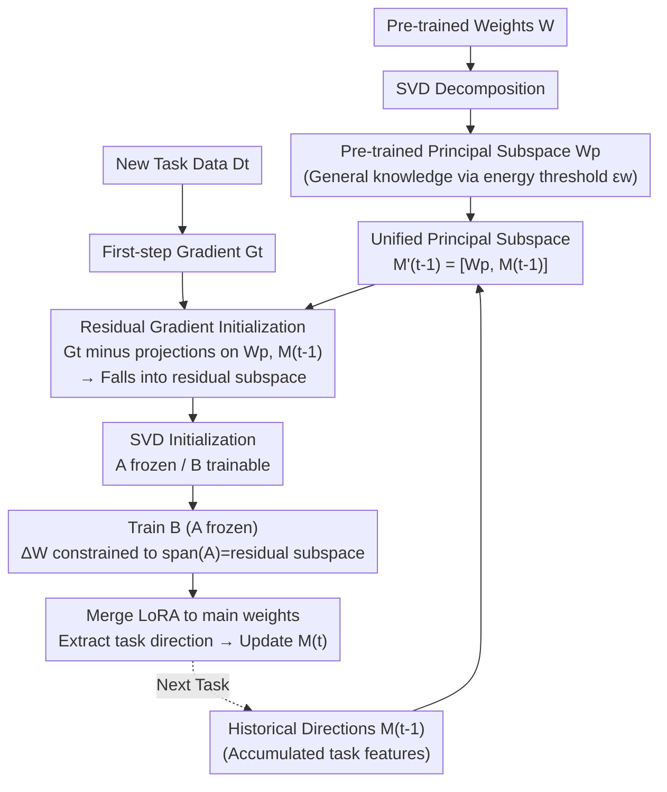

# KeepLoRA: Continual Learning with Residual Gradient Adaptation

**Conference**: ICLR 2026  
**arXiv**: [2601.19659](https://arxiv.org/abs/2601.19659)  
**Code**: [GitHub](https://github.com/MaolinLuo/KeepLoRA)  
**Area**: Multimodal VLM  
**Keywords**: Continual Learning, LoRA, Gradient Projection, Subspace Constraint, Vision-Language Models

## TL;DR

By analyzing the SVD decomposition of pre-trained model weights, it is discovered that general knowledge is encoded in the principal subspace while domain-specific knowledge is encoded in the residual subspace. The proposed KeepLoRA method constrains LoRA updates for new tasks to the residual subspace while initializing with gradient information to maintain plasticity, achieving an optimal balance among forward stability, backward stability, and plasticity in continual learning.

## Background & Motivation

Pre-trained Vision-Language Models (VLMs) face three competing objectives in continual learning:

**Forward Stability**: Preserving pre-trained general knowledge and zero-shot transfer capabilities.

**Backward Stability**: Avoiding forgetting of previously learned tasks.

**Plasticity**: Effectively learning new tasks.

Existing methods have limitations: reference data regularization (e.g., ZSCL) relies on external data with high computational overhead; architectural expansion (e.g., Prompt Pool, MoE adapters) increases inference costs without truly integrating knowledge into the model; previous LoRA-based continual learning methods (O-LoRA, InfLoRA, SD-LoRA) lack explicit protection of pre-trained general knowledge.

**Key Insight**: Through SVD decomposition of pre-trained weight matrices, the authors found that the principal subspace (directions corresponding to large singular values) primarily encodes general knowledge (robust across general datasets), while the residual subspace (directions of small singular values) encodes domain-specific knowledge (performance on specific datasets drops sharply if removed). This finding directly guides the method design: updates for new tasks should be constrained to the residual subspace.

## Method

### Overall Architecture

KeepLoRA aims to simultaneously maintain three conflicting goals—forward stability, backward stability, and plasticity. The Core Idea is to encapsulate "knowledge directions that must be protected" into a **unified principal subspace**, then force the LoRA updates of each new task into the orthogonal complement of this subspace—the residual subspace—to learn new tasks without interfering with old knowledge.

Mechanism: Perform SVD on pre-trained weights to extract the principal subspace $\mathbf{W}_p$ (containing general knowledge), accumulate feature directions from historical tasks into $\mathbf{M}_t$, and concatenate them into a unified principal subspace $\mathbf{M}_t'$. When a new task arrives, LoRA is initialized using the first-step true gradient, which is projected into the residual subspace to remove components that might damage stability. Subsequently, $\mathbf{A}$ is frozen and only $\mathbf{B}$ is trained. Proposition 3.1 guarantees that this is equivalent to locking updates within the residual subspace. After training, LoRA is merged back into the main weights, and the task direction is appended to $\mathbf{M}_t$ for the next task.

### Key Designs

**1. Pre-trained Principal Subspace: Delimiting general knowledge for protection**

To maintain forward stability, the first step is to explicitly identify where general knowledge "resides." The authors perform SVD decomposition $\mathbf{W} = \mathbf{U}\mathbf{S}\mathbf{V}^\top$ on each weight matrix $\mathbf{W} \in \mathbb{R}^{d_{in} \times d_{out}}$ to be updated, selecting the first $p$ left singular vectors to form the principal subspace $\mathbf{W}_p = \mathbf{U}_{:,1:p}$. The value of $p$ is determined by an energy constraint, ensuring the energy of the preserved components reaches a proportion $\epsilon_w$ of the original matrix:

$$\|\mathbf{W}_p\|_F^2 \geq \epsilon_w \|\mathbf{W}\|_F^2,\quad \epsilon_w \in (0,1)$$

This aligns with the core finding: directions with large singular values encode general knowledge, and altering them degrades performance on general tasks. Experiments show that a small number of principal components cover almost all general knowledge, making $\mathbf{W}_p$ "thin" and leaving sufficient residual space for subsequent tasks.

**2. Unified Principal Subspace: Incorporating each old task direction into a single constraint list**

Protecting pre-trained knowledge is insufficient; previously learned tasks must also be preserved. After learning each task, its "feature directions" are recorded and merged into the protected list. After learning the $t$-th task, the authors remove components from the task features $\mathbf{X}_t$ that are already covered by the principal subspace and historical task directions, leaving only truly new components:

$$\hat{\mathbf{X}}_t = \mathbf{X}_t - \mathbf{W}_p \mathbf{W}_p^\top \mathbf{X}_t - \mathbf{M}_{t-1} \mathbf{M}_{t-1}^\top \mathbf{X}_t$$

SVD is then performed on the residual $\hat{\mathbf{X}}_t$, and the first $m$ singular vectors are appended to the direction matrix $\mathbf{M}_t = [\mathbf{M}_{t-1}, \mathbf{V}_{t(:,1:m)}]$, where $m$ is dynamically determined by an energy threshold $\epsilon_f$. Subtracting projections before extraction is critical: it ensures newly recorded directions do not overlap with existing ones, preventing the matrix from inflating due to redundancy. Since $\mathbf{W}_p$ and $\mathbf{M}_t$ reside in the same $d_{in}$-dimensional feature space, they form the unified principal subspace:

$$\mathbf{M}_t' = [\mathbf{W}_p, \mathbf{M}_t]$$

Any subsequent updates for new tasks must be orthogonal to $\mathbf{M}_{t-1}'$. This orthogonal constraint simultaneously protects general knowledge and all previous tasks. The total number of vectors in the list is bounded by $d_{in}$, ensuring storage overhead does not grow infinitely with the number of tasks.

**3. Residual Gradient Initialization: Retaining plasticity in the orthogonal complement**

While the previous steps involve "subtraction" to protect old knowledge, this step restores plasticity to enable learning of new tasks. LoRA is initialized using the first-step true gradient $\mathbf{G}_t = \nabla_{\mathbf{W}} \mathcal{L}(\mathbf{W}; \mathcal{D}^t)$, which naturally points towards the most useful full-parameter fine-tuning direction for the new task. To avoid interference with protected directions, the gradient is projected into the residual subspace:

$$\hat{\mathbf{G}}_t = \underbrace{\mathbf{G}_t}_{\text{Plasticity}} - \underbrace{\mathbf{W}_p \mathbf{W}_p^\top \mathbf{G}_t - \mathbf{M}_{t-1} \mathbf{M}_{t-1}^\top \mathbf{G}_t}_{\text{Forward + Backward Stability}}$$

This equation integrates the three objectives: preserved $\mathbf{G}_t$ ensures plasticity, while the subtracted terms ensure forward stability (preserving general knowledge) and backward stability (preserving old tasks). SVD is then applied to $\hat{\mathbf{G}}_t$ to select the top $r$ components for LoRA initialization:

$$\mathbf{A} = \mathbf{U}_{:,1:r}, \quad \mathbf{B} = \mathbf{S}_{1:r} \mathbf{V}_{:,1:r}^\top$$

Where $\mathbf{A}$ is frozen and only $\mathbf{B}$ is trained. Since the initial $\frac{\alpha}{r}\mathbf{AB} \neq 0$, the original parameters are adjusted as $\mathbf{W}' = \mathbf{W} - \frac{\alpha}{r}\mathbf{AB}$ to maintain the model's current function at the start.

**4. Freezing A, Training B: Structural guarantee of subspace constraints**

Freezing $\mathbf{A}$ while training $\mathbf{B}$ is not just an implementation trick; Proposition 3.1 proves that it constrains the entire gradient descent within $\text{span}(\mathbf{A})$:

$$\Delta\mathbf{W} = \frac{\alpha}{r}\mathbf{A}\Delta\mathbf{B} = -c\mathbf{A}\mathbf{A}^\top\mathbf{G}_t$$

Here, $\mathbf{A}\mathbf{A}^\top$ acts as an orthogonal projection operator. Regardless of how $\mathbf{B}$ is trained, the actual change in weights is automatically projected back onto $\text{span}(\mathbf{A})$—which is precisely the residual subspace selected in the previous step. The paper requires $\text{span}(\mathbf{A})$ to satisfy two properties: orthogonality to the protected knowledge subspace (preventing forgetting) and capturing the principal directions of $\mathbf{G}_t$ (ensuring plasticity). Gradient initialization ensures $\mathbf{A}$ meets both. Thus, the balance between plasticity and stability is a hard constraint guaranteed by the parameter structure rather than a soft regularization term.

### Loss & Training

Training only uses the standard classification loss $\mathcal{L}_{\text{cls}}(\mathbf{B}_t)$ without extra regularization or reference data. For each new task:
1. Calculate the first-step gradient, project it to the residual subspace, and initialize LoRA via SVD.
2. Freeze $\mathbf{A}$ and train $\mathbf{B}$.
3. After training, merge LoRA into the main weights: $\mathbf{W} = \mathbf{W}' + \frac{\alpha}{r}\mathbf{AB}$.
4. Extract principal feature directions of the task and update the unified principal subspace.

## Key Experimental Results

### Main Results

**MTIL Setup (Sequence of 11 datasets, CLIP ViT-B/16)**:

| Method | Keep Architecture | No Extra Data | Transfer↑ |
|------|---------|-------------|----------|
| Zero-shot | ✓ | ✓ | 65.4 |
| ZSCL | ✓ | ✗ | 68.1 |
| O-LoRA | ✓ | ✓ | 66.5 |
| InfLoRA | ✓ | ✓ | 67.4 |
| SD-LoRA | ✓ | ✓ | 67.1 |
| **KeepLoRA** | ✓ | ✓ | **69.0** |
| MoE-Adapters | ✗ | ✗ | 68.9 |
| IAP | ✗ | ✓ | 69.2 |
| **KeepLoRA+** | ✗ | ✓ | **69.9** |

Ours achieves the best Transfer performance while maintaining the original architecture and using no extra data.

**Comparison of Transfer Metrics on Key Datasets**:

| Method | Aircraft | DTD | EuroSAT | Flowers | OxfordPet | Cars |
|------|----------|-----|---------|---------|-----------|------|
| O-LoRA | 80.8 | 44.5 | 49.8 | 67.5 | 88.7 | 56.1 |
| InfLoRA | 84.3 | 44.3 | 50.6 | 68.2 | 88.7 | 57.8 |
| **KeepLoRA** | 84.6 | **45.9** | **54.3** | **70.1** | **90.3** | **59.5** |

### Ablation Study

Verification of component contributions:

1. **Removing Pre-trained Subspace Protection ($\mathbf{W}_p$)**: Forward stability drops significantly, and general task transfer capability degrades.
2. **Removing Gradient Initialization (using random init)**: Plasticity decreases, and the Last task metric degrades.
3. **Removing Task Direction Matrix ($\mathbf{M}_t$)**: Backward stability decreases, lowering accuracy on early tasks.
4. **Impact of Energy Threshold $\epsilon_w$**: Values too low lead to insufficient protection, while values too high reduce the residual space, impacting plasticity.

### Key Findings

1. **Separation of Knowledge Encoding**: Rebuilding weights using only the top $p$ principal components keeps performance on general datasets (ImageNet, CIFAR100) nearly constant, while performance on domain-specific datasets (Aircraft, DTD, EuroSAT) drops sharply.
2. **Gradient Projection Equivalence**: Freezing A and training B is mathematically equivalent to performing gradient descent within the span(A) subspace.
3. **Compactness of Unified Subspace**: The total size is bounded by $d_{in}^2$ and does not grow infinitely with the number of tasks.
4. **Validation on LLaVA**: Ours is effective not only for CLIP dual-encoder models but also for encoder-decoder architectures like LLaVA, where it achieves SOTA.

## Highlights & Insights

- **Discovery-driven Design**: Derived naturally from the empirical finding that "general knowledge is in the principal subspace and specific knowledge is in the residual," providing a clear logic chain.
- **Unified Framework for Three Objectives**: A single formula balances all goals—gradient for plasticity, subtraction of principal subspace for forward stability, and subtraction of task directions for backward stability.
- **Zero Inference Overhead**: LoRA can be merged into original weights after training, adding no parameters or computation during inference.
- **No External Data Needed**: Unlike methods requiring reference datasets or generative models, Ours is more feasible for real-world deployment.

## Limitations & Future Work

1. As the task sequence grows, the residual subspace shrinks, which may degrade plasticity in long-sequence scenarios.
2. Energy thresholds $\epsilon_w$ and $\epsilon_f$ require manual setting; adaptive strategies warrant further research.
3. The computational cost of SVD for each weight matrix may be high for large models.
4. Validation is limited to classification; performance on generative tasks (e.g., VQA, image captioning) remains to be explored.
5. The unified principal subspace assumes orthogonality of task features, which may not hold as the number of tasks becomes extreme.

## Related Work & Insights

This work follows the lineage of GPM (Gradient Projection Memory), but the key improvement is the explicit protection of the pre-trained principal subspace. Unlike InfLoRA, which only constrains feature direction orthogonality, KeepLoRA constrains both gradient and initialization directions to the residual subspace. The idea of gradient-guided initialization could be extended to other parameter-efficient fine-tuning scenarios.

## Rating

- **Novelty**: ⭐⭐⭐⭐ — The discovery of knowledge separation in principal/residual subspaces is insightful.
- **Technical Quality**: ⭐⭐⭐⭐⭐ — Solid theoretical proofs and rigorous derivations.
- **Experimental Thoroughness**: ⭐⭐⭐⭐ — Validated across multiple settings and datasets with complete ablations.
- **Value**: ⭐⭐⭐⭐⭐ — Deployment-friendly with zero inference overhead and no data dependencies.
- **Writing Quality**: ⭐⭐⭐⭐ — Clear structure, though notation-heavy.
- **Overall**: ⭐⭐⭐⭐ (8.5/10)

<!-- RELATED:START -->

## Related Papers

- [\[ICLR 2026\] Reversible Primitive–Composition Alignment for Continual Vision–Language Learning](reversible_primitivecomposition_alignment_for_continual_visionlanguage_learning.md)
- [\[ICLR 2026\] Memory-Free Continual Learning with Null Space Adaptation for Zero-Shot Vision-Language Models](memory-free_continual_learning_with_null_space_adaptation_for_zero-shot_vision-l.md)
- [\[CVPR 2026\] Octopus: History-Free Gradient Orthogonalization for Continual Learning in Multimodal Large Language Models](../../CVPR2026/multimodal_vlm/octopus_history-free_gradient_orthogonalization_for_continual_learning_in_multim.md)
- [\[ICLR 2026\] Enhanced Continual Learning of Vision-Language Models with Model Fusion](enhanced_continual_learning_of_vision-language_models_with_model_fusion.md)
- [\[ICLR 2026\] RLAP-CLIP: Continual Multimodal Learning with Prototype Adaptation and Difficulty-Aware Routing](rlap-clip_continual_multimodal_learning_with_prototype_adaptation_and_difficulty.md)

<!-- RELATED:END -->
