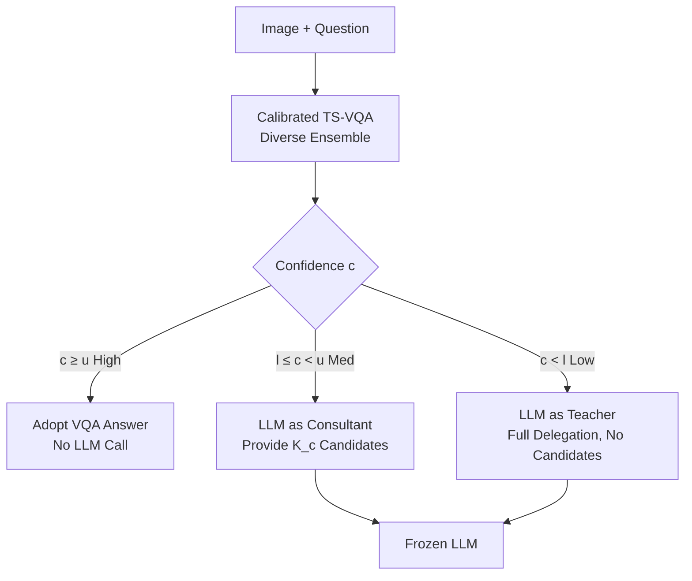

# Knowledge Exchange with Confidence: Cost-Effective LLM Integration for Reliable and Efficient Visual Question Answering

**Conference**: ICLR 2026  
**OpenReview**: [https://openreview.net/forum?id=KCj3j5dNSY](https://openreview.net/forum?id=KCj3j5dNSY)  
**Code**: To be confirmed  
**Area**: Multimodal / Visual Question Answering (VQA)  
**Keywords**: VQA, LLM-VQA collaboration, confidence calibration, uncertainty, diverse ensemble, dynamic delegation  

## TL;DR
A **well-calibrated small VQA model** outputs reliable confidence scores to route questions into three tiers: high (VQA answers directly), medium (LLM acts as a "consultant" using candidate answers), or low (LLM acts as a "teacher" via full delegation). This significantly cuts expensive LLM calls while maintaining or even improving accuracy.

## Background & Motivation
- **Background**: Integrating Large Language Models (LLMs) into Visual Question Answering (VQA) significantly improves accuracy. LLMs leverage extensive general knowledge from pre-training, typically outperforming task-specific small models (TS-VQA).
- **Limitations of Prior Work**: Relying entirely on LLMs for VQA poses three practical challenges: (a) LLMs may lag behind TS-VQAs trained on domain-specific data for specialized knowledge; (b) billions of parameters result in high computational costs, latency, and carbon emissions, with third-party LLMs incurring ongoing costs and privacy risks; (c) there is a lack of reliable means to quantify LLM uncertainty, making them questionable for high-stakes scenarios.
- **Key Challenge**: Not every visual question requires the full power of an LLM—simple questions can be handled efficiently by a TS-VQA. Crucially, the authors empirically find that LLMs and TS-VQAs have **complementary capabilities**: even if a TS-VQA is uncertain, the candidate answers it provides can significantly boost LLM accuracy (Fig. 2a). However, standard VQA models trained with cross-entropy are **overconfident and poorly calibrated**, often assigning high confidence to incorrect answers, which invalidates confidence-based decision-making.
- **Goal**: Construct a hybrid VQA system that is accurate, reliable, and cost-effective by involving the LLM only when truly necessary.
- **Core Idea**: **First calibrate the TS-VQA to provide reliable confidence scores, then use this confidence as a "router"**—not only to decide when to call the LLM but also to determine when and how to pass the TS-VQA's domain expertise (candidate answers) to the LLM. This is named **Uni-VQA** (Uncertainty-aware LLM-integrated VQA).

## Method

### Overall Architecture
Uni-VQA consists of two stages. **Training Stage**: A "Diverse Ensemble" (DE) method is used to train a well-calibrated TS-VQA, ensuring its confidence reflects the true probability of correctness. **Inference Stage**: The calibrated TS-VQA produces an initial answer and confidence $c$. Two thresholds $l < u$ route the question into one of three scenarios: direct adoption, LLM as Consultant, or LLM as Teacher.

### Key Designs

**1. Diverse Ensemble (DE) Calibration: Making Confidence Reliable.** The foundation of the framework is reliable confidence; otherwise, routing fails. The authors use Distributionally Robust Optimization (DRO) to train $E$ complementary TS-VQA sub-models. Each sub-model minimizes a weighted loss $\mathcal{L}_{\text{DRO}}(\Theta)=\sum_n w_n l(x_n,\Theta)$, where KL-regularized DRO provides closed-form softmax weights $w_n^*(\lambda)=\frac{\exp(l(x_n,\Theta)/\lambda)}{\sum_j \exp(l(x_j,\Theta)/\lambda)}$. The hyperparameter $\lambda$ controls how much weights deviate from uniform: a small $\lambda$ focuses on hard samples with high loss (producing a "cautious" model), while a large $\lambda$ approaches uniformity (producing a "confident" model). In practice, $E=3$ members are used to cover the difficulty spectrum. At inference, logits are averaged $f_{\text{DE}}(x)=\frac{1}{E}\sum_e f_e(x)$ before the softmax remains—cautious models dampen the over-optimism of confident ones, resulting in **naturally well-calibrated confidence**.

**2. Three-Tier Confidence-Guided Knowledge Exchange.** Once reliable confidence is obtained, the framework routes based on two thresholds. If $c \geq u$ (High confidence, mostly domain-specific questions familiar to the TS-VQA), the VQA answer is adopted, **bypassing the LLM entirely** to save costs. If $c < l$ (Low confidence, questions requiring broad general knowledge), the question is **fully delegated to the LLM without candidates** (LLM as Teacher). If $l \leq c < u$ (Moderate confidence), the TS-VQA provides dynamic candidate answers to the LLM (LLM as Consultant), allowing the LLM to fuse these domain clues with its general knowledge.

**3. Dynamic Top-K Candidate Selection.** The authors observed that the optimal number of candidates varies with confidence. For moderate confidence cases, a learned mapping determines the number of candidates $K(c_i)\approx\lceil M e^{-W\left(\frac{c_i-l}{u-l}\right)}\rceil$, where $M$ and $W$ are learned on a validation set. This allows the number of candidates in the prompt to decay smoothly as confidence increases, avoiding noise or interference from fixed $K$.

**4. Knowledge Distillation for Acceleration.** To reduce the overhead of ensemble inference, the outputs of the diverse ensemble are distilled into a single model of the same architecture using KL divergence. This retains accuracy and calibration while reducing latency by up to 60%.

> Theoretically, the authors prove two points: (1) The DE loss is an upper bound on "Cross-Entropy minus Predictive Entropy" (Lemma 4.1), which suppresses overconfidence while minimizing loss. (2) DE pushes more incorrect samples into the low-confidence region compared to Empirical Risk Minimization (Theorem 4.2), facilitating more efficient error correction by the LLM.

## Key Experimental Results

Evaluated on VQA-v2 and COCO-QA datasets. TS-VQA backbones include Pythia, CLIP-ViL, ViLBERT, VisualBERT, and BEiT-3. LLMs include frozen Mistral-7B and LLaVA-1.5 13B. Metrics: Accuracy (ACC↑), Expected Calibration Error (ECE↓), LLM Delegation Rate↓, and Average Latency↓.

### Main Results (VQA-v2, Selected)

| Method | ACC↑ | ECE↓ | LLM-Deleg%↓ | Latency↓ |
|---|---|---|---|---|
| LLM-only (Mistral-7B) | 69.09 | 0.31 | 100 | 0.534 |
| Pythia Standard VQA | 65.67 | 0.14 | – | 0.003 |
| Pythia Calibrated (Ours) | 66.15 | 0.06 | – | 0.009 |
| **Pythia Uni-VQA (Ours)** | **71.00** | **0.05** | 78.77 | 0.426 |
| CLIP-ViL Standard VQA | 69.95 | 0.18 | – | 0.023 |
| **CLIP-ViL Uni-VQA (Ours)** | **72.98** | **0.07** | 69.86 | 0.440 |
| BEiT-3 Standard VQA | 73.19 | 0.14 | – | 0.009 |
| **BEiT-3 Uni-VQA (Ours)** | **74.33** | **0.07** | 35.91 | 0.217 |

Uni-VQA outperforms both LLM-only and standalone TS-VQA benchmarks across all backbones. The calibration reduces ECE from ~0.14–0.18 down to ~0.02–0.08 without sacrificing accuracy.

### Ablation Study (Delegation % to match accuracy, VQA-v2)

| Backbone | Target ACC | LLM-VQA | LLM-VectorScale | **Uni-VQA** |
|---|---|---|---|---|
| Pythia | 70.07 | 64.38 | 66.11 | **50.06 (−14~16%)** |
| CLIP-ViL | 71.5 | 35.5 | 40.56 | **24.4 (−11~13%)** |
| BEiT-3 | 73.71 | 10.16 | 26.23 | **6.71 (−1~20%)** |

To match LLM-only accuracy, Uni-VQA requires significantly fewer LLM calls. For instance, BEiT-3 Uni-VQA only delegates 6.71% of questions to achieve superior performance.

### Key Findings
- **Calibration is critical for the efficiency-performance win-win**: By pushing incorrect samples to the low-confidence tier, the dynamic delegation preserves accuracy while minimizing LLM usage. Overconfident models require higher thresholds, which leads to a trade-off between efficiency and accuracy.
- **Thresholds as Knobs**: Thresholds allow for a smooth trade-off between "saving costs" and "improving accuracy," adapting to different resource constraints.
- **Diminishing Returns with Stronger TS-VQA**: With highly capable backbones like BEiT-3, the marginal gains from LLM delegation are naturally reduced.

## Highlights & Insights
- **Repurposing Calibration as a Routing Signal**: Unlike previous works using calibration solely for "abstention," this paper uses it to drive "when to call the LLM" and "how many candidates to provide."
- **Intuitive Collaborative Roles**: The classification into Teacher, Consultant, and Direct Adoption aligns with human collaborative logic.
- **Theoretical and Empirical Loop**: The use of DRO-KL weights is backed by proofs showing improved calibration and maximized error delegation, validated by empirical $N^{\text{in},\tau}$ curves.
- **Complementary to RAG**: While Retrieval-Augmented Generation (RAG) controls "what evidence" the LLM sees, Uni-VQA controls "when and how to use" the LLM.

## Limitations & Future Work
- **Threshold Sensitivity**: Depends on validation set tuning for $l, u, M, W$; robustness under distribution shift is not fully explored.
- **Benchmark Scope**: Evaluation is primarily on VQA-v2 and COCO-QA; performance in knowledge-intensive (e.g., OK-VQA) or strictly out-of-distribution (OOD) scenarios is only briefly discussed.
- **Baseline Dependency**: The hybrid framework's value decreases as the standalone small model becomes increasingly powerful.

## Related Work & Insights
- **LLM-VQA Integration**: Unlike prior works that rely entirely on the LLM (using captions or fixed candidates), Uni-VQA introduces confidence-guided knowledge exchange.
- **Selective Prediction**: Moving beyond simple rejection/abstention, this work uses calibrated uncertainty to optimize resource allocation in a multi-model system.
- **Insight**: In any "Small Model + LLM" hybrid system, **calibrating the small model first** is a universal paradigm for balancing cost and quality (e.g., for cascaded LLMs or speculative decoding).

## Rating
- **Novelty**: ⭐⭐⭐⭐ — Innovative use of balanced calibration for routing and dynamic tiering.
- **Experimental Thoroughness**: ⭐⭐⭐⭐ — Extensive backbones and LLMs evaluated; strong theoretical backing.
- **Writing Quality**: ⭐⭐⭐⭐ — Clear logic, effective visualizations, and well-structured arguments.
- **Value**: ⭐⭐⭐⭐ — High practical utility for cost-sensitive and reliability-critical VQA deployment.

<!-- RELATED:START -->

## Related Papers

- [\[ICLR 2026\] Meta-Adaptive Prompt Distillation for Few-Shot Visual Question Answering](meta-adaptive_prompt_distillation_for_few-shot_visual_question_answering.md)
- [\[ACL 2026\] WikiSeeker: Rethinking the Role of Vision-Language Models in Knowledge-Based Visual Question Answering](../../ACL2026/multimodal_vlm/wikiseeker_rethinking_the_role_of_vision-language_models_in_knowledge-based_visu.md)
- [\[ICLR 2026\] Human Uncertainty-Aware Data Selection and Automatic Labeling in Visual Question Answering](human_uncertainty-aware_data_selection_and_automatic_labeling_in_visual_question.md)
- [\[CVPR 2026\] CC-VQA: Conflict- and Correlation-Aware Method for Mitigating Knowledge Conflict in Knowledge-Based Visual Question Answering](../../CVPR2026/multimodal_vlm/cc-vqa_conflict-_and_correlation-aware_method_for_mitigating_knowledge_conflict_.md)
- [\[ACL 2025\] MAGIC-VQA: Multimodal and Grounded Inference with Commonsense Knowledge for Visual Question Answering](../../ACL2025/multimodal_vlm/magic-vqa_multimodal_and_grounded_inference_with_commonsense_knowledge_for_visua.md)

<!-- RELATED:END -->
